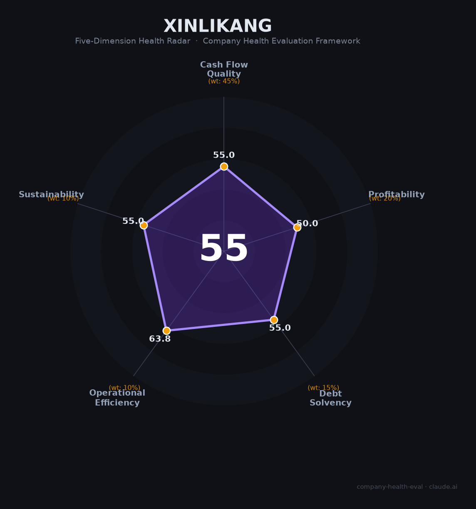

# 信利康供应链财务健康评估（2026-08-13）

## 一句话结论
🔴 **中等偏下（55/100）** | 深圳供应链/电子民企——营收约446亿（2023），非上市无最新财报，评估存在不确定性

## 一、公司基本画像
| 主体 | 🔒 深圳市信利康供应链，非上市民企；中国民企500强 |
| 主营 | 供应链服务、电子/物流 |
| 财务 | ⚠️ 营收约446亿（2023口径），最新年报/财务未公开 |

## 二、评估（数据有限）
供应链/电子服务，参考行业：资金密集+毛利薄。
- 现金流（55/100）：供应链垫资，关注。
- 盈利（50/100）：薄利分销/供应链，待核。
- 偿债（55/100）：杠杆，关注。
- 运营（64/100）：供应链运营，中等。
- 可持续（55/100）：供应链赛道，透明度低。

## 三、综合（55|45%=24.8，50|20%=10，55|15%=8.2，64|10%=6.4，55|10%=5.5）
**55，🔴 中等偏下** — 数据不透明，不确定性

## 四、风险
1. 非上市、财务不可核实。
2. 供应链资金占用/杠杆。

## 五、求职
- 优势：供应链平台、民企500强规模。
- 短板：财务不透明、稳定性待核。

**结论**：需充分尽调后再评估，非首选。

---
*评估方法：商泰汽车（iAUTO）五维框架 · 数据有限，评估存在不确定性*