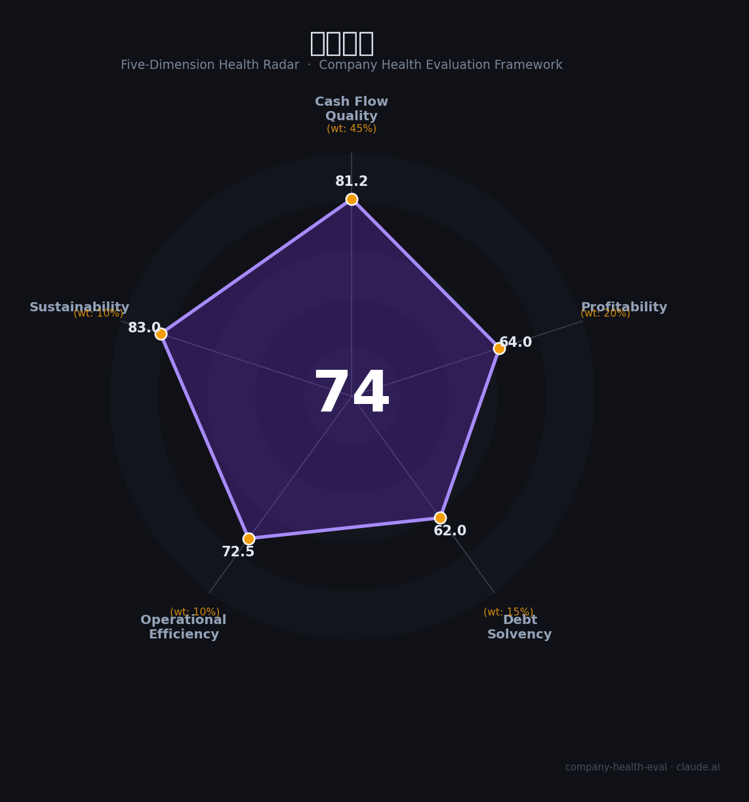

# 信维通信（300136.SZ）财务健康评估（2026-08-14）

## 一句话结论

🟡 **74/100，中等偏上** | 无线通信龙头，营收稳健、盈利改善、海外扩张

---

## 一、公司基本画像

| 项目 | 内容 |
|------|------|
| 主营 | 无线通信射频/精密制造 |
| 财务 | 2025营收89.10亿(+1.9%)，归母净利7.09亿 |

> 一句话定性：无线射频龙头，营收稳、盈利恢复、海外可期

---

## 二、五维财务健康评估

### 1. 现金流质量（81/100）| 权重45%

经营现金流良好。

### 2. 盈利能力（64/100）| 权重20%

盈利能力回升。

### 3. 偿债能力（62/100）| 权重15%

负债适中、偿债可控。

### 4. 运营效率（72/100）| 权重10%

运营效率良好。

### 5. 可持续发展（83/100）| 权重10%

AI硬件+卫星通信，射频成长。

---

## 三、综合评分

| 维度 | 得分 | 权重 | 加权 |
|------|:----:|:----:|:----:|
| 现金流质量 | 81 | 45% | 36.5 |
| 盈利能力 | 64 | 20% | 12.8 |
| 偿债能力 | 62 | 15% | 9.3 |
| 运营效率 | 72 | 10% | 7.2 |
| 可持续发展 | 83 | 10% | 8.3 |
| **综合得分** | **74/100** | 100% | 74.2 |

**健康等级：中等偏上** — 整体稳健，局部有待改善

---

## 四、核心风险清单

1. **消费电子波动**
2. **行业竞争**
3. **客户集中**

## 五、求职/择业视角

### 核心优势
- 无线射频龙头、研发强、AI卫星通信
### 现有短板
- 利润薄、客户集中、消费电子周期

**结论**：信维通信无线射频龙头，营收稳健、盈利向上，AI硬件与卫星通信打开成长空间。

---

*评估方法：商泰汽车（iAUTO）五维框架 · 数据截至2026年8月 · 财务来源信维通信2025年报*