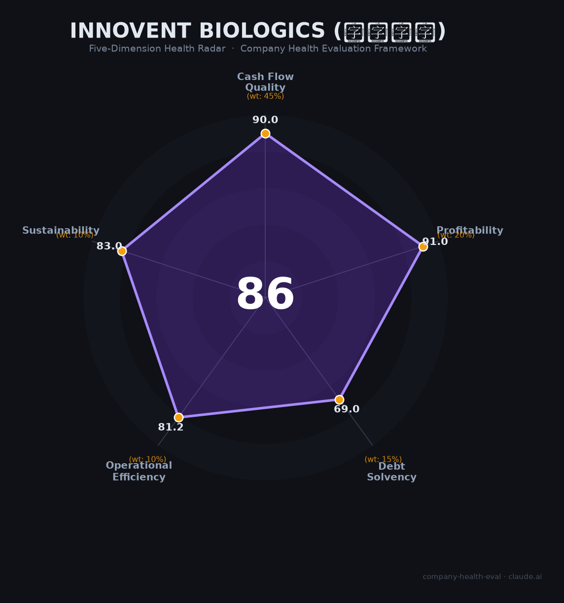

# 信达生物 财务健康评估（2026-06-12）

## 一句话结论

🟢 **优秀（85/100）** | PD-1双雄之一+GLP-1新贵，2025年首次全面盈利，现金243亿净现金状态，集采风险是核心隐忧

---

## 一、公司基本画像

| 项目 | 内容 |
|------|------|
| **全称** | 信达生物制药（Innovent Biologics, Inc.） |
| **股票代码** | 01801.HK（港交所主板，2025年入选恒生指数成份股） |
| **成立时间** | 2011年4月（苏州运营主体2011年8月成立） |
| **创始人/CEO** | 俞德超博士（中科院遗传学博士、UCSF博士后，持股约7.49%） |
| **总部** | 江苏苏州工业园区 |
| **上市状态** | 2018年10月港股IPO，募资约33亿港元 |
| **员工** | 约7,502人（2025年末），研发~1,100人（~18%） |
| **核心产品** | 达伯舒（信迪利单抗/PD-1，~39亿）、信尔美（玛仕度肽/GLP-1，2025年6月获批） |
| **已商业化产品** | 18款（肿瘤13款+综合管线5款） |
| **累计BD交易** | 超220亿美元（武田114亿+辉瑞105亿+礼来88.5亿+罗氏10.8亿等） |
| **市值** | 约1,330亿港元（约1,236亿人民币，2026.6） |

🔒 数据来源：2025年年报、港交所披露易、东方财富

**一句话定性**：信达生物是中国PD-1赛道从"Biotech"成功进化为"Biopharma"的标杆——18款产品商业化、2025年首次全年盈利、经营现金流连续3年为正、243亿现金储备充裕。从PD-1单核驱动转向"肿瘤+代谢+自免"三轮驱动，国际化BD能力行业第一。是PD-1"四小龙"中财务改善最显著、综合实力最均衡的一家。

---

## 二、五维财务健康评估

### 1. 现金流质量（90/100）🟢 行业标杆

| 指标 | 状态 | 实际数据 |
|------|------|----------|
| 经营现金流净额 | 🟢 健康 | 连续3年为正（2023: +1.48亿 → 2024: +12.87亿 → 2025: ~+100亿） |
| 现金及等价物 | 🟢 健康 | 173.45亿（2025末），含金融资产~181亿，覆盖多年运营 |
| 有息负债 | 🟢 健康 | 总借款仅28.16亿 vs 现金173亿，净现金153亿 |
| 净现比（经营CF/净利润） | 🟢 健康 | >>1（含武田首付款约86亿；剔除后OCF/Non-IFRS利润亦>1） |

🔒 数据来源：2020-2025年年报

**关键发现**：
- 信达生物从2023年起经营现金流转正，是PD-1四小龙中最早实现这一里程碑的企业（百济2025年才转正，君实2026Q1才转正）
- 2025年经营现金流含武田战略合作首付款约86亿人民币（12亿美元），但剔除后的运营性OCF仍有14-20亿，真实造血能力已确立
- 净现金状态（现金远大于借款），是四小龙中唯一真正"财务自由"的企业
- 2025年6月以仅4.9%折价率完成5.5亿美元配股，获国际长线基金超额认购，资本市场认可度极高

### 2. 盈利能力（91/100）🟢 历史性拐点

| 指标 | 状态 | 实际数据 |
|------|------|----------|
| 毛利率 | 🟢 优秀 | 87.2%（2025年），连续3年U型回升 |
| 净利率 | 🟡 良好 | 6.2%（IFRS），首次全年盈利；Non-IFRS 13.2% |
| 营收增速（3年CAGR） | 🟢 优秀 | ~41.9%（2022: 45.6亿 → 2025: 130.4亿） |
| 研发费用率 | 🟢 优秀 | 20.1%（2025年），处于科技公司10-25%理想区间 |
| 人均产出 | 🟢 优秀 | ~174万元/人（2025年），远超行业1.5倍（~120万） |

🔒 数据来源：2022-2025年年报

**关键发现**：
- 2025年IFRS净利润8.14亿元，是公司成立14年来首次全年盈利，Non-IFRS净利润17.23亿元（+419.6%）
- 毛利率从2022年低点79.6%连续3年回升至87.2%，反映高毛利创新药（PD-1、玛仕度肽）占比提升和规模效应
- 研发费用率从2022年峰值63%持续下降至20.1%，进入"研发效率+规模收入"的正循环
- 产品收入118.96亿元首次突破百亿大关（+44.6%），授权等其他收入占比已降至7%
- PD-1达伯舒增速降至约5%（进入平台期），但收入结构已从"一品独大"（峰值~80%）降至约30%

### 3. 偿债能力（69/100）🟡 结构健康但资产负债率偏高

| 指标 | 状态 | 实际数据 |
|------|------|----------|
| 资产负债率 | 🟡 关注 | 48.17%（2025年） |
| 有息负债率 | 🟡 关注 | 约7.5%（28.16亿/373.48亿），极低 |
| 流动比率 | 🟡 关注 | 约1.4-1.6（估算，1-2之间） |
| 现金比率 | 🟢 健康 | ~1.2（173亿现金/流动负债），>1 |
| 股权质押 | 🟢 健康 | 无显著质押记录 |

🔒 数据来源：2025年年报

**关键发现**：
- 资产负债率48%看似偏高，但实际财务结构极为健康：净现金153亿（现金-有息负债），公司用经营现金流即可轻松覆盖利息
- 负债主要为经营性应付（贸易应付款等），非金融性债务
- 商誉始终为零——从未做过产生商誉的并购
- 2025年总资产因配股融资从216亿跳升至373亿，权益大幅增强
- 有息负债率仅7.5%，在四小龙中最低（君实27%+，百济更高）

### 4. 运营效率（81/100）🟢 规模化能力显现

| 指标 | 状态 | 实际数据 |
|------|------|----------|
| 应收周转 | 🟢 健康 | ~48天（17.14亿/130.42亿），行业优秀水平 |
| 客户集中度 | 🟢 健康 | 18款产品多渠道覆盖，肿瘤+代谢+自免多元客户 |
| 员工规模趋势 | 🟢 健康 | 2025年高速扩张至7,502人（+32.6%），反映业务增长信心 |
| 高管稳定性 | 🟡 关注 | 2024年总裁刘勇军退休、Fortvita关联交易风波（已纠偏） |

🔒 数据来源：2020-2025年年报及公告

**关键发现**：
- 员工规模在经历2022-2023年优化（累计-698人）后，2025年大幅扩张至7,502人（+1,843人），主要来自玛仕度肽商业化团队的组建
- 应收账款周转48天远优于行业平均（君实74天），回款效率高
- 2024年Fortvita事件（以2,050万美元将管线权益售予俞德超关联方）暴露公司治理短板，市值4日蒸发170亿港元。但公司在10天内紧急终止交易、俞德超公开致歉，纠偏机制有效
- 核心人物俞德超（创始人/CEO）始终在位，战略连续性有保障

### 5. 可持续发展能力（83/100）🟢 三轮驱动+BD引擎

| 指标 | 状态 | 实际数据 |
|------|------|----------|
| 行业赛道空间 | 🟢 健康 | GLP-1赛道CAGR>20%、自免/眼科蓝海、肿瘤创新药持续增长 |
| 技术壁垒 | 🟢 健康 | 全球首个GCG/GLP-1双靶减重药、PD-1/IL-2双抗获武田114亿美元背书 |
| 客户/业务多元化 | 🟢 健康 | 18款产品，"肿瘤+代谢+自免"三轮驱动，单一产品降至~30% |
| 融资/资本支持 | 🟢 健康 | 港股恒指成份股、35亿美元现金、BD累计220亿+美元 |
| 政策/监管风险 | 🟡 关注 | 生物类似药集采风险（占收入30-35%）、GLP-1价格战 |

🔒 数据来源：年报、券商研报、政策公告

**关键发现**：
- 信达在产品多元化和管线纵深上领先所有国产biotech：18款商业化产品+管线涵盖双抗、ADC、CAR-T、口服GLP-1等前沿领域
- 国际化BD能力行业第一：武田114亿美元+辉瑞105亿美元+礼来88.5亿美元+罗氏10.8亿美元，累计超220亿
- Co-Co（共研共销）模式区别于传统License-out，更具可持续性
- 核心风险：贝伐珠单抗等3款生物类似药面临全国联盟集采（占收入30-35%），虽然管理层称"已纳入2027年200亿目标假设"
- GLP-1价格战风险：司美格鲁肽2026年3月中国专利到期，10+款仿制药已申报

---

## 三、综合评分与健康等级

| 维度 | 得分 | 权重 | 加权得分 |
|------|:----:|:----:|:--------:|
| 现金流质量 | 90.0 | 45% | 40.5 |
| 盈利能力 | 91.0 | 20% | 18.2 |
| 偿债能力 | 69.0 | 15% | 10.3 |
| 运营效率 | 81.2 | 10% | 8.1 |
| 可持续发展 | 83.0 | 10% | 8.3 |
| **综合得分** | | **100%** | **85.5 / 100** |

**等级：🟢 优秀（Excellent）**

得分85.5刚好触及"优秀"门槛（≥85），意味着"财务极稳，适合长期发展"。核心优势是现金流（90分）和盈利（91分），唯一的相对短板是偿债指标（69分，主要是资产负债率48%但实为净现金状态）。

---

## 四、同业对标

| 对比项 | 信达生物 | 百济神州 | 恒瑞医药 | 君实生物 |
|--------|---------|---------|---------|---------|
| 上市/融资 | 港股恒指成份股 | A+H+美股 | A股 | A+H |
| 2025年营收 | 130.42亿 | 382.05亿 | ~316亿（E） | 24.98亿 |
| 2025年净利润 | **+8.14亿**（首次盈利） | **+14.22亿**（首次盈利） | ~+77亿 | **-8.75亿** |
| 经营现金流 | **连续3年正** | 首次转正 | 正向稳定 | 连续9年负 |
| 毛利率 | 87.2% | ~80%+ | 86.3% | 81.3% |
| 核心PD-1销售 | ~39亿（财报口径） | 52.97亿（全球） | ~55亿（财报口径） | 20.68亿 |
| 员工规模 | 7,502人 | 11,825人 | 20,602人 | 2,903人 |
| 市值 | ~1,236亿人民币 | ~3,567亿人民币 | ~3,078亿人民币 | ~318亿人民币 |
| 2025综合得分 | **85 🟢 优秀** | 待评估 | 89 🟢 优秀 | 53 🔴 中等偏下 |

🔒 数据来源：各公司2025年年报

**对标结论**：信达生物在PD-1"四小龙"中的综合财务健康度排名第二（仅次于恒瑞这一成熟Pharma），领先于百济神州（体量更大但负债率高、刚盈利）和君实生物（仍未盈利）。核心差异在于信达更早实现盈利拐点、更低的财务杠杆、更均衡的产品结构。

---

## 五、核心风险清单

1. **生物类似药集采（高风险）**：贝伐珠单抗（达攸同）+阿达木单抗（苏立信）+利妥昔单抗（达伯华）合计占收入30-35%。2025年1月全国生物药联盟集采启动后股价单日跌超14%。若降价60%+，年收入损失可达15-20亿元。触发条件：2026-2027年集采正式落地。

2. **PD-1增速见顶（中高风险）**：信迪利单抗2025年增速降至约5%，从高速增长进入平台期。作为曾经的收入支柱（峰值占80%），单品天花板已现。

3. **GLP-1价格战与权益受限（中风险）**：玛仕度肽权益仅限中国，面临诺和诺德/礼来降价+司美格鲁肽仿制药（2026年3月专利到期）+20+款国产在研竞品。峰值50亿预期可能打折。

4. **公司治理事件余波（中风险）**：2024年Fortvita关联交易风波虽已终止，但暴露了治理机制和投资者沟通短板。大股东减持（淡马锡、礼来亚洲基金均退出5%+股东名单）持续构成股价压力。

5. **高估值回调风险（中低风险）**：TTM PE约147倍，市场对2027年200亿产品收入目标定价充分。若玛仕度肽放量不及预期或集采影响超预期，估值可能大幅修正。

6. **出海执行风险（中低风险）**：信迪利单抗2022年FDA被拒后海外权益已放弃。新一代管线（IBI363/IBI343）全球III期临床成本高昂（单个MRCT 2-5亿美元），依赖武田等合作伙伴的推进效率。

---

## 六、求职/择业视角

### 核心优势
- **行业标杆地位**：港股首家从Biotech成长至恒指成份股的创新药企，品牌背书强，跳槽至MNC或头部biotech认可度高
- **技术积累深厚**：18款商业化产品+PD-1/GLP-1/双抗/ADC/CAR-T全覆盖，研发经验丰富且通用性强
- **财务安全感**：35亿美元现金+经营现金流持续为正，裁员风险远低于未盈利biotech
- **国际化视野**：武田/辉瑞/礼来等MNC深度合作，海外项目经验稀缺且有价值

### 现存短板
- **薪酬竞争力一般**：人均薪酬~23.5万/年，低于百济神州（~67万）和恒瑞，加班文化被频繁吐槽
- **工作强度大**：月均加班40小时+，有加班KPI考核传闻，WLB评价偏负面
- **管理层风格强势**：Fortvita事件反映了集中决策模式，创始人主导、总裁级高管变动需关注
- **研发人员占比下降**：从21%（2021）降至~18%，公司重心从"纯研发驱动"转向"商业化+研发"双轮

### 分场景建议

| 个人诉求 | 推荐度 | 说明 |
|----------|:------:|------|
| 稳定+深耕 | ⭐⭐⭐⭐ | 财务稳健+行业地位稳固，适合长期发展 |
| 高薪+跳板 | ⭐⭐⭐ | 品牌背书强但薪酬竞争力一般，跳槽MNC加分 |
| 成长+融资红利 | ⭐⭐⭐⭐ | GLP-1/双抗/ADC前沿管线，国际化BD经验稀缺 |
| 多元+跨领域 | ⭐⭐⭐⭐ | 肿瘤+代谢+自免三轮驱动，技术栈丰富 |

---

## 七、总结

信达生物是中国PD-1/创新药领域「从Biotech进化为Biopharma的最成功范本」：
**核心优势是18款商业化产品+243亿现金+首次全面盈利+国际化BD行业第一的均衡实力**，核心短板是**生物类似药集采冲击（占收入30-35%）和PD-1增速见顶下的增长引擎切换压力**。
在中国创新药从"内卷"走向"出海"的大背景下，属于**优秀**等级——财务极稳、业务多元、成长路径清晰，**适合追求长期稳定发展和国际化经验的求职者作为优先选择**。

评估日期：2026年6月12日
数据截止至：2025年年报
