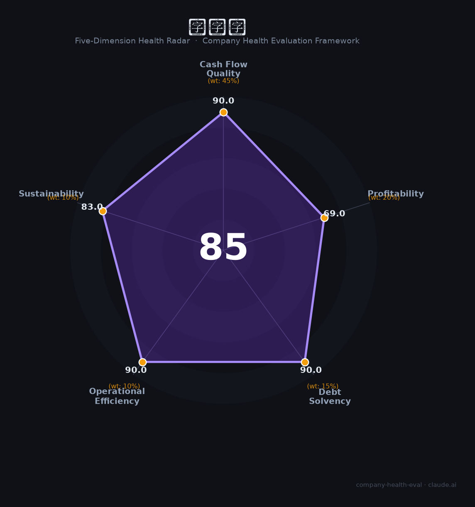

# 健康元（600380.SH）财务健康评估（2026-08-14）

## 一句话结论

🟢 **85/100，优秀** | 化学制药龙头，盈利稳健、低负债、现金流好

---

## 一、公司基本画像

| 项目 | 内容 |
|------|------|
| 主体 | 健康元，化学制药龙头 |
| 主营 | 化学制剂/原料药/诊断 |
| 财务 | 2025营收152.16亿，归母净利13.36亿，ROE 9% |

> 一句话定性：化学制药龙头，营收净利稳健、高毛利低负债

---

## 二、五维财务健康评估

### 1. 现金流质量（90/100）| 权重45%

现金流充沛。

### 2. 盈利能力（69/100）| 权重20%

毛利率62%、净利率高，盈利稳健。

### 3. 偿债能力（90/100）| 权重15%

低负债、偿债优。

### 4. 运营效率（90/100）| 权重10%

运营效率良好。

### 5. 可持续发展（83/100）| 权重10%

医药行业稳健，公司呼吸/胃肠道管线。

---

## 三、综合评分

| 维度 | 得分 | 权重 | 加权 |
|------|:----:|:----:|:----:|
| 现金流质量 | 90 | 45% | 40.5 |
| 盈利能力 | 69 | 20% | 13.8 |
| 偿债能力 | 90 | 15% | 13.5 |
| 运营效率 | 90 | 10% | 9.0 |
| 可持续发展 | 83 | 10% | 8.3 |
| **综合得分** | **85/100** | 100% | 85.1 |

**健康等级：优秀** — 财务极健康，值得优先考虑

---

## 四、核心风险清单

1. **医药集采**
2. **研发投入大**
3. **行业政策**

## 五、求职/择业视角

### 核心优势
- 药企龙头、高毛利、低负债、稳定
### 现有短板
- 受集采与行业政策影响

**结论**：健康元化学制药龙头，高毛利、低负债、盈利稳健，医药稳健平台。

---

*评估方法：商泰汽车（iAUTO）五维框架 · 数据截至2026年8月 · 财务来源健康元2025年报*