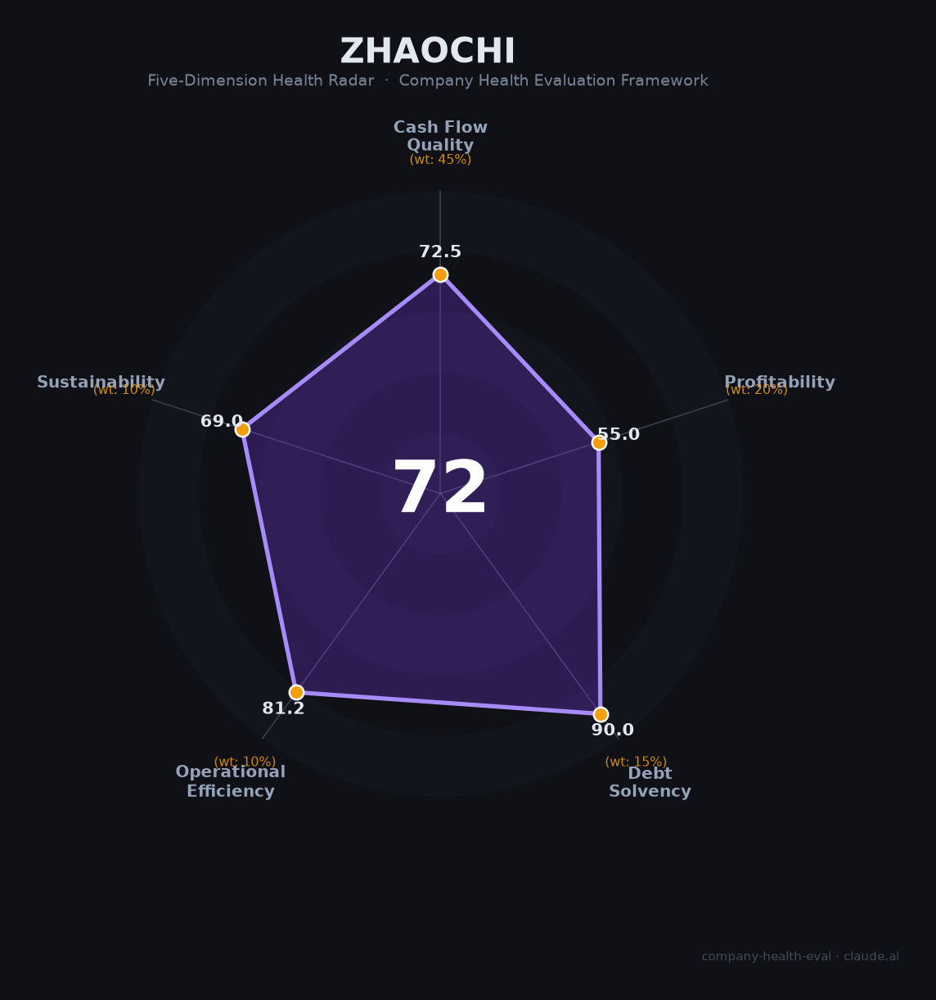

# 兆驰股份（002429.SZ）财务健康评估（2026-08-14）

## 一句话结论

🟡 **72/100，中等偏上** | LED产业链龙头，营收下滑净利承压

---

## 一、公司基本画像

| 项目 | 内容 |
|------|------|
| 主体 | 兆驰股份，智慧显示+LED全链 |
| 主营 | 智慧显示终端、LED芯片/封装/照明 |
| 财务 | 2025营收178.07亿(-12.39%)，净利13.03亿(下降) |

> 一句话定性：LED全产业链+智慧显示，净利承压但主业稳健

---

## 二、五维财务健康评估

### 1. 现金流质量（72/100）| 权重45%

现金流稳健。

### 2. 盈利能力（55/100）| 权重20%

毛利率尚可，但营收/净利同比下滑。

### 3. 偿债能力（90/100）| 权重15%

负债结构稳健。

### 4. 运营效率（81/100）| 权重10%

运营效率尚可。

### 5. 可持续发展（69/100）| 权重10%

LED行业周期波动+竞争加剧，但公司一体化优势明显。

---

## 三、综合评分

| 维度 | 得分 | 权重 | 加权 |
|------|:----:|:----:|:----:|
| 现金流质量 | 72 | 45% | 32.6 |
| 盈利能力 | 55 | 20% | 11.0 |
| 偿债能力 | 90 | 15% | 13.5 |
| 运营效率 | 81 | 10% | 8.1 |
| 可持续发展 | 69 | 10% | 6.9 |
| **综合得分** | **72/100** | 100% | 72.1 |

**健康等级：中等偏上** — 整体稳健，局部有待改善

---

## 四、核心风险清单

1. **LED/显示行业周期**
2. **需求波动**
3. **竞争加剧**

## 五、求职/择业视角

### 核心优势
- LED全产业链布局深、资金积累厚
### 现有短板
- 营收净利双降、行业增速放缓

**结论**：兆驰股份LED全链+智慧显示双主业，短期营收承压，长期行业一体化优势犹在，稳健。

---

*评估方法：商泰汽车（iAUTO）五维框架 · 数据截至2026年8月 · 财务来源兆驰股份2025年报*