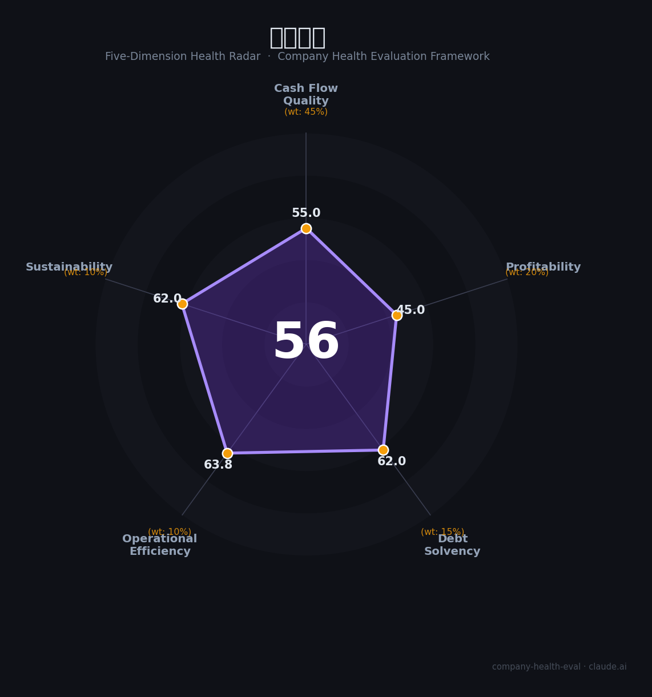

# 光峰科技（688007.SH）财务健康评估（2026-08-14）

## 一句话结论

🟠 **56/100，中等** | 激光显示龙头，营收下滑、短期亏损

---

## 一、公司基本画像

| 项目 | 内容 |
|------|------|
| 主营 | 激光显示/影院放映 |
| 财务 | 2025营收17.09亿(-29.32%)，归母净利-2.74亿(转亏) |

> 一句话定性：激光显示龙头，影视承压、转亏、需观察

---

## 二、五维财务健康评估

### 1. 现金流质量（55/100）| 权重45%

经营现金流承压。

### 2. 盈利能力（45/100）| 权重20%

盈利转亏、承压。

### 3. 偿债能力（62/100）| 权重15%

负债(或有息)偏高。

### 4. 运营效率（64/100）| 权重10%

营收下滑、运营待改善。

### 5. 可持续发展（62/100）| 权重10%

激光显示备赛+AR新方向。

---

## 三、综合评分

| 维度 | 得分 | 权重 | 加权 |
|------|:----:|:----:|:----:|
| 现金流质量 | 55 | 45% | 24.8 |
| 盈利能力 | 45 | 20% | 9.0 |
| 偿债能力 | 62 | 15% | 9.3 |
| 运营效率 | 64 | 10% | 6.4 |
| 可持续发展 | 62 | 10% | 6.2 |
| **综合得分** | **56/100** | 100% | 55.6 |

**健康等级：中等** — 整体稳健，局部有待改善

---

## 四、核心风险清单

1. **营收下滑**
2. **持续亏损**
3. **机械/经营负债**

## 五、求职/择业视角

### 核心优势
- 激光显示技术、影院、AR未来
### 现有短板
- 亏损、营收下滑、现金流偏紧

**结论**：光峰科技激光显示技术领先，但2025营收下滑+转亏，盈利承压，需观察反转。

---

*评估方法：商泰汽车（iAUTO）五维框架 · 数据截至2026年8月 · 财务来源光峰科技2025年报*