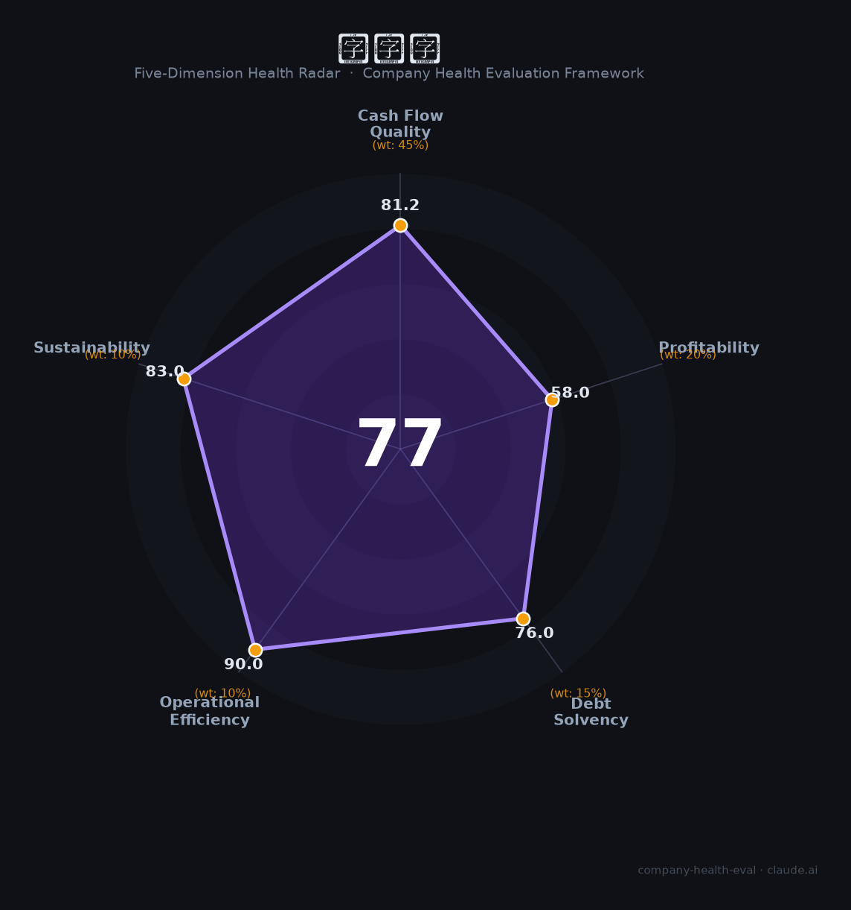

# 分期乐（NASDQ: LX）财务健康评估（2026-08-14）

## 一句话结论

🟡 **77/100，中等偏上** | 消费金融科技，净利大增、稳健增长

---

## 一、公司基本画像

| 项目 | 内容 |
|------|------|
| 主体 | 分期乐(乐信)，新消费金融科技 |
| 主营 | 分期消费/消金/电商 |
| 财务 | 2025营收131.52亿(-7.4%)，净利16.77亿(+52%) |

> 一句话定性：消费金融科技，净利高增、合规经营

---

## 二、五维财务健康评估

### 1. 现金流质量（81/100）| 权重45%

现金流动好。

### 2. 盈利能力（58/100）| 权重20%

净利高增、盈利改善。

### 3. 偿债能力（76/100）| 权重15%

持牌信贷，偿债稳健。

### 4. 运营效率（90/100）| 权重10%

运营效率高。

### 5. 可持续发展（83/100）| 权重10%

消费金融复苏，合规+科技驱动。

---

## 三、综合评分

| 维度 | 得分 | 权重 | 加权 |
|------|:----:|:----:|:----:|
| 现金流质量 | 81 | 45% | 36.5 |
| 盈利能力 | 58 | 20% | 11.6 |
| 偿债能力 | 76 | 15% | 11.4 |
| 运营效率 | 90 | 10% | 9.0 |
| 可持续发展 | 83 | 10% | 8.3 |
| **综合得分** | **77/100** | 100% | 76.8 |

**健康等级：中等偏上** — 整体稳健，局部有待改善

> 金融机构：偿债以资本充足率评估

---

## 四、核心风险清单

1. **监管趋严**
2. **利率约束**
3. **资产质量**

## 五、求职/择业视角

### 核心优势
- 消费金融龙头、盈利改善、科技
### 现有短板
- 营收下滑、监管风险

**结论**：分期乐(乐信)消费金融科技，净利高增、盈利改善，稳中向好。

---

*评估方法：商泰汽车（iAUTO）五维框架（金融机构特性） · 数据截至2026年8月 · 财务来源乐信财报*