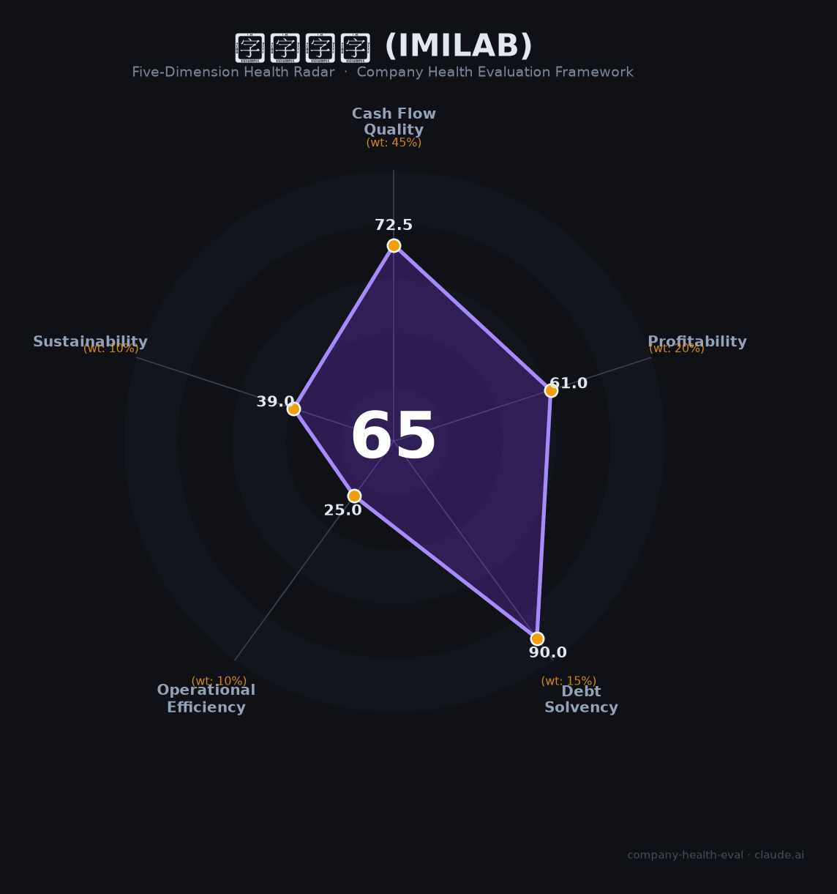

# 创米数联（IMILAB）财务健康评估（2026-07-01）

## 一句话结论

**🟠 中等（65/100）** | 现金充裕但模式脆弱，创始人内斗是当前最大不确定性

创米数联是中国家用摄像头市场份额第二（22%）的小米生态链企业，零负债、现金储备丰厚，但毛利率仅行业一半、单产品单客户高度集中、IPO折戟、2026年5月创始人实名举报董事长——是一家"财务底子不差但治理与可持续性堪忧"的公司。

## 一、公司基本画像

| 维度 | 内容 |
|------|------|
| **全称** | 上海创米数联智能科技发展股份有限公司 |
| **品牌** | 创米小白（国内）/ IMILAB（海外） |
| **成立** | 2014年4月10日 |
| **总部** | 上海徐汇区漕河泾（注册地闵行紫竹） |
| **实控人** | 邓华（直接持股17.99%，表决权34.50%） |
| **小米持股** | 8.52%（天津金星创投） |
| **员工** | 约339人（2024），社保参保275人 |
| **主营** | 智能摄像机（收入占比84%）、小白智慧门、智能门锁、猫眼门铃 |
| **市场地位** | 中国家用摄像头出货量第二（2021年份额22.11%），累计出货9000万+台 |
| **IPO状态** | 2022年6月申报创业板，2022年12月撤回（首轮问询未回复） |
| **融资** | 天使→B+轮共6轮，累计融资约3亿+元，2021年B轮估值约22亿元 |

🔒 2019-2021年财务数据来自IPO招股书（经审计）。2022年后无公开财务披露。

## 二、五维财务健康评估

### 1. 现金流质量（72.5/100）

| 指标 | 判断 | 依据 |
|------|------|------|
| 经营现金流趋势 | ⚠️ 缺失 | 招股书经营现金流数据未被任何公开来源提取，仅知投资现金流连年为负（购买理财） |
| 现金储备 | 🟡 关注 | 2021年末交易性金融资产达25.8亿元（含循环购买），但距上次融资已3.5年，当前实际现金不明 |
| 有息负债 | 🟢 健康 | 无有息负债记录，招股书未提及任何银行贷款 |
| 净现比 | ⚠️ 缺失 | 经营现金流数据不可得 |

**判断依据**：创米的资产负债表在2021年看起来非常干净——零有息负债、大量流动资产。但经营现金流数据缺失是关键盲区：应收账款周转仅6.94次（同行31.16次），且70%+来自小米，说明现金回收效率极低。2022年IPO失败后无任何财务公开，现金实际消耗情况成谜。

### 2. 盈利能力（61.0/100）

| 指标 | 判断 | 依据 |
|------|------|------|
| 毛利率 | 🔴 预警 | 19.75%（2021），行业均值36%，萤石网络42%——小米ODM模式结构性压制 |
| 净利率 | 🟡 一般 | 3.9%（2021扣非约6.9%），萤石网络9.6% |
| 营收增速 | 🟢 良好 | 2019-2021 CAGR约32%（8.75亿→11.24亿→15.33亿），但2022年后无数据 |
| 研发费用率 | 🟢 良好 | 5.14%（2021），研发人员占54%，累计490+专利 |
| 人均产出 | 🟢 优秀 | 约452万元/人（2021），远超萤石131万元——因纯代工模式，不养产线工人 |

**判断依据**：创米的盈利能力呈现"高低分化"——人均效率极高（纯研发+营销，无工厂）、历史增速快，但毛利率仅行业一半，这是小米ODM模式的代价。小米生态链中成功"去小米化"的企业（石头科技毛利率54%）与深度绑定者（创米19.75%）的差距判若云泥。

### 3. 偿债能力（90.0/100）

| 指标 | 判断 | 依据 |
|------|------|------|
| 资产负债率 | 🟢 健康 | 推测极低（无银行贷款+大量流动资产），但无精确数字 |
| 有息负债率 | 🟢 健康 | 零有息负债 |
| 流动比率 | 🟢 健康 | 推测极高（流动资产覆盖短期债务绰绰有余） |
| 现金比率 | 🟢 健康 | 现金类资产充裕 |
| 股权质押 | 🟢 健康 | 无股权质押记录 |

**判断依据**：创米的资产负债表是本报告最令人放心的部分。作为轻资产代工模式企业，没有工厂、没有银行贷款，偿债风险极低。这在本报告所有维度中得分最高。

### 4. 运营效率（25.0/100）

| 指标 | 判断 | 依据 |
|------|------|------|
| 应收周转 | 🔴 危险 | 周转率6.94次 vs 同行31.16次，小米账期拖累严重 |
| 客户集中度 | 🔴 危险 | 小米渠道占收入59.79%（2021），虽从89%下降但仍极高 |
| 员工规模趋势 | 🟡 关注 | 社保人数从约330（2022）降至275（2025），略有萎缩 |
| 高管稳定性 | 🔴 危险 | 创始人李建新2023年辞职、2025年离职、2026年5月实名举报董事长邓华 |

**判断依据**：运营效率是本报告最差的维度。这不是意外——创始人内斗+单客户集中+应收恶化三重打击同时存在。应收周转仅为同行的22%，意味着创米实际上在给小米提供营运资金融资。而2026年5月创始人李建新在顺为资本CEO社群实名举报邓华"设局夺股"，将1亿+口头退出对价压缩至576万，暴露了公司治理的深层危机。

### 5. 可持续发展能力（39.0/100）

| 指标 | 判断 | 依据 |
|------|------|------|
| 市场增速 | 🟡 关注 | 家用摄像头市场增速放缓至3-4%，智能门锁增速2-3%，均进入存量竞争 |
| 技术护城河 | 🟡 关注 | 490+专利、AI实验室，但ODM模式本质可替代，小米可随时切换供应商 |
| 业务多元化 | 🔴 危险 | 摄像头84%+小米60%=双重集中。智慧门被嘲"智商税"，门锁规模可忽略 |
| 资本支持 | 🔴 危险 | IPO失败、无新融资、无上市路径。竞品萤石已上市、鹿客港股递表 |
| 政策风险 | 🟡 关注 | 2025年摄像头新国标+工信部首轮IoT设备执法，合规成本上升 |

**判断依据**：创米的可持续发展面临结构性困境。市场在减速、小米在收紧S级品类控制（2024年SAN分级改革将摄像头和门锁归为S级）、竞争对手在上市、自身无资本通道。更致命的是，创始人内斗公开化后，任何新融资或重启IPO的可能性都大幅降低——没有投资方愿意在控制权纠纷未解决时进入。

## 三、综合评分与健康等级

| 维度 | 得分 | 权重 | 加权得分 |
|------|:----:|:----:|:--------:|
| 现金流质量 | 72.5 | 45% | 32.6 |
| 盈利能力 | 61.0 | 20% | 12.2 |
| 偿债能力 | 90.0 | 15% | 13.5 |
| 运营效率 | 25.0 | 10% | 2.5 |
| 可持续发展 | 39.0 | 10% | 3.9 |
| **综合得分** | | | **64.7 → 65/100** |
| **健康等级** | | | **🟠 中等（Moderate）** |

雷达图一目了然：偿债能力是唯一亮点（90分），现金流和盈利能力处于中位，运营效率和可持续发展双双崩塌。典型的"资产负债表健康但商业模式不健康"画像。

## 四、同业对标

| 对比项 | **创米数联** | **萤石网络（688475）** | **鹿客（港股递表）** |
|--------|:-----------:|:-------------------:|:-----------------:|
| 上市状态 | 创业板撤回 | 科创板上市 | 港股递表中 |
| 营收（最新） | ~15.33亿（2021） | 59.0亿（2025） | 10.86亿（2024） |
| 毛利率 | 19.75% | 42.6% | 31.2%（自有品牌46.9%） |
| 净利率 | ~3.9% | 9.6% | 4.1% |
| 员工 | ~339 | 4,520 | ~800-1,000 |
| 人均营收 | ~452万 | 131万 | ~110-130万 |
| 小米依赖 | ~60% | 无（海康分拆） | 61.6% |
| 核心产品 | 摄像头（84%） | 摄像头54%+门锁+云服务 | 门锁（100%） |
| 市值/估值 | ~22亿（2021 B轮） | ~450亿 | 待定 |

**对标结论**：创米在人均效率上领先（无工厂模式的天然优势），但在毛利率、资本通道、产品多元化上全面落后于萤石。与同为小米生态链的鹿客相比，创米的小米依赖程度相当，但鹿客至少已迈出港股IPO步伐。

## 五、核心风险清单

1. **创始人控制权纠纷（严重 🔴）**：2026年5月李建新实名举报邓华"设局夺股"，口头承诺1亿+退出对价被压缩至576万。事件在顺为资本CEO社群引爆后，邓华及小米均未回应。直接影响：治理危机、团队士气、后续融资可能性。

2. **小米依赖症（高 🟠）**：收入60%来自小米，应收70%+来自小米，毛利率被小米模式锁死在20%以下。小米2024年SAN分级将摄像头归为S级（严控），创米议价权进一步削弱。参考先例：华米、云米股价崩塌。

3. **IPO路径封死（高 🟠）**：创业板撤回已3.5年，在治理纠纷+小米依赖+营收单一三重问题未解决前，重启IPO可能性极低。缺乏资本市场通道意味着员工期权无法变现、公司无法融资扩张。

4. **营收单一（中高 🟡）**：84%收入来自一个品类（摄像头），60%来自一个客户（小米）。任何一个维度的变化（小米换供应商、摄像头需求下滑）都会造成致命冲击。

5. **数据缺失风险（中 🟡）**：2022年后无任何公开财务数据。本报告所有判断基于2019-2021年招股书数据，距今已3.5年。实际财务状况可能已显著恶化。

6. **专利诉讼（中 🟡）**：杭州鸿雁电器15起专利侵权诉讼（涉诉1900万），虽部分撤诉但最高法院2024年11月仍在审理相关案件。在小米与格力/美的/海尔专利战全面升级的背景下，作为小米摄像头ODM的创米面临传导风险。

## 六、求职/择业视角

### 核心优势
- **技术积累实在**：490+专利、AI实验室、180人研发团队（占54%），摄像头和IoT技术经验可迁移至安防、智能家居全行业
- **小米生态背书**：虽然依赖是风险，但"小米生态链核心供应商"的履历在消费电子行业仍有含金量
- **工作强度适中**：员工评价工作压力3.7/5（中等），管理风格4.3/5（人性化），非996文化
- **零负债**：公司短期内不会因债务问题倒闭

### 现存短板
- **期权价值存疑**：IPO失败+创始人股权被576万回购的案例在前，员工期权大概率是一张废纸
- **职业天花板低**：300人规模+单品类+代工模式，能学到的东西有限
- **跳槽品牌力一般**：在安防/摄像头行业有知名度，跨界认知度低
- **薪酬竞争力中等**：招聘薪资范围（C++工程师21-40万/年）处于上海行业中位，无明显溢价

### 分场景建议

| 个人诉求 | 推荐度 | 说明 |
|----------|:------:|------|
| 稳定+深耕 | ⭐⭐ | 公司短期不会倒闭，但创始人内斗+战略不明导致中长期不确定 |
| 高薪+跳板 | ⭐⭐⭐ | 小米生态链履历在消费电子/安防行业有价值，但期权勿抱期望 |
| 成长+融资红利 | ⭐ | IPO无望+无新融资，期权是纸，成长靠自我驱动 |
| IoT/AI技术入门 | ⭐⭐⭐ | 摄像头+AI算法技术栈通用，适合作为进入安防/IoT行业的跳板 |

## 七、总结

创米数联是中国智能摄像头ODM领域「有规模但无定价权」的公司：零负债、现金储备充足，但毛利率仅同行一半、单品类单客户高度集中、IPO折戟、创始人内斗公开化。在中国智能家居进入存量竞争、小米收紧生态链管控、监管合规成本上升的大环境下，属于**中等风险**，适合**有经验、不依赖期权、将这份工作视为行业跳板**的求职者；**强烈不建议**应届生或期望股权回报的候选人将其作为首选。

---

*评估日期：2026-07-01 | 数据截止：2021年（招股书）+ 2024-2026年公开信息 | 评分引擎：v1.1*
