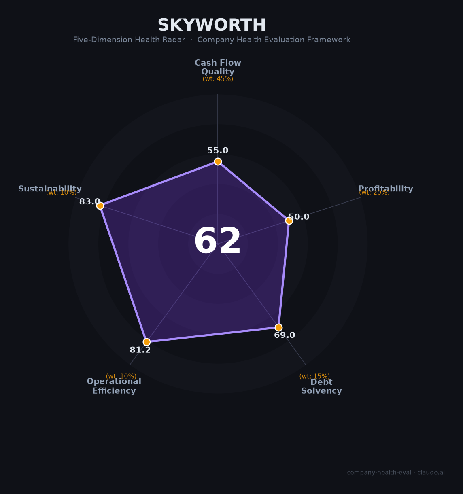

# 创维集团（00751.HK）财务健康评估（2026-08-13）

## 一句话结论

🟠 **中等（62/100）** | 老牌家电/机顶盒+新能源转型——营收703.2亿（+8.2%）但溢利-37.3%，盈利承压+转型投入期

---

## 一、公司基本画像

| 项目 | 内容 |
|------|------|
| 主体 | 🔒 创维集团，H股：00751.HK；总部深圳；中国老牌家电/彩电龙头 |
| 主营 | 智能家电（彩电）、机顶盒、光伏/新能源、现代服务业 |
| 财务 | 🔒 2025营收703.2亿（+8.2%）；溢利3.6亿（-37.3%）；毛利率12.8%（-0.7pct） |

> 一句话定性：创维从彩电/机顶盒向新能源（光伏）转型，2025营收增长（+8.2%）但溢利大降（-37.3%），新能源/现代服务毛利收窄，转型与盈利承压并存。

## 二、五维财务健康评估

1. 现金流（55/100）:营收增但溢利降，现金关注。
2. 盈利（50/100）:溢利-37.3%、毛利率12.8%下滑，盈利承压。
3. 偿债（69/100）:家电+新能源，现金相对健康、偿债平稳。
4. 运营（81/100）:彩电/机顶盒/光伏渠道成熟、运营高效。
5. 可持续（83/100）:新能源（光伏）+家电多元化，转型空间大，竞争/价格关注。

## 三、综合评分

| 维度 | 得分 | 权重 | 加权 |
|------|:----:|:----:|:----:|
| 现金流质量 | 55.0 | 45% | 24.8 |
| 盈利能力 | 50.0 | 20% | 10.0 |
| 偿债能力 | 69.0 | 15% | 10.3 |
| 运营效率 | 81.2 | 10% | 8.1 |
| 可持续发展 | 83.0 | 10% | 8.3 |
| **综合** | **62** | 100% | 61.5 |

**评级：🟠 中等** — 家电+新能源转型，盈利承压。

## 四、核心风险
1. 溢利-37.3%、毛利率下滑。
2. 新能源（光伏）/彩电价格竞争。
3. 转型投入/盈利平衡。

## 五、求职/择业视角
- 优势：老牌家电+新能源转型、多元化、深圳/全国布局。
- 短板：盈利承压、彩电业务成熟增速低、薪酬弹性一般。

**结论**：适合追求家电+新能源转型方向、稳定多元平台的求职者；盈利弹性有限。

---

*评估方法：商泰汽车（iAUTO）五维健康度框架 · 数据截至2026年8月 · 来源创维2025年报*