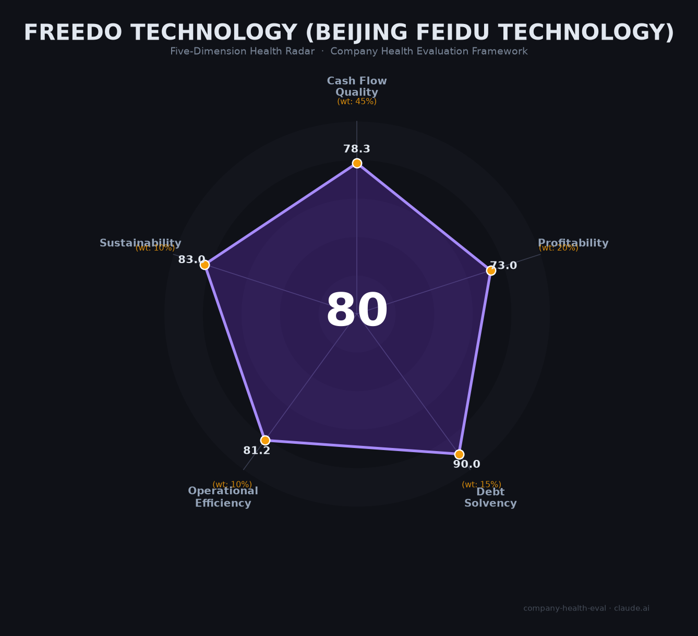

# 北京飞渡科技 财务健康评估（2026-06-15）

## 一句话结论

🟡 **中等偏上（79.8/100）** | 数字孪生平台赛道龙头，零负债+腾讯背书+政策顺风，核心短板是营收不透明、盈利能力未验证、应收账款回款承压

---

## 一、公司基本画像

| 维度 | 信息 |
|------|------|
| **主体** | 北京飞渡科技股份有限公司（非上市） |
| **成立时间** | 2016年12月9日 |
| **注册地** | 北京市大兴区 |
| **注册资本** | 约2,080万元（实缴2,033万元） |
| **创始人** | 何文武（董事长/CEO，~21.3%股权，数字化领域近30年） |
| **联合创始人/总经理** | 宋彬（BIM/GIS/CIM领域20+年，武大地理信息系统专业） |
| **核心业务** | DTS数字孪生PaaS平台、CIM基础平台、峥嵘空间智能大模型、元尊S800一体机 |
| **行业资质** | 国家级专精特新"小巨人"企业 |
| **团队规模** | 约300人（研发占比约70%，社保参保约163人） |
| **融资历程** | 8轮融资，累计披露金额超1.5亿元 |
| **核心股东** | 何文武~21%、腾讯产业创投~17%、深智城产投、碧桂园创投、达晨财智等 |
| **市场地位** | IDC 2024中国数字孪生平台市场份额25.14%，排名第1 |

**一句话定性**：飞渡科技是中国数字孪生PaaS平台领域的技术型龙头，有腾讯战略背书和强政策顺风，但作为非上市公司，核心财务数据不可得，盈利能力和现金流质量存在较大不确定性。

---

## 二、五维财务健康评估

### 1. 现金流质量（78.3/100）⚠️ 权重45%

| 指标 | 判断 | 依据 |
|------|------|------|
| 经营现金流净额 | 🟡 关注 | 非上市公司不可见；持续融资（2025年Pre-IPO轮仍融资数千万元）暗示经营现金流尚未自给自足；行业对标的51WORLD四年累亏超5亿元 |
| 现金及等价物 | 🟢 健康 | 累计融资超1.5亿元，2025-2026年连续完成战略融资，按300人规模估算月消耗约600-1000万元，现金跑道估计>12个月 |
| 有息负债 | 🟢 健康 | 纯股权融资驱动的科技公司，无银行贷款或发债记录，零有息负债 |
| 净现比 | — 缺失 | 无公开利润数据，无法计算 |

**核心判断**：飞渡的现金流健康度取决于持续的融资能力而非自身造血。8轮融资+腾讯背书提供了安全垫，但To G项目制的长回款周期和持续研发投入意味着经营性现金流大概率不理想。2026年5月对*ST英飞拓子公司申请限制消费令，侧面印证应收账款回收存在困难。

### 2. 盈利能力（73.0/100）⚠️ 权重20%

| 指标 | 判断 | 依据 |
|------|------|------|
| 毛利率 | 🟢 良好 | 📊 估算。IDC平台市场份额25.14%，平台型软件毛利率偏高。行业对标：51WORLD 51%（2024），捷瑞数字~60%。飞渡平台收入占比高，推算毛利率50-60%，高于行业平均（45-55%） |
| 净利率 | 🟠 一般 | 📊 估算。未披露。成立10年、300人规模、仍处Pre-IPO融资阶段，大概率处于盈亏平衡线附近或微亏。行业对标：51WORLD持续亏损，凡拓数创-51.72% |
| 营收增速（3年CAGR） | 🟢 优秀 | 📊 估算。IDC平台份额从20.7%（2023）升至25.14%（2024），在行业CAGR 30%+的背景下持续扩大份额。推算2023-2024年营收增速约44% |
| 研发费用率 | 🟢 良好 | 📊 估算。70%人员为研发（~210人），推算研发费用占营收25-35%，处于科技公司合理偏高区间 |
| 人均产出 | 🟢 良好 | 📊 估算。推算人均营收约52.7万元/年，高于行业平均（20-50万），但未达优秀的1.5倍门槛（~75万） |

**核心判断**：飞渡的盈利能力指标高度依赖第三方推算（所有指标标注📊），实际数据可能存在重大偏差。平台型业务结构使其毛利率理论上优于项目制同行，但"近300人研发团队"意味着高昂的固定成本，净利率大概率不理想。

### 3. 偿债能力（90.0/100）🟢 权重15%

| 指标 | 判断 | 依据 |
|------|------|------|
| 资产负债率 | 🟢 健康 | 科技公司，纯股权融资驱动，推算资产负债率<40% |
| 有息负债率 | 🟢 健康 | 零有息负债，无银行贷款或债券记录 |
| 流动比率 | 🟢 健康 | 推算>2。低负债+持续融资（最近2026年3月B+轮）保障流动性 |
| 现金比率 | 🟢 健康 | 推算>1。2025年8月和2026年3月连续完成战略融资 |
| 股权质押 | 🟢 健康 | 无公开股权质押记录。创始人何文武持股~21.3%，未见质押 |

**加分项**：未触发。零有息负债确认，但税务信用A级未经公开渠道证实，不予加分。

**核心判断**：飞渡科技在偿债维度上属于教科书级别的优秀——零有息负债、纯股权融资、轻资产运营。这一维度是五维中唯一可给高置信度评分的维度。唯一值得关注的是，持续依赖股权融资意味着创始人和早期投资人股权被不断稀释，但对求职者而言这不构成直接风险。

### 4. 运营效率（81.2/100）🟢 权重10%

| 指标 | 判断 | 依据 |
|------|------|------|
| 应收周转 | 🟡 关注 | To G项目回款周期长（行业通病）。2026年5月对*ST英飞拓子公司申请限制消费令追偿欠款，说明应收账款回收存在实际困难 |
| 客户集中度 | 🟢 健康 | 200+央国企/上市公司客户，覆盖200+行业、80+城市，高度分散 |
| 员工规模趋势 | 🟢 健康 | 社保参保从124人（2025-12）增至163人（2026-01），多渠道持续招聘，校招20人/年 |
| 高管稳定性 | 🟢 健康 | 核心团队（何文武、宋彬）自2016年创业至今稳定，未发现高管批量离职 |

**核心判断**：运营效率良好，客户多元化是亮点。但To G模式固有的应收账款周期问题是核心短板——英飞拓案暴露了客户信用管理风险的冰山一角。

### 5. 可持续发展（83.0/100）🟢 权重10%

| 指标 | 判断 | 依据 |
|------|------|------|
| 行业赛道空间 | 🟢 健康 | 数字孪生市场CAGR 30%+，2025-2027年多部委密集出台CIM/智慧城市/物联网政策，行业处于政策红利期 |
| 技术壁垒 | 🟢 健康 | IDC平台市场份额连续两年第1（20.7%→25.14%），自研底层引擎（技术根源可追溯至2005年），2026年发布全球首款空间智能大模型"峥嵘"，国家级专精特新"小巨人" |
| 客户/业务多元化 | 🟢 健康 | 横跨城市、交通、园区、能源、水利等200+行业，DTS/CIM/WIM/AI多产品线 |
| 融资/资本支持 | 🟢 健康 | 8轮融资，腾讯（第二大股东）、深智城（深圳国资）、达晨财智等强背书，Pre-IPO阶段 |
| 政策/监管风险 | 🟡 关注 | 行业政策高度利好，但2025年《自然资源领域数据安全管理办法》等地理信息数据合规新规大幅提高合规成本，CIM平台天然涉及高精度地理信息数据，存在被认定为"重要数据处理者"的风险 |

**核心判断**：飞渡处在政策、技术、资本三重顺风中，是数字孪生赛道最有可能跑出来的选手之一。地理信息数据安全合规是唯一的中期隐忧，但属于行业共性风险而非飞渡特有。

---

## 三、综合评分与健康等级

| 维度 | 得分 | 权重 | 加权得分 |
|------|:----:|:----:|:--------:|
| 现金流质量 | 78.3 | 45% | 35.2 |
| 盈利能力 | 73.0 | 20% | 14.6 |
| 偿债能力 | 90.0 | 15% | 13.5 |
| 运营效率 | 81.2 | 10% | 8.1 |
| 可持续发展 | 83.0 | 10% | 8.3 |
| **综合得分** | | **100%** | **79.8 / 100** |

**健康等级**：🟡 **中等偏上（Moderate-High）**

> 数据可信度说明：飞渡科技为非上市企业，所有财务数据（营收、毛利率、净利率）均为基于IDC市场份额及行业对标的第三方推算，标注📊。评分结果的可信度取决于推算假设的准确性。

---

## 四、同业对标

| 对比项 | **飞渡科技** | **51WORLD（五一视界）** | **优锘科技（UINO）** |
|--------|:----------:|:-------------------:|:----------------:|
| 成立时间 | 2016年 | 2015年 | 2012年 |
| 上市/融资状态 | Pre-IPO，8轮/~1.5亿+ | 港股上市（6651.HK），8轮/~8.3亿 | C轮/~3亿+ |
| 营收规模（2024） | 📊 ~1.58亿（推算） | 2.87亿（公开） | 未公开（估0.5-2亿） |
| 毛利率 | 📊 50-60%（推算） | 51.1%（下降趋势） | 未公开 |
| 净利率 | 未公开（估微亏/盈亏平衡） | -15.7%（经调整净亏损） | 未公开 |
| 员工规模 | ~300人 | ~500-800人 | ~157人 |
| 市场份额（平台） | 25.14%（第1） | — | — |
| 核心引擎 | DTS（自研） | 51Aes（自研） | ThingJS（自研） |
| 核心差异化 | 平台份额第一+空间智能大模型 | 已上市+资金规模优势 | 零代码交付平台 |

**对标结论**：飞渡科技在数字孪生平台细分领域市占率第一，技术壁垒与51WORLD相当，但资本体量和上市进度落后。51WORLD已通过港股18C章上市融资，而飞渡仍处Pre-IPO阶段，资金规模差距明显。在营收规模上两者处于同一量级（~1.5-3亿），但51WORLD有公开披露的透明度优势。

---

## 五、核心风险清单

1. **盈利能力未验证（中高）**：成立10年、300人规模、仍处Pre-IPO阶段，大概率尚未实现稳定盈利。若IPO窗口关闭或融资环境收紧，公司可能面临被迫"节流"（裁员/降薪）的压力。触发条件：港股/A股IPO政策收紧、下一轮融资估值下行。

2. **应收账款回收风险（中）**：To G项目回款周期长，已出现对*ST英飞拓子公司的追偿案例。若地方政府财政进一步收缩，坏账可能增加。触发条件：土地财政收入持续下滑、更多客户出现ST/退市。

3. **地理信息数据合规成本上升（中）**：2025年《自然资源领域数据安全管理办法》大幅提高合规要求。飞渡作为CIM平台+测绘服务企业，涉及大量高精度地理信息数据，合规成本可能侵蚀利润。触发条件：监管执法力度加强，被认定为重要数据处理者。

4. **IPO不确定性（中低）**：Pre-IPO轮融资已完成但尚未递交招股书。数字孪生行业目前仅51WORLD一家通过18C章上市，A股尚无对标。上市时间表和估值存在不确定性。触发条件：IPO审核周期延长、上市估值不达预期。

5. **薪资竞争力下降（低）**：招聘薪资连续两年下降（2023-2024），低于北京软件行业平均约10%。有限员工反馈提到"无偿加班到凌晨12点"。触发条件：核心研发人员被竞品高薪挖角。

---

## 六、求职/择业视角

### 核心优势

- **赛道确定性高**：数字孪生/CIM是国家级政策方向，短期不会熄火。在飞渡积累的数字孪生/AI空间智能经验，行业通用性强（51WORLD、超图、广联达、华为等均需此类人才）
- **技术含金量**：IDC平台市场份额第一、自研底层引擎、全球首款空间智能大模型——技术品牌在行业内认可度高，对跳槽有正面背书
- **稳定性中等偏上**：无裁员记录、持续融资、核心团队稳定。但需注意：若IPO受挫导致资金紧张，To G项目制公司的裁员往往是突然的
- **股权潜在收益**：Pre-IPO阶段入职，若成功上市（港股或A股），早期员工期权有一定增值空间。但需明确期权条款（行权价、归属期、退出机制）

### 现存短板

- **薪酬低于行业均值**：招聘薪资约低于北京软件行业10%，且连续两年下行。如果高薪是首要诉求，飞渡不是最优选
- **加班文化**：有限样本（牛客网实习生面经）提到"无偿加班到凌晨12点"，且存在"老板认为女生不能吃苦"的性别偏见评价
- **品牌认知度有限**：相较于51WORLD（已上市、品牌声量大），飞渡在求职市场的知名度偏低
- **IPO不确定性**：期权价值取决于能否成功上市，存在清零风险

### 分场景建议

| 个人诉求 | 推荐度 | 说明 |
|----------|:------:|------|
| 数字孪生/AI方向技术深耕 | ⭐⭐⭐⭐ | 技术栈先进（3D引擎+AI大模型），行业认可度高，经验可迁移 |
| 稳定+WLB | ⭐⭐ | 有加班文化，To G项目交付期压力大 |
| 高薪+快速变现 | ⭐⭐ | 薪酬低于行业平均，期权需等IPO且存在不确定性 |
| 博IPO期权收益 | ⭐⭐⭐ | Pre-IPO阶段，若顺利上市有一定增值空间，但需确认期权条款 |
| 应届生入行 | ⭐⭐⭐ | 校招20人/年，方向前沿，积累2-3年后行业通用性强 |

---

## 七、总结

**北京飞渡科技**是数字孪生PaaS平台领域「技术驱动、IDC份额第一」的公司：偿债能力极优（零负债）、腾讯战略背书、政策顺风强劲，**唯一核心短板是盈利能力未经验证**——成立10年仍处Pre-IPO阶段，所有财务数据均为第三方推算而非公开披露。

在数字孪生行业CAGR 30%+和政策密集出台的大环境下，飞渡属于**中等偏上**的雇主选择，适合愿意押注赛道成长、接受IPO不确定性的技术人才，不适合追求高薪和WLB的求职者。

建议在面试或入职前明确：① 期权授予方案（行权价/数量/归属期/退出路径），② IPO时间表和目标板块，③ 实际工作节奏和加班补偿机制。

---

*评估日期：2026-06-15 | 数据来源：IDC报告、天眼查/企查查、36氪、飞渡科技官网、招聘平台、牛客网 | 评分引擎：score.py v1.0*

*⚠️ 免责声明：本报告仅基于公开信息分析，不构成投资或求职建议。飞渡科技为非上市公司，核心财务数据为估算值，可能与实际存在重大偏差。*
