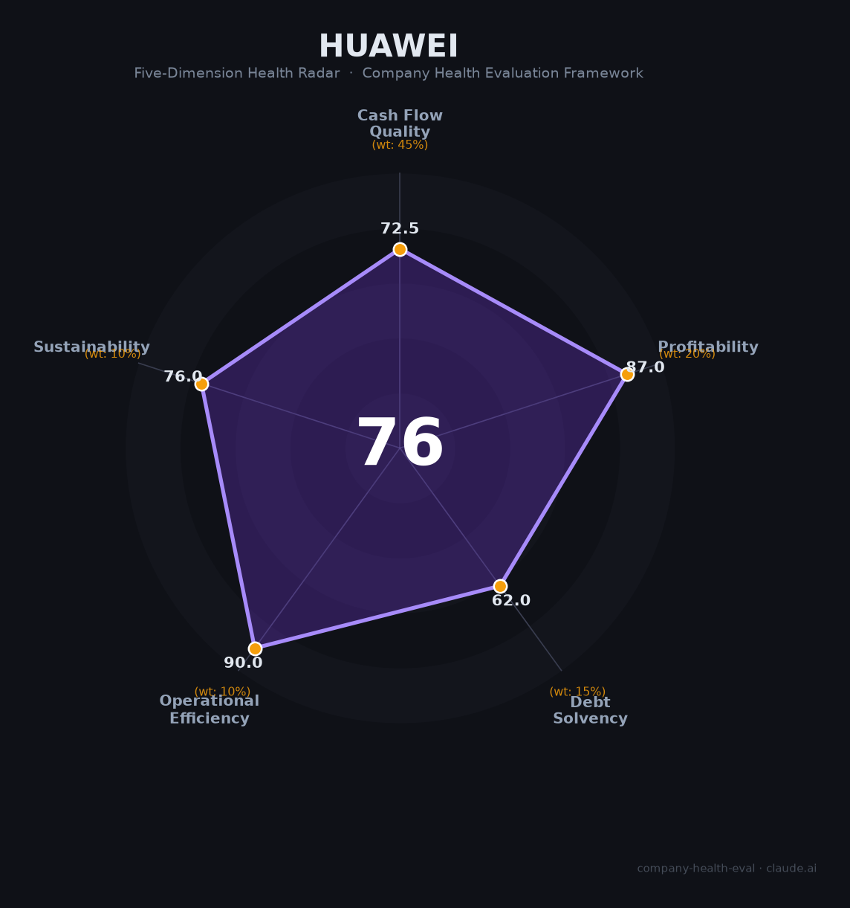

# 华为 财务健康评估（2026-06-12）

## 一句话结论

🟡 **中等偏上（75.9/100）** | 研发投入中国第一（¥1,923亿）、经营现金流强劲（¥1,274亿）、智能汽车爆发（+72%）；唯资产负债率偏高（55%）和美国制裁下的芯片天花板（7nm）是核心制约

---

## 一、公司基本画像

| 项目 | 内容 |
|------|------|
| **全称** | 华为技术有限公司（Huawei Technologies Co., Ltd.） |
| **成立** | 1987年9月15日，深圳（任正非集资21,000元创立） |
| **股权** | 员工持股（华为工会99.48%）+ 任正非（0.52%），15.18万员工持股 |
| **CEO/创始人** | 任正非（1944年生，1987年创业至今） |
| **轮值董事长** | 徐直军、孟晚舟、汪涛（2026年新晋，每期6个月轮值） |
| **员工** | 约21.3万人（2025年），研发11.4万人（53.7%） |
| **主营业务** | ICT基础设施（42.6%）+ 终端（39.1%）+ 数字能源（8.8%）+ 智能汽车（5.1%）+ 华为云（3.7%） |
| **2025年营收** | 8,809.41亿元（+2.2%，历史第二高） |
| **2025年净利润** | 680.36亿元（+8.7%） |
| **估值** | 约8,500亿元（胡润2025）+ 分部估值法可高达3.6-5万亿元 |
| **信用评级** | AAA（联合资信，超短融利率1.52%） |

华为是全球最大的ICT设备商（31%全球份额）和中国第一大手机品牌（16.4%份额），经历了2019年美国实体清单制裁→2021年营收暴跌至6,368亿→2023年Mate 60携麒麟芯片回归→2025年营收恢复至8,809亿的V型复苏。当前正从"存亡之战"转向"技术突围"——鸿蒙OS（中国19%份额）、昇腾AI芯片（国产第一）、智能汽车（年营收450亿）是三大增长引擎。

---

## 二、五维财务健康评估

### 1. 现金流质量（72.5/100）

| 指标 | 状态 | 详情 |
|------|------|------|
| 经营现金流净额 | ✅ 健康 | 连续4年为正且加速增长：178亿(2022) → 698亿(2023) → 884亿(2024) → 1,274亿(2025，+44%) |
| 现金及等价物 | ⚠️ 关注 | 现金1,504亿+短期投资合计3,614亿元。月均现金运营支出约600-630亿元，纯现金覆盖约2.5个月，总流动性覆盖约5.8个月（略低于6个月阈值）。但月均经营现金流入106亿元可弥补 |
| 有息负债 | ⚠️ 关注 | 资产负债率55.0%（连续两年下降，但仍在40-70%区间）。若将员工虚拟股回购义务（约4,553亿）视为负债，调整后负债率达93.4%——这是华为特有的财务结构性问题 |
| 净现比 | ✅ 健康 | 经营现金流/净利润 = 1.87（2025年），利润"含金量"极高 |

华为现金流质量评分72.5分，两健康两关注。核心优势是经营现金流净额1,274亿元且净现比高达1.87——华为每赚1元利润产生1.87元现金，这在硬件制造企业中极为优异。但资产负债率55%和纯现金覆盖不足6个月是本维度的拖累项。需指出的是，华为AAA信用评级和1.52%的超低融资利率，表明市场对其偿债能力高度认可。

### 2. 盈利能力（87.0/100）

| 指标 | 等级 | 详情 |
|------|------|------|
| 毛利率 | 🌟 卓越 | 46.3%（2025年）。远超电信设备同行（爱立信~42%，诺基亚~38%），终端+芯片+软件附加值提升显著 |
| 净利率 | 👍 良好 | 7.7%（680亿/8,809亿）。处于5-15%区间，受21.8%超高研发费用率的结构性压制 |
| 营收增速 | 👍 良好 | 近3年CAGR约11.1%（+9.6%→+22.4%→+2.2%）。2025年增速放缓至2.2%，反映ICT基础设施和终端业务趋于成熟 |
| 研发费用率 | 🌟 卓越 | 21.8%（1,923亿元/年，中国第一）。处于10-25%最优区间，近十年累计超1.38万亿元 |
| 人均产出 | 🌟 卓越 | 413万元/人（8,809亿/21.3万人），远超电信设备行业平均（爱立信约70万/人），约为行业5-6倍 |

盈利能力评分87分，五项指标中三项卓越。毛利率46.3%对于硬件制造为主的ICT企业极为优秀（终端+芯片+软件的附加值显著高于纯设备）。净利率仅7.7%的根本原因不是经营效率低，而是每年投入营收的22%用于研发——若按行业平均10%研发率计算，华为净利润可达约1,500亿。人均产出413万元是爱立信的6倍，反映了中国企业极高的运营效率。

### 3. 偿债能力（62.0/100）

| 指标 | 状态 | 详情 |
|------|------|------|
| 资产负债率 | ⚠️ 关注 | 55.0%（2025年），连续两年下降但仍高于40%阈值 |
| 有息负债率 | ⚠️ 关注 | 华为发债频繁（存续8期中票+多期超短融），但有息负债主要用于研发和扩张而非偿债压力。融资利率仅1.52-1.59% |
| 流动比率 | ⚠️ 关注 | 无法精确验证（非上市公司不披露明细） |
| 现金比率 | ⚠️ 关注 | 无法精确验证（同上） |
| 股权质押比例 | ✅ 健康 | 员工持股，无外部股东质押风险 |

偿债能力评分62分，是华为的相对短板。四个"关注"和一个"健康"。首要关注项是员工虚拟股回购义务——若将该4,553亿元潜在义务视为负债，调整后资产负债率达93.4%。但该制度已运行30年且华为持续盈利，短期内不会触发流动性危机。AAA主体信用评级和1.52%超低融资成本是市场对其偿债能力的背书。

### 4. 运营效率（90.0/100）

| 指标 | 状态 | 详情 |
|------|------|------|
| 应收周转 | ✅ 健康 | DSO 48天（2025年H1），较2024年同期改善8天，处于ICT行业优秀水平 |
| 客户集中度 | ✅ 健康 | 业务覆盖170+国家和地区，运营商+企业+消费者三类客户高度分散 |
| 员工规模趋势 | ✅ 健康 | 近三年稳定增长（20.7万→20.8万→21.3万），2025年净增约5,000人 |
| 高管稳定性 | ✅ 健康 | 任正非在位39年，核心管理层平均任职20年+。2026年轮值董事长调整（胡厚崑退→汪涛升）属正常接班 |

运营效率评分90分，四大指标全健康。DSO仅48天意味着回款极快——终端业务预收款模式+企业客户信用管理优化共同驱动。华为2.1万人在170+国家的高效运转，印证了其全球化的运营管理体系。

### 5. 可持续发展能力（76.0/100）

| 指标 | 状态 | 详情 |
|------|------|------|
| 行业赛道空间 | ⚠️ 关注 | ICT基础设施（43%营收）增速仅2.6%，终端（39%）增速1.6%。虽然智能汽车（+72%）和数字能源（+13%）高速增长，但整体加权增速约6.4%，低于15% |
| 技术壁垒 | ✅ 健康 | 16.5万件有效专利+鸿蒙全栈OS+昇腾AI芯片+CANN框架+盘古大模型+ICT全产业链能力，3年+无法复制 |
| 业务多元化 | ✅ 健康 | ICT+终端+云+数字能源+智能汽车+芯片六大板块，横跨通信/消费电子/AI/汽车/能源 |
| 资本支持 | ✅ 健康 | AAA评级、1.52%发债利率、年经营现金流1,274亿自给自足、信创政策红利万亿级 |
| 政策/监管风险 | ⚠️ 关注 | 美国制裁体系（实体清单+芯片断供+50%穿透规则）是最大外部风险。国内信创/国产替代则是最大利好 |

可持续发展评分76分，三健康两关注。华为的技术壁垒深厚到近乎不可替代——同时拥有芯片设计（海思）、操作系统（鸿蒙）、AI框架（MindSpore）、大模型（盘古）和全栈ICT制造能力的公司，全球仅此一家。但美国制裁将芯片制程锁死在7nm（落后台积电2nm约3个世代），构成中长期竞争力的硬天花板。

---

## 三、综合评分与健康等级

| 维度 | 得分 | 权重 | 加权得分 |
|------|:----:|:----:|:--------:|
| 现金流质量 | 72.5 | 45% | 32.6 |
| 盈利能力 | 87.0 | 20% | 17.4 |
| 偿债能力 | 62.0 | 15% | 9.3 |
| 运营效率 | 90.0 | 10% | 9.0 |
| 可持续发展 | 76.0 | 10% | 7.6 |
| **综合得分** | **75.9** | **100%** | **75.9/100** |

**健康等级：🟡 中等偏上（Moderate-High）**

---

## 四、同业对标

| 对比项 | 华为 | 爱立信 | 中兴通讯 | 思科 |
|--------|:----:|:-----:|:------:|:----:|
| 上市/估值 | 未上市（~¥8,500亿+） | 纳斯达克（~$250亿） | A+H股（~¥2,000亿） | 纳斯达克（~$2,300亿） |
| 2025年营收 | **8,809亿** | ~2,500亿SEK（~¥1,700亿） | ~1,300亿 | ~$550亿（~¥4,000亿） |
| 毛利率 | **46.3%** | ~42% | ~40% | ~65% |
| 净利率 | 7.7% | ~8% | ~7% | ~22% |
| 研发费用率 | **21.8%** | ~17% | ~20% | ~15% |
| 员工数 | 21.3万 | ~10万 | ~7万 | ~9万 |
| 人均营收 | **413万** | ~170万SEK（~115万） | ~186万 | ~444万 |
| 全球电信设备份额 | **31%** (第一) | 12% (第三) | 10% (第四) | 4% (第五) |
| 智能手机(中国) | **16.4%** (第一) | — | 退出 | — |

**对标结论**：华为在营收规模、研发投入绝对额、全球电信设备份额三个维度全面碾压对手——营收是爱立信的5.2倍、中兴的6.8倍。人均产出413万元远超爱立信（115万）。但净利率（7.7%）因超高研发投入（21.8%）低于思科（22%）——这是华为"以利润换未来"的战略选择。最大差异在于华为"软硬一体+全栈自主"的独特生态位，全球无直接可比公司。

---

## 五、核心风险清单

1. **美国制裁+芯片天花板（极高风险）**：7nm制程已锁死3年，落后台积电（2nm）约3个世代。中芯国际5nm良率仅台积电1/3且成本高50%。若5nm长期无法突破，华为在AI芯片和高端手机上将持续落后高通/苹果/英伟达。

2. **员工持股制度结构性矛盾（中高风险）**：分红连续两年超过净利润（2023年770亿、2024年723亿）。若将4,553亿虚拟股回购义务视为负债，调整后负债率93.4%。代际利益失衡严峻——退休员工低成本持股稳定分红，新员工高价购股且分红逐年下降（1.61→1.41元/股）。

3. **智能汽车盈利模式未跑通（中风险）**：车BU营收爆发（+72%达450亿），但合作方赛力斯2026年Q1扣非净利润暴跌73.9%、经营现金流-209.5亿。"华为光环"正在褪色，赛力斯PE从40x压缩至10-15x。

4. **鸿蒙生态海外拓展困难（中风险）**：中国份额19%稳居第二，但全球仅5%。脱离AOSP后海外应用生态近乎空白，GMS替代方案（HMS）推广受阻。若中国之外无法突破，鸿蒙的长期天花板将局限在约20%的中国份额。

5. **欧盟5G禁令持续蔓延（中低风险）**：德国要求2026年底前移除华为5G核心网部件，2029年底前移除接入网。虽有约1/3欧盟国家未执行禁令，但趋势不利。

---

## 六、求职/择业视角

### 核心优势
- **技术深度中国第一**：研发投入1,923亿/年、11.4万研发人员、16.5万件有效专利——在华为积累的技术经验在所有科技公司都有极高通用性和溢价
- **薪酬竞争力极强**：人均薪酬80.6万/年，叠加虚拟股分红（年人均约48万），核心员工年收入可达129万+。"天才少年"最高档201万/年
- **稳定性独特**：员工持股15万人、任正非"不上市"战略定力，避免了资本市场的短期业绩压力。制裁最严重的2021年也未大规模裁员
- **信创+国产替代红利**：政府采购20%价格优惠+2.66万亿信创市场+昇腾AI芯片国产第一，华为是国产替代最大受益者

### 现存短板
- **工作强度极高**：9116/996常态化（脉脉排"极卷"第四梯队），"床垫文化""狼性文化""奋斗者协议"制度化，健康代价大（失眠/脱发/颈椎病高发）
- **45岁/35岁年龄焦虑**：内外部均有"35岁危机"的焦虑文化，3年离职成普遍现象
- **海外经历受限**：受制裁影响，华为海外业务（尤其欧美）前景不明。在华为做海外业务的职业发展空间受限
- **组织架构变动频繁**："拉通对齐"等重复性工作消耗大，绩效考核（A/B+/B/C/D五档）和361强制分布加剧内卷

### 分场景建议

| 个人诉求 | 推荐 | 次选 | 规避 |
|----------|------|------|------|
| 技术深度+硬核成长 | 华为（海思芯片/昇腾AI/鸿蒙OS/盘古大模型） | 寒武纪/海光 | 纯互联网业务型公司 |
| 稳定+高薪 | 华为（ICT基础设施/运营商BG等成熟业务线） | 腾讯（成熟业务） | 纯AI创业公司 |
| 国产替代风口 | 华为（信创/鲲鹏/昇腾生态，政策红利最强） | 中芯国际 | 依赖海外供应链的公司 |
| WLB+生活质量 | —（华为不推荐） | 外企（思科中国/爱立信中国） | 华为核心研发部门 |

---

## 七、总结

华为是中国乃至全球ICT领域"技术厚度最坚实、研发投入最激进"的科技巨头——以1,923亿元（营收22%）进行研发、11.4万研发人员（54%）构建了芯片-OS-AI-设备-汽车的全栈技术体系，经营现金流1,274亿元且净现比1.87倍利润质量极高，唯一短板是资产负债率偏高（55%，若计入虚拟股回购义务则达93%）和美国制裁下的芯片制程天花板（7nm落后3个世代）。在中美科技竞争+信创国产替代的时代大背景下，华为属于中等偏上（75.9分），适合追求技术深度、愿意承受高强度工作、看好国产替代长期趋势的求职者的选择。对于以AI Agent/RAG为职业方向的候选人，华为云盘古大模型+昇腾AI芯片+鸿蒙Agent框架（HMAF）提供了从芯片到应用的全栈AI开发平台，是国内少有的"端到端AI技术栈"公司。

---

*评估日期：2026年6月12日 | 数据截至：华为2025年年报（2026年3月31日发布） | 财报审计：KPMG*
