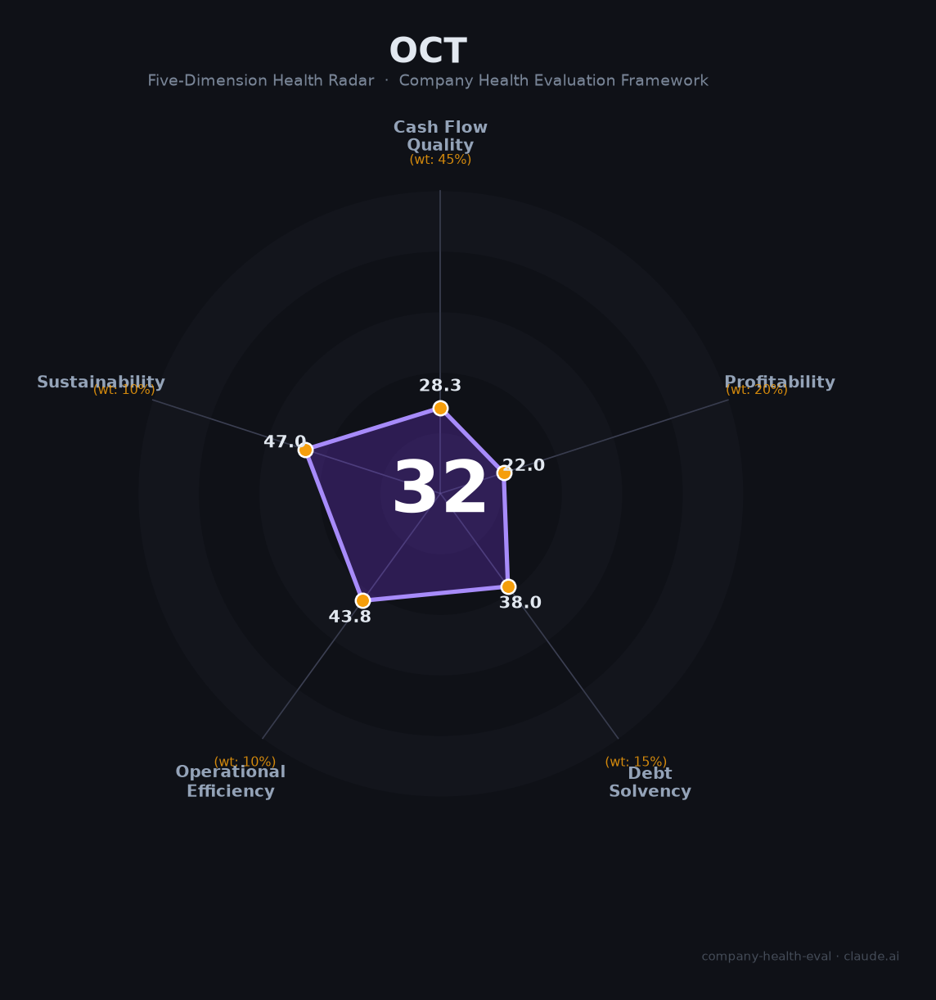

# 华侨城A（000069.SZ）财务健康评估（2026-08-13）

## 一句话结论
⚫ **高风险（32/100）** | 文旅+地产央企——2025营收-42.3%、归母净亏-145亿（资产减值86亿）、负债率80.6%，深度承压

## 一、公司基本画像
| 主体 | 🔒 深圳华侨城A，A股000069.SZ；央企文旅+地产平台（欢乐谷/锦绣中华） |
| 主营 | 文旅+地产+商业 |
| 财务 | 2025营收313.8亿(-42.3%)；归母净利-145亿(-62.9%)；资产减值86亿；经营现金流125亿；负债率80.6%、PB0.43 |

## 二、五维
### 1. 现金流（28/100）危险：双减/融资收缩，现金流靠回款维持
### 2. 盈利（22/100）预警：归母-145亿巨亏、毛利率9.3%、净利-60%，减值重
### 3. 偿债（38/100）危险：负债率80.6%、地产高杠杆
### 4. 运营（44/100）：文旅+地产去化承压、减值、员工收缩
### 5. 可持续（47/100）：文旅消费+地产周期反转

## 三、综合（28|45%=12.7，22|20%=4.4，38|15%=5.7，44|10%=4.4，47|10%=4.7）
**32，⚫ 高风险** — 巨亏+高杠杆，生存存疑

## 四、风险
1. 归母-145亿巨亏+减值86亿。
2. 负债率80.6%、地产下行。
3. 文旅+地产去化。

## 五、求职
- 优势：文旅央企平台（欢乐谷等）、品牌文旅资产。
- 短板：巨亏+裁员/降薪、债务压力，开发条线风险大。

**结论**：财务深度承压，文旅运营条线或有潜力，但整体不建议优先考虑。

---
*评估方法：商泰汽车（iAUTO）五维框架 · 来源华侨城2025年报*