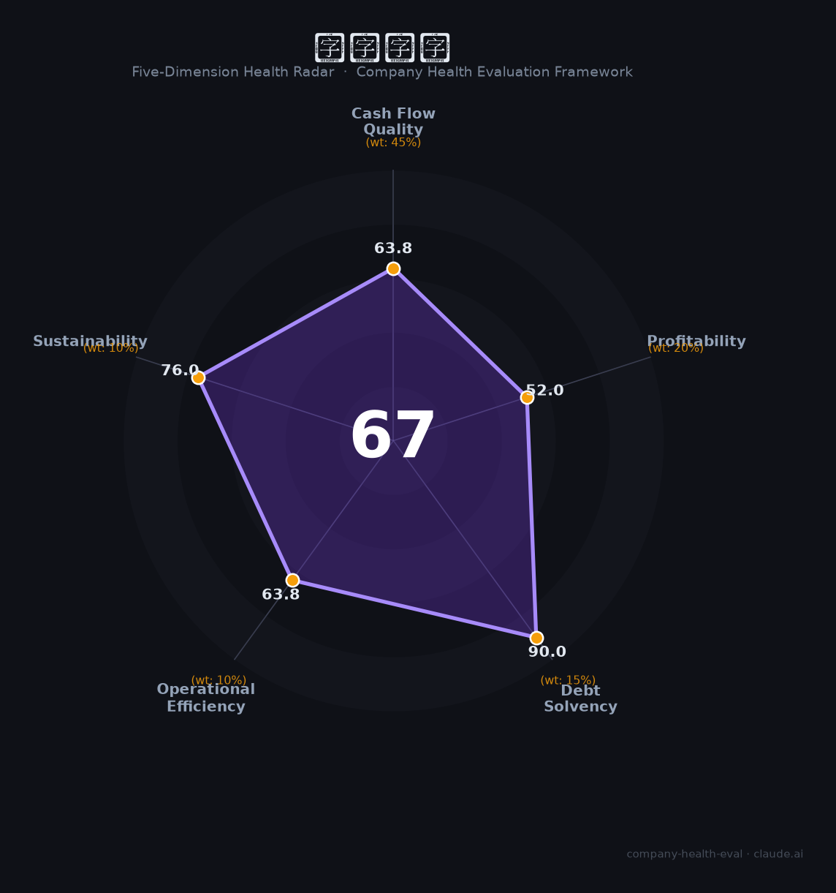

# 华大基因（300676.SZ）财务健康评估（2026-08-14）

## 一句话结论

🟠 **67/100，中等** | 基因测序龙头，营收稳但净利亏损，低负债

---

## 一、公司基本画像

| 项目 | 内容 |
|------|------|
| 主体 | 华大基因，基因测序龙头 |
| 主营 | 基因测序/民生检测/基因组学 |
| 财务 | 2025营收37.05亿(-4.18%)，归母净利-6.17亿(亏损) |

> 一句话定性：基因测序龙头，营收略降、净利亏损、低负债

---

## 二、五维财务健康评估

### 1. 现金流质量（64/100）| 权重45%

经营现金流转弱。

### 2. 盈利能力（52/100）| 权重20%

净利亏损，盈利能力承压。

### 3. 偿债能力（90/100）| 权重15%

低负债、偿债稳健。

### 4. 运营效率（64/100）| 权重10%

运营效率一般。

### 5. 可持续发展（76/100）| 权重10%

基因测序需求平稳，华大平台有技术积淀。

---

## 三、综合评分

| 维度 | 得分 | 权重 | 加权 |
|------|:----:|:----:|:----:|
| 现金流质量 | 64 | 45% | 28.7 |
| 盈利能力 | 52 | 20% | 10.4 |
| 偿债能力 | 90 | 15% | 13.5 |
| 运营效率 | 64 | 10% | 6.4 |
| 可持续发展 | 76 | 10% | 7.6 |
| **综合得分** | **67/100** | 100% | 66.6 |

**健康等级：中等** — 整体稳健，局部有待改善

---

## 四、核心风险清单

1. **净利亏损**
2. **测序价格下行**
3. **科研需求波动**

## 五、求职/择业视角

### 核心优势
- 基因测序龙头、技术平台厚、低负债
### 现有短板
- 净利亏损、盈利承压

**结论**：华大基因基因测序龙头，低负债、平台强，但净利亏损、盈利承压，需观察反转。

---

*评估方法：商泰汽车（iAUTO）五维框架 · 数据截至2026年8月 · 财务来源华大基因2025年报*