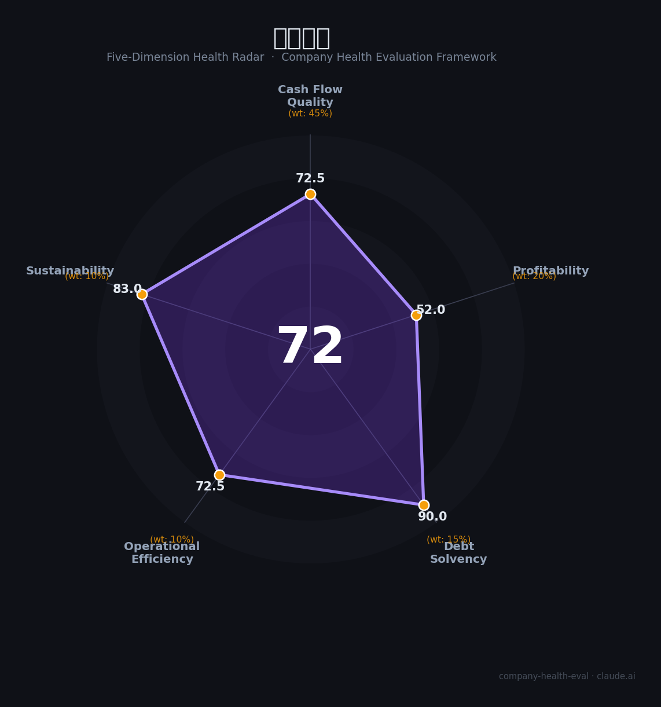

# 华大智造（688114.SH）财务健康评估（2026-08-14）

## 一句话结论

🟡 **72/100，中等偏上** | 基因测序平台龙头，亏损大幅收窄、经营转正

---

## 一、公司基本画像

| 项目 | 内容 |
|------|------|
| 主营 | 基因测序仪及耗材 |
| 财务 | 2025营收27.80亿(-7.73%)，归母净利-2.37亿(减亏63%)，经营现金流转正 |

> 一句话定性：基因测序平台龙头，减亏明显、营收待恢复

---

## 二、五维财务健康评估

### 1. 现金流质量（72/100）| 权重45%

经营现金流转正、减亏。

### 2. 盈利能力（52/100）| 权重20%

盈利仍亏损、承压。

### 3. 偿债能力（90/100）| 权重15%

低负债、现金充裕。

### 4. 运营效率（72/100）| 权重10%

研发投入重、运营一般。

### 5. 可持续发展（83/100）| 权重10%

基因测序国产化+全球需求。

---

## 三、综合评分

| 维度 | 得分 | 权重 | 加权 |
|------|:----:|:----:|:----:|
| 现金流质量 | 72 | 45% | 32.6 |
| 盈利能力 | 52 | 20% | 10.4 |
| 偿债能力 | 90 | 15% | 13.5 |
| 运营效率 | 72 | 10% | 7.2 |
| 可持续发展 | 83 | 10% | 8.3 |
| **综合得分** | **72/100** | 100% | 72.1 |

**健康等级：中等偏上** — 整体稳健，局部有待改善

---

## 四、核心风险清单

1. **持续亏损**
2. **测序竞争**
3. **研发高投入**

## 五、求职/择业视角

### 核心优势
- 基因测序龙头、国产替代、减亏向稳
### 现有短板
- 净利亏损、营收下滑

**结论**：华大智造基因测序平台龙头，亏损大幅收窄、现金流转正，国产替代+减亏向好，成长可期。

---

*评估方法：商泰汽车（iAUTO）五维框架 · 数据截至2026年8月 · 财务来源华大智造2025年报*