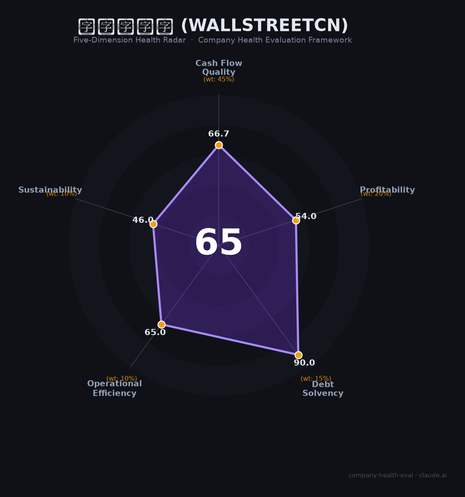

# 华尔街见闻 财务健康评估（2026-06-19）

## 一句话结论

🟠 **中等（65/100）** | 偿债稳健但创始人入刑+十年无融资，可持续性堪忧

## 一、公司基本画像

| 项目 | 内容 |
|------|------|
| **运营主体** | 上海阿牛信息科技有限公司 |
| **成立时间** | 2013年5月（博客形态始于2010年纽约） |
| **法定代表人** | 贺小红（原为创始人吴晓鹏） |
| **注册资本** | 1,354.26万元 |
| **员工规模** | 约130-160人（2023年社保参保131人） |
| **总部** | 上海（另设北京、广州、纽约办公室） |
| **融资历史** | 天使轮→A轮平安创投→B轮字节跳动/海通→C轮2016年CMC资本1亿元 |
| **估值** | 约5亿元（📊 亿欧数据2026年估算） |
| **业务模式** | 7×24全球金融快讯 + 付费订阅（见闻VIP/Alpha会员）+ 广告 + 机构数据服务 |
| **用户规模** | APP累计下载597万+，月活超1000万（自报数据） |

**一句话定性**：华尔街见闻是中国最早的全球金融实时快讯平台之一，以资讯速度见长，但属于财经媒体第三梯队。2019年因资质问题停服15个月，2021年创始人因非法经营罪被判刑，此后十年无新融资，现处于「小而稳但增长停滞」的维持状态。

## 二、五维财务健康评估

### 1. 现金流质量（66.7/100）

| 指标 | 判断 | 说明 |
|------|------|------|
| 经营现金流 | ⚠️ 关注 | 非上市公司无财报，存续12年+十年无融资→推测经营现金流为正但偏薄 |
| 现金储备 | ⚠️ 关注 | 131人团队年运营成本2000-3000万，储备量不明但十年无融资暗示家底不厚 |
| 有息负债 | ✅ 健康 | 无公开债务记录，轻资产模式天然低负债 |
| 净现比 | — 未知 | 无数据 |

**评估**：公司十年未融资仍持续经营，说明基础现金流为正。但团队精简至130人左右也暗示规模在收缩而非扩张。广告+订阅的现金流受资本市场周期影响较大，熊市中弹性差。

### 2. 盈利能力（54.0/100）

| 指标 | 判断 | 说明 |
|------|------|------|
| 毛利率 | 📊 一般 | 介于财经媒体（36氪49%、虎嗅6%）和金融数据（卓创63%、同花顺89%）之间，估算40-60% |
| 净利率 | 📊 一般 | 财经媒体普遍微利或亏损（36氪刚扭亏、虎嗅亏损），推测净利率0-10% |
| 营收增速 | 📊 一般 | 2019年停服15个月重创增长，恢复后增速温和，无融资扩张受限 |
| 研发费用率 | ✅ 良好 | 高新技术企业/专精特新认定，研发投入应在合理区间 |
| 人均产出 | 📊 一般 | 130人×行业人均约40-70万≈年营收5000万-1亿量级，属行业中等 |

**评估**：盈利能力是典型的中型财经媒体水平——够活但不发财。最大问题是增长引擎熄火：十年无融资限制了产品和市场扩张，而AI对快讯类内容的替代威胁正在加速。

### 3. 偿债能力（90.0/100）

| 指标 | 判断 | 说明 |
|------|------|------|
| 资产负债率 | ✅ 健康 | 轻资产运营，推测低于40% |
| 有息负债率 | ✅ 健康 | 十年无融资也未借债，推测零或极低有息负债 |

**评估**：本维度只有两个可判断指标（流动比率、现金比率、股权质押均无数据），但因公司极低的负债运营特征，偿债能力是五个维度中最不需要担心的。**这也是本报告唯一给出「健康」判断的维度。**

### 4. 运营效率（65.0/100）

| 指标 | 判断 | 说明 |
|------|------|------|
| 客户集中度 | ✅ 健康 | 媒体平台面向海量用户+多广告主，无单一大客户依赖 |
| 员工规模趋势 | ✅ 健康 | 2023年社保131人，持续招聘，无裁员报道 |
| 高管稳定性 | 🔴 危险 | 创始人吴晓鹏2021年因非法经营罪被判2年9个月；高管樊殿华判5年；法定代表人变更为贺小红 |

**评估**：创始人入刑是运营效率维度最大的扣分项。虽然公司在吴晓鹏服刑期间维持了运营（说明有过渡管理团队），但创始人的刑事判决对战略决策、人才招聘、商业合作均构成持续性损伤。

### 5. 可持续发展能力（46.0/100）

| 指标 | 判断 | 说明 |
|------|------|------|
| 行业赛道 | ⚠️ 关注 | 金融信息服务市场~762亿（2025），增速温和；财经媒体细分赛道趋于成熟 |
| 技术壁垒 | ⚠️ 关注 | 以快讯和原创见长，但无AI大模型/数据终端等深度技术壁垒；行业评测中未进前十 |
| 业务多元化 | ✅ 健康 | 广告+订阅+机构服务三线并行，非单一依赖 |
| 融资/资本支持 | 🔴 危险 | 2016年C轮后十年无新融资，无IPO计划 |
| 政策/监管风险 | 🔴 危险 | 2019年两次被处罚+停服15个月；2021年创始人涉刑；财经媒体监管持续收紧 |

**评估**：可持续性是致命短板。公司已从「资本看好的创业明星」（曾获字节跳动、CMC投资）沦为「监管黑名单上的幸存者」。AI正在瓦解其「快讯速度」核心价值。没有资本弹药，在AI军备竞赛中几乎没有胜算。

## 三、综合评分与健康等级

| 维度 | 得分 | 权重 | 加权得分 |
|------|------|------|----------|
| 现金流质量 | 66.7 | 45% | 30.0 |
| 盈利能力 | 54.0 | 20% | 10.8 |
| 偿债能力 | 90.0 | 15% | 13.5 |
| 运营效率 | 65.0 | 10% | 6.5 |
| 可持续发展 | 46.0 | 10% | 4.6 |
| **综合得分** | | | **65.4/100** |
| **健康等级** | | | 🟠 **中等** |

## 四、同业对标

| 对比项 | 华尔街见闻 | 36氪（KRKR） | 财联社/界面 | 雪球 |
|--------|-----------|-------------|------------|------|
| 上市/融资状态 | C轮（2016），十年无融资 | 美股上市 | 未上市（上报集团旗下） | E轮（2020，蚂蚁领投） |
| 营收规模（估算） | 📊 5000万-1亿 | 2.28亿（2025） | 数亿（利润超1亿） | 未公开 |
| 毛利率（估算） | 📊 40-60% | 57.7%（2025） | 估计50%+ | 未公开 |
| 净利率 | 📊 微利 | 5%（2025扭亏） | >10% | 推测未盈利 |
| 员工规模 | ~130人 | ~300人 | 数百人 | ~1000人+ |
| 核心差异 | 快讯速度+跨境资讯 | 创投生态+企业服务 | AI+机构服务（已盈利） | 社区+基金代销 |

**对标结论**：华尔街见闻在财经媒体中处于**第三梯队**——远落后于东方财富/同花顺（第一梯队）、雪球/财联社（第二梯队），与36氪体量接近但36氪已实现盈利并上市。核心差距在于：缺乏AI能力、未形成交易闭环、无资本弹药。

## 五、核心风险清单

1. **创始人刑事判决的持续阴影（高）**：2021年吴晓鹏因非法经营罪被判2年9个月，涉及金额7500万+。虽已服刑完毕，但对公司品牌、融资、政府关系造成不可逆损伤。任何新的监管收紧都可能引发「二次审查」。

2. **AI替代核心价值（高）**：公司的核心卖点是「最快的全球金融快讯」。AI大模型可在秒级完成同样任务（新闻聚合+翻译+摘要），且成本趋近于零。华尔街见闻几乎没有任何AI能力（行业评测明确标注「无AI降噪」），护城河正在被填平。

3. **十年无融资=增长死刑（中高）**：2016年后无任何融资记录。在AI军备竞赛需要巨额研发投入的时代，130人的小型团队和有限资金储备几乎无法参与竞争。维持现状尚可，增长无望。

4. **监管双杀历史（中高）**：2019年因无资质被停服15个月→2021年创始人涉刑。两次重大监管事件表明公司对合规边界的把控能力不足。财经信息+证券咨询的交叉地带监管只会更严。

5. **财经大V个人IP分流（中）**：2024-2025年大量前券商首席经济学家涌向知识星球/抖音独立变现（洪灏10天吸金760万+），平台型付费订阅面临「去中心化」冲击。

## 六、求职/择业视角

### 核心优势
- **品牌残留价值**：金融圈内仍有一定知名度，「华尔街见闻」四个字在简历上对金融/财经类岗位有轻度加分
- **五险一金正规**：社保公积金正常缴纳，有补充医疗保险和年终奖
- **无裁员风险（目前）**：团队已足够精简（130人），进一步裁减空间不大

### 现存短板
- **薪资竞争力弱**：记者岗5-13K/月（上海），多个来源反馈「低于行业平均」
- **面试体验差**：知乎多个独立回答反映流程混乱、HR不专业、套取竞品信息嫌疑
- **职业天花板极低**：公司自身无增长，个人成长空间受限；无AI经验积累，技能在AI时代加速贬值
- **法律污点**：前雇主的刑事判决记录可能对某些合规敏感岗位（券商/基金合规岗）构成负面影响

### 分场景建议

| 个人诉求 | 推荐 | 次选 | 规避 |
|----------|------|------|------|
| 稳定+深耕 | 东方财富（龙头，待遇好） | 同花顺 | **华尔街见闻** |
| 高薪+跳板 | 同花顺（技术岗薪资高） | 雪球（社区运营） | **华尔街见闻** |
| 成长+融资红利 | 财联社/界面（AI转型中） | 雪球 | **华尔街见闻** |
| 入门+累积经验 | **可考虑**（金融资讯入门门槛低） | 36氪 | — |

> 应届生或转行者可将华尔街见闻作为进入金融媒体行业的「垫脚石」，但建议入职1-2年后跳槽。不建议3年以上长期停留。

## 七、总结

**华尔街见闻是中国金融资讯领域「曾经的一线选手，如今的监管幸存者」：**
偿债能力极强（零负债运营），但创始人刑事判决+十年无融资+AI替代三重打击下，可持续发展前景暗淡。
在中国财经媒体「持牌化+AI化」大趋势下，属于**有明确生存风险**的公司，仅适合作为行业入门的短期跳板，不建议作为长期职业发展平台。

---

*评估日期：2026-06-19 | 数据截至：2026年6月公开信息 | 评分引擎：company-health-eval v1.0*
