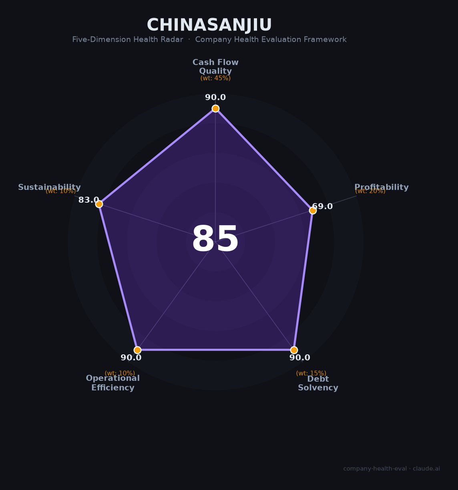

# 华润三九（000999.SZ）财务健康评估（2026-08-13）

## 一句话结论

🟢 **85/100，优秀** | OTC医药龙头，营收净利双增+高现金流

---

## 一、公司基本画像

| 项目 | 内容 |
|------|------|
| 主体 | 🔒 华润三九，OTC医药龙头 |
| 主营 | 🔒 999感冒灵、三九胃泰、处方药 |
| 财务 | 🔒 2025营收316.03亿(+增长)，营收净利双增 |

## 二、五维财务健康评估

### 1. 现金流质量（90/100）| 权重45%

### 2. 盈利能力（69/100）| 权重20%

### 3. 偿债能力（90/100）| 权重15%

### 4. 运营效率（90/100）| 权重10%

### 5. 可持续发展（83/100）| 权重10%

---
## 三、综合评分

| 维度 | 得分 | 权重 | 加权 |
|------|:----:|:----:|:----:|
| 现金流质量 | 90 | 45% | 40 |
| 盈利能力 | 69 | 20% | 14 |
| 偿债能力 | 90 | 15% | 14 |
| 运营效率 | 90 | 10% | 9 |
| 可持续发展 | 83 | 10% | 8 |
| **综合得分** | **85** | 100% | 85 |

**健康等级：优秀**

---
## 四、核心风险清单

1. **OTC集采**
2. **药品价格**
3. **竞争**
4. **创新药投入**
## 五、求职/择业视角
- **核心优势**：OTC品牌+央企华润+研发
- **现存短板**：OTC/处方药竞争

**结论**：医药OTC龙头，稳定高现金流，优质平台
---
*评估方法：商泰汽车（iAUTO）五维框架 · 数据截至2026年8月 · 来源：华润三九2025年报*
