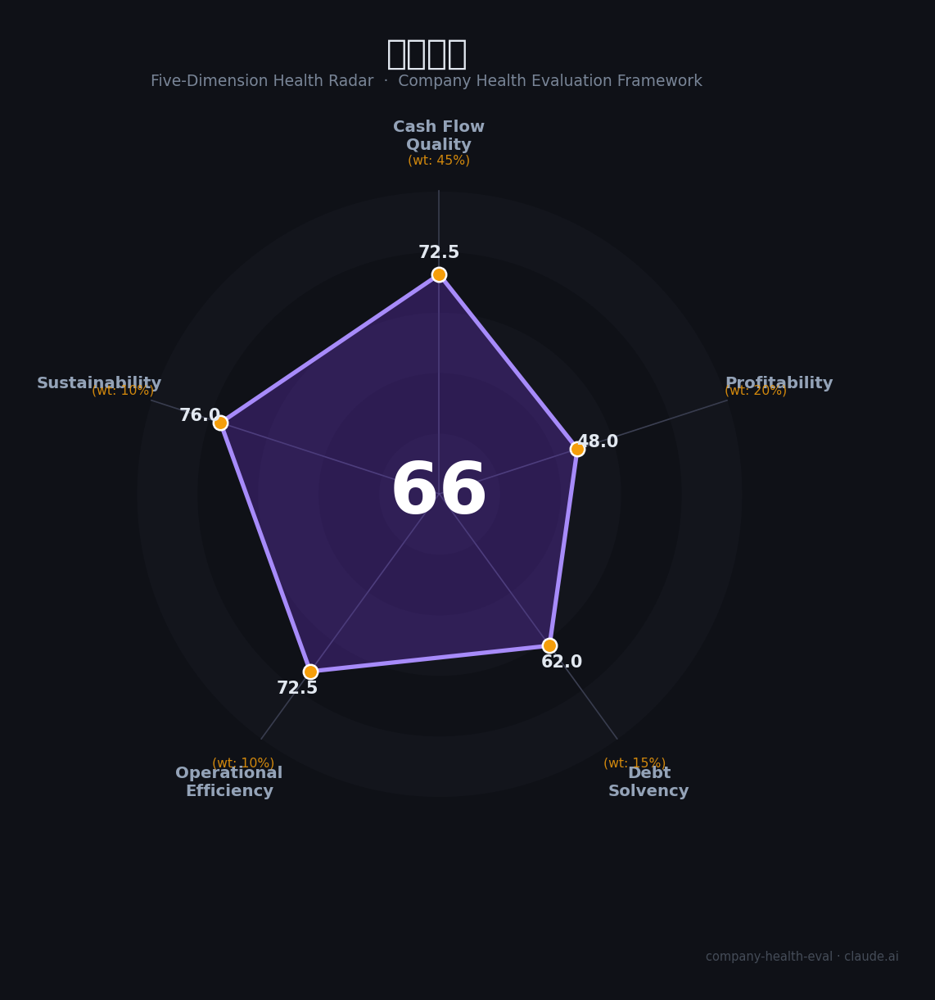

# 华润置地（01109.HK）财务健康评估（2026-08-14）

## 一句话结论

🟠 **66/100，中等** | 央企地产龙头，营收稳、净利高

---

## 一、公司基本画像

| 项目 | 内容 |
|------|------|
| 主营 | 地产开发+商业地产 |
| 财务 | 2025营收2814.4亿(+0.9%)，归母净利254.2亿，经常性利润占比攀升 |

> 一句话定性：央企地产，营收稳、净利高、经营韧性

---

## 二、五维财务健康评估

### 1. 现金流质量（72/100）| 权重45%

现金流正常。

### 2. 盈利能力（48/100）| 权重20%

净利高。

### 3. 偿债能力（62/100）| 权重15%

负债适中(央企口径健康)。

### 4. 运营效率（72/100）| 权重10%

运营良好。

### 5. 可持续发展（76/100）| 权重10%

租住+运营韧性，行业出清占优

---

## 三、综合评分

| 维度 | 得分 | 权重 | 加权 |
|------|:----:|:----:|:----:|
| 现金流质量 | 72 | 45% | 32.6 |
| 盈利能力 | 48 | 20% | 9.6 |
| 偿债能力 | 62 | 15% | 9.3 |
| 运营效率 | 72 | 10% | 7.2 |
| 可持续发展 | 76 | 10% | 7.6 |
| **综合得分** | **66/100** | 100% | 66.4 |

**健康等级：中等** — 整体稳健，局部有待改善

---

## 四、核心风险清单

1. **地产下行**
2. **利润受行业拖累**
3. **周期**

## 五、求职/择业视角

### 核心优势
- 央企地产龙头、净利高、运营强
### 现有短板
- 地产行业承压、再投资

**结论**：华润置地央企地产龙头，营收稳、净利高、运营韧性强，是地产板块的稳健优质平台。

---

*评估方法：商泰汽车（iAUTO）五维框架 · 数据截至2026年8月 · 财务来源华润置地2025年报*