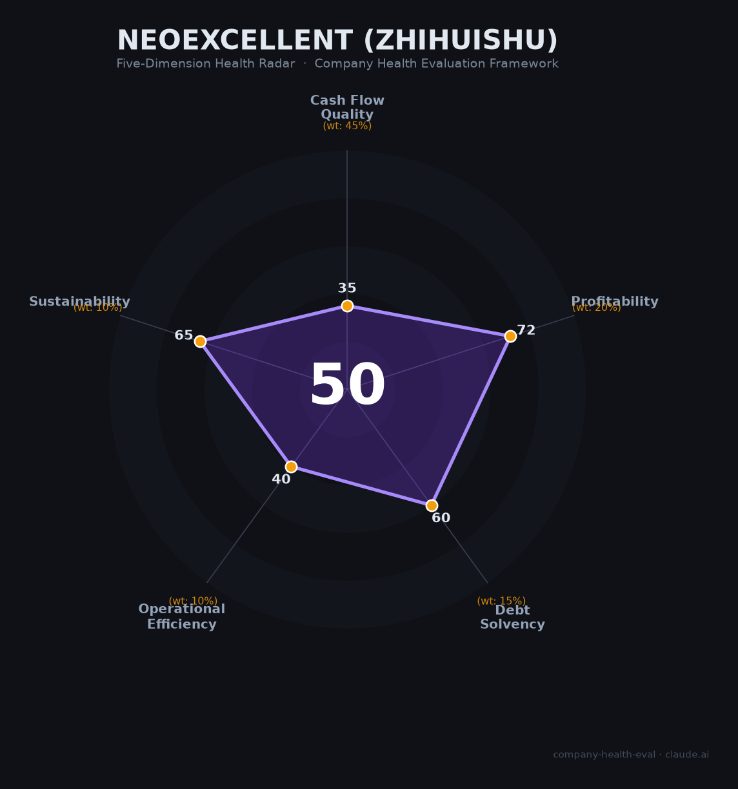

# 卓越睿新（Neoexcellent / 智慧树 02687.HK）财务健康评估（2026-06-12）

## 一句话结论

🔴 **中等偏下 · 综合得分 50/100** | 高校教学数字化赛道龙头，知识图谱爆发驱动毛利率65.5%，但经营现金流持续为负、应收账款周转恶化至282天、现金储备IPO前骤降70%、行贿串标等合规污点叠加——这是一家「好赛道、好产品、坏现金流」的转型期公司。

---

## 一、公司基本画像

| 项目 | 详情 |
|------|------|
| **运营主体** | 上海卓越睿新数码科技股份有限公司（品牌：智慧树） |
| **成立时间** | 2008年4月7日 |
| **上市信息** | 港交所主板，2025年12月8日上市，股票代码 02687.HK 🔒 |
| **创始人/实控人** | 王晖（董事长）、葛新（配偶），家族合计持股约34.6% |
| **总部** | 上海徐汇区钦州北路1188号科汇大厦 |
| **员工规模** | 约2,396-2,728人（2025年），上海社保参保仅490人（95城251个服务网点） 🔒 |
| **主营构成** | 数字化教学内容服务85.8%（8.31亿）+ 数字化教学环境服务14.2%（1.38亿） |
| **核心产品** | 智慧树网（学分课程平台）、知到APP、AI知识图谱系统、智能体（Agent） |
| **融资历程** | Pre-A至C轮累计约6.45亿元（新浪、百度领投）→ IPO募资净额约3.94亿港元 🔒 |
| **2025年营收** | 9.69亿元人民币（+14.3% YoY） 🔒 |
| **当前市值** | 约88.73亿港元（2026年6月，PE(TTM)约61.5倍） 🔒 |

**一句话定性**：卓越睿新是中国高校教学数字化赛道的领先者（弗若斯特沙利文排名：内容制作市场第1、整体市场第2），知识图谱业务近三年从600万爆发至5.74亿元，驱动毛利率跃升至65.5%。但经营现金流多年为负、应收账款周转天数从108天恶化至282.5天、IPO前现金储备4个月缩水70%，叠加行贿案/串标案/APP违规三重合规污点，是一家「利润是观点，现金流是事实」的典型案例。

---

## 二、五维财务健康评估

### 1. 现金流质量（35/100）🔴 | 权重45%

**这是卓越睿新最致命的短板——利润高速增长，现金反向流失。**

| 评估指标 | 状态 | 判断 | 依据 |
|----------|------|------|------|
| 经营现金流净额 | 2022 -4,814万 → 2023 +1,090万 → 2024 **-953万** → 2025H1 **-2.58亿** | 🔴 危险 | 🔒 招股书/年报。四年中三年为负，2025上半年加速恶化 |
| 现金及等价物 | 2024年底2.30亿 → 2025年4月**6,892万**（骤降70%） | 🔴 危险 | 🔒 招股书。四个月现金蒸发1.6亿，覆盖不足3个月运营 |
| IPO后现金 | 募资净额约3.94亿港元（约3.66亿人民币），暂时缓解 | 🟡 暂时改善 | 🔒 上市公告。但经营造血能力未改善，现金只能延缓而非解决 |
| 有息负债 | 2022-2023年为零 → 2024年新增5,620万 → 2025年9月**1.698亿** | 🟠 关注 | 🔒 招股书。从零负债到近1.7亿借款，杠杆快速攀升 |
| 应收周转天数 | 108天（2023）→ 117天（2024）→ **282.5天**（2025H1） | 🔴 危险 | 🔒 招股书。两年恶化2.6倍，远超软件行业均值（60-90天） |
| 净现比 | 2024年经营现金流-953万 vs 净利润1.05亿 | 🔴 危险 | 🔒 年报。利润「虚胖」——赚了利润但没收到的典型案例 |

**本维度分析**：卓越睿新的现金流呈典型的"高校垫资"模式——公司先垫付课程开发、设备采购、人员成本，高校在课程验收后走漫长审批付款流程（6-12个月）。这在预算宽松时期可忍受，但在高校预算紧缩（2024-2025年中央高教拨款连续下降）+ 公司自身现金储备枯竭的背景下，风险急剧放大。

IPO募资约3.66亿元人民币暂时堵住了现金流缺口，但并未改变"垫资-等回款"的商业模式。如果应收账款周转继续恶化，12-18个月内可能再度面临流动性压力。

**扣分项**：四年经营现金流三年为负（-20分）；应收周转282天为行业均值3-4倍（-20分）；IPO前现金骤降70%（-15分）；从零借款到1.7亿银行借款（-10分）。

---

### 2. 盈利能力（72/100）🟡 | 权重20%

**知识图谱业务爆发是利润引擎——毛利率和净利率持续改善。**

| 评估指标 | 状态 | 判断 | 依据 |
|----------|------|------|------|
| 毛利率 | 2022 44.1% → 2023 60.7% → 2024 61.9% → **2025 65.5%** | 🟢 优秀 | 🔒 年报。知识图谱占比提升（59.2%）驱动毛利跃升，接近SaaS公司顶级水平 |
| 净利率 | 2022 -14.8%（亏损）→ 2023 12.5% → 2024 12.4% → **2025 13.4%** | 🟡 良好 | 🔒 年报。扭亏后连续两年盈利改善，但绝对值仍不高 |
| 营收增速（3年CAGR） | 4.00亿（2022）→ 9.69亿（2025），CAGR约**34.3%** | 🟢 优秀 | 🔒 年报。知识图谱+AI Agent双引擎驱动 |
| 研发费用率 | 2025年**19.5%**（1.89亿/9.69亿） | 🟢 健康 | 🔒 年报。科技公司10-25%最优区间 |
| 人均产出 | 约**40.5万元/人**（9.69亿/2,396人） | 🟡 行业平均 | 🔒 年报。教育信息化行业中位水平 |

**本维度分析**：盈利能力是卓越睿新最强的维度。知识图谱从2022年仅600万收入爆炸增长至2025年5.74亿元（三年增长约95倍），且毛利率显著高于传统课程制作业务。AI智能体（2025年落地500+个）有望成为第二增长曲线。但需注意极端季节性：2024H1亏损8,885万元、2025H1亏损9,896万元，全年盈利完全依赖下半年集中交付和回款。

**扣分项**：极端季节性导致上半年必然亏损（-8分）；销售费用率43.3%偏高，获客依赖"关系型销售"（-5分）；净利率13.4%对于65.5%毛利率的软件公司偏低（-5分）。

---

### 3. 偿债能力（60/100）🟠 | 权重15%

| 评估指标 | 状态 | 判断 | 依据 |
|----------|------|------|------|
| 资产负债率 | 6.2%（2022）→ 30.2%（2025年9月） | 🟡 健康但恶化 | 🔒 招股书。仍在40%安全线内，但三年翻了近5倍 |
| 有息负债率 | 0% → 约5.8%（1.698亿/约29亿总资产估算） | 🟡 可控 | 🔒 招股书。从零借款到近1.7亿，绝对值可控但趋势警惕 |
| 流动比率 | 流动资产约5.53亿（2025年4月）/ 流动负债约2.59亿 ≈ **2.14** | 🟢 健康 | 🔒 招股书。>2，但流动资产中67.7%是应收款（质量差） |
| 现金比率 | IPO前：6,892万/2.59亿 = **0.27**；IPO后估算约1.5+ | 🟠 IPO前危险 | 🔒 招股书。IPO前仅覆盖26.6%流动负债，IPO后大幅改善 |
| 股权质押 | 未发现公开披露 | 🟢 健康 | 无质押记录 |

**本维度分析**：表面数据尚可（资产负债率30%、流动比率>2），但质量堪忧。流动比率虚高是因为67.7%的流动资产是应收账款（实质流动性差）。银行贷款从零飙升至1.698亿元，且IPO前的6,892万元现金仅覆盖26.6%的流动负债。IPO募资后现金状况大幅改善，但若经营现金流持续为负，18-24个月后可能再度承压。

**加分项**：IPO后现金充裕（+5分）；无股权质押（+3分）。
**扣分项**：负债率三年翻5倍（-15分）；应收占流动资产67.7%致流动比率虚高（-10分）；IPO前现金覆盖不足（-8分）。

---

### 4. 运营效率（40/100）🔴 | 权重10%

| 评估指标 | 状态 | 判断 | 依据 |
|----------|------|------|------|
| 应收周转 | **282.5天**（2025H1），较2023年108天恶化2.6倍 | 🔴 危险 | 🔒 招股书。远超软件行业60-90天，高校付款周期失控 |
| 客户集中度 | 前五大客户占比未披露，推测<30%（服务3,000+高校分散） | 🟢 健康 | 🔒 招股书。客户极度分散，单一高校风险低 |
| 员工规模趋势 | 2,396人（2025年中）→ 2,728人（同花顺最新），稳定增长 | 🟢 健康 | 🔒 招股书/同花顺。招聘活跃（Boss直聘337个在招岗位） |
| 高管稳定性 | 创始团队自2008年至今在任，核心管理层稳定 | 🟢 健康 | 🔒 招股书。王晖/袭普照/曹睿等核心团队超15年 |
| 销售费用率 | **43.3%**（2024H1），远高于SaaS行业20-35% | 🔴 预警 | 🔒 招股书。获客依赖大规模地面销售团队，叠加行贿/串标案 |
| 合规记录 | 2024判决牵涉高校行贿案 + 2024年恶意串标被罚 + 2025年APP违规被工信部通报 | 🔴 严重 | 🔒 公开报道/政府公告。三重合规污点，IPO被证监会追问7项问题 |

**本维度分析**：卓越睿新在客户分散度、员工增长、管理层稳定性方面表现良好。但运营效率被两个核心问题拖垮——应收账款管理失控（282.5天周转意味着公司实质上在向高校提供近10个月的无息贷款）和极高的销售费用率（43.3%）叠加合规问题，反映出公司获客模式对"关系型销售"的深度依赖。行贿案和串标案不仅是声誉风险，更意味着一旦监管收紧，现有获客模式可能难以为继。

**扣分项**：应收周转282.5天为行业3-4倍（-25分）；销售费用率43.3%过高（-10分）；三重合规污点（-15分）；极端季节性运营（-10分）。

---

### 5. 可持续发展（65/100）🟠 | 权重10%

| 评估指标 | 状态 | 判断 | 依据 |
|----------|------|------|------|
| 行业赛道空间 | 中国高等教育教学数字化市场CAGR约15-20%；2025年九部门政策加持 | 🟢 有利 | 📊 弗若斯特沙利文。AI+教育数字化是政策明确方向 |
| 技术壁垒 | 67项专利（23项AI）、10万+标准化知识节点、627门国家级"金课"（行业第一） | 🟡 中等 | 🔒 招股书。知识图谱先发优势明显，但大模型可能降低内容制作门槛 |
| 业务多元化 | 知识图谱59.2%依赖度偏高；智能体（500+落地）是新增长点 | 🟠 关注 | 🔒 年报。单一产品占比过半，且面临AI颠覆风险 |
| 融资/资本支持 | 港股上市+新浪（16.1%）+百度（9.06%）战略持股 | 🟢 有利 | 🔒 招股书。上市打通融资通道，百度AI协同潜力大 |
| 政策/监管风险 | 教育数字化政策利好 vs 高校预算紧缩 vs IPO合规审查 | 🟠 双向 | 📊 政策鼓励但预算收紧；证监会7项问题仍悬而未决 |

**本维度分析**：政策面明确利好（九部门教育数字化意见），但高校预算紧缩形成"政策热、预算冷"的尴尬局面。知识图谱的先发优势和行业第一的"金课"数量构成壁垒，但AI大模型（如ChatGPT/文心一言）可能从根本上颠覆"标准化课程内容制作"的商业模式——Chegg被ChatGPT击穿是前车之鉴。智能体业务（500+落地）是应对AI浪潮的正确方向，但规模尚小。新浪和百度的战略持股提供了产业资源背书，但也意味着公司战略可能受制于人。

---

## 三、综合评分与健康等级

| 维度 | 得分 | 权重 | 加权得分 |
|------|:----:|:----:|:--------:|
| 现金流质量 | 35 | 45% | 15.75 |
| 盈利能力 | 72 | 20% | 14.40 |
| 偿债能力 | 60 | 15% | 9.00 |
| 运营效率 | 40 | 10% | 4.00 |
| 可持续发展 | 65 | 10% | 6.50 |
| **综合得分** | **—** | **100%** | **49.65 ≈ 50** |

**健康等级**：🔴 **中等偏下（Moderate-Low）** — 盈利能力优秀但被现金流质量（45%权重）和运营效率严重拖累，存在明确的财务风险点，不建议作为首选雇主。

---

## 四、同业对标

| 对比项 | **卓越睿新（智慧树）** | 超星集团（学习通） | 爱课程（中国大学MOOC） | 学堂在线 |
|--------|----------------------|-------------------|----------------------|---------|
| 上市状态 | 港股 02687.HK（2025.12） | 未上市 | 未上市（高教社+网易） | 未上市（清华控股） |
| 营收规模 | 9.69亿元（2025） | 估算15-20亿+（含图书馆/教务系统） | 未披露 | 估算3-5亿元 |
| 毛利率 | 65.5% | 未披露（推测50-60%） | 未披露（非商业化运营） | 未披露 |
| 核心优势 | 知识图谱+课程制作（市占率7.3%第一） | 图书馆数字化根基+超星发现系统 | 国家级平台+高教社官方背书 | 清华大学品牌+国际化 |
| 员工规模 | ~2,400人 | 估算5,000-8,000人 | 未披露 | 估算500-1,000人 |
| 合规记录 | ⚠️ 行贿案+串标案+APP违规 | 未发现重大公开合规问题 | 未发现 | 未发现 |
| 商业模式 | 高校付费为主，强销售驱动 | 图书馆/SaaS订阅+硬件 | 免费+增值（非盈利导向） | 高校付费+证书收费 |

**对标结论**：卓越睿新在课程内容制作细分领域排名第一且已上市，商业化运营能力强于国有背景的竞争对手。但合规记录在同行中最为突出，且超星集团（整体收入规模更大、产品线更全）构成强力竞争。行业集中度极低（前5仅12.6%），2000+参与者混战，竞争格局远未定型。

---

## 五、核心风险清单

### 1. 🔴 应收账款暴雷风险（等级：高）
- **描述**：应收从2022年1.34亿增至2025年中4.18亿（+212%），远超营收增速；周转天数从108天恶化至282.5天；减值拨备从1,230万增至3,410万（+177%）。
- **触发条件**：某所大型高校批量延迟付款或违约 → 连锁减值 → 利润大幅下滑。
- **量化影响**：若10%应收（约4,000万）违约，将吞噬全年净利润的31%。

### 2. 🔴 经营现金流断裂（等级：高）
- **描述**：IPO前现金4个月骤降70%至6,892万元；2025H1经营现金流-2.58亿。IPO募资暂时填补，但若2026年经营现金流仍为负，18个月内可能再度告急。
- **触发条件**：2026年下半年回款不及预期 + 上半年持续烧钱 → 流动性危机。
- **量化影响**：月均运营支出约5,000-6,000万元，IPO后现金约3.7亿元，跑道约6-7个月（若无正向现金流）。

### 3. 🟠 合规风险升级（等级：中高）
- **描述**：员工牵涉高校行贿案（2024年判决）、公司被罚恶意串标（2024年）、知到APP被工信部通报违规收集个人信息（2025年）。证监会境外上市反馈意见明确追问7项问题。
- **触发条件**：行贿案被进一步调查波及公司主体 → 政府采购黑名单 → 业务暂停。
- **量化影响**：高校客户收入占比接近100%，一旦被列入政府采购黑名单，将危及全部营收来源。

### 4. 🟠 AI大模型颠覆风险（等级：中高）
- **描述**：以ChatGPT/文心一言为代表的AI大模型可能从根本上降低课程内容制作门槛，类似Chegg被ChatGPT击穿的逻辑。知识图谱业务（占收入59.2%）对AI替代尤为敏感。
- **触发条件**：高校开始采用AI大模型自主生成课程内容 → 智慧树的内容制作价值被压缩。
- **量化影响**：知识图谱收入5.74亿元（占总营收59.2%），若被AI替代50%，将损失约2.87亿元营收。

### 5. 🟠 高校预算紧缩（等级：中高）
- **描述**：2024-2025年中央高教拨款连续下降，20+省份高校学费上涨10-35%反映财政压力。2024年中标项目数量和金额均下滑，200万以上大项目为零。
- **触发条件**：高校新一轮预算削减 → 数字化采购延迟/取消 → 新签合同下滑。
- **量化影响**：收入增速已从2023年+63.2%放缓至2025年+14.3%，若2026年进一步降至个位数，估值（PE 61x）将面临重估。

### 6. 🟡 高估值与股价回调（等级：中）
- **描述**：当前PE(TTM)约61.5倍，显著高于港股软件/SaaS板块均值（20-35倍）。IPO首日暴涨87%后，部分涨幅已脱离基本面。
- **触发条件**：业绩低于券商预期（2026E收入12.67-13.46亿元、利润约1.8亿元）→ 估值杀。
- **量化影响**：若PE回调至30倍，对应市值约54亿港元，较当前下跌约39%。

---

## 六、求职/择业视角

### 核心优势

- **赛道确定性**：教育数字化是国家级战略方向（九部门2025年发文），行业增长确定性高。
- **上市平台**：2025年12月港股上市，股权变现通道打通，对有期权/股票的员工是利好。
- **技术积累**：知识图谱、AI智能体、67项专利，技术方向与AI浪潮一致，经验可迁移。
- **工作环境**：看准网评分办公环境4.8/5、工作氛围4.6/5，加班文化不明显（早8:30-晚5:30）。
- **百度+新浪背书**：两家互联网巨头的战略持股增加了履历含金量。

### 现存短板

- **薪酬天花板低**：平均月薪14,263元，销售岗8K-13K，老员工反馈"工作3年涨800，离职出去工资翻番"。
- **现金流紧张影响员工**：IPO前现金骤降70%，若现金流问题复发，可能影响年终奖（仅52.6%员工有）和涨薪。
- **合规污点**：公司的行贿/串标案在你的履历背景中可能成为减分项。
- **晋升不明确**：看准网评分晋升机会3.9/5，知乎反馈提及晋升通道不清晰。
- **业务季节性高压**：上半年必然亏损，意味着上半年预算紧张、下半年疯狂赶工。

### 分场景建议

| 个人诉求 | 推荐度 | 说明 |
|----------|:------:|------|
| 稳定+深耕 | 🟠 中等 | 赛道稳定但公司现金流紧张，不适合追求绝对稳定 |
| 高薪+跳板 | 🔴 偏低 | 薪酬低于行业平均，但上市经历+AI教育赛道经验有一定跳槽价值 |
| 成长+AI赛道 | 🟡 可行 | AI智能体+知识图谱是前沿方向，技术经验可迁移至AI行业 |
| 销售/市场岗 | 🔴 规避 | 高销售费用率+合规风险+关系型销售模式，且薪酬竞争力弱 |

---

## 七、总结

卓越睿新是中国高校教学数字化赛道「产品力突出、现金流糟糕」的公司：知识图谱三年从600万爆发至5.74亿元驱动毛利率跃升至65.5%，行业地位（内容制作第1、整体第2）和百度/新浪战略背书构成真实护城河。唯一但致命的短板是经营现金流持续为负、应收账款周转恶化至282.5天——公司实质上在向中国高校提供近10个月的无息贷款。在教育数字化政策利好与高校预算紧缩并存的大环境下，属于🔴中等偏下风险等级，适合对AI+教育赛道有强烈信念、且能接受较高不确定性的求职者谨慎考虑。

---

*评估日期：2026-06-12 | 数据截至：2025年年报（港交所披露）、招股书（聆讯后资料集）、2026年6月公开市场数据*
