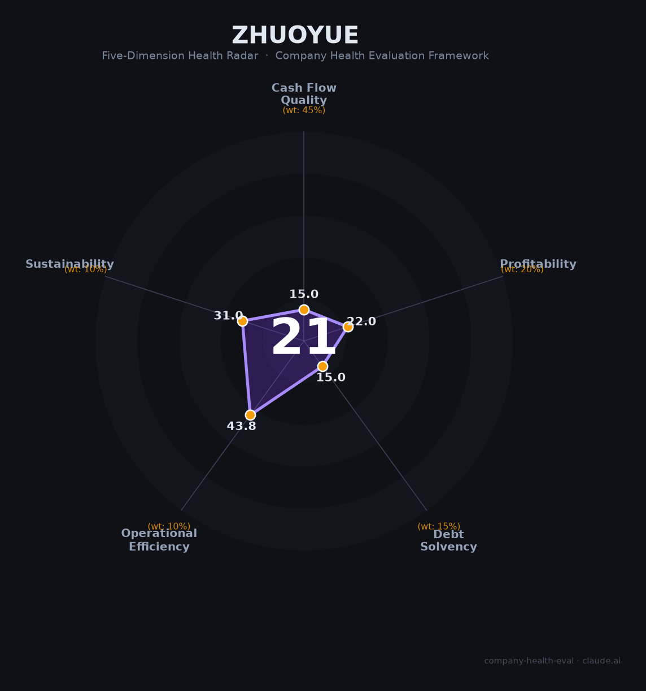

# 卓越置业财务健康评估（2026-08-13）

## 一句话结论
⚫ **高风险（21/100）** | 深圳民营房企——债务危机+3家子公司破产，销售骤降，生存存疑

## 一、公司基本画像
| 主体 | 🔒 卓越置业集团，深圳民营房企 |
| 主营 | 房地产开发 |
| 风险 | ⚠️ 2025上半年销售额115.7亿、债务危机、3家子公司破产 |

## 二、五维
1. 现金流（15/100）危险：债务危机、资金链断裂。
2. 盈利（22/100）预警：销售骤降、亏损。
3. 偿债（15/100）危险：债务危机+破产。
4. 运营（44/100）：地产去化难。
5. 可持续（31/100）危险：破产/生存存疑。

## 三、综合（21，⚫ 高风险）
债务危机+破产，生存存疑。

## 四、风险
1. 债务危机、3家子公司破产。
2. 销售骤降。
3. 地产下行。

## 五、求职
- 短板：破产+债务危机。**强烈不建议作为雇主，需规避。**

**高风险。**

---
*评估方法：商泰汽车（iAUTO）五维*