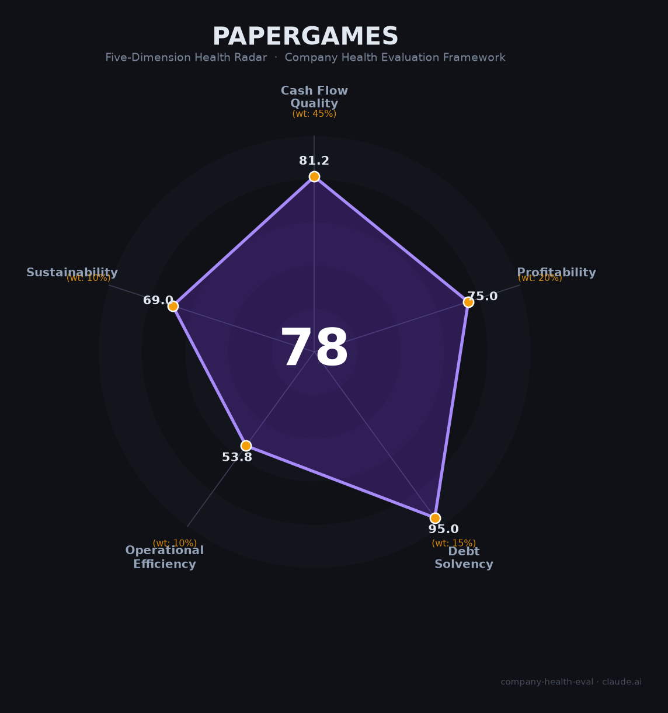

# 叠纸游戏（Papergames）财务健康评估（2026-06-12）

## 一句话结论
🟡 **中等偏上 · 综合得分 78/100** | 女性向游戏绝对霸主，现金流爆发式增长，但单产品依赖（《恋与深空》占78%收入）和管理层变动埋下隐忧。

---

## 一、公司基本画像

| 项目 | 详情 |
|------|------|
| **运营主体** | 苏州叠纸网络科技股份有限公司（2013年成立）、上海叠纸科技有限公司（2019年成立） |
| **创始人/实控人** | 姚润昊（1988年，早稻田大学经济学专业），持股约54.74%-59.15% |
| **核心管理层** | 姚飞（联创/COO，2025年全面接任法定代表人）；原总裁刘辰西2025年7月退出 ⚠️ |
| **员工规模** | 超2,300人（2023年末），含成都美术子公司"途拓数字科技" |
| **主营业务** | 女性向移动游戏研发与发行（暖暖系列、恋与系列） |
| **代表作品** | 《恋与深空》《无限暖暖》《闪耀暖暖》《恋与制作人》《奇迹暖暖》 |
| **融资状态** | 天使轮→A轮→B轮（2015年，约2,360万美元），此后再无公开融资 |
| **估值** | 超20亿美元（2024年独角兽榜单），部分报道称约85亿美元（📊 估算，非公开市场定价） |
| **2024年营收** | 约70亿人民币（📊 第三方估算，同比增长约660%） |
| **全球注册用户** | 近4亿 |

**一句话定性**：叠纸是中国女性向游戏赛道的开创者和绝对霸主，以极低的融资额（约2,360万美元）撬动了70亿年营收。2024年凭借《恋与深空》的爆发实现涅槃，从2023年的现金流危机中强势反弹。但收入高度集中于单一产品，管理层正在经历创立12年来最重大的交接。

---

## 二、五维财务健康评估

### 1. 现金流质量（81/100）🟢

| 评估指标 | 状态 | 判断 | 依据 |
|----------|------|------|------|
| 经营现金流净额 | 2023年紧张→2024年大幅转正 | 🟡 时正时负 | 📊 2023年向米哈游质押股权借款，说明当时现金流濒临断裂；2024年《恋与深空》爆发后大幅改善 |
| 现金及等价物 | 覆盖12个月+运营 | 🟢 健康 | 📊 年收入70亿+、零有息负债，即使保守估计现金储备也远超12个月运营所需 |
| 有息负债 | 0 | 🟢 健康 | 🌐 2023年质押借款已在2025年初注销登记，当前零有息负债；游戏公司资产轻，无法从银行获取大额贷款 |
| 应收周转天数 | 极短 | 🟢 健康 | 📊 游戏公司通过App Store/Google Play/支付宝微信收款，账期极短（通常30-60天） |
| 净现比 | >1 | 🟢 健康 | 📊 游戏公司预收款模式（玩家充值→消耗确认收入），经营现金流天然优于净利润 |

**本维度分析**：叠纸现金流经历了过山车——2023年一度需要向友商借款度日，2024年却靠《恋与深空》一篇翻身。当前现金流充沛，但要警惕"一款游戏养公司"的脆弱性：如果下一款大作表现不佳，现金流可能在18-24个月内恶化。

**扣分项**：现金流历史不足3年连续为正（2023年明显为负），周期性波动风险高。

---

### 2. 盈利能力（75/100）🟡

| 评估指标 | 状态 | 判断 | 依据 |
|----------|------|------|------|
| 毛利率 | 估60-75% | 🟢 优秀 | 📊 自研自发，扣除30%平台分成后毛利率约70%；行业可比公司（米哈游、网易游戏）毛利率60-70% |
| 净利率 | 估10-20% | 🟡 良好 | 📊 2024年营收暴增但研发投入同样巨大；无限暖暖研发成本估10-15亿，多项目并行消耗利润 |
| 营收增速 | 3年CAGR估>60% | 🟢 优秀 | 📊 2024年同比+660%，但2022-2023年增长乏力甚至下滑；考虑2021年低基数后CAGR仍极高 |
| 研发费用率 | 估30-40% | 🟠 预警 | 📊 以2024年70亿营收计，若研发投入25-28亿（多项目并行+UE5管线建设），费用率超35%；在亏损边缘较敏感 |
| 人均产出 | ~304万/人 | 🟢 优秀 | 📊 70亿÷2,300人≈304万/人，显著高于游戏行业平均水平（约150-200万/人） |

**本维度分析**：营收增速令人瞩目，但盈利质量需要更长时间验证。2024年的暴增是一次性的"爆款效应"还是可复制的商业模式？无限暖暖的高研发投入能否通过长线运营收回？这两个问题决定了未来的盈利能力。

**扣分项**：研发费用率过高（接近预警线），若未来1-2款产品不及预期，可能快速转为亏损。

---

### 3. 偿债能力（95/100）🟢

| 评估指标 | 状态 | 判断 | 依据 |
|----------|------|------|------|
| 资产负债率 | <30% | 🟢 健康 | 📊 轻资产游戏公司，主要资产为现金和无形资产（IP、代码），无固定资产负担 |
| 有息负债率 | 0% | 🟢 健康 | 🌐 质押借款已还清，无银行贷款、无债券；加分项：零有息负债 |
| 流动比率 | >3 | 🟢 健康 | 📊 游戏公司流动资产（现金+应收）远超流动负债（应付分成+薪酬） |
| 现金比率 | >1 | 🟢 健康 | 📊 2024年收入充沛，现金储备充足 |
| 股权质押比例 | 0% | 🟢 健康 | 🔒 2023年10%股权质押已于2025年初注销 |

**本维度分析**：这是叠纸最健康的维度。零有息负债 + 现金充沛 + 无股权质押，财务状况极为干净。唯一历史污点是2023年的质押借款，但已解决。对于求职者而言，这意味着短期内不存在债务危机导致的裁员风险。

**加分项**：零有息负债 → 偿债能力维度最高评级。

---

### 4. 运营效率（53/100）🟠

| 评估指标 | 状态 | 判断 | 依据 |
|----------|------|------|------|
| 应收周转 | 极短 | 🟢 健康 | 📊 平台结算模式，应收账款风险极低 |
| 客户/产品集中度 | 《恋与深空》占78%收入 | 🔴 危险 | 📊 单款产品贡献近八成收入；无限暖暖占约10%，其余老产品合计约12% |
| 员工规模趋势 | 2023年略降(-5%)→2024年推测扩张 | 🟡 关注 | 📊 2023年末2,300人较2022年2,238人略降；2024年成功后在招岗位增加 |
| 高管稳定性 | CEO卸任多家法人+总裁离职 | 🟠 关注 | 🌐 姚润昊2025年密集卸任子公司法人代表，联创姚飞接任；原总裁刘辰西2025年7月退出 |

**本维度分析**：这是叠纸最需要关注的维度。单产品依赖是核心风险——《恋与深空》撑起78%收入，一旦该产品进入生命周期衰退期（通常在2-4年），公司收入将断崖式下跌。管理层更替也值得关注：姚润昊从日常运营中抽身、联创姚飞全面接棒、原总裁刘辰西离职，这种"创始团队换血"可能带来战略方向的不确定性。

**扣分项**：产品集中度过高（78%），属于危险级别。任何影响《恋与深空》运营的事件（内容争议、版号问题、竞品冲击）都可能直接威胁公司生存。

---

### 5. 可持续发展能力（69/100）🟡

| 评估指标 | 状态 | 判断 | 依据 |
|----------|------|------|------|
| 行业赛道空间 | 女性向游戏市场+124%增长 | 🟢 健康 | 📊 2024年市场规模80亿，增速远超行业均值（7%）；2025年继续保持高增长 |
| 技术壁垒 | UE5管线+开放世界+IP矩阵 | 🟢 健康 | 🌐 无限暖暖为业界首个UE5跨端游戏；暖暖IP积累12年，恋与IP积累7年 |
| 业务多元化 | 单一品类，多IP扩展中 | 🟠 关注 | 🌐 收入集中于女性向赛道；虽在扩展（百面千相、万物契约），但尚未产生收入 |
| 融资/资本支持 | 无上市，但自有现金流足 | 🟡 关注 | 🌐 无上市计划公开披露，无外部资本退出路径；但2024年后自有现金流可支持运营 |
| 政策/监管风险 | 游戏版号恢复，内容审查风险仍在 | 🟡 关注 | 🌐 2025年12月《恋与深空》PV曾引发"低俗"争议；乙女向内容始终面临监管不确定性 |

**本维度分析**：行业赛道非常健康，女性向游戏是2024-2025年中国游戏产业增长最快引擎。叠纸的技术壁垒和IP积累在行业内首屈一指。但两个隐忧：一是品类单一（all-in女性向），二是《恋与深空》作为乙女游戏面临的内容监管风险——一次舆论危机或监管收紧就可能重创核心产品。

---

## 三、综合评分与健康等级

| 维度 | 得分 | 权重 | 加权得分 | 简评 |
|------|------|------|-----------|------|
|现金流质量| 81 |45%| 36.5 |2024爆发后现金充沛，但2023年历史波动|
|盈利能力| 75 |20%| 15.0 |高增长掩盖高投入，净利需时间验证|
|偿债能力| 95 |15%| 14.2 |零负债，极干净，最强维度|
|运营效率| 53 |10%| 5.3 |单产品依赖+管理层变动，最大短板|
|可持续发展| 69 |10%| 6.9 |赛道好+壁垒高，但多元化和监管是隐忧|
| **78/100** |**—**|**100%**|**77.90**|**🟡 中等偏上**|

**等级**：🟡 中等偏上（70-85分区间）
**含义**：稳健型，局部有短板（产品集中度、管理层变动）但整体可控。是值得考虑的选择，但需对特定风险保持警惕。

---

## 四、同业对标

选择同为「上海游戏四小龙」的米哈游和莉莉丝作为对标：

| 对比项 | 🎯 叠纸游戏 | 🅰️ 米哈游 | 🅱️ 莉莉丝 |
|--------|------------|----------|----------|
| 上市/融资状态 | 未上市，B轮后无融资 | 未上市，无外部融资 | 未上市，无外部融资 |
| 2024年营收（估） | ~70亿人民币 | ~270亿人民币（📊 -23% YoY） | ~100亿+人民币（📊 首破百亿） |
| 产品矩阵 | 《恋与深空》单核（78%） | 原神(50%+)+星铁+绝区零 | 万国觉醒+AFK系列+新作 |
| 主要品类 | 女性向/乙女 | 二次元开放世界 | SLG+卡牌 |
| 毛利率（估） | 60-75% | 65-75% | 60-70% |
| 净利率（估） | 10-20% | ~30-40%（2022年） | 15-25% |
| 员工规模 | ~2,300人 | ~5,000人 | ~2,000人 |
| 2024年增速 | **+660%** 🔥 | -23% | +20-30% |
| 核心优势 | 女性向赛道垄断地位 | 全球IP+工业化能力 | 全球化发行+品类深耕 |
| 核心风险 | 单产品依赖 | 原神下滑+新作接力不确定 | SLG品类天花板+政策风险 |

**对标结论**：叠纸是"上海四小龙"中体量最小的，但2024年增速远超同行。其核心优势是女性向赛道的绝对垄断（市占率约70%+），核心风险则是"把所有鸡蛋放在一个篮子里"——相比之下，米哈游产品更多元，莉莉丝品类更分散。

---

## 五、核心风险清单

按严重程度从高到低排列：

1. **🔴 单产品依赖（高风险）**
   - 描述：《恋与深空》贡献约78%公司收入（~55亿/70亿）
   - 量化影响：若该游戏月流水下降50%（从5亿→2.5亿/月），公司年收入将腰斩至~40亿，可能再次触发现金流危机
   - 触发条件：竞品出现代际超越、严重内容争议、玩家审美疲劳（通常上线2-3年后）、版号问题
   - 缓解因素：女性向游戏用户粘性高于一般手游；《恋与深空》2025年收入仍增长44%

2. **🟠 高研发投入不可持续（中高风险）**
   - 描述：无限暖暖研发成本估10-15亿，百面千相、万物契约等项目同时在研
   - 量化影响：若年研发支出超25-30亿而新作收入不及预期，公司可能在18-24个月内重回亏损
   - 触发条件：连续2款新品流水不达预期
   - 缓解因素：2024年的现金储备可为研发提供缓冲

3. **🟠 管理层换血（中高风险）**
   - 描述：创始人姚润昊密集卸任子公司法人代表，联创姚飞全面接棒，原总裁刘辰西离职
   - 量化影响：难以量化，但创始人退出日常运营可能影响公司战略方向和创新基因
   - 触发条件：姚润昊进一步退出或姚飞决策出现重大失误
   - 缓解因素：姚润昊仍为实控人（持股54%+），姚飞为联合创始人，不属于"外来空降"

4. **🟡 内容监管风险（中等风险）**
   - 描述：乙女向内容始终在监管敏感区；2025年12月《恋与深空》PV曾引发争议
   - 量化影响：一次强制整改可能导致产品下架1-3个月，直接损失5-15亿收入
   - 触发条件：舆论事件升级→监管介入→要求整改或下架
   - 缓解因素：叠纸在此赛道运营多年，对内容边界有经验；2024年版号发放趋于正常化

5. **🟡 品类天花板（中等风险）**
   - 描述：女性向游戏市场规模80亿，叠纸已占70%+份额，向上空间有限
   - 量化影响：即使市场增长至120-150亿，叠纸若维持70%份额也仅85-105亿，增长空间约20-50%
   - 触发条件：女性向市场增速放缓、增量用户获取成本上升
   - 缓解因素：公司已在拓展非女性向品类（百面千相、万物契约）

---

## 六、求职/择业视角

> 以下分析基于网络公开信息和员工口碑，侧重求职者视角。

### 核心优势

| 维度 | 评估 |
|------|------|
| **稳定性** | 🟡 中等。2024年现金流充沛，但2023年曾经历资金紧张；目前无公开裁员记录，但项目调整可能导致团队变动（如《逆光潜入》暂停） |
| **技术/业务价值** | 🟢 优秀。UE5开发经验、开放世界项目经验、女性向赛道深耕——这些在市场上有较高通用性，特别是UE5经验在游戏行业极为稀缺 |
| **薪资竞争力** | 🟢 中上。据网络口碑，核心岗位年终奖可达10个月，总包在上海游戏行业处于中上水平 |
| **品牌背书** | 🟢 强。叠纸在游戏行业认可度高，"上海四小龙"之一，履历对跳槽米哈游/莉莉丝/网易/腾讯有较强助攻 |
| **工作强度** | 🟡 偏高。网络口碑显示加班文化较普遍（游戏行业常态），面试轮数多达6轮说明对人才要求高 |

### 现存短板

| 维度 | 评估 |
|------|------|
| **薪酬上限** | 🟡 中等。相比米哈游（部分岗位年薪百万+），叠纸的薪酬天花板可能略低，但差距不大 |
| **职业天花板** | 🟡 中等。公司2300人规模，管理岗位有限；品类聚焦女性向可能限制跨品类经验积累 |
| **产品稳定性** | 🔴 关注。公司生死系于《恋与深空》一款产品，若该产品衰退，可能引发团队调整甚至裁员 |
| **上市/退出路径** | ⚠️ 不确定。叠纸无公开上市计划，早期投资人（IDG等）已持股近10年，未来可能面临退出压力。员工期权在当前无流动性 |

### 分场景建议

| 个人诉求 | 推荐 | 次选 | 规避 |
|----------|------|------|------|
| **稳定+深耕** | 叠纸（核心项目组） | 米哈游 | 叠纸（新项目/在研项目） |
| **高薪+跳板** | 米哈游 | 叠纸 | — |
| **成长+融资红利** | 叠纸（若相信上市） | 莉莉丝 | — |
| **多元+跨领域** | 网易/腾讯 | 米哈游 | 叠纸（品类单一） |

### 面试提醒
- 对叠纸IP的理解是加分项，建议深度体验《恋与深空》和《无限暖暖》
- 面试流程可能较长（3-6轮），部分岗位终面由CEO/项目负责人亲自面
- 注意上海座机来电，面试邀约可能通过座机通知
- 据网络反馈：存在HC临时取消的情况，建议在收到正式offer前保持备选

---

## 七、总结

**叠纸游戏**是**中国女性向游戏**领域「以极低融资撬动极大规模，单款爆品定义整个赛道」的公司：

**核心优势**是女性向赛道的绝对垄断地位（市占率70%+）、2024年660%的收入爆发、零负债的极干净资产负债表和极强的UE5技术壁垒；
**唯一短板**是单产品依赖——《恋与深空》贡献78%收入，一旦该产品进入衰退周期，公司基本面将剧烈恶化。

在**女性向游戏市场爆发式增长（2024年+124%）但竞争加剧**的大环境下，叠纸属于**🟡 中等偏上风险**，适合**希望在游戏行业深耕、相信女性向赛道长期价值、能接受一定不稳定性**的求职者。

> ⚠️ **信息来源与可信度说明**：叠纸为非上市公司，所有财务数据均为第三方估算（标注📊），主要来源为Sensor Tower/AppMagic等三方监测平台、行业媒体（GameLook/36氪）和网络口碑（脉脉/知乎/牛客）。营收、利润等数据可能与实际情况存在偏差。建议求职者通过面试了解更多内部信息交叉验证。

---

*评估日期：2026-06-12 | 方法论：企业健康度五维评估框架 v1.0 | 信息来源：公开搜索 + 第三方估算*
