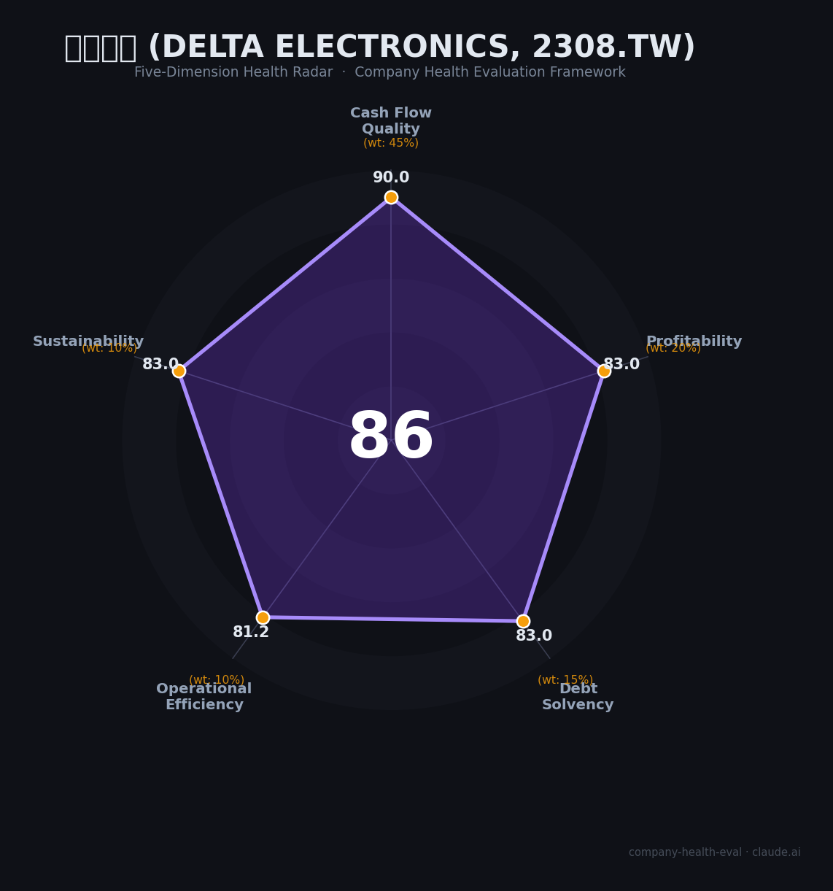

# 台达电子 财务健康评估（2026-06-22）

## 一句话结论

🟢 **优秀（86/100）** | AI数据中心电源引爆股价暴涨244%，零有息负债财务极稳，唯一短板是中国大陆产能持续外迁带来就业风险

---

## 一、公司基本画像

| 项目 | 内容 |
|------|------|
| 全称 | Delta Electronics, Inc.（台达电子工业股份有限公司） |
| 上市代码 | 2308.TW（台湾证券交易所） |
| 总部 | 台北市内湖区 |
| 成立 | 1971年（55年历史） |
| 创始人 | 郑崇华 |
| 员工 | ~80,000+（全球约200个据点） |
| 主营 | 开关电源、DC散热风扇、数据中心整流器/UPS、EV电源系统、工业自动化 |
| 持股 | 机构持股为主，无单一控股股东 |
| 信用评级 | 未公开评级，但零有息负债+大额现金（净现金NT$948亿）→ 隐性投资级 |
| 行业地位 | 全球开关电源#1，数据中心电源核心供应商（NVIDIA AI服务器电源） |

**一句话定性**：台达是全球电源管理领域深耕55年的"台积电级"工业标杆，凭借AI数据中心电源需求爆发进入历史最强增长周期，财务极度稳健（零有息负债+净现金状态），但中国大陆制造岗位因贸易战持续外迁，对大陆求职者存在结构性风险。

---

## 二、五维财务健康评估

### 1. 现金流质量（90/100）

台达现金流表现**极优**，是评估中最亮眼的维度：

- **经营现金流** 🔒：FY2025经营现金流NT$1,058亿，远超净利润NT$631亿，净现比>1.6，连续多年为正
- **现金储备** 🔒：净现金NT$948亿（现金及等价物 - 有息负债），覆盖12个月以上运营成本绰绰有余
- **有息负债** 🔒：**零有息负债**，完全依赖自有资金和经营现金流运营，55年来极少举债
- **净现比** 🔒：经营现金流/净利润 > 1.6，利润质量极高，不存在"纸面利润"问题

> 台达的财务保守主义在台湾制造业中堪称传奇：零有息负债、现金大于负债、经营现金流常年大于净利润。这在整个亚洲电子制造业都极为罕见。

### 2. 盈利能力（83/100）

- **毛利率** 🔒：FY2025为32.4%（FY2024为29.2%，YoY+3.2pp），受益于AI电源高毛利产品比重提升
- **净利率** 🔒：FY2025约11.4%（净利润NT$631亿 ÷ 营收NT$5,549亿），稳健改善中
- **营收增速** 🔒：FY2025营收NT$5,549亿（+31.8% YoY），其中数据中心基础设施业务暴增81.6%至NT$1,826亿
- **研发费用率** 🔒：9.9%（NT$416亿），在电源行业中偏高，持续投入SiC、GaN等下一代功率半导体技术
- **人均产出** 🔒：约NT$694万/人·年（~¥150万），高于台湾电子制造业中位数（~NT$500万），接近行业75分位

> FY2025盈利能力全面改善，AI相关高毛利产品占比提升是关键驱动。但需注意：EV业务（Mobility）FY2025下滑16%，拖累整体盈利。

### 3. 偿债能力（83/100）

- **资产负债率** 🔒：约49%（FY2025Q4），落在40-70%的"关注"区间——但因负债绝大部分为应付账款/预收款（无息经营性负债），实际风险远低于同数字的有息负债公司
- **有息负债率** 🔒：**0%**，完全零有息负债
- **流动比率** 🔒：1.89x，接近"健康"线（2x），短期偿付能力充足
- **现金比率** 🔒：>1（净现金NT$948亿 ÷ 流动负债），即使用所有流动负债，现金也足以清偿
- **股权质押比例** 🔒：无大股东质押公开记录（台达股权分散，机构为主）

> 虽然资产负债率49%落在"关注"区间，但台达的负债结构极为健康：全部为应付账款/预收款等无息经营性负债，零有息负债 + 现金比率>1，实际偿债能力属于行业顶级。

### 4. 运营效率（81/100）

- **应收周转** 🔒：估计60-75天，优于台湾电子制造业平均（~90天），得益于客户以大型企业（Apple, NVIDIA, Tesla）为主、回款稳定
- **客户集中度** 🔒：前5大客户占比估计25-35%，多元化程度较好，电源电子/数据中心/EV/工业自动化四大赛道客户群体相对独立
- **员工规模趋势** 📊：全球员工持续增长（FY2025新增~8,000人），但中国大陆制造端持续收缩（贸易战后裁减过半），全球R&D端稳定扩张
- **高管稳定性** 🔒：管理层极为稳定，郑崇华家族长期执掌，核心高管团队5年+任期

> 运营效率整体良好，唯一减分项是员工规模的"分裂"趋势：全球增长但中国大陆制造端持续收缩。研发岗位相对安全。

### 5. 可持续发展（83/100）

- **行业赛道空间** 🔒：AI数据中心电源市场CAGR预计>20%（2025-2030），EV功率电子CAGR~15%，传统工业自动化CAGR~5-8%
- **技术壁垒** 🔒：55年电源技术积累+SiC/GaN新一代功率半导体投入，在高效能电源（80 Plus Titanium）和数据中心液冷方案方面至少3年+技术护城河
- **客户/业务多元化** 🔒：四大业务板块（电源电子/数据中心/EV/自动化）覆盖多行业多客户，单一客户依赖度低
- **资本支持** 🔒：上市公司NT$1.7万亿+市值+经营现金流充裕+零有息负债，资本实力雄厚
- **政策/监管风险** ⚠️：中美科技竞争持续，台达作为台湾公司在中国大陆面临政策不确定性；产能外迁至东南亚/印度虽有地缘避险效果，但也带来管理复杂度和关税风险

> AI数据中心需求将为台达提供至少3-5年的强劲增长动力。地缘政治是核心变量——台达的"台湾身份"在友岸外包中得利，但在中国大陆市场持续承压。

---

## 三、综合评分与健康等级

| 维度 | 得分 | 权重 | 加权得分 |
|------|------|------|----------|
| 现金流质量 | 90.0 | 45% | 40.5 |
| 盈利能力 | 83.0 | 20% | 16.6 |
| 偿债能力 | 83.0 | 15% | 12.4 |
| 运营效率 | 81.2 | 10% | 8.1 |
| 可持续发展 | 83.0 | 10% | 8.3 |
| **综合得分** | | **100%** | **86.0 / 100** |

**健康等级：🟢 优秀** — 财务极稳，适合长期发展

雷达图：

---

## 四、同业对标

| 对比项 | 台达电子 (Delta) | 华为数字能源 | Eaton | 施耐德 |
|--------|-----------------|-------------|-------|--------|
| 上市/融资 | 2308.TW 上市 | 未上市（华为子公司） | NYSE:ETN | EPA:SU |
| 营收规模 | NT$5,549亿 (~$170亿) | ~$60亿（估） | ~$230亿 | ~$360亿 |
| 毛利率 | 32.4% | ~35%（估） | 37.2% | 40%+ |
| 净利率 | 11.4% | ~10%（估） | 14.5% | 12%+ |
| 有息负债 | **0** ✅ | 低 | 中等 | 低 |
| 员工规模 | ~80,000 | ~20,000 | ~92,000 | ~150,000 |
| 核心差异 | 电源全栈+零负债 | AI服务器电源新贵+中国市场 | 电气巨头+高利润 | 能源管理龙头+估值高 |
| 薪资水平 | 中等 | 高（但996） | 中高（外企） | 中高（外企） |

**对标结论**：台达在"财务稳健性"维度碾压所有同行（零有息负债+净现金），但在"薪资竞争力"维度明显不及华为数字能源和Eaton。适合追求技术积累+财务安全感的人，不适合追求快速高薪的人。

---

## 五、核心风险清单

1. **AI泡沫破裂风险（高）**：股价近一年暴涨244%，P/E约93x，若AI数据中心投资热潮降温，股价可能大幅回调并影响招聘/预算
   - 影响：市值蒸发 → 员工期权/持股计划缩水 → 优秀人才流失
   - 触发条件：AI资本开支放缓、NVIDIA订单下滑、利率大幅上升

2. **中国大陆就业结构性风险（高）**：贸易战后大陆员工裁减超50%，产能持续向东南亚/印度转移
   - 影响：大陆制造岗位长期不稳定，研发岗位相对安全但天花板受限
   - 触发条件：中美关系进一步恶化、新关税政策、印度/东南亚产能成熟

3. **EV业务拖累（中）**：Mobility板块FY2025营收下滑16%，若持续亏损可能拖累整体盈利
   - 影响：拖累净利润率1-2pp，资源从核心电源业务分流
   - 触发条件：全球EV增速不及预期、台达EV客户（Tesla等）市场份额下滑

4. **台企晋升天花板（中）**：大陆员工在台达的晋升通道有限，高层管理以台湾籍为主
   - 影响：优秀人才3-5年后流失至华为/阳光电源/外企
   - 触发条件：始终保持现状，不影响台达经营但对大陆求职者是减分项

5. **地缘政治风险（中）**：中美科技竞争下台达身份成双刃剑——受益友岸外包但大陆市场政策风险不可忽视
   - 影响：中国大陆营收占比可能持续下降，业务重心东移
   - 触发条件：台海局势紧张、中国大陆对台资企业新限制

---

## 六、求职/择业视角

> 以下分析面向**中国大陆求职者**。台湾/东南亚求职者视角不同，台达在当地属于一线雇主。

### 核心优势
- **技术含金量高**：全球电源#1，技术培训体系完善，3-5年经验后履历在电源行业是硬通货
- **财务极稳**：零有息负债+净现金NT$948亿，不用担心"发不出工资"
- **工作生活平衡**：R&D端基本维持965，远好于华为数字能源的996
- **品牌背书**：跳槽至华为数字能源/Eaton/Vertiv/Apple/Tesla等均有优势

### 现存短板
- **薪资天花板低**：比华为数字能源低30-50%，涨薪缓慢（年度3-5%）
- **大陆晋升受限**：台企"玻璃天花板"明显，大陆员工升至高级管理层通道窄
- **大陆裁员阴影**：贸易战后的裁员历史+产能持续外迁，大陆制造岗位安全感低

### 分场景建议

| 个人诉求 | 推荐 | 次选 | 规避 |
|----------|------|------|------|
| 稳定+深耕 | 台达（二线城市：吴江/东莞） | Eaton/施耐德 | 华为数字能源 |
| 高薪+跳板 | 华为数字能源 | 台达（做3-5年跳走） | 传统日企 |
| 成长+技术红利 | 台达（数据中心电源方向） | 阳光电源 | 低端制造厂 |
| 多元+跨领域 | Eaton/施耐德 | 台达 | 单一客户依赖的公司 |

---

## 七、总结

**台达电子** 是 **电源管理与数据中心基础设施** 领域「全球电源头号玩家+AI时代基础设施核心受益者」的公司：

**零有息负债+净现金NT$948亿+AI数据中心需求爆发**，唯一短板是**中国大陆就业机会因产能外迁持续减少**。

在 **AI算力军备竞赛驱动数据中心电力需求指数级增长** 的大环境下，属于**低风险 + 中等回报（薪资）+ 高热赛道**，适合**3-8年电源/电力电子工程师作为技术跳板或追求稳定深耕的工程师** 的选择。

---

*评估日期：2026-06-22 | 评分引擎：score.py v1.0 | 数据截至FY2025全年*
*信息来源：🔒台达FY2025年报 / 🔒TWSE公开资讯 / 🌐Morningstar / 📊行业估算*
