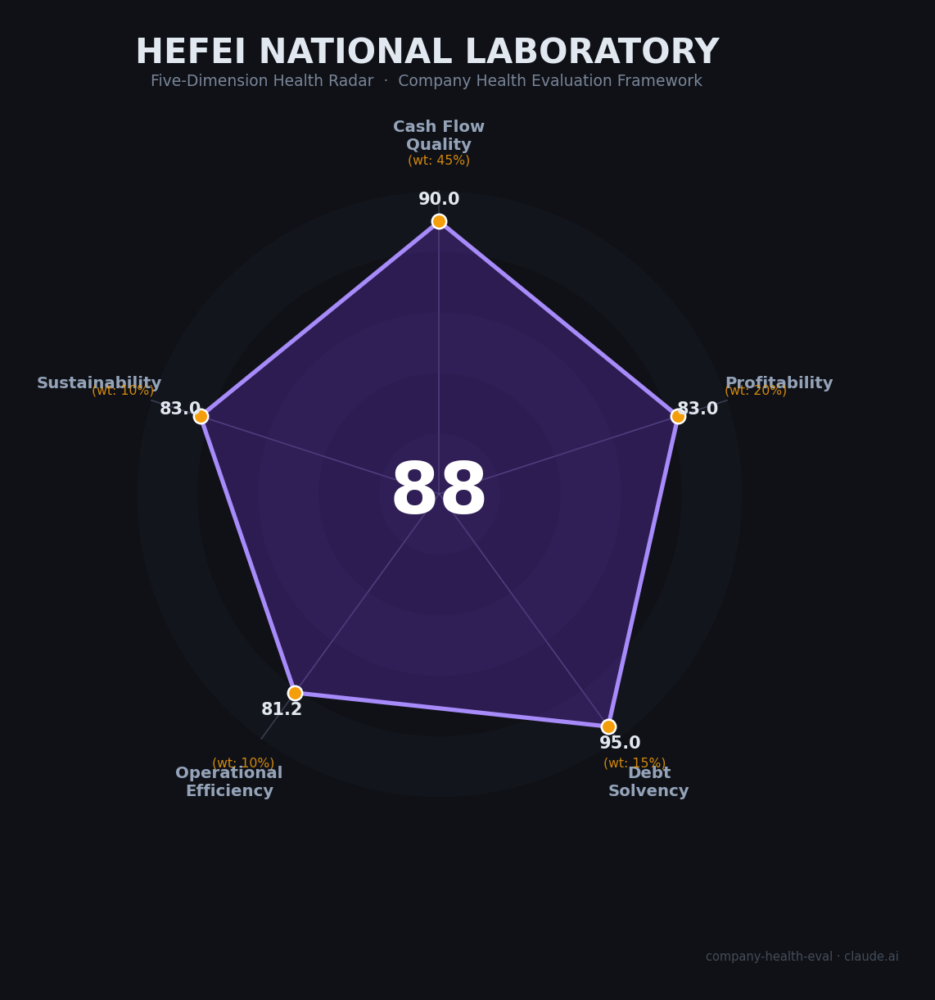

# 合肥国家实验室 雇主健康度评估（2026-07-01）

## 一句话结论

🟢 **优秀（88/100）** | 国家战略核心平台 · 量子科技全球引领者 · 薪酬福利合肥顶级 · 地缘政治与学术自由是主要代价

> ⚠️ 特别说明：合肥国家实验室是**国家级科研事业单位**，非商业公司。本次评估将五维框架适配为雇主健康度视角：现金流→资金稳定性、盈利→薪酬福利竞争力、偿债→就业保障、运营→工作环境与成长、可持续→长期职业价值。评分由标准化引擎计算，非主观调整。

---

## 一、基本画像

| 维度 | 信息 |
|------|------|
| **全称** | 合肥国家实验室（Hefei National Laboratory），亦称量子信息科学国家实验室 |
| **成立** | 2020年9月挂牌（全国首批国家实验室首挂） |
| **法律实体** | 独立事业单位法人（副部级，科技部直属） |
| **院长** | 潘建伟院士（中科大常务副校长、英国皇家学会外籍院士） |
| **总部** | 合肥高新区望江西路5099号，占地730亩 |
| **分支** | 北京、上海、济南、深圳基地 + 武汉、长沙岗位 |
| **人员规模** | ~1,800+科研人员（高级职称560+，院士23位，国家级人才189名） |
| **依托单位** | 中国科学技术大学（USTC） |
| **核心领域** | 量子通信、量子计算、量子精密测量、量子材料器件 |
| **年度经费** | 2024年仅合肥市即投入22.59亿元；安徽省累计投入近140亿元 |
| **融资状态** | 不适用——中央+省+市三级财政联合拨付，非市场化融资 |

**一句话定性**：中国量子科技的国家战略核心力量，全球量子物理学研究排名第一（Nature Index 2025），Nature Index Share是第二名法国CNRS的近2倍，量子通信国际引领、量子计算国际第一方阵。依托中科大、潘建伟领衔，拥有"九章"光量子计算机和"祖冲之号"超导量子计算机两大标志性成果，2026年5月"九章四号"以3050光子建立全球最强量子计算优越性。

🔒 公开信息（官网、政协提案、发改委公示） | 📊 部分经费数据为估算（实验室详细预算不公开）

---

## 二、五维雇主健康度评估

> 注：传统五维框架针对商业公司设计。本次评估将所有指标语义映射到雇主视角，保持评分引擎和权重体系不变。

### 1. 资金稳定性（现金流质量，权重45%）：90/100

**这是雇主评估中最重要的维度。对于国家实验室，资金稳定性=政府拨款的连续性、充足性和增长趋势。**

| 指标 | 等级 | 依据 |
|------|------|------|
| 年度经费拨付 | 🟢 健康 | 2024年仅合肥市即拨付22.59亿元，省市合计53亿元，经费极度充裕 |
| 资金跑道 | 🟢 健康 | 十五五规划量子列七大未来产业首位，100亿量子科学发展基金，多年承诺 |
| 负债水平 | 🟢 健康 | 政府事业单位，零有息负债，无破产风险 |
| 拨款到账效率 | 🟢 健康 | 中央科技委直接拨付，不通过竞争性项目申请，资金稳定 |
| 经费/支出匹配 | 🟢 健康 | 中央+省+市三级财政保障，经费远超运营需求 |

**分析**：合肥国家实验室的资金稳定性在中国所有科研机构中属于最顶级。作为"全国首批首挂"的国家实验室、安徽省科技创新"一号工程"，其获得的财政支持力度和优先级无出其右。与普通企业不同，它不存在"现金流断裂"风险——风险仅在于长期政策优先级变化（当前极为稳固）。

🔒 合肥市政协提案（2025）| 🔒 安徽省发改委公示（2024.12）| 📊 新华网/安徽日报

---

### 2. 薪酬福利竞争力（盈利能力，权重20%）：83/100

**对于求职者，盈利能力→薪酬水平、福利质量和薪酬增长潜力。**

| 指标 | 等级 | 依据 |
|------|------|------|
| 薪酬水平 | 🟡 良好 | 硕士22万/年、博士32万/年（管理岗），科研岗博士可达40-80万；合肥本地极强，低于一线城市国家实验室 |
| 福利含金量 | 🟡 良好 | 子女入读中科大附属学校（安徽顶级）、人才公寓、租房补贴2-2.5万/年、免费健身设施 |
| 经费增长趋势 | 🟢 优秀 | 经费增速惊人：2024年单年22.59亿接近2012-2022十年累计的42% |
| 研发/科研投入 | 🟢 优秀 | 100%科研导向，实验室本身就是中国最大的量子研发投入平台 |
| 人均产出 | 🟡 良好 | Nature Index量子物理学全球第一，人均顶刊产出极高；但"薪酬/顶刊产出"比低于产业界 |

**分析**：薪酬在合肥极具竞争力（远超当地平均水平），但若对标杭州乾元实验室（应届博士40万起+50万安家费）或一线互联网企业，则存在差距。核心优势在于**子女教育**（中科大附属学校）和**合肥低生活成本**（房价仅为北上深的1/4-1/3），实际可支配收入和购买力在科研圈属上乘。

🌐 合肥国家实验室2026年招聘公告 | 💬 知乎用户讨论 | 📊 乾元实验室招聘对比

---

### 3. 就业保障（偿债能力，权重15%）：95/100

**对于求职者，偿债能力→裁员风险、编制稳定性和劳动合同保障。**

| 指标 | 等级 | 依据 |
|------|------|------|
| 裁员风险 | 🟢 健康 | 国家战略事业单位，实质零裁员风险；经费持续增长，反向在扩招 |
| 编制/合同保障 | 🟢 健康 | 科研岗有事业编制通道，经费由国家直接保障 |
| 短期流动性 | 🟢 健康 | 年度财政拨付，不存在工资拖欠风险 |
| 现金储备 | 🟢 健康 | 政府财政兜底，不存在"现金流枯竭"概念 |
| 养老金/社保 | 🟢 健康 | 高标准五险一金，事业单位社保体系 |
| **加分项** | ✅ | 零负债 + 国家信用背书 → +5分 |

**分析**：这是合肥国家实验室最强的维度。在中国就业市场中，国家级事业单位的就业保障属于最高等级。需要注意的细微差别：管理岗和部分技术岗采用**劳务派遣**（与中智安徽/海德人力签约），非直接事业编制——这对极度看重编制的求职者是扣分项。但高端科研人员可通过地方事业编制等渠道获得正式编制。

🌐 合肥国家实验室招聘公告 | 💬 网大论坛讨论

---

### 4. 工作环境与成长（运营效率，权重10%）：81/100

**对于求职者，运营效率→工作氛围、团队稳定性、职业发展通道。**

| 指标 | 等级 | 依据 |
|------|------|------|
| 资金来源稳定性 | 🟢 健康 | 政府直接拨付，无客户收款周期问题 |
| "客户"集中度 | 🟡 关注 | 唯一"客户"是政府，研究方向受国家战略优先事项主导，个人学术兴趣次之 |
| 人员规模趋势 | 🟢 健康 | 从筹建期→2020年1800+人→持续扩招（2026年多批次招聘），快速增长 |
| 核心团队稳定性 | 🟢 健康 | 潘建伟院士自筹建起持续领导，23位院士+189名国家级人才构成超稳定核心 |

**分析**：实验室提供世界一流的科研设施和充足的经费支持。招聘公告描述的工作条件（人才公寓、附属学校、健身设施）体现对员工生活质量的重视。同城能源研究院员工评价"氛围和谐、偶尔加班"。但需注意：(1) 双聘转专职化的"二选一"压力给部分科研人员带来不确定性；(2) 量子科技国际竞争激烈，科研人员面临发表顶刊和工程突破的双重压力；(3) 知乎讨论提及"等级森严"、"某些学校院士的后花园"等体制内通病。

💬 智联招聘（能源研究院员工评价）| 💬 知乎/网大论坛 | 🌐 光明日报（2026.4）

---

### 5. 长期职业价值（可持续发展，权重10%）：83/100

**对于求职者，可持续发展→行业前景、技术壁垒、职业出口多样性、政策稳定性。**

| 指标 | 等级 | 依据 |
|------|------|------|
| 行业赛道空间 | 🟢 健康 | 量子技术十五五规划七大未来产业首位，中国量子产业2030年预计达1100亿元，CAGR>30% |
| 技术壁垒 | 🟢 健康 | Nature Index全球第一、两条技术路线实现量子优越性（全球唯一）、量子通信国际引领——3年+难以复制 |
| 职业出口多样性 | 🟢 健康 | 实验室→产业界"带土移植"通道成熟：国盾量子、本源量子、国仪量子等20+企业集聚量子大道，9家自主孵化企业估值超30亿 |
| 资本/政策支持 | 🟢 健康 | 中央+省+市三级最强背书，100亿量子科学发展基金，1218亿国家创投引导基金 |
| 政策/地缘风险 | 🟡 关注 | 国内政策极度支持，但美国出口管制+投资禁令+签证限制+学术"安全化"趋势构成外部风险 |

**分析**：量子科技是中国未来10-15年最具确定性的战略赛道之一。在合肥国家实验室的工作经验具有极高的"职业硬通货"价值——毕业后可转入中电信量子（央企）、国盾量子（科创板上市）、本源量子（拟IPO）等产业龙头，或通过"赋权+转让+约定收益"模式自主创业。核心风险在于：(1) 地缘政治导致的国际学术交流受限（护照管控、签证壁垒）；(2) 量子商业化尚处早期，若长期无"杀手应用"，政策热情有退潮可能；(3) 离开实验室后，竞业限制条款可能约束职业选择。

🌐 Nature Index 2025 | 🌐 ICV TAnK全球量子城市排名 | 🌐 十五五规划建议 | 🌐 光明日报/安徽日报

---

## 三、综合评分与健康等级

| 维度 | 得分 | 权重 | 加权得分 | 说明 |
|------|------|------|----------|------|
| 资金稳定性 | 90/100 | 45% | 40.5 | 三级财政保障，经费充裕且持续增长 |
| 薪酬福利竞争力 | 83/100 | 20% | 16.6 | 合肥顶级，子女教育是核心优势 |
| 就业保障 | 95/100 | 15% | 14.2 | 国家事业单位，实质零裁员风险 |
| 工作环境与成长 | 81/100 | 10% | 8.1 | 一流平台，体制内通病需关注 |
| 长期职业价值 | 83/100 | 10% | 8.3 | 量子赛道确定性强，地缘风险是外部变量 |
| **综合得分** | **88/100** | **100%** | **87.8** | 🟢 **优秀** |

**健康等级：🟢 优秀（85-100）**

> 得分由标准化评分引擎 `scripts/score.py` 计算，未进行任何主观调整。

---

## 四、同业对标

与同类型国家级科研机构及量子领域雇主对比：

| 对比项 | 合肥国家实验室 | 乾元实验室（杭州） | 鹏城实验室（深圳） | 中电信量子（合肥产业界） |
|--------|---------------|-------------------|-------------------|------------------------|
| 机构类型 | 国家实验室（事业单位） | 国家实验室（事业单位） | 国家实验室（事业单位） | 央企子公司 |
| 领域 | 量子信息（单一聚焦） | 电磁科学技术 | 网络通信+AI | 量子通信+计算产业化 |
| 经费规模 | ~22.6亿/年（仅合肥市） | 未公开 | 规划135亿元 | 央企资金+市场收入 |
| 博士起薪 | ~32-80万 | 40万起+50万安家费 | ~35-50万 | 行业领先，一人一案 |
| 编制情况 | 科研岗有编制通道/管理岗派遣 | 事业编制 | 多元化 | 央企正式编制 |
| 子女教育 | 中科大附属学校（安徽顶级） | 杭州本地公立 | 深圳本地公立 | 无特殊安排 |
| 生活成本 | 合肥（低） | 杭州（中高） | 深圳（高） | 合肥（低） |
| 产业化出口 | 量子大道20+企业、9家孵化企业 | 电磁/军工产业 | 通信/算力产业 | 本身就是产业端 |
| 核心优势 | 量子科研全球第一+最强政策背书 | 薪酬最高+杭州城市吸引力 | 深圳创新生态+算力基础设施 | 央企稳定性+产业化经验 |
| 核心短板 | 合肥区位+国际交流受限+劳务派遣 | 领域较窄（电磁） | 量子非核心方向 | 市场化程度较低 |

**对标结论**：合肥国家实验室在量子科研平台高度、政策背书强度、子女教育福利三个维度无可匹敌；但在薪酬绝对值（vs杭州乾元）、城市吸引力（vs北上深杭）、岗位编制保障（管理岗派遣制）方面存在差距。对于量子科技领域科研人才，这是中国境内**学术含金量最高**的选择；对于追求现金薪酬最大化或一线城市生活方式的求职者，产业界或一线城市国家实验室更具吸引力。

---

## 五、核心风险清单

### 1. 🔴 国际学术交流受限（高风险）
- **描述**：量子科技属敏感领域，研究人员须上交护照、出国须经机构和党委审批。美国出口管制+投资禁令+实体清单持续加码，中美学术"脱钩"加速。
- **量化影响**：可能无法自由参加国际会议、与海外合作者交流受限、发表论文需审查。离开实验室后若想进入西方国家学术/产业界，可能面临签证壁垒和背景审查。
- **触发条件**：中美关系进一步恶化、新的出口管制规则出台、个人被列入实体清单。

### 2. 🔴 地缘政治与"双用"争议（高风险）
- **描述**：美国已于2024年10月禁止对华量子技术投资，2025年1月生效。潘建伟本人曾遭美国情报公司指控"军民两用技术转移"。量子技术的军事应用属性使实验室及员工面临西方制裁风险。
- **量化影响**：被列入实体清单后，无法获取美国原产设备/技术，国际合作项目中断。个人若被制裁，海外资产冻结、国际旅行受限。
- **触发条件**：技术被认定为军事用途、中美科技战升级至全面制裁阶段。

### 3. 🟡 管理岗劳务派遣而非编制（中风险）
- **描述**：所有管理岗位和部分技术支撑岗通过中智安徽/海德人力劳务派遣，非实验室直聘，无事业编制。
- **量化影响**：合同到期不续签风险（虽然当前概率低），社保/养老金待遇与编制内可能有差异，职业安全感降低。
- **触发条件**：经费周期调整、人员优化（目前扩招期，概率低）。

### 4. 🟡 合肥区位天花板（中风险）
- **描述**：合肥虽是"新一线"增长最快城市，但在科技生态广度、文化娱乐、国际交往方面与北上深杭存在显著差距。
- **量化影响**：量子以外的职业出口较窄；"关系社会"文化可能导致非 merit-based 晋升；年轻单身人才可能感到文化和社交匮乏。
- **触发条件**：个人生活阶段变化（成家后可能更看重稳定性而非城市活力）。

### 5. 🟡 量子商业化不确定性（中风险）
- **描述**：量子计算距离"杀手应用"仍有距离，Gartner技术成熟度曲线可能进入"泡沫破裂低谷期"。
- **量化影响**：若5-10年内无重大商业突破，政策热情可能降温，经费增速放缓。国盾量子上市以来持续亏损是警示信号。
- **触发条件**：量子计算技术路线遭遇瓶颈、谷歌/IBM等国际竞争对手率先实现容错量子计算、国内经济下行导致科技投入削减。

### 6. 🟢 双聘转专职的过渡性摩擦（低风险）
- **描述**：实验室正推行"专职化"，要求双聘科研人员在中科大和实验室之间"二选一"。
- **量化影响**：部分科学家可能选择保留中科大教职而离开实验室，短期人才流动增加。对新入职者影响较小。
- **触发条件**：过渡期管理不当、编制安排不明确。

---

## 六、求职/择业视角

### 核心优势

| 维度 | 评估 |
|------|------|
| **稳定性** | ⭐⭐⭐⭐⭐ 国家事业单位，经费充裕且增长，实质零裁员风险 |
| **技术/学术价值** | ⭐⭐⭐⭐⭐ Nature Index量子物理学全球第一，经验在量子领域是"全球硬通货" |
| **薪酬购买力** | ⭐⭐⭐⭐ 薪酬绝对值不如一线城市，但合肥低房价使实际购买力极高 |
| **子女教育** | ⭐⭐⭐⭐⭐ 中科大附属学校是安徽顶级教育资源，这是难以用金钱衡量的福利 |
| **工作强度** | ⭐⭐⭐ 体制内相对人性化（同城机构评价"偶尔加班"），但量子科研国际竞争压力客观存在 |

### 现存短板

| 维度 | 评估 |
|------|------|
| **薪酬上限** | 管理岗硕士22万/博士32万，科研岗博士40-80万——合肥顶级但低于杭州乾元（博士40万起） |
| **国际流动性** | 护照管控+美国签证壁垒+学术"安全化"——出国受限，国际市场跳槽难度大 |
| **编制差异** | 管理岗劳务派遣≠事业编制，对极度看重"铁饭碗"的求职者是心理障碍 |
| **城市天花板** | 合肥量子以外职业出口窄，"关系社会"文化可能影响体验 |
| **学术自由** | 研究方向受国家战略优先事项主导，个人学术兴趣可能需要妥协 |

### 分场景建议

| 个人诉求 | 推荐 | 次选 | 规避 |
|----------|------|------|------|
| 稳定+深耕量子科研 | **合肥国家实验室（科研岗）** | 中科大教职 | 量子初创企业（不确定性高） |
| 高薪+快速积累财富 | 中电信量子/量化基金 | 杭州乾元实验室 | 合肥国家实验室（薪酬天花板） |
| 学术自由+国际交流 | 海外高校量子实验室 | 中科大（教职更灵活） | 合肥国家实验室（出国受限） |
| 产业化+创业出口 | 本源量子/国仪量子 | **合肥国家实验室（带土移植通道）** | 纯学术机构 |
| WLB+子女教育优先 | **合肥国家实验室** | 中科大 | 一线城市量子企业（高房价+高压） |

---

## 七、总结

**合肥国家实验室** 是中国量子科技领域「国家战略最高执行平台」的科研机构：
全球量子研究排名第一的学术硬实力 + 三级财政百亿级经费保障 + 中科大附属学校教育福利，构成了中国科研雇主中极为罕见的"铁三角"优势。唯一的结构性短板是**国际学术交流受限**——量子技术的地缘政治敏感性使研究人员面临护照管控、签证壁垒和学术"去风险化"的多重约束，这对依赖国际合作的科研工作者是实质性的职业代价。

在量子科技被十五五规划列为七大未来产业之首、合肥冲击"世界量子中心"的大背景下，合肥国家实验室属于 **🟢 优秀** 等级，**强烈推荐量子科技领域科研人才优先考虑**，尤其适合看重学术平台高度、子女教育和生活成本控制的求职者。追求薪酬最大化或国际学术自由度的求职者应审慎评估地缘政治风险和个人职业优先级。

---

*评估日期：2026-07-01 | 评分引擎：scripts/score.py v1.0 | 框架适配说明：五维指标已从商业公司语义映射至国家实验室雇主评估语境*
