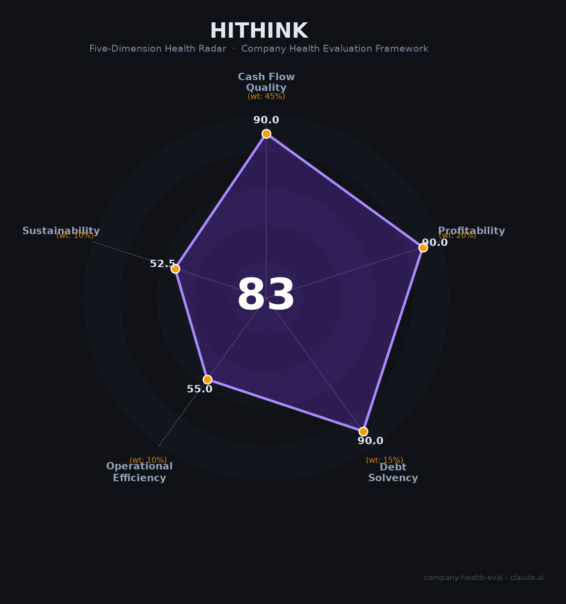

# 同花顺（300033.SZ）财务健康评估（2026-06-12）

## 一句话结论

🟡 **中等偏上（83/100）** | 零负债+¥140亿现金+53%净利率+A股金融AI第一，唯一短板：业绩高度依赖牛市+连续监管处罚

## 一、公司基本画像

| 维度 | 内容 |
|------|------|
| **主体** | 浙江核新同花顺网络信息股份有限公司（A股创业板300033.SZ，2009年上市） |
| **成立** | 2001年（杭州），创始人易峥（浙大电机系，1994年以¥40万起步） |
| **股权** | 易峥持股36.13%（实控人），创始团队4人合计~56%，上市以来从未减持 |
| **员工** | 5,087人（研发占比61.7%），杭州余杭 |
| **核心产品** | 同花顺APP（MAU 3,549万，行业第一）、iFinD金融数据终端（B端第二，机构覆盖率37.6%）、AI问财（首个备案金融大模型） |
| **2025年营收** | ¥60.29亿（+44%），净利润¥32.05亿（+76%），毛利率91.5%，净利率53.2%，ROE 38.5% |
| **AI布局** | HithinkGPT大模型（首家金融大模型备案）、自研千卡异构集群、问财深度思考2.0 Agent、iFinD MCP+Skills |

同花顺是中国金融信息服务的C端流量霸主（APP月活超东方财富2倍），也是唯一对Wind构成实质B端威胁的数据终端厂商。2025年借A股牛市东风实现爆发增长，但业绩与市场活跃度高度绑定，监管处罚频发。

## 二、五维财务健康评估

### 1. 现金流质量（90.0/100）
- 经营现金流连续3年为正，2025年¥37.74亿（+63%），净现比1.18 → 健康
- ¥140亿货币资金，零有息负债 → 健康

### 2. 盈利能力（90.0/100）
- 毛利率91.5%（行业中位值40%，为行业2.3倍）、净利率53.2%、ROE 38.5% → 全部优秀
- 人均创收¥118.5万、人均创利¥63万 → 金融IT行业顶级
- 营收3年CAGR ~19%，研发费率19%（AI重点投入）

### 3. 偿债能力（90.0/100）
- 资产负债率40%（均为合同负债/预收款，非有息负债），零短期/长期借款 → 全部健康

### 4. 运营效率（55.0/100）
- 广告导流收入占比57%，商业模式高度单一 → 关注
- 2024年减员399人（-7.3%），存在末位淘汰 → 关注
- 创始人易峥稳定（25年），但二股东叶琼玖72岁大规模减持套现¥6.38亿 → 关注

### 5. 可持续发展（52.5/100）
- 金融IT市场CAGR ~12%，AI金融是新增长点 → 关注
- C端MAU第一+金融大模型首个备案+千卡集群 → 技术壁垒强
- 业绩与A股牛熊强绑定（牛市弹性8-14倍），熊市利润可腰斩 → 关注
- **连续监管处罚**：2024.11云软件被暂停新客3个月+2026.4基金销售被记入诚信档案 → 危险

## 三、综合评分

| 维度 | 得分 | 权重 | 加权得分 |
|------|:----:|:----:|:--------:|
| 现金流质量 | 90.0 | 45% | 40.5 |
| 盈利能力 | 90.0 | 20% | 18.0 |
| 偿债能力 | 90.0 | 15% | 13.5 |
| 运营效率 | 55.0 | 10% | 5.5 |
| 可持续发展 | 52.5 | 10% | 5.2 |
| **综合** | | | **82.8** 🟡 中等偏上 |

## 四、核心风险

1. **A股牛熊强绑定（极高）**：日均成交额每降10%，广告收入可能降15-20%。若成交额从2万亿回落至1万亿，净利润可能下滑30-50%。
2. **连续监管处罚（高）**：2024.11投顾违规+2026.4基金违规记入诚信档案，「重扩张轻合规」是系统性缺陷。
3. **单业务依赖（中高）**：广告导流占57%收入，券商自建流量+AI入口变革可能长期侵蚀。

## 五、求职视角

- **优势**：金融科技履历含金量高、核心岗位薪资杭州有竞争力、AI Agent/大模型方向投入坚决
- **短板**：日均11.5h+大小周、「杭州四大坑之首」口碑、年终普遍仅1-2月、时薪偏低
- **建议**：适合应届生作为职业跳板（跳槽券商IT非常吃香），不适合追求WLB

---

*评估日期：2026-06-12 | 数据来源：同花顺2025年年报（2026.3.10披露）、Q1 2026季报（2026.4.23披露）*
