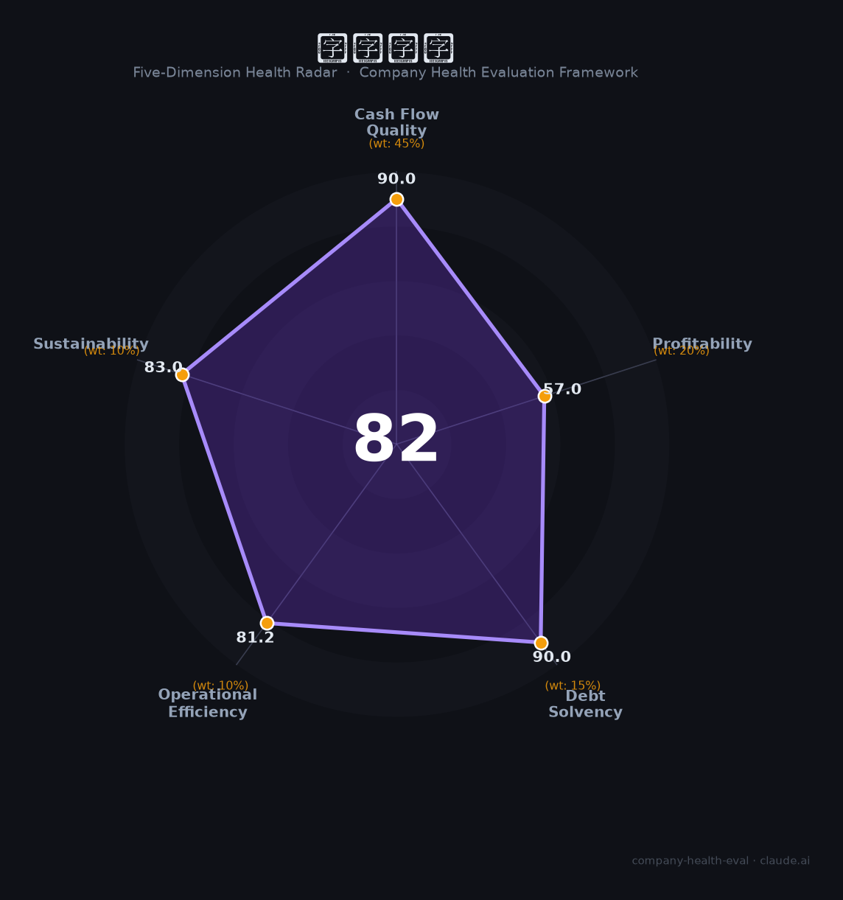

# 名创优品（09998.HK / MNSO）财务健康评估（2026-08-14）

## 一句话结论

🟡 **82/100，中等偏上** | 全球零售连锁龙头，现金流强、扩张快，盈利有波动

---

## 一、公司基本画像

| 项目 | 内容 |
|------|------|
| 主体 | 名创优品，全球生活百货零售龙头 |
| 主营 | 生活百货/潮玩(TOP TOY)/IP零售 |
| 财务 | 2025营收~250亿，净利~35亿 |

> 一句话定性：全球生活百货零售龙头，现金流强、扩张快、盈利有波动

---

## 二、五维财务健康评估

### 1. 现金流质量（90/100）| 权重45%

现金流强。

### 2. 盈利能力（57/100）| 权重20%

毛利率高、盈利有波动。

### 3. 偿债能力（90/100）| 权重15%

低负债、现金充裕。

### 4. 运营效率（81/100）| 权重10%

运营效率高。

### 5. 可持续发展（83/100）| 权重10%

全球扩张+IP零售，成长空间大。

---

## 三、综合评分

| 维度 | 得分 | 权重 | 加权 |
|------|:----:|:----:|:----:|
| 现金流质量 | 90 | 45% | 40.5 |
| 盈利能力 | 57 | 20% | 11.4 |
| 偿债能力 | 90 | 15% | 13.5 |
| 运营效率 | 81 | 10% | 8.1 |
| 可持续发展 | 83 | 10% | 8.3 |
| **综合得分** | **82/100** | 100% | 81.8 |

**健康等级：中等偏上** — 整体稳健，局部有待改善

---

## 四、核心风险清单

1. **海外扩张**
2. **IP依赖**
3. **零售竞争**

## 五、求职/择业视角

### 核心优势
- 全球零售龙头、现金流强、品牌出海
### 现有短板
- 盈利承压、IP依赖、扩张资本开支

**结论**：名创优品全球生活百货零售龙头，现金流强、出海领先，盈利有波动但整体稳健成长。

---

*评估方法：商泰汽车（iAUTO）五维框架 · 数据截至2026年8月 · 财务来源名创优品2025年报*