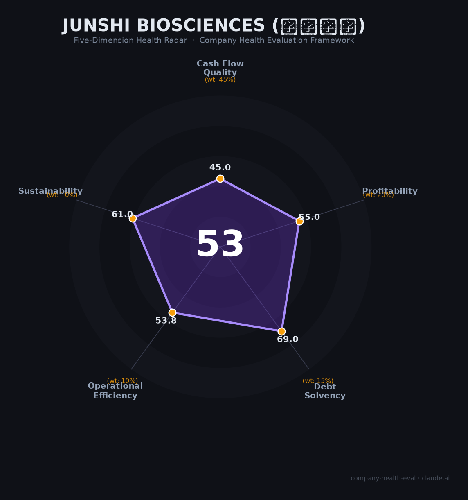

# 君实生物 财务健康评估（2026-06-12）

## 一句话结论

🔴 **中等偏下（53/100）** | PD-1赛道先发者但后劲不足，持续亏损+债务快速攀升+核心产品单一依赖是三大硬伤

---

## 一、公司基本画像

| 项目 | 内容 |
|------|------|
| **全称** | 上海君实生物医药科技股份有限公司 |
| **英文名** | Shanghai Junshi Biosciences Co., Ltd. |
| **成立时间** | 2012年12月27日（约13.5年） |
| **上市状态** | A股科创板（688180.SH，2020.7）+ 港股（01877.HK，2018.12） |
| **实际控制人** | 熊俊 + 熊凤祥（父子），一致行动人合计持股约18.67% |
| **CEO** | 邹建军（2024年1月上任，前恒瑞医药CMO） |
| **总部** | 上海浦东新区 |
| **员工** | 2,903人（2025年末），研发人员~620人 |
| **核心产品** | 拓益（特瑞普利单抗/Toripalimab），首个获FDA批准的国产PD-1 |
| **累计募资** | A+H合计超130亿元人民币（含IPO+配售+定增+可转债） |
| **市值** | 约310-330亿元（A股，较2020年峰值2,000亿+缩水超85%） |

🔒 数据来源：2024-2025年年报、上交所/港交所公告、东方财富

**一句话定性**：君实生物是中国PD-1赛道的技术先行者——首个国产获批、首个FDA出海——但在商业化执行、管线宽度和财务管理上全面落后于百济神州、信达生物和恒瑞医药，是"四小龙"中唯一仍深陷亏损的企业。

---

## 二、五维财务健康评估

### 1. 现金流质量（45/100）⚠️ 核心短板

| 指标 | 状态 | 实际数据 |
|------|------|----------|
| 经营现金流净额 | 🔴 危险 | 连续9年+为负，2025年-5.20亿（改善中，2026Q1首次转正） |
| 现金及等价物覆盖 | 🟡 关注 | 26.15亿（2025末），覆盖约11个月运营支出 |
| 有息负债 | 🟡 关注 | 34亿（短借6亿+长借28亿），5年增长5.6倍 |
| 净现比（经营CF/净利润） | 🟡 关注 | 两者均为负值，CF亏损小于NI亏损（-5.2亿 vs -8.8亿） |

🔒 数据来源：2020-2025年年报

**关键发现**：
- 经营现金流从2023年-20.05亿的谷底连续改善至2025年-5.20亿（+74%），2026Q1历史性转正
- 但长期视角下，自2016年以来经营现金流从未实现年度转正，累计烧掉超100亿元
- 长期借款从2021年5.8亿暴增至2025年27.9亿，叠加2026Q1新发约10亿可转债，债务结构加速恶化
- 现金26亿尚可支撑1-2年，但若扭亏进度不及预期，2027年前后可能面临再融资压力

### 2. 盈利能力（55/100）📈 快速改善中

| 指标 | 状态 | 实际数据 |
|------|------|----------|
| 毛利率 | 🟢 优秀 | 81.33%（2025年），较2023年低点55.6%大幅回升 |
| 净利率 | 🔴 预警 | -40.4%（2025年），连续9年亏损，但亏损率较2023年-168.8%大幅收窄 |
| 营收增速（3年CAGR） | 🟡 良好 | ~19.8%（2022: 14.5亿 → 2025: 25.0亿） |
| 研发费用率 | 🔴 预警 | 53.7%（2025年），>35%且亏损中 |
| 人均产出 | 🟡 良好 | ~86万元/人（2025年），高于创新药行业均值 |

🔒 数据来源：2022-2025年年报

**关键发现**：
- 毛利率从2023年的"灾难级"55.6%快速修复至81.3%，回到行业正常水平，反映产品结构优化和规模效应
- 亏损收窄趋势明确——从2022年-23.9亿 → 2025年-8.8亿（三年减亏63%），券商一致预期2027年实现全年盈利
- 营收增长质量高：药品销售收入占比从2022年52%升至2025年92%，摆脱对一次性授权收入的依赖
- 但53.7%的研发费用率在行业中偏高（信达28%、恒瑞24%），且低于2022-2023年的高点（129-165%），侧面反映研发收缩

### 3. 偿债能力（69/100）🟡 从稳健走向承压

| 指标 | 状态 | 实际数据 |
|------|------|----------|
| 资产负债率 | 🟡 关注 | 51.1%（2025），2026Q1升至约57% |
| 有息负债率 | 🟡 关注 | 约27.4%（34亿/124亿总资产） |
| 流动比率 | 🟡 关注 | 约1.6（估算），处于1-2之间 |
| 现金比率 | 🟢 健康 | 约1.05（26.15亿现金/约25亿流动负债） |
| 股权质押 | 🟢 健康 | 无显著质押记录 |

🔒 数据来源：2025年年报、东方财富

**关键发现**：
- 资产负债率3年内从22%暴增至51%（+29个百分点），主因持续亏损侵蚀权益 + 长借快速扩张
- 无应付债券（2025年末前），2026Q1首次发行~10亿可转债，债务结构进入新阶段
- 零商誉——历史上未做过并购，无商誉减值风险
- 税务信用A级需确认，未纳入加分

### 4. 运营效率（54/100）⚠️ 组织动荡未平

| 指标 | 状态 | 实际数据 |
|------|------|----------|
| 应收周转 | 🟢 健康 | ~74天（5.06亿/25亿营收），行业正常水平 |
| 客户集中度 | 🟡 关注 | 分销商模式但无精确前5客户数据 |
| 员工规模趋势 | 🟡 关注 | 2023年裁员13%（2,961→2,568），此后缓慢恢复至2,903人 |
| 高管稳定性 | 🔴 危险 | 4位核心技术人员已走2人（冯辉、武海2023年离职，姚盛2026年转非执行董事）；CEO 2024年换帅 |

🔒 数据来源：2020-2025年年报及公告、天眼查

**关键发现**：
- 核心技术人员从2022年的4人缩减至2026年的2人（邹建军+张卓兵），研发核心团队持续流失
- 2023年研发人员从995人骤降至736人（-26%），2025年进一步降至约620人
- 但2023年"裁员"主要发生在商业化团队优化和研发管线聚焦，不完全是被动裁员
- 2026年校招计划约150人，反映业务仍在扩张

### 5. 可持续发展能力（61/100）🟡 有机遇但隐忧深重

| 指标 | 状态 | 实际数据 |
|------|------|----------|
| 行业赛道空间 | 🟡 关注 | PD-1增速放缓至10-15%，但下一代IO赛道（双抗/ADC）空间大 |
| 技术壁垒 | 🟢 健康 | 首个FDA获批国产PD-1，BTLA、ADC等多管线布局 |
| 客户/业务多元化 | 🔴 危险 | 特瑞普利单抗占总营收83%，单一产品依赖极重 |
| 融资/资本支持 | 🟢 健康 | A+H双上市平台，2026年新增可转债，仍具融资能力 |
| 政策/监管风险 | 🟡 关注 | 2026年销售费用率42%遭上交所问询，生物药集采风险，BIOSECURE Act |

🔒 数据来源：年报、上交所问询函、美国立法记录

**关键发现**：
- 单一产品依赖是最大的结构性风险——特瑞普利单抗若遭遇集采或竞品替代，公司营收将断崖式下跌
- 国际化是最大亮点：全球40+国家获批，美国定价为国内33倍，但海外放量仍需时间验证
- 2026年5月上交所问询事件（销售费用率42.15%，质疑商业贿赂风险）引发股价9日跌20%，合规风险成定时炸弹
- 中美地缘政治：BIOSECURE Act已签署成法，FDA数据接受度存疑，但君实的LOQTORZI已获批上市受影响相对可控

---

## 三、综合评分与健康等级

| 维度 | 得分 | 权重 | 加权得分 |
|------|:----:|:----:|:--------:|
| 现金流质量 | 45.0 | 45% | 20.2 |
| 盈利能力 | 55.0 | 20% | 11.0 |
| 偿债能力 | 69.0 | 15% | 10.3 |
| 运营效率 | 53.8 | 10% | 5.4 |
| 可持续发展 | 61.0 | 10% | 6.1 |
| **综合得分** | | **100%** | **53.1 / 100** |

**等级：🔴 中等偏下（Moderate-Low）**

得分处于40-55区间，意味着"多个风险维度预警，不建议作为首选"。核心拖累因素是现金流质量（45分）和运营效率（54分），偿债能力（69分）是唯一接近中等偏上的维度。

---

## 四、同业对标

| 对比项 | 君实生物 | 信达生物 | 百济神州 | 恒瑞医药 |
|--------|---------|---------|---------|---------|
| 上市/融资 | A+H | 港股 | A+H+美股 | A股 |
| 2024年营收 | 19.48亿 | 94.22亿 | 272.14亿 | 279.85亿 |
| 2024年净利润 | -12.82亿 | -0.95亿（近乎盈亏平衡） | -49.78亿 | +63.37亿 |
| 经营现金流 | -14.34亿 | +12.87亿（已转正） | -12.59亿 | 正向稳定 |
| 毛利率 | 78.9% | 84.0% | ~80%+ | 86.3% |
| 核心PD-1销售 | 15.01亿 | 38.14亿 | 44.67亿 | ~20亿+ |
| 员工规模 | 2,578人 | ~5,000人 | 11,075人 | 20,238人 |
| 市值 | ~315亿 | ~1,200亿 | ~3,600亿 | ~3,300亿 |
| 盈利状态 | 持续亏损 | 2024年Non-IFRS转正 | 2025年首次盈利 | 持续盈利 |

🔒 数据来源：各公司2024年年报

**对标结论**：君实生物在国产PD-1"四小龙"中体量最小、亏损最深、负债率攀升最快。百济和信达已先后实现盈利拐点，恒瑞作为成熟Pharma稳如磐石。君实的核心比较优势仅剩"首个FDA获批国产PD-1"的先发国际化标签。

---

## 五、核心风险清单

1. **持续亏损与现金流枯竭（高风险）**：累计亏损超百亿，经营现金流连续9年为负。货币资金从2022年峰值60亿消耗至26亿。若2027年未能如期扭亏，可能面临再融资压力或被迫出售核心资产。

2. **单一产品依赖（高风险）**：特瑞普利单抗占总营收83%。若遭遇PD-1集采、竞品替代（如康方双抗AK112头对头击败K药），或FDA政策收紧，公司营收将面临断崖式下跌。下一代管线（BTLA、ADC等）尚处早期，3-5年内难成第二增长极。

3. **销售费用合规风险（中高风险）**：2026年5月上交所问询42.15%销售费用率，质疑是否存在商业贿赂或利益输送。在商业贿赂入刑门槛降至3万元、《医药代表管理办法》8月实施背景下，若被查实违规，可能面临罚款、列入黑名单、高管刑事追责。

4. **债务快速攀升（中风险）**：资产负债率3年翻倍（22%→51%），长期借款5倍增长（5.8亿→28亿），2026年新增可转债10亿。若收入增速放缓，偿债压力将急剧上升。

5. **核心人才持续流失（中风险）**：4位创始核心技术人员仅剩2人（张卓兵+邹建军），研发团队从995人缩减至620人（-38%）。研发能力空心化是长期隐忧。

6. **中美地缘政治（中风险）**：BIOSECURE Act已立法，虽未直接点名君实，但美国FDA数据接受度、License-out交易审查趋严等系统性风险持续升级。君实在美国规模尚小（LOQTORZI年销售仅千万美元级），但出海天花板可能被压低。

7. **24.5亿肿瘤医院投资（中低风险）**：苏州君奥肿瘤医院投资回收期15年，行业超六成民营医院亏损。在自身现金紧张的情况下，这一重资产投资被市场广泛质疑。

---

## 六、求职/择业视角

### 核心优势
- **技术品牌价值**：首个FDA获批国产PD-1的研发经验在行业内有辨识度，对跳槽至其他创新药企（尤其有出海需求的公司）有一定加分
- **国际化平台**：在美国有子公司（拓普艾莱），涉及FDA申报、国际多中心临床等稀缺经验
- **改善趋势明确**：营收高增长（+28%）、亏损快速收窄、2026Q1扣非净利润首次转正——公司在变好

### 现存短板
- **稳定性风险**：有过裁员记录（2023年-13%），持续亏损状态下不排除进一步人员优化
- **薪酬天花板**：研发人员平均薪酬约47万元（2022年数据），低于百济神州（研发人均95.6万）和信达，薪酬竞争力一般
- **品牌背书有限**：在恒瑞、百济、信达等头部玩家面前，君实的体量和行业影响力处于劣势
- **职业天花板**：核心管线聚焦PD-1，新兴技术领域（双抗、ADC、细胞治疗）布局较弱

### 分场景建议

| 个人诉求 | 推荐度 | 说明 |
|----------|:------:|------|
| 稳定+深耕 | ⭐⭐ | 持续亏损+裁员历史，稳定性一般 |
| 高薪+跳板 | ⭐⭐⭐ | 国际化经验可作为跳板，但薪酬竞争力一般 |
| 成长+融资红利 | ⭐⭐ | PD-1红利期已过，下一代管线尚早 |
| 多元+跨领域 | ⭐⭐ | 技术栈偏单一（抗体为主），跨领域广度有限 |

---

## 七、总结

君实生物是中国PD-1/创新药领域「先发技术领先但商业化掉队」的公司：
**核心优势是首个FDA获批国产PD-1的国际化先发地位和明确改善的营收趋势**，关键短板是**持续亏损+债务急升+单一产品依赖+核心人才流失四重压力下的财务脆弱性**。
在中国创新药从"me-too内卷"向"全球新出海"转型的大背景下，属于**中等偏下风险**的选择——适合能承受不确定性、看重国际化经验的求职者，但**不建议作为追求稳定和财务安全的首选**。

评估日期：2026年6月12日
数据截止至：2025年年报 / 2026年Q1季报
