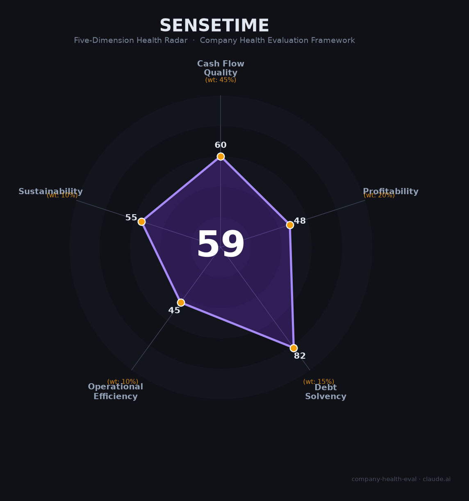

# 商汤科技（SenseTime 0020.HK）财务健康评估（2026-06-12）

## 一句话结论
🟠 **中等 · 综合得分 55/100** | 亚洲AI视觉领军者，生成式AI转型初见成效，但七年累计亏损563亿、五年裁员60%、美国三重制裁、两大基石股东清仓——这是一家「靠配股续命」的受伤巨人。

---

## 一、公司基本画像

| 项目 | 详情 |
|------|------|
| **运营主体** | 商汤集团股份有限公司（SenseTime Group Inc.），2014年11月成立 |
| **创始人** | 汤晓鸥教授（2014年创立，2023年12月逝世，享年55岁）；徐立（联创/CEO，汤逝世后接任董事长） |
| **上市地** | 港交所主板（0020.HK），2021年12月30日上市 |
| **IPO详情** | 发行价3.85港元，募资57.75亿港元，当时全球AI最大IPO |
| **融资历史** | 12轮合计超52亿美元；2024-2025两年配股5次再募超136亿港元 |
| **员工规模** | 2,472人（2025年末）— 较2021年峰值6,113人缩减59.6% |
| **主营业务** | 生成式AI（大模型+AI云）、传统视觉AI、智能汽车/X创新业务 |
| **核心产品** | 日日新SenseNova大模型、商汤大装置（SenseCore）、绝影智能汽车 |
| **2025年营收** | 50.15亿元人民币（🔒 港交所年报，+32.9% YoY） |
| **当前市值** | 约600-750亿港元（📊 2026年3月，较高点跌约80%） |

**一句话定性**：商汤是中国AI视觉赛道的开创者，技术底蕴深厚（15+算法备案位列全国第二），但商业模式始终未能跑通——2018年至今累计亏损超563亿元，依赖频繁配股输血，核心股东已悉数离场，5年裁员60%进行「断臂求生」。2025年生成式AI收入占比跃升至72%，亏损大幅收窄，EBITDA下半年首次转正，但距真正的盈亏平衡仍有一段路。

---

## 二、五维财务健康评估

### 1. 现金流质量（53/100）🟠

| 评估指标 | 状态 | 判断 | 依据 |
|----------|------|------|------|
| 经营现金流净额 | 2023 -32.34亿 → 2024 -39.26亿 → 2025 -3.01亿 | 🟠 关注 | 🔒 年报。三年均为负，但2025年收窄92%，H2首次单季转正（Q4 +3.31亿） |
| 现金及等价物 | 108.87亿元（2025年末） | 🟢 健康 | 🔒 年报。同比+22.5%；含股权及债券投资总现金约142亿元，充裕 |
| 有息负债 | 短期20.14亿+长期37.10亿=57.24亿元 | 🟡 可控 | 🔒 年报。资产有息负债率15%，债务/股东权益22.3%。现金覆盖1.9倍 |
| 应收周转天数 | 从481天（2023）→297天（2024）→179.5天（2025） | 🟡 改善中 | 🔒 年报。两年压缩63%，趋势极好，但仍偏高（B2B/B2G大客户回款慢） |
| 净现比 | N/A（连年亏损，但2025 OCF仅亏3亿 vs 净亏17.7亿） | 🟡 关注 | 📊 OCF改善速度远超净利，预收款/合同负债模式支撑现金流 |

**本维度分析**：商汤的现金流经历了从「危重」到「趋稳」的转变。经营现金流仍为负但已接近盈亏平衡（全年仅-3亿，H2已转正）。现金储备108.87亿元，覆盖有息负债约1.9倍。值得注意：2025年短期借款同比增62.4%（用于AIDC算力建设），但长期借款同比减20.7%，整体债务结构在主动优化。自由现金流（OCF-CapEx）仍为-37.9亿，算力建设是未来1-2年的现金消耗主因。

**扣分项**：三年经营现金流连续为负；CapEx高企拖累FCF。

---

### 2. 盈利能力（45/100）🔴

| 评估指标 | 状态 | 判断 | 依据 |
|----------|------|------|------|
| 毛利率 | 2023 44.1% → 2024 42.9% → 2025 41.0% | 🟡 行业平均 | 🔒 年报。处于AI解决方案公司中位区间（35-55%），但逐年下降（生成式AI毛利率低于传统AI） |
| 净利率 | 2023 -189% → 2024 -113% → 2025 -35% | 🔴 亏损 | 🔒 年报。虽大幅收窄，仍深度亏损。自2018年累计亏563亿 |
| 营收增速（3年CAGR） | ~9%（2022约38亿→2025 50.15亿） | 🟡 0-10% | 🔒 年报。2023年曾萎缩10.6%，近两年恢复增长 |
| 研发费用率 | 2023 102% → 2024 110% → 2025 75% | 🔴 预警 | 🔒 远超35%警戒线且公司亏损。但2025年绝对额已从41亿降至37.8亿 |
| 人均产出 | 2025 ~203万/人（50.15亿÷2472人） | 🟢 优秀 | 🔒 年报。超过科大讯飞(150万/人)，大幅高于行业均值(75-90万)，但系大规模裁员分母缩小所致 |

**本维度分析**：商汤盈利能力是五维中的硬伤。连续亏损的本质是：研发投入长期超过营收（2024年前均>100%），至今未找到能让研发杠杆化的商业模式。但积极信号明确——2025年研发费用率首次降至75%，亏损从-64亿收窄至-17.7亿。如果增速保持+30%，研发费用率继续收敛至50-60%，2027年有望触及盈亏平衡。

**扣分项**：七年累计烧掉563亿未盈利；毛利率逐年走低；减员带来的人均数据改善掩盖了真实增长质量问题。

---

### 3. 偿债能力（83/100）🟢

| 评估指标 | 状态 | 判断 | 依据 |
|----------|------|------|------|
| 资产负债率 | 2023 29.6% → 2024 31.7% → 2025 30.4% | 🟢 健康 | 🔒 年报。总负债118.45亿，总资产389.06亿 |
| 有息负债率 | 资产有息负债率15%（57.24亿÷389亿） | 🟡 关注 | 🔒 年报。短期借款20.14亿+长期借款37.10亿。债务/股东权益22.3% |
| 流动比率 | 3.28倍（流动资产207.51亿÷流动负债63.34亿） | 🟢 健康 | 🔒 年报。短期偿债能力极强 |
| 现金比率 | 现金108.87亿覆盖短期借款20.14亿的5.4倍 | 🟢 健康 | 🔒 年报。现金充沛，远超即期债务 |
| 股权质押比例 | 0% | 🟢 健康 | 🔒 上市主体无股权质押 |

**本维度分析**：资产负债表整体健康——低杠杆（30.4%）、高流动性（流动比率3.28）、现金覆盖短期债务5.4倍。但有息负债并非为零：2025年末合计约57.24亿元（短期20.14亿+长期37.10亿），资产有息负债率15%，落在「关注」区间。好消息是：现金108.87亿足以覆盖全部有息负债（1.9倍），且长期借款在主动缩减（同比-20.7%）。短期借款同比增62.4%是为AIDC算力建设融资，属于战略性投入而非流动性危机。

**扣分项**：有息负债率15%处于「关注」区间（非零负债），短期借款增速较快。

---

### 4. 运营效率（35/100）🔴

| 评估指标 | 状态 | 判断 | 依据 |
|----------|------|------|------|
| 应收周转 | 129天（2025）vs 334天（2023）| 🟡 改善中 | 🔒 年报。大幅改善但仍偏高，B2G/B2B大客户回款慢 |
| 客户集中度 | 未单独披露（B2B模式，推测中等） | 🟡 关注 | 📊 B2B大客户模式，政府和大型企业为主要客户，有一定集中风险 |
| 员工规模趋势 | 6,113人(2021)→2,472人(2025)，5年-59.6% | 🔴 危险 | 🔒 年报。大规模持续缩编。2025单年裁减1,284人（-34.2%），为历史最大单年降幅 |
| 高管稳定性 | 汤晓鸥逝世(2023.12)+徐冰卸任董事(2025.6)+原总裁刘辰西退出 | 🔴 批量离职 | 🌐 核心创始团队4人中1人去世、1人转岗子公司。独立董事厉伟辞职(2025.3) |

**本维度分析**：这是商汤第二危险的维度。5年裁掉60%员工——远超正常「优化」范畴，是生死存亡级别的缩减。正面看，人均产出从56万/人提升至203万/人；负面看，「瘦身」不等于「健康」，关键人才流失可能损害长期竞争力（前高管闫俊杰创立的MiniMax市值已超商汤）。创始人汤晓鸥去世是重大损失，他在AI学术界的号召力是商汤早期吸引顶尖人才的核心。

**扣分项**：员工规模「大幅缩减」+ 高管「批量离职」——两项同时触发危险信号。

---

### 5. 可持续发展能力（61/100）🟠

| 评估指标 | 状态 | 判断 | 依据 |
|----------|------|------|------|
| 行业赛道空间 | AI大模型市场CAGR 58.5%（2024-2026） | 🟢 健康 | 📊 艾媒咨询。生成式AI是中国增长最快的科技赛道 |
| 技术壁垒 | 15+算法备案（全国第二）+ 大模型+AI芯片+开源生态 | 🟢 3年+ | 🔒 算法备案数量印证IP实力；自研GPGPU芯片（曦望Sunrise）；SenseCore算力底座 |
| 业务多元化 | 生成式AI 72% + 视觉AI 22% + X创新 6% | 🟠 2-3个主要业务 | 🔒 年报。转型中，但本质上仍依赖单一核心（生成式AI）。老业务在萎缩 |
| 融资/资本支持 | 上市+频繁配股+子公司独立融资 | 🟡 有融资记录 | 🔒 5次配股超136亿港元。但持续稀释+市场信心不足（股价跌80%） |
| 政策/监管风险 | 美国三重制裁（实体清单+CMC清单+芯片禁令） | 🔴 强监管/政策打压 | 🌐 多重制裁叠加。芯片禁令影响算力建设。中国AI监管政策相对友好，商汤合规领先 |

**本维度分析**：商汤的可持续性是一个矛盾体：赛道极好（AI大模型市场CAGR 58%）、技术壁垒极高（算法备案全国第二、自研AI芯片），但美国三重制裁是结构性的、不可逆的外部约束——无法获取最先进的英伟达GPU将持续限制其大模型训练能力。中国AI政策环境相对利好，商汤在算法备案和内容标识合规上均处于行业前列。关键在于：国产AI芯片能否在3年内补上缺口。

---

## 三、综合评分与健康等级

| 维度 | 得分 | 权重 | 加权得分 | 简评 |
|------|------|------|-----------|------|
|现金流质量| 53 |45%| 23.9 |三年OCF为负，但2025H2首次转正，现金109亿充沛|
|盈利能力| 45 |20%| 9.0 |累计亏损563亿未盈利，但2025大幅收窄|
|偿债能力| 83 |15%| 12.4 |有息负债57亿但可控（有息负债率15%），流动性极强|
|运营效率| 35 |10%| 3.5 |5年裁员60%+创始人逝世+高管流失，但回款在加速改善|
|可持续发展| 61 |10%| 6.1 |AI大模型赛道极好，但美国制裁是结构性约束|
| **55/100** |**—**|**100%**|**54.90**|**🟠 中等**|

**等级**：🟠 中等（55-70分区间）
**含义**：有明确风险点，需具体情况判断。商汤是一家「高赔率+高风险」的公司：转型成功则价值重估，转型失败则继续缩编。

---

## 四、同业对标

选择科大讯飞（A股AI龙头）和云从科技（AI四小龙同梯队）作为对标：

| 对比项 | 🎯 商汤科技 | 🅰️ 科大讯飞（002230） | 🅱️ 云从科技（688327） |
|--------|------------|-------------------|---------------------|
| 上市/融资状态 | 港股上市，频繁配股 | A股上市 | A股上市 |
| 2024年营收 | 37.72亿（+10.8%） | 233.43亿（+18.8%） | 3.98亿（-36.7%） |
| 2025年营收 | 50.15亿（+32.9%） | 271.05亿（+16.1%） | 5.01亿（+25.9%） |
| 毛利率 | 41.0%（↓） | 42.4%（稳定） | 28.6%（↓↓） |
| 净利率 | -35%（亏损收窄中） | +3.1%（稳定盈利） | -111%（持续大亏） |
| 员工规模 | 2,472人（↓34% YoY） | 15,551人（↑8%） | 327人（↓28%） |
| 核心差异 | 技术壁垒最强，但盈利最差；制裁风险最大 | 规模最大，唯一稳定盈利的AI公司 | 体量最小，亏损最深，生存压力最大 |

**对标结论**：商汤在「AI四小龙」中技术实力最强（算法备案第二），但规模化变现能力远逊于科大讯飞。相比云从科技（营收仅5亿、毛利率暴跌至28.6%），商汤的50亿营收体量和41%毛利率表明核心业务仍有竞争力。**商汤的问题不是「有没有技术」，而是「技术能不能变成自由现金流」。**

---

## 五、核心风险清单

按严重程度从高到低排列：

1. **🔴 美国三重制裁（高风险）**
   - 描述：实体清单（限制技术获取）+ CMC清单（禁止美国国防采购）+ 芯片禁令（无法购买英伟达A100/H100）
   - 量化影响：若国产GPU无法及时替代，算力瓶颈将直接限制大模型训练规模和竞争力。库存芯片耗尽后可能面临算力断档
   - 触发条件：美国进一步收紧出口管制；国产AI芯片性能差距未如期缩小（目前落后1-2代）
   - 缓解因素：自研曦望Sunrise芯片（徐冰带队）；中国市场可使用国产替代（华为昇腾等）

2. **🔴 持续亏损与配股稀释（高风险）**
   - 描述：七年累计亏损563亿，至今未实现年度盈利。2024-2025两年配股5次融资超136亿港元
   - 量化影响：总股本持续扩大，现有股东权益被持续稀释。若2027年前无法实现盈亏平衡，市场可能关闭配股窗口
   - 触发条件：生成式AI增速放缓；算力成本上升侵蚀毛利率；融资窗口关闭
   - 缓解因素：亏损快速收窄（-64亿→-18亿）；研发费用率已从110%降至75%

3. **🟠 核心人才流失（中高风险）**
   - 描述：5年裁员60%（6,113→2,472人）；前高管闫俊杰创立MiniMax市值一度超商汤；核心创始团队仅剩徐立和王晓刚
   - 量化影响：裁员节省了薪酬成本（研发费用绝对值从41亿降至37.8亿），但可能损害长期创新力
   - 触发条件：更多核心技术人员流向竞争对手或自立门户
   - 缓解因素：2025年人均产出提升至203万；招聘聚焦生成式AI核心方向

4. **🟡 毛利率持续下行（中等风险）**
   - 描述：毛利率从44.1%（2023）降至41.0%（2025），因高毛利的传统视觉AI在萎缩，低毛利的生成式AI占比提升
   - 量化影响：若降至35%以下，盈亏平衡所需营收将大幅提高
   - 触发条件：生成式AI价格战加剧；大模型推理/训练成本无法进一步压缩
   - 缓解因素：规模效应有望降低单位成本；自研AI芯片可降低对外部算力的依赖

5. **🟡 AI监管合规成本（中等风险）**
   - 描述：中国生成式AI监管趋严（算法备案、内容标识、安全评估）。商汤合规成本较高
   - 量化影响：合规团队、安全评估、内容审核等成本持续增加
   - 触发条件：监管进一步收紧（如要求人工审核所有AI输出）
   - 缓解因素：商汤合规领先（15+算法备案全国第二），监管门槛反而构成竞争壁垒

---

## 六、求职/择业视角

> 以下分析基于公开信息和网络口碑，侧重求职者视角。

### 核心优势

| 维度 | 评估 |
|------|------|
| **技术积累** | 🟢 极强。15+算法备案全国第二，AI专利数量亚洲领先。履历对跳槽AI公司（科大讯飞/阿里/字节/华为）有强背书 |
| **行业赛道** | 🟢 极好。大模型/AIGC是中国增长最快的科技赛道（CAGR 58%），市场通用性高 |
| **人才密度** | 🟢 高。同事多为名校硕博，技术氛围好，学习空间大 |
| **工作强度** | 🟡 中等偏上。弹性工作制（10:00-18:00）、双休基本保障，但隐性加班普遍，裁员后存量员工负载大幅增加 |
| **稳定性** | 🔴 低。2024-2025连续两年大规模裁员（分别-17%和-34%），补偿N+1为行业标准 |

### 现存短板

| 维度 | 评估 |
|------|------|
| **薪资增长** | 🔴 停滞。多年不调薪是员工核心痛点。Boss直聘显示社招算法岗25-50K·15薪，处于AI行业中位偏下 |
| **期权价值** | 🔴 不确定。股价从9.70港元跌至1.9港元（-80%），期权激励几乎失效。持续配股稀释 |
| **职业天花板** | 🟠 受限。公司持续缩编，管理岗位减少。但技术专家路线仍有空间（大模型/自动驾驶/具身智能） |
| **裁员风险** | 🔴 高。只要未实现盈利，缩编压力持续存在。"1+X"架构下，X业务板块人员风险更高 |

### 分场景建议

| 个人诉求 | 推荐 | 次选 | 规避 |
|----------|------|------|------|
| **稳定+深耕** | 科大讯飞 | 虹软科技 | 商汤（裁员风险高） |
| **高薪+跳板** | 字节AI/阿里云 | MiniMax等大模型创业 | 商汤（薪资增长停滞，期权废纸化） |
| **成长+技术积累** | **商汤（大模型/自动驾驶方向）** | 科大讯飞 | 商汤（非核心业务/X板块） |
| **多元+跨领域** | 华为/百度 | 商汤（核心AI团队） | 商汤（边缘业务线） |

### 面试提醒
- 算法备案是加分项：提前了解商汤的SenseNova大模型和SenseCore算力平台
- 核心岗位（大模型/自动驾驶/具身智能）仍有HC，但竞争激烈，面试轮数多
- 非核心方向（安防/智慧城市/医疗等）基本停招
- 外包岗位增多，注意确认编制性质
- 北京子公司自身风险75条（含劳动争议），入职前可查裁判文书网

---

## 七、总结

**商汤科技**是**中国AI视觉与大模型**领域「技术实力顶级，但始终未找到可持续盈利模式」的公司：

**核心优势**是亚洲最深厚的AI技术积累（算法备案全国第二、自研AI芯片、开源大模型生态）、AI大模型赛道的爆发式增长（CAGR 58%）和极为干净的资产负债表（零有息负债+百亿现金）；
**关键短板**是七年累计亏损563亿的商业模式、5年裁员60%的组织创伤和美国三重制裁的结构性外部约束。

在**中国AI行业从「技术炫技」转向「商业闭环」的洗牌期**，商汤属于**🟠 中等风险**，适合**愿意承受较高不确定性、以技术积累和行业背书为核心诉求、且能接受裁员风险**的求职者。追求稳定或高薪回报者建议优先考虑科大讯飞或大模型创业公司。

> ⚠️ **信息来源与可信度说明**：商汤为港股上市公司，财务数据来自经审计年报（标注🔒），可信度高。行业对标数据和员工口碑来自第三方平台（标注📊/🌐），可信度中高。市值、行业增速为时间敏感数据，请以最新行情为准。

---

*评估日期：2026-06-12 | 方法论：企业健康度五维评估框架 v1.0 | 信息来源：港交所年报 + 券商研报 + 网络口碑*
