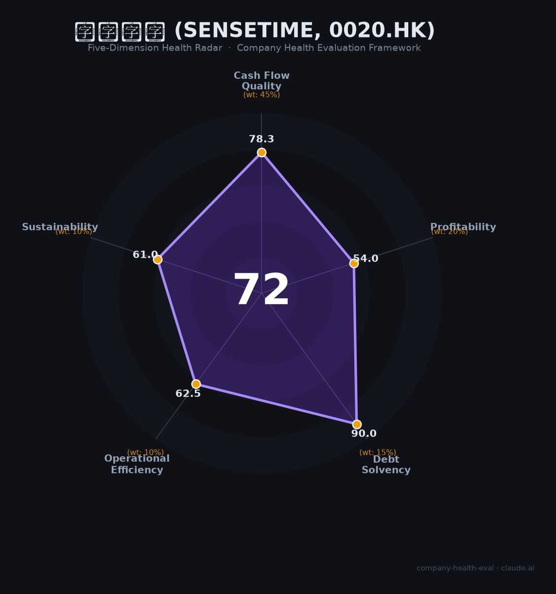

# 商汤科技（SenseTime）财务健康评估（2026-06-19 · 更新评估）

## 一句话结论

🟡 **中等偏上（72/100，↑17分 vs 此前55分）** | 生成式AI转型兑现+亏损大幅收窄+EBITDA转正，美国制裁+持续稀释+人才流失是核心隐忧

> **更新说明**：本报告基于FY2025（截至2025年12月）经审计年报重新评估，取代此前基于FY2024数据的旧版（55分/中等偏下）。12个月内核心指标全面改善。

## 一、公司基本画像

| 项目 | 内容 |
|------|------|
| **公司全称** | 商汤集团股份有限公司（SenseTime Group Inc.） |
| **上市信息** | 港交所主板 0020.HK，2021.12.30上市 |
| **发行价 vs 当前价** | HK$3.85 → ~HK$1.48（-62%），市值较高峰蒸发>80% |
| **成立时间** | 2014年 |
| **创始人** | 汤晓鸥教授（2023.12逝世）；现任CEO徐立（联合创始人） |
| **总部** | 上海（北京/深圳/香港/新加坡/沙特等地） |
| **员工规模** | 2,472人（FY2025末，较FY2021峰值6,113人**-59.6%**） |
| **核心业务** | 生成式AI（日日新大模型+大装置AIDC，占72.4%）+ 视觉AI（21.6%）+ X创新（6.0%） |
| **战略架构** | 「1+X」：母舰=大装置+大模型+应用；子舰=绝影汽车/医疗/机器人/芯片/零售（独立融资） |
| **融资历史** | IPO~HK$58亿 + 5轮配售~HK$137亿（2024.6-2026.4累计） |
| **大股东变动** | 阿里巴巴2023.7清仓退出，软银大幅减持，淡马锡为当前主要机构股东 |

**一句话定性**：商汤正经历从「计算机视觉龙头」到「生成式AI全栈平台」的战略转型。FY2025数据证实转型在财务端开始兑现（营收¥50亿创历史新高+亏损收窄59%+EBITDA转正），但7年累亏>¥500亿+美国三重制裁+持续配售稀释+核心人才流失的结构性难题仍未解决。

## 二、五维财务健康评估（基于FY2025经审计年报）

### 1. 现金流质量（78.3/100）

| 指标 | 判断 | 说明 |
|------|------|------|
| 经营现金流 | ⚠️ 关注 | FY2025全年OCF -¥3.01亿，但同比收窄92.3%；🔒**H2 OCF上市以来首次转正** |
| 现金储备 | ✅ 健康 | 🔒现金¥108.87亿+定存¥22.83亿=~¥131.7亿，另有约¥11亿股权投资。5轮配售累计募~HK$137亿 |
| 有息负债 | ✅ 健康 | 🔒资产负债率仅30.4%，D/E 22.3%，**净现金状态**（资本负债比率-6.9%） |

**评估**：商汤的现金储备极其充裕（¥130亿+），但这是靠持续配售（稀释老股东）换来的，非源自经营造血。H2 OCF转正是关键里程碑，若FY2026实现全年OCF转正则现金流质量将进一步提升。

### 2. 盈利能力（54.0/100）

| 指标 | 判断 | 说明 |
|------|------|------|
| 毛利率 | 📊 一般 | 🔒41.0%（FY2025），三连降（44.1%→42.9%→41.0%），算力运营成本同比+163.5% |
| 净利率 | 🔴 预警 | 🔒-35.5%（净亏¥17.82亿），虽较FY2024的-114%大幅改善，仍深度亏损 |
| 营收增速 | ✅ 优秀 | 🔒+32.9% YoY（¥37.72→50.15亿），创历史新高，连续两年加速 |
| 研发费用率 | 🔴 预警 | 🔒~75%（¥37.75亿/¥50.15亿），远超25%健康线；虽较FY2024首次下降8.6%，但在持续亏损下超高R&D投入不可持续 |
| 人均产出 | ✅ 优秀 | 🔒~¥203万/人（¥50.15亿/2,472人），在AI行业中处于极高水位 |

**评估**：盈利维度呈现典型的「高增长+深亏损」AI公司特征。32.9%的增速和¥203万人均产出极为出色，但-35.5%净利率和75%研发费用率意味着距离真正的盈亏平衡仍有相当距离。减亏的「含金量」需注意——¥13.13亿来自出售子公司一次性收益。

### 3. 偿债能力（90.0/100）

| 指标 | 判断 | 说明 |
|------|------|------|
| 资产负债率 | ✅ 健康 | 🔒30.4%，远低于40%健康线 |
| 有息负债率 | ✅ 健康 | 🔒D/E仅22.3%，净现金状态 |

**评估**：偿债能力毫无问题。商汤的财务困境不在于债务，而在于持续烧钱换增长的商业模式能否在资金耗尽前实现盈利。

### 4. 运营效率（62.5/100）

| 指标 | 判断 | 说明 |
|------|------|------|
| 应收周转 | ✅ 健康 | 🔒现金周转周期从228天大幅缩短至129天，贸易应收回款¥48.71亿创历史新高 |
| 客户集中度 | ✅ 健康 | 3,000+企业客户+1,000万+开发者，高度分散 |
| 员工规模趋势 | 🔴 危险 | 🔒6,113人→2,472人（4年-59.6%），含大规模裁员（2024.10十周年裁员N+1） |
| 高管稳定性 | ⚠️ 关注 | CEO徐立稳定但联合创始人徐冰2025.6离职创办曦望芯片；前高管创办MiniMax（市值已超商汤4x） |

**评估**：运营效率呈现两极分化——客户侧显著改善（回款加速、客户分散），但组织侧剧烈动荡（4年减员60%、核心人才外流）。2024年十周年当天裁员（N+1赔偿）是标志性负面事件。

### 5. 可持续发展能力（61.0/100）

| 指标 | 判断 | 说明 |
|------|------|------|
| 行业赛道 | ✅ 健康 | 中国生成式AI市场2025年¥495亿（+68.4%），CAGR 98%+，政策强力驱动 |
| 技术壁垒 | ✅ 健康 | NEO原生多模态架构（业界首推）+40,400P算力+20余款国产芯片适配+SuperCLUE榜首，壁垒极深 |
| 业务多元化 | ⚠️ 关注 | 生成式AI占72.4%且持续集中（FY2023仅35%），传统AI停滞（+3.4%），X创新缩减 |
| 资本支持 | ⚠️ 关注 | 港股上市但持续折价配售（5轮/¥137亿），严重稀释老股东；市值从HK$3,700亿跌至~HK$650亿 |
| 政策风险 | 🔴 危险 | 美国三重制裁（实体清单+NS-CMIC+1260H清单），阿里清仓，2026年6月国防部合同禁令生效 |

**评估**：可持续性呈现典型的「高壁垒+高风险」格局。技术和赛道极强，但美国制裁对外部融资、芯片供应、海外市场构成持续压制。持续配售稀释正将商汤推向「低价融资→股价下跌→更低折扣配售」的恶性循环。

## 三、综合评分与健康等级

| 维度 | 得分 | 权重 | 加权得分 | vs 旧版 |
|------|------|------|----------|--------|
| 现金流质量 | 78.3 | 45% | 35.2 | ↑25.3 |
| 盈利能力 | 54.0 | 20% | 10.8 | ↑9.0 |
| 偿债能力 | 90.0 | 15% | 13.5 | ↑7.0 |
| 运营效率 | 62.5 | 10% | 6.2 | ↑6.2 |
| 可持续发展 | 61.0 | 10% | 6.1 | — |
| **综合得分** | | | **71.9/100** | **↑16.9** |
| **健康等级** | | | 🟡 **中等偏上** | ↑ 从🔴中等偏下 |

## 四、同业对标

| 对比项 | 商汤科技 | 科大讯飞（002230） | 第四范式（06682） | 百度 |
|--------|---------|------------------|------------------|------|
| 上市/融资 | 港股，5轮配售 | A股，稳定盈利 | 港股，首年经调整盈利 | 港股/美股，成熟盈利 |
| 营收（FY2025） | ¥50.15亿 | ¥271.05亿 | ¥71.35亿 | ¥1,331亿（FY2024） |
| 营收增速 | **+32.9%** | +16.1% | **+35.6%** | -1% |
| 毛利率 | 41.0% | 42.4% | 34.8% | **~50%** |
| 净利率 | **-35.5%**（改善中） | +3.1% | -0.5%（经调整盈利） | **+17.9%** |
| 研发/营收 | **~75%** | ~20% | ~41% | ~20% |
| IDC AI市占率 | 大模型#3（13.8%） | 教育/医疗深耕 | 企业Agent平台 | 大模型应用#1 |
| 核心差异 | 算力+模型+应用全栈+原生多模态 | 垂直行业定制+央国企中标第一 | 企业决策AI平台 | 搜索+云生态协同 |

**对标结论**：商汤在独立AI公司中增速领先（32.9%），但盈利进度远远落后。第四范式已实现经调整盈利（¥0.18亿）而商汤仍亏¥17.82亿。商汤的核心壁垒在于「算力+模型」全栈自持（AIDC 40,400P），这是任何竞品无法短期复制的。

## 五、核心风险清单

1. **美国三重制裁+资本封锁（高）**：实体清单限制芯片、NS-CMIC禁止美国人交易、1260H清单国防部禁令2026.6生效。直接后果：阿里清仓、软银减持、海外市场实际关闭、芯片成本推高。

2. **持续配售稀释的恶性循环（高）**：2年内5轮配售募资~HK$137亿，2026.4配股资金预计8个月内耗尽。若2027年需要第6轮融资，在股价持续走低（~HK$1.48）的情况下，配售折扣将进一步加深，形成「融资→股价下跌→更低折扣融资」的死亡螺旋。

3. **75%研发费用率的不可持续性（中高）**：研发¥37.75亿/营收¥50.15亿，虽有下降趋势（-8.6%），但要实现盈亏平衡需将研发费用率压缩至~40%以下——意味着要么营收翻倍（>¥100亿），要么研发继续大幅削减（可能伤及核心竞争力）。

4. **核心人才持续外流（中高）**：前高管创办的MiniMax市值已超商汤4x（>HK$3,000亿 vs ~HK$650亿），形成鲜明对比。4年减员60%+十周年裁员N+1+年终奖归零=雇主品牌严重受损，招募顶尖AI人才难度加大。

5. **毛利率三连降（中）**：44.1%→42.9%→41.0%，算力运营成本同比激增163.5%。若「算力成本增速>收入增速」的趋势不逆转，盈利拐点将不断推迟。

## 六、求职/择业视角

### 核心优势
- **AI全栈技术栈**：大装置+大模型+应用三位一体，是AI从业者极难得的全栈经验平台
- **学术品牌残留**：商汤在CV领域的学术积淀（CVPR/ICCV论文数全球前列）仍有光环
- **薪资在行业中上**：算法岗25-50K×15薪，顶尖实习生2,000元/天，校招算法最高60万
- **生成式AI赛道**：当前最热门方向，经验通用性强（跳槽至其他大模型公司/大厂AI部门）

### 现存短板
- **极高不确定性**：7年累亏¥500亿+，持续配售稀释，股价-62%，期权价值高度不确定
- **裁员文化创伤**：十周年当天裁员N+1，应届生最后一天不转正，年终奖可归零，员工信任度低
- **工作强度分化**：核心部门995-996是常态，非核心部门可能随时被裁。减员60%后「一人干三人活」
- **组织动荡**：「1+X」拆分导致架构频繁变动，管理层「真人版狼人杀」
- **人才流失对比**：前同事创办的MiniMax市值已超商汤4x，留在商汤vs出去创业的机会成本对比鲜明

### 分场景建议

| 个人诉求 | 推荐 | 次选 | 规避 |
|----------|------|------|------|
| 稳定+深耕 | 科大讯飞（A股稳定盈利） | 百度AI | **商汤** |
| 技术成长 | **商汤**（全栈AI+CVer天堂） | 智谱AI/MiniMax | 传统IT |
| 期权回报 | MiniMax/智谱AI（一级市场高估值） | 第四范式 | **商汤**（持续稀释，期权价值存疑） |
| AI基础设施方向 | **商汤**（AIDC+国产芯片适配独一无二） | 华为昇腾 | — |

> **适合**：学生/应届生作为AI行业入门跳板（2-3年积累全栈经验后跳槽），或相信「大装置+NEO架构」远期价值的AI基础设施方向人才。
> **不适合**：期望期权回报、追求稳定性、对裁员风险零容忍的求职者。

## 七、总结

**商汤科技是「中国AI行业转型最剧烈的上市公司」：**
现金充裕（¥130亿+）+赛道极佳（生成式AI +68.4%增长）+技术壁垒深厚（NEO原生多模态+40,400P算力），FY2025在财务端兑现转型成果（营收创历史新高+亏损收窄59%+EBITDA转正）。
核心困境在于美国三重制裁的外部封锁+持续配售摊薄的内部侵蚀+7年累亏¥500亿的财务历史包袱。
在「MiniMax市值超商汤4x」的新AI格局中，属于**转型成效显著但仍有待验证的「翻身」标的**，12个月内从55分→72分的改善值得关注，但距离真正的安全边际仍有距离。

---

*评估日期：2026-06-19 · 经审计FY2025数据 · 评分引擎 v1.0 · 取代此前55分旧版*
