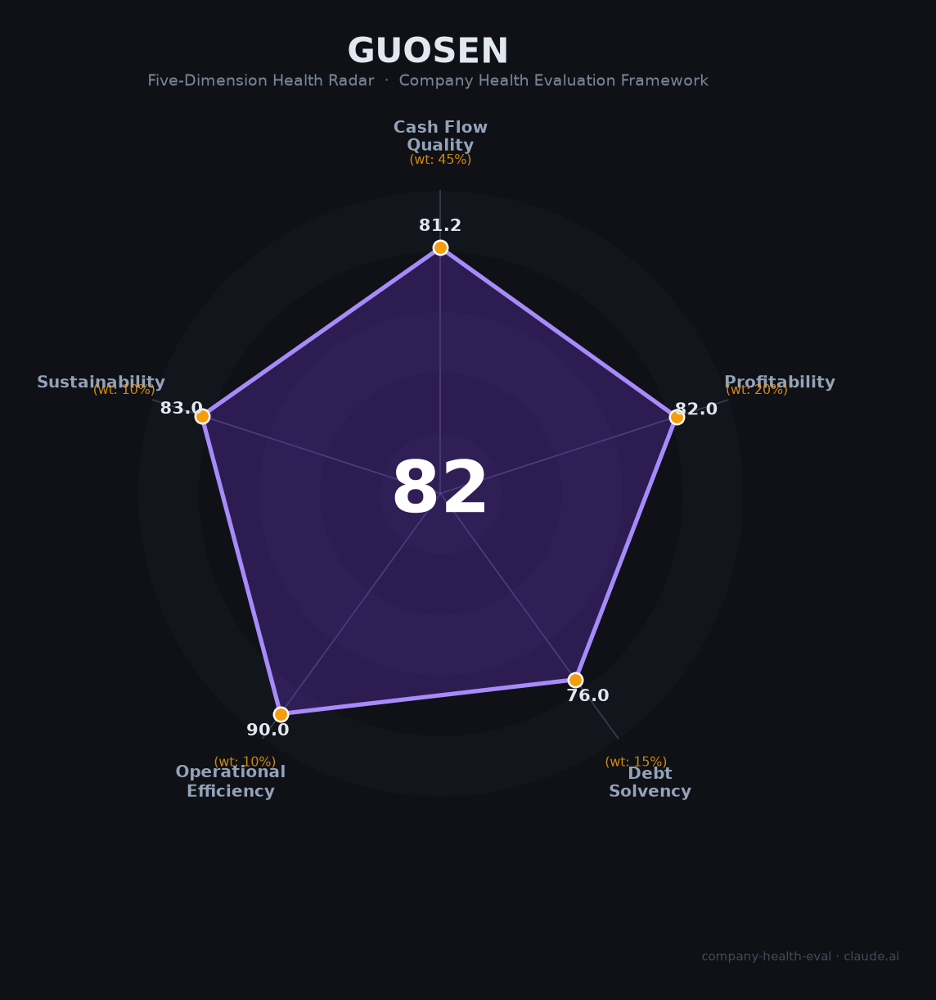

# 国信证券（002736.SZ / 1786.HK）财务健康评估（2026-08-14）

## 一句话结论

🟡 **82/100，中等偏上** | 深圳头部券商，营收净利双创新高，经营稳健

---

## 一、公司基本画像

| 项目 | 内容 |
|------|------|
| 主体 | 国信证券，深圳千亿级头部券商 |
| 主营 | 经纪/投行/资管/自营/研究 |
| 财务 | 2025营收241.43亿(+28.21%)，净利(+34.76%)创历史新高 |

> 一句话定性：深圳老牌券商，营收净利双增创新高

---

## 二、五维财务健康评估

### 1. 现金流质量（81/100）| 权重45%

券商杠杆经营但现金流稳健。

### 2. 盈利能力（82/100）| 权重20%

净利率与人均产出领先。

### 3. 偿债能力（76/100）| 权重15%

以净资本为核心，偿债稳健。

### 4. 运营效率（90/100）| 权重10%

运营效率高。

### 5. 可持续发展（83/100）| 权重10%

券商板块景气，公司综合实力强。

---

## 三、综合评分

| 维度 | 得分 | 权重 | 加权 |
|------|:----:|:----:|:----:|
| 现金流质量 | 81 | 45% | 36.5 |
| 盈利能力 | 82 | 20% | 16.4 |
| 偿债能力 | 76 | 15% | 11.4 |
| 运营效率 | 90 | 10% | 9.0 |
| 可持续发展 | 83 | 10% | 8.3 |
| **综合得分** | **82/100** | 100% | 81.6 |

**健康等级：中等偏上** — 整体稳健，局部有待改善

> 金融机构：偿债以净资本/资本充足率评估

---

## 四、核心风险清单

1. **市场行情波动**
2. **佣金率下行**
3. **投行承压**

## 五、求职/择业视角

### 核心优势
- 千亿券商平台，业务全面、薪酬优厚
### 现有短板
- 业绩与资本市场强周期绑定

**结论**：国信证券深圳头部券商，经营稳健、业绩创新高，资本市场回暖下成长可期。

---

*评估方法：商泰汽车（iAUTO）五维框架（金融机构特性：偿债以净资本/资本充足率评估） · 数据截至2026年8月 · 财务来源国信证券2025年报*