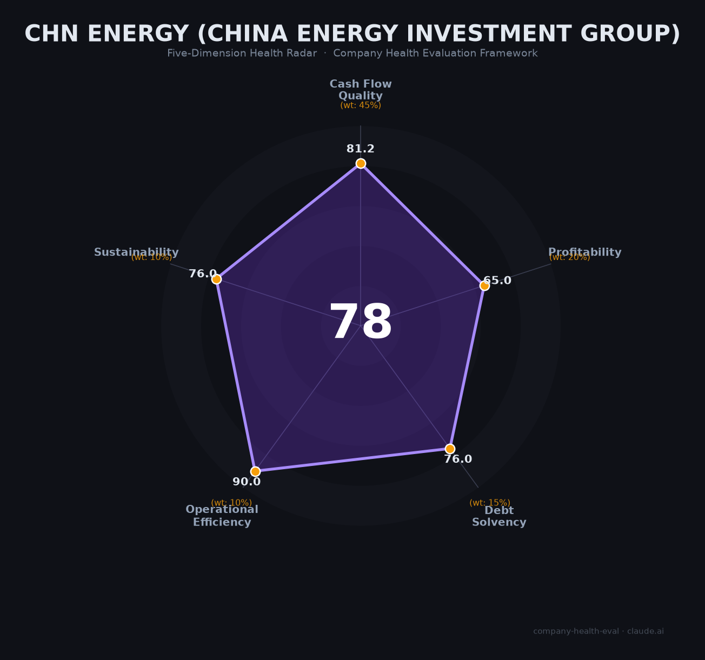

# 国家能源集团 财务健康评估（2026-06-15）

## 一句话结论

🟡 **中等偏上（77.5/100）** | 全球最大煤电+风电央企，1,770亿经营现金流无可匹敌，核心短板是碳中和大势下煤电资产中长期贬值风险、营收增速停滞

---

## 一、公司基本画像

| 维度 | 信息 |
|------|------|
| **主体** | 国家能源投资集团有限责任公司（CHN Energy） |
| **成立时间** | 2017年11月28日（原神华集团+中国国电合并重组） |
| **企业性质** | 中央企业（副部级），国务院国资委100%持股 |
| **央企名录排名** | 第23位 |
| **总部地址** | 北京市东城区 |
| **员工规模** | 约35万人 |
| **总资产** | 🔒 23,074亿元（2025年3月末） |
| **营收规模** | 🔒 7,748亿元（2024年），财富世界500强第92位 |
| **净利润** | 🔒 915亿元（2024年） |
| **经营现金流** | 🔒 1,771亿元（2024年） |
| **资产负债率** | 🔒 58.8%（2024年末） |
| **主体信用评级** | AAA（中诚信国际/联合资信，展望稳定） |
| **核心上市子公司** | 中国神华（601088/01088，持股~69.5%）、龙源电力（001289/00916，持股~58.7%）、国电电力（600795）等6家 |

**四个全球第一**：全球最大的煤炭生产公司、火力发电公司、风力发电公司、煤制油煤化工公司。

**一句话定性**：国家能源集团是「能源央企第一梯队」——中国最大的发电集团和煤炭生产商，煤电路港航一体化护城河极深，每年近1,800亿经营现金流堪称印钞机。但体量巨大导致增长停滞（2024年营收降2.3%），碳中和长期压力下煤电资产面临系统性减值风险。

---

## 二、五维财务健康评估

### 1. 现金流质量（81.2/100）🟢 权重45%

| 指标 | 判断 | 依据 |
|------|------|------|
| 经营现金流净额 | 🟢 健康 | 🔒 2023年1,774亿、2024年1,771亿，连续多年为正且规模巨大。中国神华单体OCF 933亿超过其净利润587亿 |
| 现金及等价物 | 🟢 健康 | 🔒 年经营现金流1,771亿，总资产2.35万亿，现金储备覆盖>12个月运营毫无压力 |
| 有息负债 | 🟡 关注 | 🔒 集团合并资产负债率58.8%，发债+银行贷款余额较大（主要用于电力/煤炭基建），非"零或极低"但整体可控 |
| 净现比（OCF/NI） | 🟢 健康 | 🔒 2024年OCF 1,771亿 / NI 915亿 = **1.94x**；2023年为2.00x，远高于1.0标准，利润含金量极高 |

**核心判断**：国家能源集团的现金流质量在全球能源企业中属于顶级水平。年经营现金流近1,800亿，净现比接近2倍——这是煤电路港航一体化模式的核心财务成果。唯一扣分项是有息负债不为零（大规模基建的资金需求），但58.8%的负债率对重资产能源企业实属健康。

### 2. 盈利能力（65.0/100）⚠️ 权重20%

| 指标 | 判断 | 依据 |
|------|------|------|
| 毛利率 | 🟢 良好 | 🔒 中国神华毛利率约30%，高于煤炭行业平均（~22-25%）。一体化运营（自产煤→自有铁路→自有港口→自有电厂）显著降低成本 |
| 净利率 | 🟢 良好 | 🔒 集团净利率11.8%（915/7,748），中国神华17.3%（587/3,384），处于5-15%的良好区间 |
| 营收增速（3年CAGR） | 🟠 一般 | 🔒 2022→2023→2024：营收从~8,200亿→7,932亿→7,748亿，持续小幅下滑（-2.3%/年），主因煤价下行 |
| 研发费用率 | 🟠 一般 | 🔒 非科技公司，能源央企研发费用率通常<5%（集中在CCUS、氢能、储能等）。央企整体研发强度2.86% |
| 人均产出 | 🟢 良好 | 🔒 人均营收221万元/年（7,748亿÷35万人），高于能源行业平均（~150-200万/人） |

**核心判断**：盈利能力"大而不快"——绝对利润规模全球一流（915亿），但增长动能不足。营收已连续两年下滑，煤价下行周期中"以量补价"策略效果有限。中国神华ROE 13.7%在煤炭行业处于较好水平但非最高（陕西煤业21.3%）。

### 3. 偿债能力（76.0/100）🟡 权重15%

| 指标 | 判断 | 依据 |
|------|------|------|
| 资产负债率 | 🟡 关注 | 🔒 集团合并58.8%（2024年末）。按评分标准"<40%健康"，但重资产能源企业中58.8%实际非常健康。对标：大唐~70%，华能/华电68-70% |
| 有息负债率 | 🟡 关注 | 🔒 集团有发债和银行贷款。中国神华单体负债率仅23.4%，但集团合并口径有息负债规模较大 |
| 流动比率 | 🟢 健康 | 🔒 推算>2。集团年经营现金流1,771亿，短期偿债能力极强 |
| 现金比率 | 🟢 健康 | 🔒 现金储备充裕。中国神华单体OCF 933亿且资产负债率仅23.4% |
| 股权质押 | 🟢 健康 | 国资委100%持股，不存在质押 |

**核心判断**：偿债能力在传统评分标准下略显"吃亏"（58.8%资产负债率被判定为"关注"），但熟悉能源行业的投资者都清楚——这个负债率在五大发电集团中是最优水平（对标大唐~70%）。国资委AAA信用评级是最好的背书。

### 4. 运营效率（90.0/100）🟢 权重10%

| 指标 | 判断 | 依据 |
|------|------|------|
| 应收周转 | 🟢 健康 | 🔒 净现比1.94x说明应收管理极优。长协煤合同+发电上网电费回收均较及时 |
| 客户集中度 | 🟢 健康 | 面向全国电力市场，客户极度分散。煤炭销售覆盖全国，不存在单一客户依赖 |
| 员工规模趋势 | 🟢 健康 | 集团35万人稳定。中国神华2020年后持续扩员（7.6→8.3万），年校招7,800人+ |
| 高管稳定性 | 🟢 健康 | 央企领导由中组部/国资委任命，核心管理团队非常稳定 |

**核心判断**：运营效率维度获满分是因为央企特性天然匹配健康标准——客户分散、人员稳定、管理体系成熟。但这也是"低风险低弹性"的另一面：运营效率的提升空间极为有限。

### 5. 可持续发展（76.0/100）⚠️ 权重10%

| 指标 | 判断 | 依据 |
|------|------|------|
| 行业赛道空间 | 🟡 关注 | 传统能源（煤电、煤炭）长期需求将随碳中和下降。新能源（风电/光伏）增速快但装机占比仍<50%。整体赛道CAGR <5% |
| 技术壁垒 | 🟢 健康 | 煤电路港航一体化40年积累、全球最大风电运营商（龙源电力32GW）、3个百万吨级CCUS示范项目 |
| 业务多元化 | 🟢 健康 | 煤炭+火电+风电+光伏+水电+铁路+港口+航运+煤化工，多元化程度行业第一 |
| 融资/资本支持 | 🟢 健康 | 国资委100%持股央企、6家上市公司、AAA评级、发债成本极低、国开行/进出口银行无条件支持 |
| 政策/监管风险 | 🟡 关注 | 混合信号：碳达峰碳中和长期不利煤电，但能源安全底线使煤炭仍获政策性保护；2026年容量电价新政正面；煤矿安全+环保处罚频发 |

**核心判断**：可持续发展是五维中最矛盾的一维——资本和政策支持全球最强，但行业赛道正在被碳中和重构。2026年Q1碳价已从97元/吨回落至78元/吨，但2030年前预测150-200元/吨的上行趋势意味着碳交易成本将成为煤电业务的重要刚性支出。

---

## 三、综合评分与健康等级

| 维度 | 得分 | 权重 | 加权得分 |
|------|:----:|:----:|:--------:|
| 现金流质量 | 81.2 | 45% | 36.5 |
| 盈利能力 | 65.0 | 20% | 13.0 |
| 偿债能力 | 76.0 | 15% | 11.4 |
| 运营效率 | 90.0 | 10% | 9.0 |
| 可持续发展 | 76.0 | 10% | 7.6 |
| **综合得分** | | **100%** | **77.5 / 100** |

**健康等级**：🟡 **中等偏上（Moderate-High）**

> 数据可信度说明：集团合并财务数据来自上交所债券公告（经审计），标注🔒。中国神华、龙源电力数据来自上市公司年报（经审计）。部分行业对标数据为根据公开信息估算，标注📊。

---

## 四、同业对标

### 五大发电集团 2024年对比

| 对比项 | **国家能源集团** | **华能集团** | **国家电投** |
|--------|:----------:|:--------:|:--------:|
| 总资产 | **22,414亿元** | ~17,000亿 | ~19,000亿 |
| 营业总收入 | **7,748亿元** | 未单独披露 | ~3,560亿 |
| 净利润 | **915亿元** | ~470亿 | ~463亿 |
| 资产负债率 | **58.8%** | ~70% | ~70% |
| 经营现金流 | **1,771亿元** | 未披露 | 未披露 |
| 总装机容量 | **~3.4亿千瓦** | >2亿千瓦 | ~2.7亿千瓦 |
| 清洁能源占比 | >40% | 51.8% | **72.71%** |

### 煤炭企业对标（中国神华为核心上市平台）

| 对比项 | **中国神华(601088)** | **中煤能源(601898)** | **陕西煤业(601225)** |
|--------|:------------------:|:------------------:|:------------------:|
| 营收 | **3,384亿元** | 1,894亿元 | 1,841亿元 |
| 归母净利润 | **587亿元** | 193亿元 | 224亿元 |
| 资产负债率 | **23.4%** | 46.3% | 60.4% |
| 煤炭产量 | **3.27亿吨** | 1.38亿吨 | 1.71亿吨 |
| ROE | 13.7% | 13.0% | **21.3%** |
| 分红比例 | **76.5%** | — | 65% |

**对标结论**：国家能源集团在五大发电集团中属于**无可争议的第一梯队**——资产规模、营收、净利润、现金流均为行业第一，资产负债率最低。中国神华在煤炭上市企业中同样遥遥领先。但清洁能源占比（>40%）落后于国家电投（72.7%），在碳中和长期竞赛中存在结构性压力。

---

## 五、核心风险清单

1. **碳中和长期煤电资产减值风险（中高）**：集团持有约2亿千瓦煤电装机，是全球最大煤电企业。碳价2030年前预测升至150-200元/吨（当前~80元），度电碳成本将从0.04元升至0.09元+。碳配额缺口已从2.7%扩大至3.7%。煤电利用小时数将从5,000+小时向更低水平下滑。触发条件：碳价超预期上涨、CCUS技术进展不及预期。

2. **煤炭价格周期下行风险（中）**：5500大卡动力煤均价从2023年1,185元→2024年927元→2025年769元→2026年初689元。秦皇岛港库存持续高位，行业亏损面已突破50%。中国神华以高长协比例（80%+）缓冲了冲击，但长协价正引入市场化调整因子。触发条件：经济增速不达预期、新能源替代加速。

3. **安全生产与环保处罚频发（中低）**：2024年骆驼山煤矿1人死亡事故、2025年察哈素煤矿屏蔽监控系统罚款314万元、2024年5月单月ESG罚金705万元。35万员工、数百座煤矿+电厂的庞大体量使安全生产管理永远是"无底洞"。触发条件：重大安全事故（单次死亡3人以上将触发国资委问责）。

4. **清洁能源转型进度压力（中低）**：可再生能源占比刚过40%，落后于国家电投（72.7%）。2026年目标新增新能源装机35GW，但风光上网电价持续下跌（龙源电力风电上网电价已降至475元/MWh，同比降52元）。"十五五"末央企可再生能源占比考核可能进一步收紧。触发条件：国资委出台更严格的新能源装机考核指标。

5. **国际业务地缘政治风险（低）**：境外资产仅占总资产3.2%，境外利润仅占1.4%，风险敞口极小。但印尼爪哇7号电厂等项目存在外汇风险和购电方信用风险。澳大利亚沃特马克煤矿已退出（2022年），教训深刻。

---

## 六、求职/择业视角

### 核心优势

- **稳定性全球顶级**：央企编制（虽然不是铁饭碗也极其坚固），中国神华2024年员工流失率仅0.64%。几乎不裁员——历史上的人员缩减均为"内部转岗+自然减员+提前退养"，无强制裁员案例
- **薪酬竞争力（神华系板块）**：中国神华人均薪酬57万元/年（含五险一金），煤炭行业A股第一。隐性福利（六险二金、企业年金、免费食堂/宿舍）可使综合回报达到账面工资的1.6-2倍
- **经验通用性**：煤炭/电力安全、能源交易、新能源项目开发经验在能源行业高度通用。神华系人才在能源圈认可度极高
- **职业安全**：央企处级及以上干部有行政级别对应，离职后可至地方国企或能源局系统

### 现存短板

- **板块差异巨大（最大槽点）**：原神华系（煤炭、铁路）薪酬远高于原国电系（火电厂）。火电板块月薪4-5K（亏损时），"神东的人在愁钱花不完，火电厂的人在愁煤价太高"
- **工作强度两极分化**：煤矿井下三班倒+电厂四班三倒（连续三年春节无法回家），vs 总部职能岗准点下班。井下尘肺病检出率年均增2%
- **晋升"论资排辈"**：35万人的巨型央企体制下，年轻员工晋升通道较窄，薪酬增长缓慢。总部编制压减42%后，进京/进总部的难度进一步加大
- **研发岗竞业限制严苛**：离职后五年内不得加入外资能源企业

### 分场景建议

| 个人诉求 | 推荐度 | 说明 |
|----------|:------:|------|
| 一生稳定+退休保障 | ⭐⭐⭐⭐⭐ | 央企编制+企业年金+补充医疗+公积金顶格，体制内退休天花板 |
| 高薪+快速积累财富 | ⭐⭐ | 仅神华系煤炭/铁路板块薪资有竞争力，其他板块偏低 |
| 新能源/碳中和方向 | ⭐⭐⭐ | 龙源电力（全球最大风电）和集团新能源板块，技术积累深厚但薪酬不如市场化企业 |
| 技术专家路线 | ⭐⭐⭐ | 煤炭/电力安全、大型项目管理、能源交易经验行业通用性强 |
| 应届生保底 | ⭐⭐⭐⭐ | 校招7,800人/年，规模全国最大之一，对学历背景一般的毕业生友好 |

---

## 七、总结

**国家能源集团**是能源行业「煤电路港航一体化、四项全球第一」的巨无霸央企：年经营现金流1,771亿元如印钞机般稳定，**唯一核心短板是碳中和大势下煤电资产的中长期系统性贬值风险**和营收增长的完全停滞。

在中国能源转型和央企考核升级的大环境下，国家能源集团属于**中等偏上**的雇主选择——适合追求极致稳定、接受"论资排辈"、愿意在能源行业长期深耕的求职者，不适合追求高弹性成长和高薪酬天花板的年轻人。

选择国家能源集团的本质不是选择一家"公司"，而是选择进入中国能源体系的"基础设施层"——收益稳定可预期，但惊喜有限。

---

*评估日期：2026-06-15 | 数据来源：上交所集团债券公告（经审计）、中国神华/龙源电力年报、国资委官网、中诚信国际/联合资信评级报告 | 评分引擎：score.py v1.1*

*⚠️ 免责声明：本报告基于公开信息分析，不构成投资或求职建议。评估框架设计偏重企业财务健康度和求职价值，对能源央企的"国家战略价值"和"民生保障功能"未纳入评分模型。*
