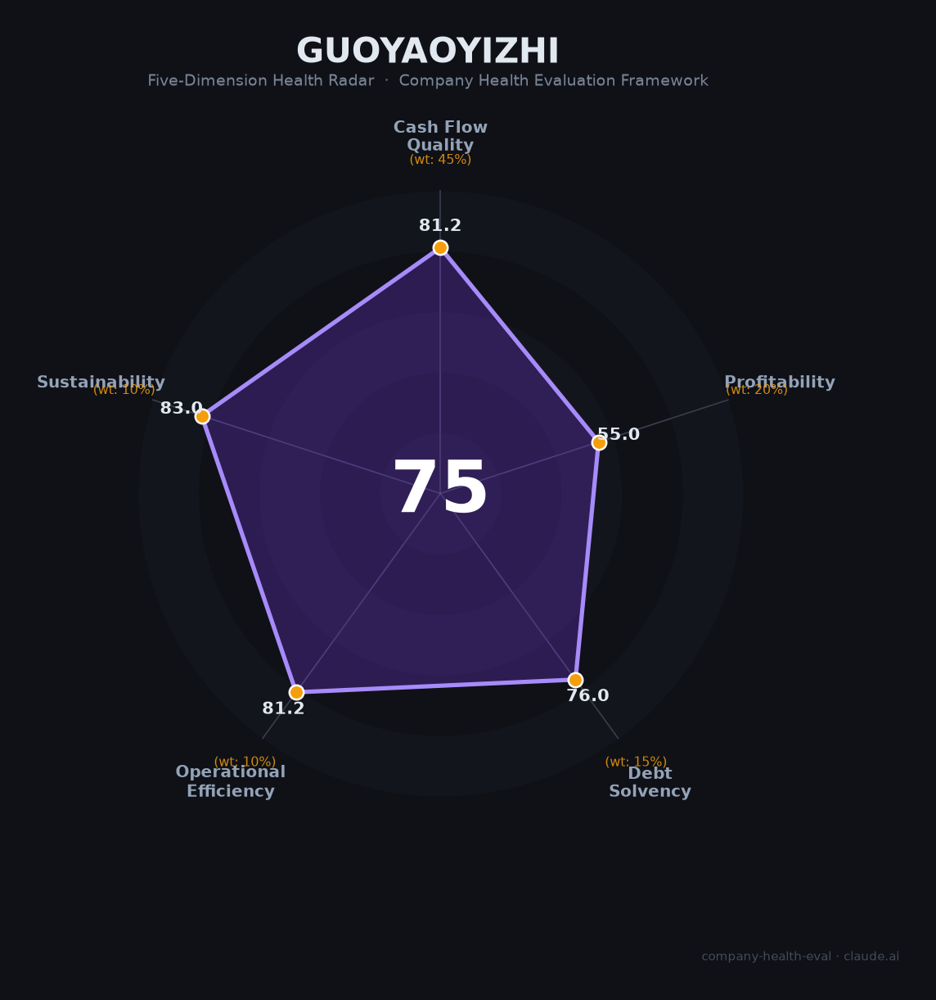

# 国药一致（000028.SZ）财务健康评估（2026-08-13）

## 一句话结论

🟡 **中等偏上（75/100）** | 医药分销零售龙头——营收734.2亿+归母净利11.4亿（+76.8%）盈利修复，公司分销+零售双轮，稳健国企平台

---

## 一、公司基本画像

| 项目 | 内容 |
|------|------|
| 主体 | 🔒 国药集团一致药业股份有限公司，A股：000028.SZ；国药集团旗下华南医药分销零售平台 |
| 主营 | 医药分销+医药零售（国大药房） |
| 财务 | 🔒 2025营收734.2亿（-1.3%）；归母净利11.4亿（+76.8%）；约3.5万员工 |
| 盈利 | 毛利率约7%、净利率约1.5% |

## 二、五维财务健康评估

### 1. 现金流质量（81/100）| 权重45%
医药分销现金流稳健（国企+账期），健康。

### 2. 盈利能力（55/100）
归母净利11.4亿（+76.8%）盈利修复，净利增长明显；但分销毛利薄（7%）、净利率仅1.5%。

### 3. 偿债能力（76/100）
国企信用+分销账期，偿债稳妥。

### 4. 运营效率（81/100）
分销网络/零售（国大药房）成熟，运营高效。

### 5. 可持续发展（83/100）
医药分销+零售长期稳定赛道，国药集团背书，集采/价格下行是关注点。

## 三、综合评分

| 维度 | 得分 | 权重 | 加权 |
|------|:----:|:----:|:----:|
| 现金流质量 | 81.2 | 45% | 36.5 |
| 盈利能力 | 55.0 | 20% | 11.0 |
| 偿债能力 | 76.0 | 15% | 11.4 |
| 运营效率 | 81.2 | 10% | 8.1 |
| 可持续发展 | 83.0 | 10% | 8.3 |
| **综合** | **75** | 100% | 75.4 |

**评级：🟡 中等偏上** — 医药分销国企龙头，盈利修复稳健。

## 四、核心风险
1. 分销低毛利，净利率仅1.5%。
2. 医药分销/集采/价格政策。
3. 账期与回款。

## 五、求职/择业视角
- 优势：国药集团央企平台、医药分销/零售双轮、稳定。
- 短板：分销毛利薄、薪酬弹性一般、零售条线强度。

**结论**：适合追求医药分销/零售+国企稳定平台的求职者，非高增长但极稳健。

---

*评估方法：商泰汽车（iAUTO）五维健康度框架 · 数据截至2026年8月 · 来源国药一致2025年报*