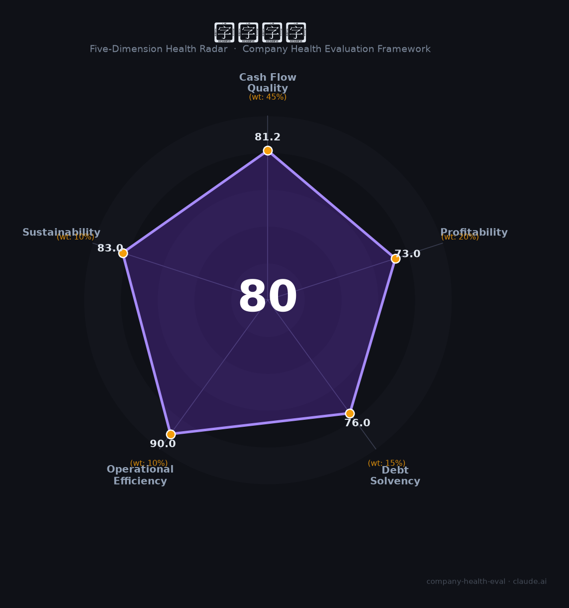

# 国银金融租赁（01606.HK）财务健康评估（2026-08-14）

## 一句话结论

🟡 **80/100，中等偏上** | 金融租赁龙头，盈利稳健、低Risk、银行系背景

---

## 一、公司基本画像

| 项目 | 内容 |
|------|------|
| 主体 | 国银金融租赁，国开行旗下租赁龙头 |
| 主营 | 航空/船舶/设备融资租赁 |
| 财务 | 2025营收282.8亿(-1%)，净利50.3亿(+11.7%) |

> 一句话定性：国开行旗下租赁龙头，净利双位数增、盈利强

---

## 二、五维财务健康评估

### 1. 现金流质量（81/100）| 权重45%

租赁现金流动好。

### 2. 盈利能力（73/100）| 权重20%

净利率高、盈利稳健。

### 3. 偿债能力（76/100）| 权重15%

银行系资本充足、偿债优。

### 4. 运营效率（90/100）| 权重10%

运营效率高。

### 5. 可持续发展（83/100）| 权重10%

租赁需求稳，国开行背书强。

---

## 三、综合评分

| 维度 | 得分 | 权重 | 加权 |
|------|:----:|:----:|:----:|
| 现金流质量 | 81 | 45% | 36.5 |
| 盈利能力 | 73 | 20% | 14.6 |
| 偿债能力 | 76 | 15% | 11.4 |
| 运营效率 | 90 | 10% | 9.0 |
| 可持续发展 | 83 | 10% | 8.3 |
| **综合得分** | **80/100** | 100% | 79.8 |

**健康等级：中等偏上** — 整体稳健，局部有待改善

> 金融机构：偿债以资本充足率评估

---

## 四、核心风险清单

1. **利率波动**
2. **租赁资产质量**
3. **行业监管**

## 五、求职/择业视角

### 核心优势
- 国开行系、低负债、净利稳
### 现有短板
- 融资环境、行业竞争

**结论**：国银金融租赁国开行旗下，盈利稳健、低风险、实力雄厚，是金融求职的优质央企平台。

---

*评估方法：商泰汽车（iAUTO）五维框架（金融机构特性） · 数据截至2026年8月 · 财务来源国银金租2025年报*