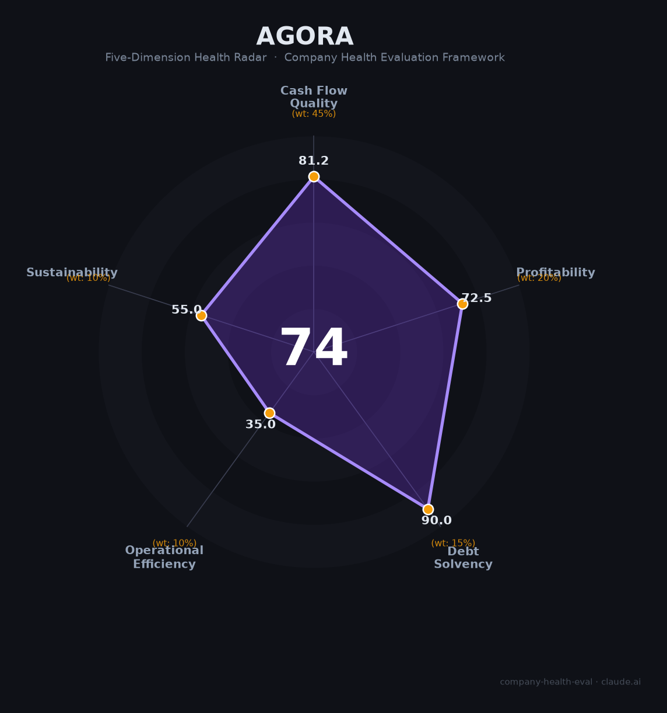

# 声网（Agora, NASDAQ: API）财务健康评估（2026-06-12）

## 一句话结论

🟡 **中等偏上（73.5/100）** | 现金充裕+首次盈利+Voice Agent新引擎，但连续4年裁员58%、中国区持续萎缩、竞争格局恶化

## 一、公司基本画像

| 维度 | 内容 |
|------|------|
| **主体** | Agora, Inc.（开曼注册），国内运营：上海兆言网络科技有限公司 |
| **成立** | 2013年11月（硅谷创立），2020年6月纳斯达克上市（IPO $20/股） |
| **创始人** | 赵斌（Tony Zhao），北大无线电学士，前YY CTO、WebEx创始工程师 |
| **股权** | 赵斌持股27%（84.4%投票权），双重股权结构（A类1票/B类20票） |
| **员工** | ~543人（2025年末，从2021年峰值1,311人累减58%） |
| **主营** | RTE PaaS（实时互动平台即服务），SD-RTN全球200+节点，端到端<400ms延迟 |
| **定位** | 中国实时音视频通信云市场第一（IDC 2024），全球上市RTC独立厂商 |
| **融资** | 累计融资约$240M（不含IPO），2026年6月市值约$3.2亿（峰值$100亿→蒸发97%） |
| **2025年重大变化** | 终止VIE结构、GAAP首次全年盈利、Conversational AI Engine发布、CTO钟声离职 |

声网是从$100亿峰值跌至$3.2亿的「失落巨头」，但2025年实现扭亏为盈，Conversational AI / Voice Agent是其从谷底反弹的核心引擎。

## 二、五维财务健康评估

### 1. 现金流质量（81.2/100）

| 指标 | FY2023 | FY2024 | FY2025 | 判定 |
|------|--------|--------|--------|------|
| 经营现金流净额 | -$13.6M | -$14.1M | +$27.2M | ⚠️ 关注（时正时负） |
| 现金及等价物 | — | $363.8M | $374.9M | ✅ 健康（覆盖3.5年+运营） |
| 有息负债 | — | $50.1M | $82.3M | ✅ 健康（净现金$292M+） |
| 净现比 | - | - | 2.85x | ✅ 健康（OCF/NI >1） |

**解读**：声网的现金流结构呈现鲜明的「V型反转」。2023-2024年经营现金流连续为负（合计-$27.7M），2025年大幅转正至+$27.2M——远超净利润$9.5M，利润含金量高。$3.75亿现金储备是最大安全垫，即使零收入也足以支撑3.5年以上运营。净现金头寸约$2.92亿，可以说「手里有钱，心里不慌」。唯一短板：经营现金流尚未连续3年为正，需2026-2027年持续验证。

### 2. 盈利能力（72.5/100）

| 指标 | FY2023 | FY2024 | FY2025 | 判定 |
|------|--------|--------|--------|------|
| 毛利率 | 63.2% | 64.1% | 66.4% | 🏆 优秀（行业75分位+） |
| 净利率 | -61.6% | -32.0% | +6.8% | ✅ 良好（5-15%区间） |
| 营收增速（3Y CAGR） | — | — | -2.2% | ⚠️ 一般（趋势反转中） |
| 研发费用率 | 54.9% | 60.3% | 39.3% | ✅ 良好（回落中，已盈利） |
| 人均产出 | $141K | $169K | $232K | ✅ 良好（改善显著） |

**解读**：毛利率连续三年攀升（63.2%→66.4%），在同业中处于领先（Twilio FY2025仅48.9%，含低毛利SMS业务）。FY2025是自2018年以来首次全年GAAP盈利（$9.53M），标志着从「烧钱换增长」向「盈利优先」的战略转型完成。但需注意：盈利主要靠成本削减（研发费用同比-31%、管理费用-31%）而非收入爆发，属于「收缩型盈利」。营收3年CAGR为-2.2%（FY2022 $151M→FY2025 $141M），但2025年单年+5.9%且逐季加速（Q1 2026 +13.5%），拐点已现。

### 3. 偿债能力（90.0/100）

| 指标 | 数值 | 判定 |
|------|------|------|
| 资产负债率 | 22.0% | ✅ 健康（<40%） |
| 有息负债率 | 11.4%（占资产） | ✅ 健康（<20%） |
| 流动比率 | ~5x（估算） | ✅ 健康（>2） |
| 现金比率 | ~5x | ✅ 健康（>1） |
| 股权质押 | 无公开质押 | ✅ 健康 |

**解读**：声网的资产负债表极为干净——22%资产负债率在科技公司中属于极低水平，$3.75亿现金完全覆盖$0.82亿有息负债。即使极端压力情景下（全年零收入+$1亿营业亏损），现金跑道仍超3年。这是声网财务上最强的维度。

### 4. 运营效率（35.0/100）

| 指标 | 现状 | 判定 |
|------|------|------|
| 客户集中度 | 历史教育客户25%（双减冲击后分散），现较多元 | ⚠️ 关注 |
| 员工规模趋势 | 1,311→543人，累减58%，每年裁20%+ | 🔴 危险 |
| 高管稳定性 | CTO钟声2025年8月离职，CEO赵斌在位 | ⚠️ 关注 |

**解读**：运营效率是声网最大的硬伤。2022-2025年连续4年裁员（2022年-24%、2023年-21%、2024年-23%、2025年-11%），从1,311人砍至543人。虽然换来了盈利，但「收缩型」模式不可持续——持续的人才流失可能侵蚀长期研发底蕴。CTO钟声（联合创始人）2025年8月离职是核心人才损失的标志性事件。客户集中度在2021年双减冲击后已显著改善（教育占比从25%大幅下降），但海外业务成为「增长单一引擎」带来新的集中风险。

### 5. 可持续发展（55.0/100）

| 指标 | 现状 | 判定 |
|------|------|------|
| 行业赛道 | AI Voice Agent市场CAGR 30-40%，CPaaS市场CAGR 20-33% | ✅ 健康 |
| 技术壁垒 | RTC技术正被云巨头商品化，1-3年壁垒 | ⚠️ 关注 |
| 客户多元化 | 3,961活跃客户，覆盖社交/教育/游戏/IoT/金融等10+行业 | ✅ 健康 |
| 融资/资本支持 | NASDAQ上市+$3.75亿现金+$200M回购计划 | ✅ 健康 |
| 政策/监管风险 | VIE历史遗留+中概股监管+数据合规+美国NPE专利诉讼 | ⚠️ 关注 |

**解读**：Voice Agent赛道是声网最大的结构性机遇——AI语音代理市场CAGR 30-40%，声网Conversational AI Engine使用量每季度翻倍增长，Agent Studio无代码平台（2026年3月发布）进一步降低开发者门槛。但RTC核心技术的壁垒正在被云巨头（腾讯TRTC/阿里云RTC/火山引擎）以「打包赠送」模式侵蚀——声网虽仍居中国RTC市场第一，但份额持续被蚕食。2025年1月终止VIE结构是一个积极信号，但2025-2026年两起美国NPE专利诉讼增加了法律不确定性。

## 三、综合评分与健康等级

| 维度 | 得分 | 权重 | 加权得分 |
|------|:----:|:----:|:--------:|
| 现金流质量 | 81.2 | 45% | 36.5 |
| 盈利能力 | 72.5 | 20% | 14.5 |
| 偿债能力 | 90.0 | 15% | 13.5 |
| 运营效率 | 35.0 | 10% | 3.5 |
| 可持续发展 | 55.0 | 10% | 5.5 |
| **综合得分** | | | **73.5** |
| **健康等级** | | | **🟡 中等偏上** |

## 四、同业对标

| 对比项 | 声网（Agora） | Twilio | 即构（ZEGO） |
|--------|:------------:|:------:|:-----------:|
| 上市/融资 | NASDAQ上市 | NYSE上市 | 未上市 |
| FY2025营收 | $141.1M | $5.07B | 未公开 |
| 毛利率 | 66.4% | 48.9% | — |
| 净利率（GAAP） | +6.8% | +0.67% | — |
| 员工规模 | ~543人 | ~5,500人 | — |
| 市值 | ~$3.2亿 | ~$100亿+ | — |
| 核心差异 | 纯RTC PaaS，中国第一 | 广义CPaaS，SMS为主 | 国内竞品，RTC第二梯队 |

**对标结论**：声网在纯RTC领域的毛利率显著优于Twilio（受益于无低毛利SMS业务拖累），但营收规模仅为Twilio的1/36，且面临中国云巨头「免费赠送RTC」的降维打击。在中国RTC市场中仍居第一，但领先优势在缩小。

## 五、核心风险清单

1. **持续收缩风险（高）**：连续4年裁员58%，「收缩型盈利」不可持续。若收入增长无法接棒成本削减，2026-2027年将面临「砍无可砍」的困境。
2. **竞争格局恶化（高）**：腾讯云TRTC/阿里云RTC/火山引擎以打包赠送模式蚕食市场，声网RTC技术壁垒正在被商品化。
3. **单一引擎依赖（中高）**：海外Agora品牌（+16.1%）和Conversational AI是唯二增长引擎，中国区（声网品牌）仍在下滑（-3.5%）。
4. **人才流失（中高）**：CTO钟声2025年8月离职，「大牛走得快」的口碑，竞业协议争议加剧人才外流。
5. **专利诉讼（中）**：2025-2026年两起美国NPE专利诉讼（ContentNexus LLC），虽为「专利流氓」性质但法律成本不可忽视。
6. **VIE/中概股监管（中）**：VIE已于2025年1月终止，但中美地缘政治风险仍可能影响美股流动性和估值。

## 六、求职/择业视角

### 核心优势
- **现金安全垫厚**：$3.75亿现金→即使极端情况，1-2年内无倒闭风险
- **Voice Agent赛道红利**：Conversational AI方向技术积累有市场价值，经验可迁移
- **技术品牌尚存**：中国RTC第一的技术品牌，简历有一定辨识度
- **上海杨浦**：候选人在上海，通勤便利（浦东→杨浦约30-40分钟）

### 现存短板
- **薪酬上限**：2025年招聘薪资区间25-50K×15薪（约38-75万年薪），低于一线大厂
- **品牌背书弱**：市值从$100亿跌至$3.2亿，「失落巨头」标签影响跳槽议价
- **职业天花板**：543人小公司+扁平结构→晋升通道窄，业务线单一
- **人员稳定性极差**：连续4年每年裁20%+→随时可能被优化
- **竞业协议**：脉脉多有提及对普通员工使用竞业限制

### 分场景建议

| 个人诉求 | 推荐程度 | 理由 |
|----------|:--------:|------|
| 稳定+深耕 | ⚫ 不推荐 | 4年裁员58%，稳定性极差 |
| 高薪+跳板 | 🟠 可考虑 | Voice Agent经验有迁移价值，但薪资上限有限 |
| 成长+赛道红利 | 🟡 推荐 | Conversational AI/Voice Agent是明确风口 |
| 多元+跨领域 | ⚫ 不推荐 | 业务线单一，跨领域机会少 |

## 七、总结

声网是RTE/CPaaS领域「技术积累深厚、现金流充裕，但面临战略收缩和竞争围剿」的公司：$3.75亿现金储备和最干净的资产负债表是其最大安全垫，Conversational AI/Voice Agent提供了真实的第二增长曲线；唯一短板是连续4年58%的人员缩减——「收缩型盈利」能否转化为「增长型盈利」，取决于2026-2027年AI引擎的商业化速度。

在当前「Voice Agent赛道爆发+中概股估值低迷」的双重背景下，声网属于🟡 **中等偏上**，适合**看好AI语音代理方向、能承受较高职业不确定性**的求职者的选择性机会——不是安全牌，但可能是一张有赔率的牌。

---

*评估日期：2026-06-12 | 数据截至：FY2025年报（2026年4月15日提交20-F）+ Q1 2026财报（2026年5月26日发布）*
