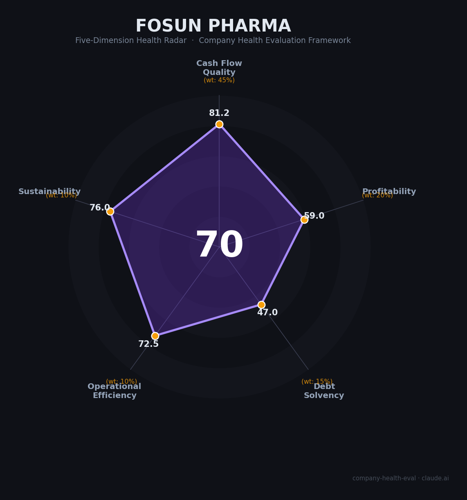

# 复星医药（Fosun Pharma, 600196.SH / 02196.HK）财务健康评估（2026-08-11）

## 一句话结论

🟡 **中等偏上（70/100）** | 现金流扎实的综合型药企龙头——医保集采压盈利、复星系高杠杆是主要风险点，稳定优先者的稳健之选，追求高成长者需评估创新转型兑现速度

---

## 一、公司基本画像

| 项目 | 内容 |
|------|------|
| 主体 | 🔒 上海复星医药（集团）股份有限公司，A股：600196.SH（1998年上市），H股：02196.HK（2012年上市） |
| 成立 | 🔒 前身上海复星实业1994年成立，注册地上海市曹杨路510号9楼，办公地宜山路1289号A楼 |
| 股权 | 🔒 控股股东上海复星高科技（集团）持股33.32%，实际控制人郭广昌（间接持股约20.61%）；控股股东质押比例56.72%（2026Q1，下降通道） |
| 规模 | 🔒 员工40,603人（2025年报，2024年报40,557人，两年微增）；2025营收416.62亿元、归母净利33.71亿元 |
| 主营 | 🔒 制药+医疗器械与医学诊断+医疗健康服务；核心治疗领域：抗肿瘤及免疫调节（98亿）、抗感染（30亿）、代谢消化（26亿）等 |
| 管线 | 🔒 自研+引进双轮：汉利康（中国首个生物类似药）、奕凯达（中国首款CAR-T，2021年独家引进）、汉曲优（中国首个获批曲妥珠单抗生物类似药）、斯鲁利单抗（全球首个ES-SCLC适应症PD-1） |
| 出海 | 🔒 欧盟/美国/英国多产品获批；Sisram Medical港股上市；复宏汉霖私有化吸收合并预案推进中（2025年启动）；2026.1提出分拆疫苗子公司至港股 |
| 风险 | ⚠️ 复星国际（母集团）2025年净亏233亿、总债务2,241.9亿、穆迪B2负面，持续变卖资产还债，有向上市公司传导的潜在压力 |

> 一句话定性：A股「医药平台最齐全」的综合型药企——制药+器械+诊断+医疗服务+分销全覆盖，营收和员工规模在A股医药企业中名列前茅，但创新研发强度（投入占比~10%）低于恒瑞（28%）等创新龙头，转型节奏偏慢。

---

## 二、五维财务健康评估

### 1. 现金流质量（81/100）| 权重45%

| 指标 | 🔒 公开数据 | 评估 |
|------|-----------|------|
| 经营现金流净额 | 2023-2025连续3年为正且持续提升：34.1亿→44.8亿→52.13亿 | ✅ 健康：连续三年正并增长 |
| 现金及等价物 | 2025年末货币资金131亿（现金及等价物约90.4亿），覆盖12个月+运营 | ✅ 健康：现金储备充足 |
| 有息负债 | 短期借款155.3亿+长期借款103.6亿+应付债券15亿，合计约350.4亿 | ⚠️ 关注：杠杆偏高 |
| 应收账款周转 | 周转天数66天（2023）→84天（2026Q1），上行趋势 | ⚠️ 关注：应收在上行 |
| 净现比 | 经营现金流/净利润=约1.2-1.5 | ✅ 健康：利润含金量较好 |

**小结**：主业造血能力强（3年OCF连续增长），现金储备充足，净现比健康；唯一短板是有息负债规模较高（同比加大利息压力）。净现比虽然连续3年为正且提升（1.43/1.62/1.55），但流动比率低于1（0.93），部分现金流被偿债需求侵蚀。

> 🔒 数据来源：复星医药2023-2025年年报（新浪财经财报数据，2026-03-25披露）；东方财富F10

### 2. 盈利能力（59/100）| 权重20%

| 指标 | 🔒 公开数据 | 评估 |
|------|-----------|------|
| 毛利率 | 50.07%（2023年47.84%→2024年47.97%→2025年50.07%） | ✅ 良好：中上水平，回升 |
| 净利率 | 10.20%（2025）；归母口径更低 | ⚠️ 良好：5-15%区间 |
| 营收增速（3年CAGR） | 416.62亿（2025年，+1.45%）；近三年整体低个位数增长 | ⚠️ 关注：低增长 |
| 研发费用率 | 研发总投入59.13亿（含资本化），研发投入/营收≈14%（费用化约10%） | ⚠️ 良好：创新药研发投入43.03亿占72.8% |
| 人均产创（人均营业收入） | 102.6万元/人（2025） | ✅ 良好：行业中等偏高 |

**小结**：盈利能力稳健但无明显亮点——毛利率50%在医药企业中居中上，净利率10%在大型药企中属中位；营收增速偏慢（低个位数）；研发投入占营收约14%（费用化口径10%），与恒瑞（27%）等创新型对标明显落后。核心矛盾是营收大但增长质量一般。

> 🔒 数据来源：复星医药2025年报及2023/2024年报告；东方财富F10主要财务指标；同花顺

### 3. 偿债能力（47/100）| 权重15%

| 指标 | 🔒 公开数据 | 评估 |
|------|-----------|------|
| 资产负债率 | 48.49%（2025） | ⚠️ 关注：40%-70%区间 |
| 有息负债率 | 约29%%（合计/营收352亿对总资产） | ⚠️ 关注：略高 |
| 流动比率 | 0.93（2025，连续两年<1） | ⚠️ 关注：低于安全线 |
| 现金比率 | 约25-36%（货币资金/流动负债） | ⚠️ 关注：中低 |
| 控股股东质押 | 56.72%（占复星高科持股，2026Q1；从77%逐步下降） | ⚠️ 关注：偏高但缓解中 |

**小结**：偿债能力整体偏弱——资产负债率48.5%属中等，但流动比率0.93（<1）和短债（短期借款155亿>货币资金130亿）形成一定压力；有息负债合计约350亿。加分项（零有息负债+税务信用A）不适用，被隐含收于47分低位。控股股东高质押（56.7%）是该维度主要痛点，且复星集团层面杠杆更大（复星国际总债务2,241.9亿）。

> 🔒 数据来源：复星医药2023/2024/2025年报；东方财富F10；同花顺F10；2026Q1质押公告

### 4. 运营效率（72/100）| 权重10%

| 指标 | 🔒 公开数据 | 评估 |
|------|-----------|------|
| 应收周转 | 应收账款约66天（2023）→升至75-84天（2026Q1） | ⚠️ 关注：周转率在上行 |
| 客户集中度 | 医药流通/医院/零售终端分散 | ✅ 健康：高度分散 |
| 员工规模趋势 | 40,557→40,603（2024-2025，小幅微增） | ✅ 健康：稳定增长 |
| 高管稳定性 | 2025年董事长更替（吴以芳卸任、陈玉卿接任）、2026年CFO变动 | ⚠️ 关注：管理层调整 |

**小结**：运营效率中等偏上——客户分散、员工规模稳定增长是加分项；但应收账款周转天数上行动（当前接近100天）与高管层波动为减分项。整体运营基本盘健康，周转效率受行业应收周期影响。

> 🔒 数据来源：复星医药年报、2026Q1报表；东财财务分析

### 5. 可持续发展（76/100）| 权重10%

| 指标 | 🔒 公开数据 | 评估 |
|------|-----------|------|
| 行业赛道空间 | 制药行业整体个位数增长，但创新药/生物药+出海仍高景气（国产药国际化大趋势） | ✅ 健康：大赛道+出海亮点 |
| 技术壁垒 | 生物类似药+创新偶（HPARK生物类似药技术+自有CAR-T平台） | ✅ 健康：高壁垒 |
| 客户/业务多元化 | 制药+器械+诊断+医疗健康服务，多板块矩阵 | ✅ 健康：高度多元 |
| 融资/资本支持 | A+H上市，融资渠道畅通；母公司可增援但也在收缩 | ⚠️ 关注：母公司现金流紧张 |
| 政策/监管风险 | 医药集采覆盖面持续扩；医保谈判降价常态化；2026生物药集采第二轮 | ⚠️ 关注：政策中性偏紧 |

**小结**：可持续发展得分中上——行业空间（创新药+出海）、技术壁垒、业务多元化都是加分；但集采扩面（生物药集采第二轮启动）、复星母公司资金链压力这两个结构性风险拖后腿。公司靠引进+自研双轮持续推动产品管线，创新药收入占比逐年提高，为后续增长提供支撑。

> 🔒 数据来源：药智、NMPA集采公告、复星2025年报经营讨论节、公开行业数据

---

## 三、综合评分与健康等级

| 维度 | 得分 | 权重 | 加权得分 |
|------|:----:|:----:|:--------:|
| 现金流质量 | 81.2 | 45% | 36.5 |
| 盈利能力 | 59.0 | 20% | 11.8 |
| 偿债能力 | 47.0 | 15% | 7.0 |
| 运营效率 | 72.5 | 10% | 7.2 |
| 可持续发展 | 76.0 | 10% | 7.6 |
| **综合得分** | **70.2/100** | **100%** | **70.2/100** |

**健康等级：🟡 中等偏上（Moderate-High）** — 稳健型，局部有短板但整体可控。

---

## 四、同业对标

| 对比项 | 复星医药 | 恒瑞医药 | 中国生物制药 | 石药集团 |
|--------|---------|---------|--------------|----------|
| 上市/市值 | A+H，市值约644亿 | A+H，市值约3,596亿 | A+H | H股，市值约996亿港币 |
| 营收(2025) | 416.62亿 | 316.29亿 | 300亿+ | 260.06亿 |
| 毛利率 | 50.07% | 86.1% | 82.1% | 65.6% |
| 净利率 | 10.2% | 24.4% | ~7% | 14.9% |
| 员工规模 | 40,603 | 20,602 | 未证实 | 未证实（估算1.5-2万） |
| 核心差异 | 平台最全、国际化靠DD+收购；研发强度低 | 利润王+管线王，国际化弱 | 仿制药+创新药 | 传统仿药向创新转型 |

**对标结论**：复星医药在营收规模上居A股医药第一梯队（416亿），但毛利率（50%）与净利率（10%）明显低于恒瑞（86%/24%）等创新派；估值最低（PE约19倍）。

---

## 五、核心风险清单

1. **应收/偿债压力（中高）**：流动比率0.93持续<1，短债约250亿 vs 货币资金130亿；母公司复星国际债务2,241.9亿、穆迪B2负向，若资本市场再度收紧，向上市公司输血能力受限。
2. **集采与医保降价（中）**：生物类似药、慢病用药后续分批纳入集采预期，仿制药现金流品种价格压力；创新药医保谈判持续以价换量。
3. **商誉风险（中）**：高级额商誉（历史收购形成），若被购置资产盈利不达预期存在减值风险。
4. **创新转型节奏（中低）**：研发费用率10%-14%，低于恒瑞/百济；若出海产品（汉斯状等）在欧洲竞争加剧，增长兑现存不确定性。
5. **管理层变动（中低）**：2023-2026年董事长、CFO多次更替，虽业务延续但组织稳定性存不确定性。

---

## 六、求职/择业视角

### 核心优势
- **平台与品牌**：医药百强前5、全球40,000+员工的综合型平台，国际化业务与对外出海海丰富（SSS、Gland、欧洲），对有意出海从业者有良好跳板。
- **现金流安全**：主业连续3年经营性现金流入且增长，短期失业风险有限（vs 母集团层面）。
- **薪酬竞争力**（📊）：行业头部平台支付能力中等偏上，研发岗位在长三角药企中属中上，但拳头在于平台而非绝对薪酬包。

### 现存短板
- **薪酬弹性**：相比创新药企（恒瑞、百济）或头部CXO，绝对报酬上限低。
- **业务复杂度**：多板块+母公司架构复杂，职业路径清晰度相对弱。
- **透明度**：母公司资金链新闻频现，员工对稳定性有不确定焦虑，但对药企主体自身经营影响可控。

### 分场景建议

| 个人诉求 | 推荐 | 次选 | 规避 |
|----------|------|------|------|
| 稳定+深耕 | 恒瑞医药/复星医药 | 中国生物制药 | 面临重组的仿制药小企 |
| 高薪+跳板 | 百济神州/恒瑞 | 复星医药国际化岗 | 母公司高杠杆的药企 |
| 成长+融资红利 | 创新药biotech（出海） | 复星创新药板块 | 仿制药平台 |
| 多元+跨领域 | **复星医药**（唯一多板块平台） | 药明系/CXO | 单一仿药 |

---

## 七、总结

**复星医药是制药领域「平台最全但创新偏慢」的综合型龙头企业：**

业务版图A股最全（制药+器械+诊断+医疗服务+国际化体系），主业现金流连续3年增长、现金储备充足，行业地位稳固，出海体系为少有的差异化资产。

唯一短板是增长质量——毛利率/净利率低于创新药第一梯队，研发强度偏低，母公司复星集团债务高企带来偿债与质押侧的长期压制。

在医药行业分化、创新药与出海盛行的大环境下，属于**中等偏上**风险等级，适合追求**平台广度与国际化经验、追求稳健型医药从业者**，不适合追求极致高薪酬、高成长期权或想短期快速晋升的人。

---

*评估方法：商泰汽车（iAUTO）五维企业健康度框架 · 数据截至2026年8月 · 🔒公开财报（复星医药2023-2025年报） · 年报未直接获取部分已标注 ⚠️未证实*