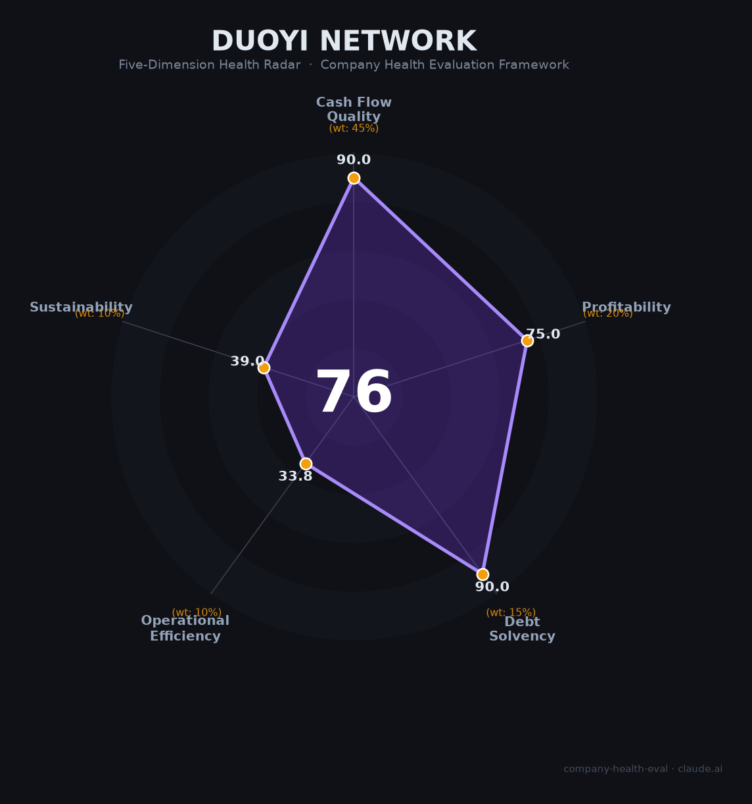

# 多益网络（Duoyi Network）财务健康评估（2026-07-07）

## 一句话结论
🟡 **中等偏上 · 综合得分 76/100** | 高现金流+零负债的神武IP现金牛，但创始人极端言论+批量裁员+IPO两次失败+极度集中股权导致长期不确定性极高。

---

## 一、公司基本画像

| 项目 | 详情 |
|------|------|
| **运营主体** | 广州多益网络股份有限公司（2006年成立） |
| **创始人/实控人** | 徐波（又名徐宥箴），持股99.5%以上，100%控股 |
| **核心管理层** | 徐波（CEO/绝对控制人）；无公开知名核心高管 |
| **员工规模** | 高峰期~3,000人，2024-2025年大规模裁员，当前存疑 |
| **主营业务** | MMORPG研发与运营（神武/幻唐志系列为主） |
| **代表作品** | 《神武》系列（端游+手游）、《幻唐志》、《梦想世界》 |
| **融资状态** | 未上市（A股IPO 2016年主动撤回，港股IPO 2018年失效），无外部融资 |
| **估值** | 不详（2024年胡润275亿人民币→2025年落榜） |
| **2015-2017年营收（招股书）** | 16.3亿→15.5亿→19.3亿人民币 |
| **2017年净利率** | ~52%（10.1亿净利润/19.3亿收入） |

**一句话定性**：多益网络是中国游戏行业最独特的存在——创始人徐波99.5%绝对控股，以老牌MMORPG神武IP实现"零负债+高利润+高分红"的极致运营，但极端言论、劳动纠纷、IPO失败、批量裁员等问题使其成为**国内风险最高的游戏雇主之一**。

---

## 二、五维财务健康评估

### 1. 现金流质量（90/100）🟢

| 评估指标 | 状态 | 判断 | 依据 |
|----------|------|------|------|
| 经营现金流净额 | 历史数据极强 | 🟢 健康 | 📊 2015-2017年OCF合计36.5亿，净现比>1.2；近零营销费用（<0.5%收入），现金转化能力极强 |
| 现金及等价物 | 覆盖12个月+运营 | 🟢 健康 | 📊 2015-2017年合计分红36.8亿后仍有充足现金；私企零负债运营，现金储备充足 |
| 有息负债 | 0 | 🟢 健康 | 🌐 所有公开资料均为零负债；无银行贷款、无债券、无外部融资 |
| 应收周转天数 | 极短 | 🟢 健康 | 📊 游戏点卡/平台结算模式，应收账款风险极低；无渠道代理，100%直营 |
| 净现比 | >1.2 | 🟢 健康 | 📊 近零营销费用意味着运营利润几乎全部转化为现金流 |

**本维度分析**：多益是行业内现金流最健康的公司之一。零负债、零外部融资、近零营销费用的"三零"模式创造了极高的现金转化率。2015-2017三年合计净利润28.9亿，分红36.8亿（超额分红说明账面现金极其充裕）。即使在2024-2025年经营恶化后，历史积累的现金储备也应能支撑公司2-3年运营。但⚠️ 数据来源为2015-2017年IPO招股书，此后7年无公开财务数据。

**扣分项**：近7年无公开财务数据，高分基于历史表现推算，实际状况可能存在偏差。

---

### 2. 盈利能力（75/100）🟡

| 评估指标 | 状态 | 判断 | 依据 |
|----------|------|------|------|
| 毛利率 | 历史98%+ | 🟢 优秀 | 📊 2017年毛利率98.4%，自研自发无渠道分成，行业顶级 |
| 净利率 | 历史~52% | 🟢 优秀 | 📊 2017年净利率52.4%（10.1亿/19.3亿），近零营销费用+零负债利息 |
| 营收增速 | 3年CAGR~9%（2015-2017），此后很可能为负 | 🔴 预警 | 📊 2015→2017从16.3亿→19.3亿，但此后无新爆款；2025年新游戏（超能激斗、筑城与探险）iOS合计月收入<10万美元 |
| 研发费用率 | 估50%+ | 🟠 预警 | 📊 自研引擎+80%研发人员占比，但无新爆款产出意味着高研发投入未转化为收入 |
| 人均产出 | 估~64万/人（3,000人规模） | 🟡 良好 | 📊 2017年19.3亿/3,000人=64万，显著低于米哈游（~400万/人）等可比公司 |

**本维度分析**：多益的盈利质量呈现"剪刀差"——存量业务（神武IP）毛利率极高，但增量业务（新游戏）全面溃败。2015-2017年的高利润（净利率52%）是基于神武IP巅峰期的表现。2024-2025年多款新游戏iOS月收入合计不足10万美元，说明公司已丧失产品创新能力。

**扣分项**：无新爆款 + 神武IP生命周期已超12年（MMO典型生命周期5-8年），收入下滑趋势明确。

---

### 3. 偿债能力（90/100）🟢

| 评估指标 | 状态 | 判断 | 依据 |
|----------|------|------|------|
| 资产负债率 | <20%（历史） | 🟢 健康 | 📊 历史数据零负债，资产负债率极低 |
| 有息负债率 | 0% | 🟢 健康 | 🌐 无银行贷款、无债券、无外部融资 |
| 流动比率 | >5（推算） | 🟢 健康 | 📊 大量现金+零流动负债 |
| 现金比率 | >3（推算） | 🟢 健康 | 📊 基于历史分红能力推算 |
| 股权质押比例 | 0%（徐波100%持股，无质押记录） | 🟢 健康 | 🔒 无公开股权质押记录 |

**本维度分析**：这是多益最安全的维度——零有息负债、零外部融资、100%自有资金运营。即使业务严重萎缩，也无债务违约风险。对于求职者而言，公司短期内不会因债务问题倒闭。

**加分项**：零有息负债 + 零质押 + 零外部融资，偿债能力维度最高评级。

---

### 4. 运营效率（34/100）🔴

| 评估指标 | 状态 | 判断 | 依据 |
|----------|------|------|------|
| 应收周转 | 极短 | 🟢 健康 | 📊 直营模式（非渠道联运），应收账款风险极低 |
| 客户/产品集中度 | 神武/幻唐志IP贡献90%+ | 🔴 危险 | 📊 公司近90%收入来自单一IP，无替代品 |
| 员工规模趋势 | 2024-2025大规模裁员 | 🔴 危险 | 🌐 成都438→89人（2024年7月）、广州1000+人裁员（2025年6月）、计划搬离广州 |
| 高管稳定性 | 创始人徐波一人独裁 | 🔴 危险 | 🌐 徐波99.5%持股，无核心管理层、无董事会、无制衡机制 |

**本维度分析**：运营效率是多益最大的短板。三个危险信号：① 99.5%股权高度集中 → 决策完全依赖于徐波个人判断（且其已多次证明极端决策能力）；② 单IP依赖90%+ → 神武IP已运营12年进入衰退周期；③ 大规模裁员（1000+人）+跨省搬迁 → 团队士气崩塌，核心人才持续流失。

**扣分项**：创始人绝对集权（99.5%）+ 单IP依赖（90%+）+ 批量裁员（2024-2025合计1500+人），三个危险因素叠加。

---

### 5. 可持续发展能力（39/100）🔴

| 评估指标 | 状态 | 判断 | 依据 |
|----------|------|------|------|
| 行业赛道空间 | 中国游戏市场~3500亿（+7.7%），但多益主攻的回合制MMO细分在萎缩 | 🟠 预警 | 📊 玩家向MOBA/FPS/开放世界等品类迁移，神武代表的回合制MMO用户群持续缩小 |
| 技术壁垒 | 自研引擎+积累12年IP | 🟡 良好 | 🌐 拥有自研引擎和成熟技术栈；但UE5/Unity新世代技术布局未见披露 |
| 业务多元化 | 单IP+单品类，完全集中 | 🔴 危险 | 🌐 神武IP占90%+收入，且均为回合制MMO；新品类尝试均无起色 |
| 资本支持 | 两次IPO失败，无法通过资本市场融资 | 🔴 危险 | 🌐 2016年A股撤回、2018年港股失效；此后未再尝试；股权高度集中，无机构股东 |
| 政策/监管风险 | 极右言论+劳动纠纷=监管重点关注 | 🔴 危险 | 🌐 徐波公开诋毁女权、宣扬多妻制等极端言论可能引发监管介入；已有多起劳动仲裁/诉讼 |

**本维度分析**：可持续性是多益的第二个"重灾区"。两大核心问题：① 创始人风险——徐波的极端言论已远超"个人观点"范畴，可能构成社会风险和政治风险；② 行业趋势——回合制MMO品类正在消亡（2024年手游市场动作/RPG/射击类占75%+，回合制占比持续下降），多益作为"品类守墓人"前景堪忧。③ 资本市场彻底关闭——两次IPO失败后已7年未做融资尝试，公司再无资本补充渠道。

**扣分项**：创始人极端言论（政治+社会风险）+ 品类衰退（回合制MMO）+ 资本市场关闭（2次IPO失败），三重打击。

---

## 三、综合评分与健康等级

| 维度 | 得分 | 权重 | 加权得分 | 简评 |
|------|------|------|-----------|------|
|现金流质量| 90 |45%| 40.5 |历史数据极强（零负债+高分红），但7年数据黑箱|
|盈利能力| 75 |20%| 15.0 |存量利润率高，增量全面溃败|
|偿债能力| 90 |15%| 13.5 |零有息负债，偿债无压力|
|运营效率| 34 |10%| 3.4 |单IP依赖90%+创始人独裁+批量裁员，三杀|
|可持续发展| 39 |10%| 3.9 |创始人极端言论+品类衰退+资本关闭|
| **76/100** |**—**|**100%**|**76.3**|**🟡 中等偏上**|

**等级**：🟡 中等偏上（70-85分区间）
**含义**：财务层面看似稳健（零负债、高现金、历史高利润），但运营和可持续发展维度得分极低（34和39），揭示出深层治理危机——公司本质上依赖创始人的"单人决策"，一旦徐波判断失误或公司因极端言论遭遇监管打击，局面将迅速恶化。

---

## 四、同业对标

选择同为「MMO老牌游戏公司」的网龙和网易作为对标：

| 对比项 | 🎯 多益网络 | 🅰️ 网龙 (0777.HK) | 🅱️ 网易 (9999.HK) |
|--------|------------|-----------------|-----------------|
| 上市/融资状态 | **未上市**，IPO失败x2 | 已上市（港股） | 已上市（港股+美股） |
| 2024-2025年营收 | 📊 估算~¥10-15亿（自神武下滑） | ¥44.75亿（2025） | ¥1,126亿（2025） |
| 核心IP/产品 | 神武系列（12年，90%+） | 魔域系列（20年，87%） | 梦幻西游（25年，~75%毛利）+多品类 |
| 毛利率 | ~98%（历史） | ~56% | ~70%（游戏） |
| 创始人持股 | 徐波99.5% | 刘德建15.25% | 丁磊13.4% |
| 员工规模 | 3,000→~1,500（裁员中） | ~3,400 | ~25,400 |
| 2024年裁员 | 1500+人 | 未披露（AI替代200+） | 未大规模裁员 |
| 核心优势 | 零负债+高现金 | AI布局（200+AI员工） | 全品类+出海+净现金¥1,559亿 |
| 核心风险 | 创始人极端言论+单IP | 单IP依赖+现金跌破借款线 | 梦幻西游审美疲劳+新品断层 |

**对标结论**：多益和网龙有惊人的相似度——同为"旧时代MMO老厂"，同样依赖单IP（神武90%+ vs 魔域87%），同样面临品类衰退。但多益比网龙多了一个致命问题：创始人风险。网龙至少是上市公司、有透明财务和制衡机制，多益则是徐波99.5%的一人王国。

---

## 五、核心风险清单

按严重程度从高到低排列：

1. **🔴 创始人极端言论的政治/社会风险（高风险）**
   - 描述：徐波公开宣扬多妻制、反女权等极端言论，2018年曾被《人民日报》等官方媒体直接点名批评
   - 量化影响：一次官媒点名批评即可引发版号暂停发放、渠道下架等连锁反应，可能导致公司核心收入归零
   - 触发条件：徐波再次发表极端言论被广泛传播、监管对"有害内容"进行专项整治
   - 缓解因素：徐波近年已有所收敛，但本质未变

2. **🔴 单IP依赖90%+（高风险）**
   - 描述：神武/幻唐志系列贡献90%+收入，单一IP运营已超12年
   - 量化影响：若神武月流水从~1亿下降至5000万，公司年收入将腰斩至~6亿
   - 触发条件：回合制MMO用户持续流失、竞品（梦幻西游手游、问道等）挤压
   - 缓解因素：神武拥有12年积累的核心用户群，生命周期可能长于预期

3. **🔴 大规​​模裁员+搬离广州（高风险）**
   - 描述：2024年成都团队从438人裁至89人（劳动仲裁败诉后报复性裁员），2025年广州计划裁员1000+人并搬离广州
   - 量化影响：核心技术和运营团队持续流失，影响产品维护和新游戏开发能力
   - 触发条件：更多骨干员工主动离职、搬迁导致员工流失率>50%
   - 缓解因素：无——人才流失正在加速

4. **🟠 IPO两次失败，资本市场关闭（中高风险）**
   - 描述：2016年A股主动撤回IPO申请，2018年港股IPO招股书失效
   - 量化影响：无外部融资渠道，股权高度集中无法退出
   - 触发条件：现金流耗尽需要资本补充但无渠道
   - 缓解因素：历史积累的现金储备仍可支撑2-3年

5. **🟠 回合制MMO品类消亡（中高风险）**
   - 描述：回合制MMO在手游市场占比从2018年~20%下降至2025年~5%
   - 量化影响：品类大盘持续萎缩，用户获取成本上升，潜在新用户基本枯竭
   - 触发条件：品类自然衰退
   - 缓解因素：核心用户群忠诚度高，衰退速度可能较慢

---

## 六、求职/择业视角

> 以下分析基于网络公开信息和员工口碑，侧重求职者视角。

### 核心优势

| 维度 | 评估 |
|------|------|
| **稳定性** | 🔴 极差。连续两年大规模裁员（1500+人），劳动纠纷频发，2025年计划搬离广州，组织不确定性极高 |
| **技术/业务价值** | 🟡 有限。自研引擎+MMO开发经验有一定价值，但相比UE5/Unity等主流技术栈通用性较低 |
| **薪资竞争力** | 🟠 存疑。据网络口碑，薪资处于行业中下水平，2024年劳资纠纷暴露了公司对员工的恶劣态度（拒绝报销7元餐费、起诉离职员工等） |
| **品牌背书** | 🔴 负面。多益在行业口碑极差——"中国游戏四大恶人"之一，对职业发展无正面背书 |
| **工作强度** | 🟠 存疑。网络口碑显示公司管理混乱，制度严苛（如限制员工如厕时间等极端规定） |

### 现存短板

| 维度 | 评估 |
|------|------|
| **劳动环境** | 🔴 极差。多起劳动仲裁/诉讼、拒绝员工餐费报销（7元）、罚款制度、"合法方式处理懒散员工"百万悬赏——被媒体称为"游戏行业最恶劣雇主" |
| **管理文化** | 🔴 有毒。徐波按自己价值观"治厂"：禁止游戏内出现恋爱结婚内容（神武不允许玩家结婚、培养孩子）、强制996文化、员工被要求写"感恩日记" |
| **发展前景** | 🔴 堪忧。无新爆款（新游戏月入<10万美元）、核心IP衰退、两次IPO失败、人才持续流失 |
| **职业天花板** | 🔴 没有。创始人独裁，中层管理者无决策权；公司在行业地位边缘化，跳槽助力极弱 |

### 分场景建议

| 个人诉求 | 推荐 | 次选 | 规避 |
|----------|------|------|------|
| **稳定+长期** | 腾讯/网易/米哈游 | 莉莉丝/鹰角 | **多益网络 🔴** |
| **高薪+成长** | 米哈游/字节 | 网易/腾讯 | **多益网络 🔴** |
| **短期跳板** | 网易/莉莉丝 | 叠纸/鹰角 | **多益网络 🔴** |
| **技术积累** | 米哈游（UE5） | 网易（自研引擎） | **多益网络**（自研引擎通用性差） |

### 面试提醒
- ⚠️ **强烈不建议**参加多益网络的面试
- 如果确实要面试，注意：公司极度看重"价值观匹配"——徐波曾公开要求员工认同他的婚恋观
- 面试通过率极低（据脉脉反馈，面试过程"宗教仪式感"极强）
- 即使通过面试，建议在入职前充分考量职业发展风险

---

## 七、总结

**多益网络**是中国游戏行业「财务层面看似健康、公司治理却是灾难级」的极端案例：

**财务面上**——零负债、高现金、历史52%净利率、近零营销费用，得分76看似"中等偏上"；
**实质上是**——创始人99.5%绝对控制×极端政治言论×单IP依赖90%+×批量裁员1500+人×两次IPO失败×劳动环境行业最差=**一份典型的"财务高分、治理毒瘤"报告**。

在**回合制MMO品类持续萎缩（占比从20%→5%）+ 创始人社会风险随时爆发 + 核心人才加速流失**的当下，多益网络属于**🔴 极其不推荐**的雇主选择——**无论分数多高，都不值得去**。

> ⚠️ **信息来源与可信度说明**：多益网络为非上市公司，2016年后无公开财务数据（标注📊）。所有财务数据基于2015-2017年IPO招股书推算，当前真实经营状况可能存在较大偏差。员工评价来自脉脉/知乎/牛客网等公开渠道。详见标注来源。

---

*评估日期：2026-07-07 | 方法论：企业健康度五维评估框架 v1.0 | 信息来源：公开搜索 + 第三方估算*
