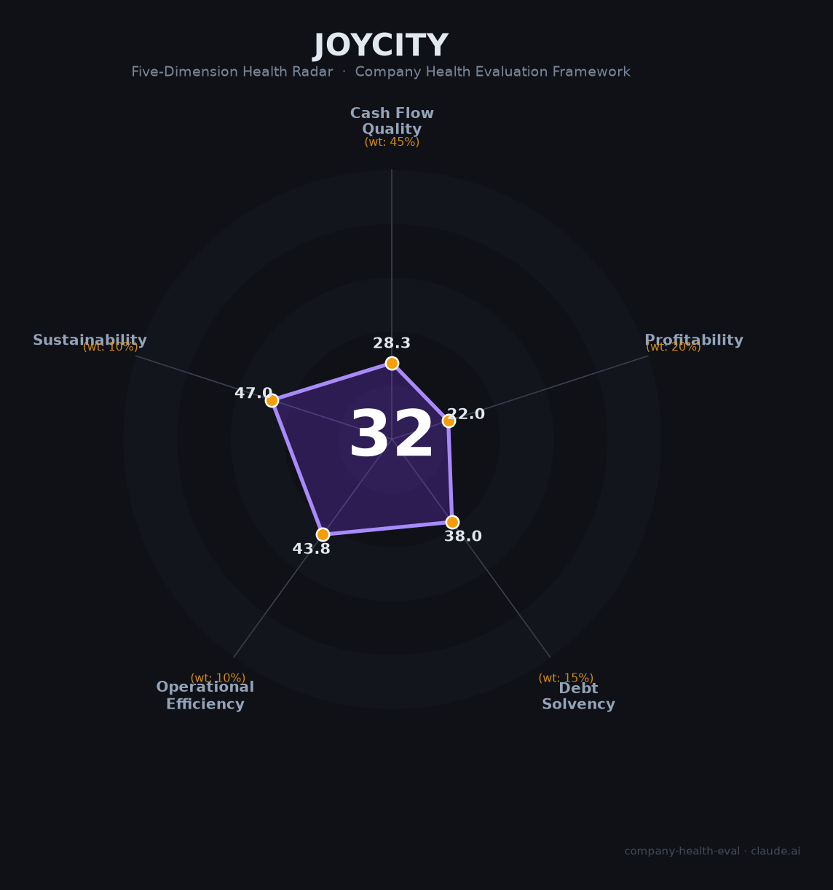

# 大悦城控股（000031.SZ）财务健康评估（2026-08-13）

## 一句话结论
⚫ **高风险（32/100）** | 央企中粮商业地产——2025营收-13.7%、归母-23.5亿亏损+负债70%+，商业地产承压

## 一、公司基本画像
| 主体 | 🔒 大悦城控股，A股000031.SZ；中粮集团商业地产平台 |
| 主营 | 商业地产（大悦城购物中心）、住宅开发 |
| 财务 | 2025营收308.9亿(-13.7%)；归母-23.5亿（亏损）；负债率70%+ |

## 二、五维财务健康评估
### 1. 现金流（28/100）预警：亏损+地产去化，现金流承压
### 2. 盈利（22/100）预警：归母-23.5亿亏损
### 3. 偿债（38/100）危险：负债70%+、商业地产高杠杆
### 4. 运营（44/100）：商业+住宅去化承压
### 5. 可持续（47/100）：商业地产/消费周期反转

## 三、综合评分
| 现金流28|45%=12.7 | 盈利22|20%=4.4 | 偿债38|15%=5.7 | 运营44|10%=4.4 | 可持续47|10%=4.7 | **32** |
**评级：⚫ 高风险** — 亏损+高负债，财务承压

## 四、风险
1. 归母-23.5亿亏损。
2. 负债70%+、商业地产承压。
3. 消费/地产去化。

## 五、求职
- 优势：中粮央企、大悦城品牌商业地产。
- 短板：亏损+降薪/裁员，商业条线有压力。

**结论：商业地产承压，作为雇主非首选（商业运营/大悦城品牌或有价值）。**

---
*评估方法：商泰汽车（iAUTO）五维 · 来源大悦城2025年报*