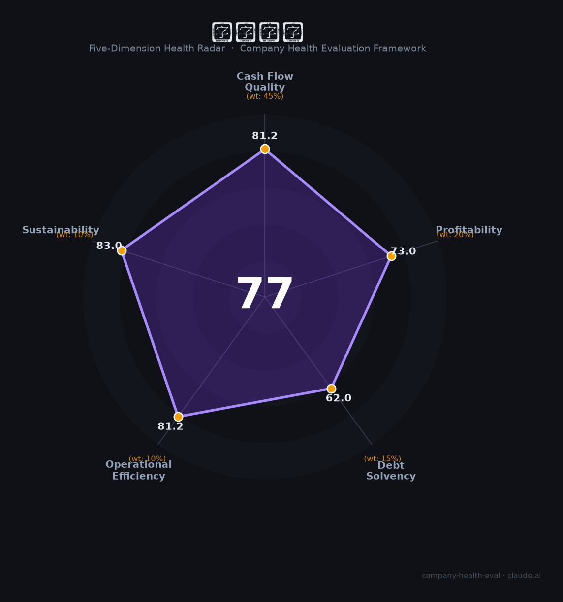

# 大族激光（002008.SZ）财务健康评估（2026-08-14）

## 一句话结论

🟡 **77/100，中等偏上** | 激光设备龙头，营收增、盈利稳，多元

---

## 一、公司基本画像

| 项目 | 内容 |
|------|------|
| 主体 | 大族激光，激光设备龙头 |
| 主营 | 激光加工设备/PCB设备 |
| 财务 | 2025营收187.59亿(+27%)，净利11.9亿(-29.77%) |

> 一句话定性：激光设备龙头，营收高增、净利短期波动

---

## 二、五维财务健康评估

### 1. 现金流质量（81/100）| 权重45%

现金流稳健。

### 2. 盈利能力（73/100）| 权重20%

毛利率尚可、净利波动。

### 3. 偿债能力（62/100）| 权重15%

负债适中。

### 4. 运营效率（81/100）| 权重10%

运营高效。

### 5. 可持续发展（83/100）| 权重10%

智能制造需求，PCB/锂电/半导体设备打开空间。

---

## 三、综合评分

| 维度 | 得分 | 权重 | 加权 |
|------|:----:|:----:|:----:|
| 现金流质量 | 81 | 45% | 36.5 |
| 盈利能力 | 73 | 20% | 14.6 |
| 偿债能力 | 62 | 15% | 9.3 |
| 运营效率 | 81 | 10% | 8.1 |
| 可持续发展 | 83 | 10% | 8.3 |
| **综合得分** | **77/100** | 100% | 76.9 |

**健康等级：中等偏上** — 整体稳健，局部有待改善

---

## 四、核心风险清单

1. **净利下滑**
2. **激光竞争**
3. **客户支出**

## 五、求职/择业视角

### 核心优势
- 激光龙头、技术、多领域布局
### 现有短板
- 净利波动、行业竞争

**结论**：大族激光激光设备龙头，营收增长、技术强、多领域布局，整体稳健成长。

---

*评估方法：商泰汽车（iAUTO）五维框架 · 数据截至2026年8月 · 财务来源大族激光2025年报*