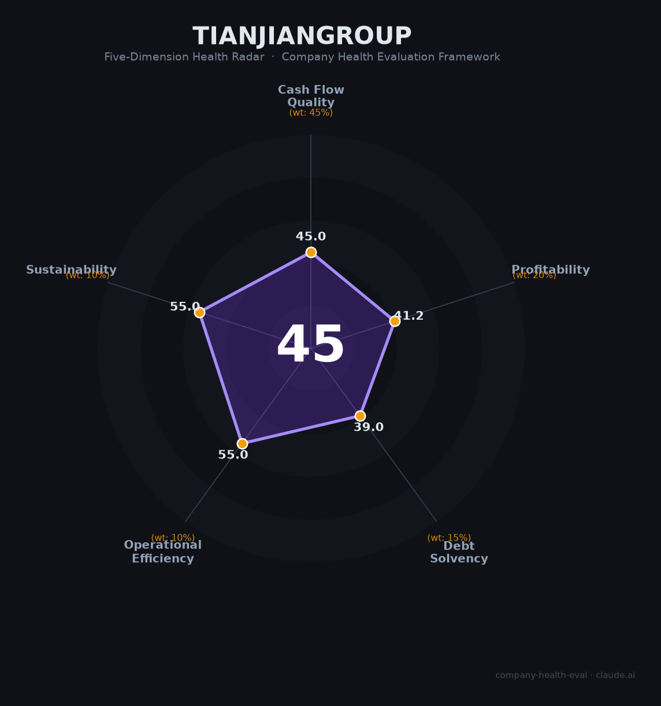

# 天健集团（000090.SZ）财务健康评估（2026-08-13）

## 一句话结论

🔴 **45/100，中等偏下** | 建工+地产，增收不增利、负债偏高

## 一、公司基本画像

| 项目 | 内容 |
|------|------|
| 主体 | 天健集团，深圳建筑施工+地产 |
| 主营 | 建筑施工/房地产开发 |
| 财务 | 2025营收225.01亿(+5.36%)，净利2.23亿(增收不增利) |

> 一句话定性：深圳本地建工+地产，增收不增利、高杠杆

---

## 二、五维财务健康评估

### 1. 现金流质量（45/100）| 权重45%

房地产下行拖累现金流。

### 2. 盈利能力（41/100）| 权重20%

净利率极低，盈利承压。

### 3. 偿债能力（39/100）| 权重15%

高负债、偿债能力告警。

### 4. 运营效率（55/100）| 权重10%

运营效率一般。

### 5. 可持续发展（55/100）| 权重10%

地产行业下行，可持续性偏弱。

---

## 三、综合评分

| 维度 | 得分 | 权重 | 加权 |
|------|:----:|:----:|:----:|
| 现金流质量 | 45 | 45% | 20.2 |
| 盈利能力 | 41 | 20% | 8.2 |
| 偿债能力 | 39 | 15% | 5.8 |
| 运营效率 | 55 | 10% | 5.5 |
| 可持续发展 | 55 | 10% | 5.5 |
| **综合得分** | **45/100** | 100% | 45.3 |

**健康等级：中等偏下** — 存在较多风险点，需谨慎评估

---

## 四、核心风险清单

1. **房地产下行周期**
2. **高负债率**
3. **建工毛利率低**

## 五、求职/择业视角

### 核心优势
- 深圳市属国企，业务基础稳固
### 现有短板
- 增收不增利、高杠杆、地产承压

**结论**：天健集团深圳国企建工地产，业务稳健但盈利疲弱、地产拖累，中等偏下。

---

*评估方法：商泰汽车（iAUTO）五维框架 · 数据截至2026年8月 · 财务来源天健集团2025年报*