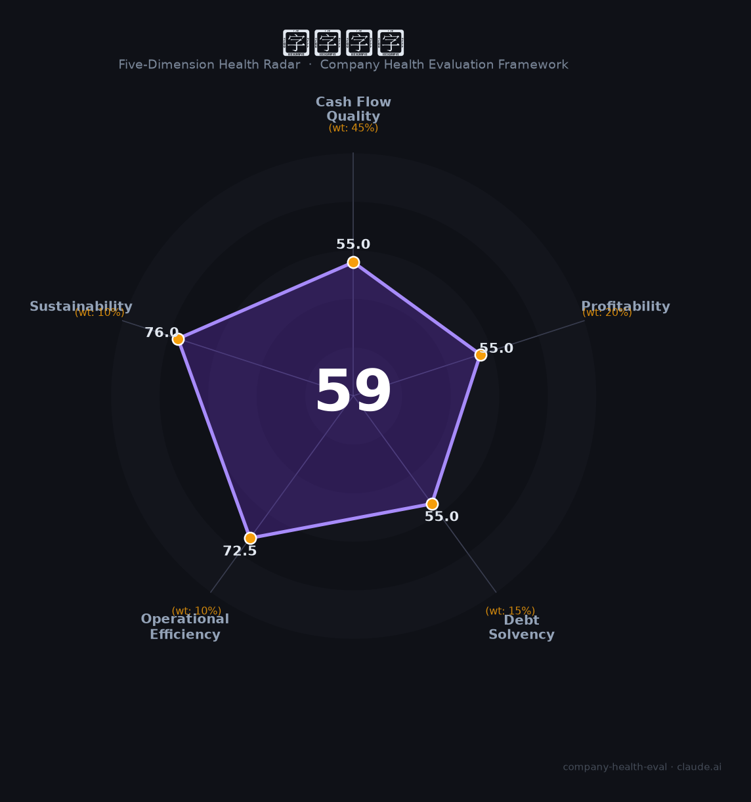

# 天珑科技（400059）财务健康评估（2026-08-14）

## 一句话结论

🟠 **59/100，中等** | 手机ODM，营收增长、盈利偏薄

---

## 一、公司基本画像

| 项目 | 内容 |
|------|------|
| 主体 | 天珑科技集团，手机ODM/平板 |
| 主营 | 智能通信设备ODM |
| 财务 | 2025营收201.42亿(+20.21%) |

> 一句话定性：手机ODM龙头，营收高增、盈利薄

---

## 二、五维财务健康评估

### 1. 现金流质量（55/100）| 权重45%

ODM现金流一般。

### 2. 盈利能力（55/100）| 权重20%

净利率薄。

### 3. 偿债能力（55/100）| 权重15%

中高负债。

### 4. 运营效率（72/100）| 权重10%

运营效率一般。

### 5. 可持续发展（76/100）| 权重10%

手机ODM集中度提升、出海增长。

---

## 三、综合评分

| 维度 | 得分 | 权重 | 加权 |
|------|:----:|:----:|:----:|
| 现金流质量 | 55 | 45% | 24.8 |
| 盈利能力 | 55 | 20% | 11.0 |
| 偿债能力 | 55 | 15% | 8.2 |
| 运营效率 | 72 | 10% | 7.2 |
| 可持续发展 | 76 | 10% | 7.6 |
| **综合得分** | **59/100** | 100% | 58.9 |

**健康等级：中等** — 整体稳健，局部有待改善

---

## 四、核心风险清单

1. **ODM薄利**
2. **客户集中**
3. **海外政策**

## 五、求职/择业视角

### 核心优势
- ODM龙头、规模大、出海布局
### 现有短板
- 盈利薄、依赖大客户

**结论**：天珑科技手机ODM龙头，营收增长、规模大但盈利薄，稳定但成长溢价有限。

---

*评估方法：商泰汽车（iAUTO）五维框架 · 数据截至2026年8月 · 财务来源天珑科技2025年报*