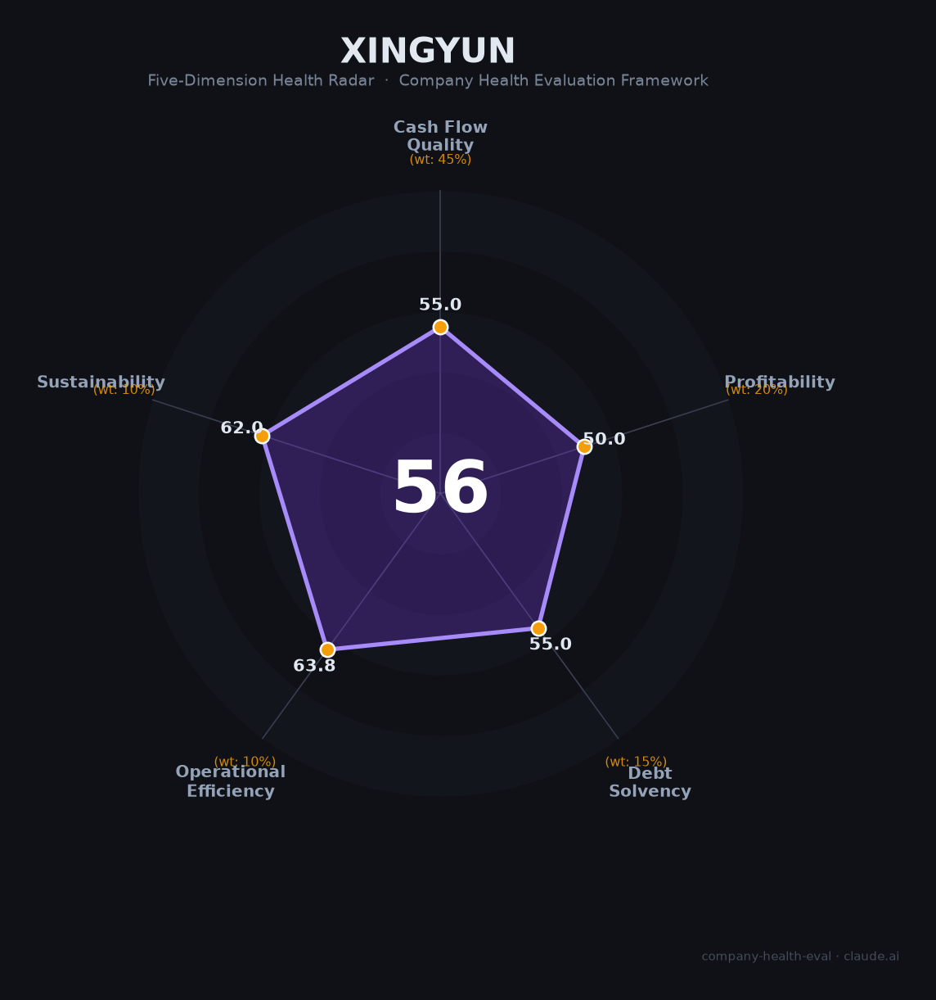

# 天行云（行云集团）财务健康评估（2026-08-13）

## 一句话结论
🟠 **中等（56/100）** | 跨境电商数字供应链——2025中国500强第339位，但非上市无公开财务，评估存不确定性

## 一、公司基本画像
| 主体 | 🔒 深圳天行云供应链·行云集团，非上市；跨境电商数字供应链 |
| 主营 | 跨境电商数字供应链 / 跨境贸易 |
| 财务 | ⚠️ 2025中国500强第339位，非上市无强制财务披露 |

## 二、评估（数据有限）
跨境电商数字供应链：现金流/供应链 + 跨境物流资金占用，非上市不可验证。
## 三、综合（55|45%=24.8，50|20%=10，55|15%=8.2，64|10%=6.4，62|10%=6.2）
**56，🟠 中等** — 赛道中上但财务不透明

## 四、风险
1. 非上市、财务不透明。
2. 跨境电商供应链资金/物流占用。

## 五、求职
- 优势：跨境电商供应链平台（行云集团）、出海赛道。
- 短板：财务不透明、稳定性待核。

**结论**：适合跨境/供应链方向、能尽调财务的求职者，非首选但赛道有前景。

---
*评估方法：商泰汽车（iAUTO）五维框架 · 数据有限（非上市），评估存在不确定性*