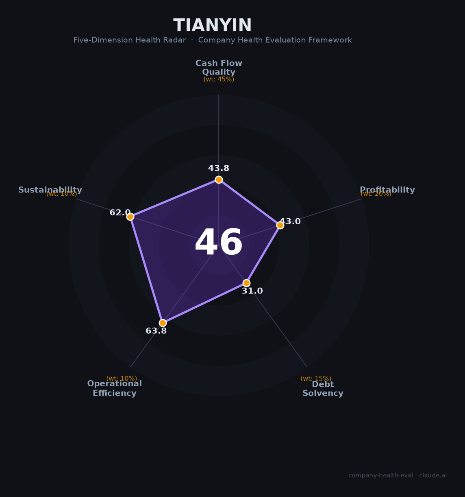

# 天音控股（000829.SZ）财务健康评估（2026-08-13）

## 一句话结论
🔴 **中等偏下（46/100）** | 手机/IT分销龙头——营收906亿（+7.8%）但归母净利-0.2亿转亏、负债率89.3%，高杠杆薄利承压

## 一、公司基本画像
| 主体 | 🔒 天音通信（天音控股），A股000829.SZ；手机/IT分销龙头 |
| 主营 | 手机/消费电子分销、IT电商、彩票/零售新分销 |
| 财务 | 2025营收906亿(+7.8%)；归母净利-0.2亿（-169%转亏）；扣非-0.65亿；经营现金流4.9亿；负债率89.3%、员工4061 |

## 二、五维
### 1. 现金流（44/100）关注：转亏+低毛利，现金紧张
### 2. 盈利（43/100）预警：归母转亏-0.2亿、毛利仅3.1%、扣非亏损
### 3. 偿债（31/100）危险：负债率89.3%、流动比率0.87、高杠杆
### 4. 运营（64/100）：分销网络成熟、运营高效
### 5. 可持续（62/100）：手机分销稳定但薄利，转型新分销关注

## 三、综合（44/45%=19.7，43/20%=8.6，31/15%=4.6，64/10%=6.4，62/10%=6.2）
**46，🔴 中等偏下** — 高杠杆分销+转亏

## 四、风险
1. 转亏+扣非亏损。
2. 负债率89.3%高杠杆。
3. 手机分销薄利/竞争。

## 五、求职
- 优势：手机分销龙头、全国网络。
- 短板：转亏+高杠杆、薪酬弹性弱。

**结论**：适合手机分销/渠道方向，能接受薄利与杠杆的求职者。

---
*评估方法：商泰汽车（iAUTO）五维框架 · 来源天音控股2025年报*