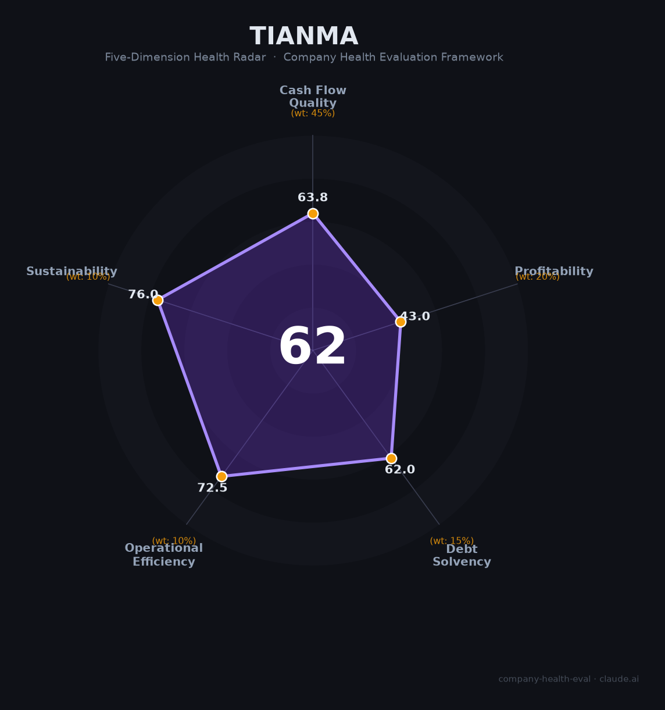

# 天马微电子（000050.SZ）财务健康评估（2026-08-13）

## 一句话结论

🟠 **62/100，中等** | 面板龙头扭亏，ROE极低薄利

---

## 一、公司基本画像

| 项目 | 内容 |
|------|------|
| 主体 | 🔒 深天马A，面板显示 |
| 主营 | 🔒 中小尺寸LCD/OLED面板 |
| 财务 | 🔒 2025营收362亿，归母净利1.67亿扭亏，ROE 0.61%，研发33亿 |

## 二、五维财务健康评估

### 1. 现金流质量（64/100）| 权重45%

### 2. 盈利能力（43/100）| 权重20%

### 3. 偿债能力（62/100）| 权重15%

### 4. 运营效率（72/100）| 权重10%

### 5. 可持续发展（76/100）| 权重10%

---
## 三、综合评分

| 维度 | 得分 | 权重 | 加权 |
|------|:----:|:----:|:----:|
| 现金流质量 | 64 | 45% | 29 |
| 盈利能力 | 43 | 20% | 9 |
| 偿债能力 | 62 | 15% | 9 |
| 运营效率 | 72 | 10% | 7 |
| 可持续发展 | 76 | 10% | 8 |
| **综合得分** | **62** | 100% | 62 |

**健康等级：🟠 中等**

---
## 四、核心风险清单

1. **面板周期**
2. **低ROE**
3. **重资产**
4. **竞争**
## 五、求职/择业视角
- **核心优势**：面板基本盘+显示技术
- **现存短板**：薄利+周期波动

**结论**：面板/显示方向可用，但盈利薄非首选
---
*评估方法：商泰汽车（iAUTO）五维框架 · 数据截至2026年8月 · 来源：天马2025年报*
