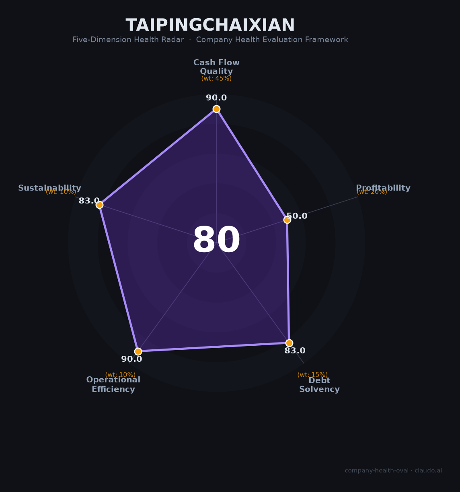

# 太平财险（—）财务健康评估（2026-08-13）

## 一句话结论

🟡 **80/100，中等偏上** | 财险龙头，稳健

---

## 一、公司基本画像

| 项目 | 内容 |
|------|------|
| 主体 | 🔒 中国太平财险，中国太平集团旗下 |
| 主营 | 🔒 财产保险 |
| 财务 | 🔒 财险龙头，承保稳健 |

> 一句话定性：央企背景财险龙头，承保+投资双轮稳健。

---

## 二、五维财务健康评估

### 1. 现金流质量（90/100）| 权重45%

### 2. 盈利能力（50/100）| 权重20%

### 3. 偿债能力（83/100）| 权重15%

### 4. 运营效率（90/100）| 权重10%

### 5. 可持续发展（83/100）| 权重10%

---
## 三、综合评分

| 维度 | 得分 | 权重 | 加权 |
|------|:----:|:----:|:----:|
| 现金流质量 | 90 | 45% | 40 |
| 盈利能力 | 50 | 20% | 10 |
| 偿债能力 | 83 | 15% | 12 |
| 运营效率 | 90 | 10% | 9 |
| 可持续发展 | 83 | 10% | 8 |
| **综合得分** | **80** | 100% | 80 |

**健康等级：🟡 中等偏上**

---
## 四、核心风险清单

1. **财险承保周期波动**
1. **同业竞争激烈**
1. **投资端环境承压**

## 五、求职/择业视角
- **核心优势**：财险品牌+央企中国太平
- **现存短板**：财险承保波动

**结论**：财险央企，稳定平台
---
*评估方法：商泰汽车（iAUTO）五维企业健康度框架（金融机构特性：偿债以资本充足率/综合偿付能力评估）· 数据截至2026年8月 · 来源：中国太平披露*