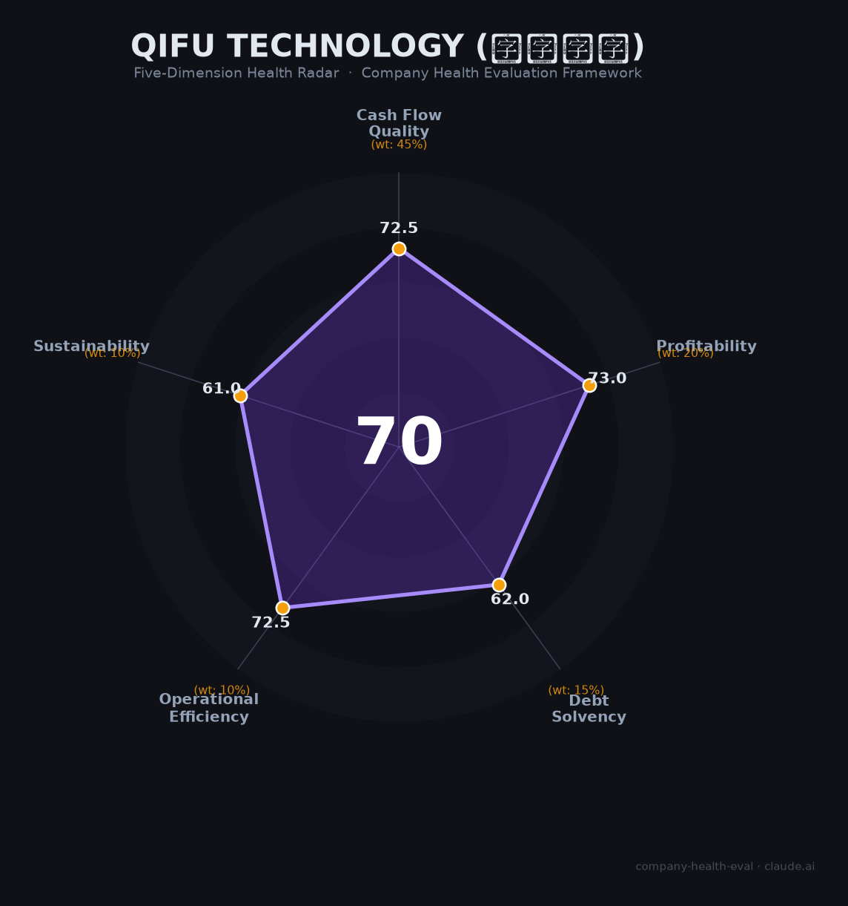

# 奇富科技 财务健康评估（2026-06-14）

## 一句话结论

🟠 **中等（69.9/100）** | 现金流强劲但监管寒冬已至，2025Q4业绩拐点确立，2026年面临严峻考验

---

## 一、公司基本画像

| 项目 | 内容 |
|------|------|
| **主体** | 奇富科技股份有限公司（Qifu Technology, Inc.），前身"360金融""360数科" |
| **成立时间** | 2018年4月（开曼群岛注册），前身360金服始于2015年 |
| **上市状态** | NASDAQ: QFIN（2018.12.14）+ HKEX: 03660（2022.11.29），双重上市 |
| **股权结构** | 周鸿祎及家族间接持股约16%（第一大股东），方源资本约5.4%，OLP Capital约5.4% |
| **核心高管** | CEO吴海生（2019起）、CFO徐祚立（2020起）、CRO郑彦；2024年8月周鸿祎辞任董事长，赵帆接任 |
| **员工规模** | 3,527人（2024年末），研发人员约851人（核心实体口径，占比48%） |
| **主营业务** | AI驱动信贷科技平台：奇富借条（C端消费信贷）+ 奇富周转灵（小微贷）+ FocusPro技术输出 |
| **商业模式** | 信贷驱动服务（72.8%）+ 平台服务（27.2%），双轮驱动；合作金融机构167家 |
| **关键规模** | 累计注册用户2.91亿，2025年促成贷款3,270.7亿元，年末在贷余额1,260.1亿元 |
| **当前市值** | 约60亿美元（NASDAQ QFIN），PE(TTM)约2.0倍，P/B约0.58倍（破净状态） |

**一句话定性**：奇富科技是中国信贷科技行业规模最大的独立上市平台（不含蚂蚁/字节/京东等生态型平台），以高盈利能力、强现金流和激进股东回报著称，但正面临监管利率上限压顶、资产质量恶化和高管密集减持的多重逆风。

---

## 二、五维财务健康评估

### 1. 现金流质量（72.5/100）

| 评估指标 | 判断 | 依据 |
|----------|------|------|
| 经营现金流净额 | 🟢 健康 | 连续3年为正且逐年增长（59.2→71.2→93.4亿元），2025年达110.8亿元🔒 |
| 现金覆盖周期 | 🟡 关注 | 现金+短期投资约75.4亿元（2025末），覆盖约7个月运营支出（年化125亿元）🔒 |
| 有息负债水平 | 🟡 关注 | 短期借款22.2亿+可转债（净额约16亿）+长期借款15.8亿，合计约54亿元，占净资产22%🔒 |
| 净现比 | 🟢 健康 | 经营现金流/净利润 = 110.84/59.76 = 1.85，利润质量极高🔒 |

**核心判断**：现金流是奇富科技最坚固的护城河。净现比连续多年>1，说明利润并非纸面数字。但现金储备相对年化运营支出仅7个月，在行业下行期略显不足。2025年发行可转债（6.9亿美元）后已部分回购，杠杆控制意识较强。

### 2. 盈利能力（73.0/100）

| 评估指标 | 判断 | 依据 |
|----------|------|------|
| 毛利率 | 🟡 良好 | 估算约75-78%，高于行业均值（70-75%）但低于嘉银科技（81%）📊 |
| 净利率 | 🟢 优秀 | GAAP净利率31.1%（2025年），远超15%的优秀线；但Q4单季已降至24.8%，2026Q1仅22.6%🔒 |
| 营收增速（3年CAGR） | 🟠 一般 | 2022→2025 CAGR约5.1%，在0-10%区间；2026Q1营收同比-16.6%🔒 |
| 研发费用率 | 🟡 良好 | 研发投入21.08亿元（2024年），占营收8.53%，处于科技公司理想区间（5-10%）🔒 |
| 人均产出 | 🟡 良好 | 人均营收约544万元（2025年估算），高于金融科技行业均值（约300-400万）📊 |

**核心判断**：历史盈利能力极强（净利率31%），但这一优势高度依赖高利率客群。24%利率红线施行后，Take Rate从Q3的15.5%骤降至Q4的13.3%，净利率趋势性下滑已成定局。2026Q1净利润同比腰斩（-51%），Q2指引继续-47~-51%。研发投入强度合理，技术人员密度高（48%）是长期竞争力支撑。

### 3. 偿债能力（62.0/100）

| 评估指标 | 判断 | 依据 |
|----------|------|------|
| 资产负债率 | 🟡 关注 | 57.6%（2025末），在40-70%区间内，较2024年末（49.6%）明显上升🔒 |
| 有息负债率 | 🟡 关注 | 约22%（54亿/242亿净资产），可控但不可忽视🔒 |
| 流动比率 | 🟡 关注 | 金融科技企业典型水平（估算1-2倍），短期偿债能力尚可但非宽裕📊 |
| 现金比率 | 🟡 关注 | 现金+短期投资约75.4亿元，面临担保负债的潜在资金占用📊 |
| 股权质押比例 | 🟢 健康 | 周鸿祎持股15.99%，未发现大比例质押；美股/港股双重上市增加透明度🔒 |

**核心判断**：整体杠杆可控，但2025年资产负债率上升8个百分点（49.6%→57.6%），主要源于可转债发行和表内贷款扩张。作为金融企业，当前杠杆水平在合理范围内，但需关注担保业务（66.77亿元不良资产主要来自融资担保端）对表外偿债压力的传导。无股权质押风险。

### 4. 运营效率（72.5/100）

| 评估指标 | 判断 | 依据 |
|----------|------|------|
| 应收/贷款质量 | 🟡 关注 | 90天+逾期率从2.09%（2024末）升至2.71%（2025Q4）→3.50%（2026Q1）；D1首日逾期6.1%创5年新高🔒 |
| 客户集中度 | 🟢 健康 | 2.91亿注册用户，6,360万授信用户，客户高度分散🔒 |
| 员工规模趋势 | 🟢 健康 | 2022年2,199→2023年3,121→2024年3,527人，连续增长；虽有2025年3月行业裁员传闻，但实际数据不支持大规模裁员🔒 |
| 高管稳定性 | 🟡 关注 | CEO/CFO/CRO在任3年+，但董事长更替（2024年8月）+核心高管密集减持超9,000万美元（2024Q4-2025H1）🌐 |

**核心判断**：客户基础广泛分散是结构性优势。但资产质量恶化趋势明确——逾期率三连升（2.09%→2.71%→3.50%），2025年12月以3.08亿元折价处置74.29亿元不良资产包（回收率仅4.15%）。高管大规模减持在业绩承压期尤为刺眼，尽管暂未离职，但"用脚投票"信号不容忽视。

### 5. 可持续发展能力（61.0/100）

| 评估指标 | 判断 | 依据 |
|----------|------|------|
| 行业赛道空间 | 🟡 关注 | 互金助贷行业CAGR约11.8%（至2030年），在5-15%区间；但24%以上利率资产规模增速从34.1%骤降至8.6%📊 |
| 技术壁垒 | 🟡 关注 | AI风控引擎（Argus）+FocusPro技术输出增长448%，但头部竞品（蚂蚁/字节/度小满）均有类似布局；壁垒1-3年📊 |
| 业务多元化 | 🟢 健康 | 消费贷+小微贷双产品线、167家合作金融机构、技术输出新增长极、海外布局启动🔒 |
| 资本支持 | 🟢 健康 | NASDAQ+HKEX双重上市，三年回购授权累计15亿美元（2023-2025），股息率约10%🔒 |
| 政策/监管风险 | 🔴 危险 | 24%利率红线（2025年10月施行）直接清退高定价客群；2026年3月被监管约谈；个贷综合成本明示新规8月施行；小贷公司6倍杠杆上限🔒 |

**核心判断**：政策风险是本维度最大拖累项，也是奇富科技当前面临的核心威胁。24%利率红线是分水岭——此前约30-40%的高定价资产将被逐出银行资金体系，直接冲击利润最丰厚的客群。积极面：技术输出（FocusPro余额118亿，+448%）和海外布局提供了第二曲线想象空间，双地上市和高股东回报提供了估值底部支撑。

---

## 三、综合评分与健康等级

| 维度 | 得分 | 权重 | 加权得分 |
|------|------|------|----------|
| 现金流质量 | 72.5 | 45% | 32.6 |
| 盈利能力 | 73.0 | 20% | 14.6 |
| 偿债能力 | 62.0 | 15% | 9.3 |
| 运营效率 | 72.5 | 10% | 7.2 |
| 可持续发展 | 61.0 | 10% | 6.1 |
| **综合得分** | | | **69.9 / 100** |

**健康等级**：🟠 **中等（Moderate）**

雷达图显示：现金流和盈利能力为双高峰（72.5/73.0），偿债和可持续发展为双低谷（62.0/61.0），呈典型的"强当下、弱未来"格局。

---

## 四、同业对标

| 对比项 | 奇富科技 (QFIN) | 信也科技 (FINV) | 乐信 (LX) | 嘉银科技 (JFIN) |
|--------|:--------------:|:--------------:|:---------:|:--------------:|
| 上市状态 | NASDAQ+HKEX | NYSE | NASDAQ | NASDAQ |
| 2024年营收 | 171.7亿元 | 130.7亿元 | 142.0亿元 | 58.0亿元 |
| 2024年净利润 | 62.5亿元 | 23.9亿元 | 11.0亿元 | 10.6亿元 |
| 净利率 | 36.5% | 18.3% | 7.7% | 18.2% |
| 在贷余额 | 1,370亿元 | 715亿元 | 1,103亿元 | ~450亿元 |
| 90天+逾期率 | 2.09%（年末） | ~2.5% | 3.0-3.7% | 1.13%（2025Q1） |
| 员工数 | 3,527人 | ~3,650人 | ~7,169人 | ~1,500人 |
| 市盈率(TTM) | ~2.0倍 | ~3.6倍 | ~1.6倍 | ~1.0倍 |
| 市净率 | 0.58倍 | ~0.8倍 | ~0.3倍 | ~0.3倍 |
| ROE | 22.7% | 15.3% | 8.6% | 58.8% |

**对标结论**：奇富科技在营收、利润、ROE维度均处于行业第一梯队，净利率（36.5%）远超信也（18.3%）和乐信（7.7%）。但市场给予其极低估值（PE仅2倍、PB 0.58倍破净），反映对监管风险的系统性折价。逾期率控制优于乐信但不及嘉银科技。嘉银ROE畸高（58.8%）需警惕杠杆风险。

---

## 五、核心风险清单

1. **监管利率上限冲击（高风险）**：24%IRR红线2025年10月生效，Q4净利润即同比-46.9%。2026Q1净利润同比-51%，Q2指引继续-47~-51%。全年净利润可能从2025年的59.8亿元降至30-35亿元区间。触发条件已发生，冲击仍在释放中。

2. **资产质量持续恶化（高风险）**：90天+逾期率从2.09%（2024末）→2.71%（2025Q4）→3.50%（2026Q1），三连升累计恶化67%。首日逾期率6.1%创5年新高。若宏观经济进一步下行，逾期率可能突破4%，触发拨备计提螺旋。2025年Q4拨备11.9亿元（同比+99%）。

3. **核心高管密集减持（中高风险）**：CEO吴海生、CFO徐祚立、CRO郑彦、SVP贺志强在2024Q4-2025H1期间合计减持超9,000万美元。在业绩拐点期的大规模套现，打击市场信心，可能暗示内部人对短期复苏不乐观。

4. **品牌与合规争议（中风险）**：黑猫投诉累计约5万条（暴力催收/隐私泄露/高息），2025年12月被央行罚款119万元（征信违规），2026年3月被金融监管总局约谈。个贷综合成本明示新规（2026年8月施行）将进一步压缩收费操作空间。

5. **营收结构转型不确定性（中风险）**：轻资本放款占比从55%（2024Q3）降至43.8%（2025Q4），转型遇阻。重资本模式推高杠杆（资产负债率49.6%→57.6%）。技术输出（FocusPro，+448%）和增值业务（+112%）增长快但基数低（合计不到15%营收）。

6. **宏观经济与中概股折价（中低风险）**：居民偿债负担处历史高位，信用卡逾期率升至1.43%。港股从高点198港元跌至约53港元（跌幅73%），中概股板块整体承压。双重上市部分对冲退市风险。

---

## 六、求职/择业视角

### 核心优势

- **薪酬竞争力强**：技术岗月薪15K-70K×15薪+12%全额公积金+免费三餐+补充医疗保险，金融科技行业头部水平
- **技术密度高**：研发人员占比48%（核心实体口径），AI/风控技术经验可迁移至银行、消金、互联网平台等
- **品牌背书**：NASDAQ+HKEX双重上市，信贷科技行业规模第一的独立平台，简历含金量较高
- **稳定性尚可**：员工数连续三年增长（2,199→3,121→3,527），无大规模裁员记录；虽有2025年3月行业裁员传闻，未获证实

### 现存短板

- **工作强度极大**：员工口碑普遍反映"加班严重""高薪高压""卷是常态"，WLB追求者不友好
- **行业天花板降低**：监管利率上限压缩行业利润空间，2026年公司进入收缩期，晋升通道和调薪幅度可能收窄
- **品牌独立性存疑**：虽已完成"去360化"，但周鸿祎仍为第一大股东，"360系"标签未完全消失
- **业务边界受限**：核心能力（信贷风控）迁移面窄，跨行业跳槽需补充新技能

### 分场景建议

| 个人诉求 | 推荐 | 次选 | 规避 |
|----------|------|------|------|
| 稳定+深耕 | — | 奇富科技（财务底子厚，短期不会倒） | 行业中小平台（24%红线下去产能） |
| 高薪+跳板 | 奇富科技（薪资头部+技术经验值钱） | 蚂蚁/字节金融（更高薪但更卷） | 传统银行IT（薪资天花板低） |
| 成长+融资红利 | — | — | 奇富科技（行业红利消退，股价承压，期权价值缩水） |
| 多元+跨领域 | 蚂蚁/字节金融（业务线广） | 奇富科技（AI+金融复合经验） | 纯信贷平台（能力单一） |

---

## 七、总结

**奇富科技** 是中国信贷科技领域「规模最大、盈利最强、但被监管压顶」的独立上市平台：经营现金流连续三年超70亿、净现比1.85、ROE达22.7%，财务底子极为扎实；唯一短板是**对高利率客群的依赖在24%监管红线下被系统性拆除**，2025Q4净利润同比腰斩（-46.9%），2026年全年利润预计降至30-35亿元区间。

在「助贷新规+资产质量恶化+高管减持」三重逆风下，奇富科技属于**中等风险**，适合**有风险承受能力、看重现金薪酬和技术成长**的求职者。对于追求稳定或行业成长红利的人，当前不是最佳入场时机。值得持续观察的拐点信号：逾期率何时企稳、轻资本转型是否重启、2026H2利润能否触底回升。

---

*评估日期：2026-06-14 | 数据截至：2025年Q4财报（2026年3月发布）及2026年Q1财报（2026年5月发布）*
*评分引擎：company-health-eval v1.0 | 数据来源标注：🔒公开财报 📊估算 🌐网络口碑 ⚠️未验证*
