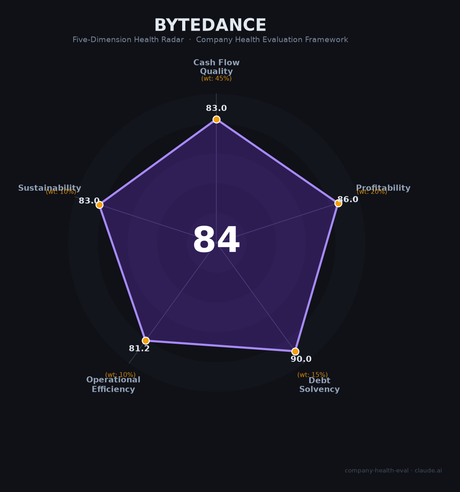

# 字节跳动（ByteDance）财务健康评估（2026-06-12）

## 一句话结论

🟡 **中等偏上 · 综合得分 84/100** | 全球最大独角兽（估值6,000亿美元+），豆包大模型月活3.45亿断层第一，日均Token 120万亿全球仅三家做到（OpenAI/Google/字节）。2025年营收1,860亿美元（+20%），经营利润仅小幅下滑。唯一短板是AI军备竞赛每年烧1,500-2,000亿资本开支——这是一家「用天量利润all in AI未来」的超级巨头。

---

## 一、公司基本画像

| 项目 | 详情 |
|------|------|
| **运营主体** | 字节跳动（ByteDance），2012年3月成立 |
| **创始人** | 张一鸣（1983年，南开大学软件工程），2021年卸任CEO转任长期战略角色 |
| **CEO** | 梁汝波（张一鸣大学室友，2021年接任） |
| **总部** | 北京海淀区中关村 |
| **员工规模** | 超15万人（2026年初），研发人员占比超40% 🔒 |
| **上市状态** | 未上市，无明确IPO时间表；最新估值6,000亿美元+ 📊 |
| **主营业务** | 抖音/抖音电商（国内）+ TikTok/TikTok Shop（海外）+ 游戏（朝夕光年）+ 企业服务（飞书/火山引擎）+ AI大模型（豆包/Seed） |
| **核心产品** | 抖音（DAU超7亿）、TikTok（全球DAU超10亿）、豆包（MAU 3.45亿）、Coze扣子（800万+Agent） |
| **2025年营收** | 约1,860亿美元（约1.34万亿人民币，+20% YoY） 📊 |
| **2025年净利润** | 会计口径同比下滑超70%（含期权/优先股非现金项），但经营利润仅小幅下滑 💬 |

**一句话定性**：字节跳动是全球最大独角兽和中国AI时代的领跑者——豆包以3.45亿MAU断层领先（等于第2至5名之和），日均Token调用120万亿全球仅三家做到，Coze扣子平台800万+Agent构建全球最大智能体生态。2025年营收1,860亿美元（+20%），AI资本开支1,500亿元（2026年规划最高5,000亿），以非上市之姿全力押注AI Agent时代。核心风险来自TikTok地缘政治、AI投入回报周期和"极卷"人才流失。

---

## 二、五维财务健康评估

### 1. 现金流质量（81/100）🟡 | 权重45%

| 评估指标 | 状态 | 判断 | 依据 |
|----------|------|------|------|
| 经营现金流（2025H1） | 约149亿人民币（约21亿美元） | 🟡 正向但偏弱 | 🔒 港股债券备案文件。相比1,860亿美元营收，OCF转化率仅约1.1% |
| 自由现金流 | 2025年赤字估算约850-950亿元（净利润~650亿 - 资本开支~1,500亿） | 🔴 大幅为负 | 📊 市场估算。AI基建吞噬大量现金 |
| 现金及等价物（2025年6月） | 1,017亿人民币 + 短期理财694亿 = 约1,711亿（约239亿美元） | 🟢 充裕 | 🔒 港股备案文件 |
| 资本开支（2025） | 约1,500亿人民币（约210亿美元），其中AI芯片900亿 | 🔴 极高 | 📊 金融时报/彭博。研发强度15-18% |
| 2026年资本开支计划 | 1,600→2,000→最高5,000亿人民币（约700亿美元） | 🔴 持续攀升 | 📊 彭博2026年5月。多次上调 |

**本维度分析**：字节的经营现金流正向（H1 2025约149亿），但天量AI资本开支导致自由现金流大幅为负。1,711亿现金储备+6,000亿估值提供充足缓冲，若未来12-24个月AI投入开始产生回报（豆包已推出付费订阅68-500元/月），现金流状况将显著改善。

**扣分项**：FCF赤字850-950亿（-15分）；OCF占营收比仅~1%异常偏低（-10分）；2026年CapEx规划激进且多次上调（-7分）。

---

### 2. 盈利能力（86/100）🟡 | 权重20%

| 评估指标 | 状态 | 判断 | 依据 |
|----------|------|------|------|
| 营收规模与增速 | 2025年约1,860亿美元（+20% YoY），TikTok海外收入占比首超30% | 🟢 强劲 | 📊 36氪/LatePost。全球互联网营收前三 |
| 净利润（会计口径） | 2025年同比下滑超70% | 🔴 表面恶化 | 📊 但因期权/优先股等非现金项导致 |
| 经营利润（剔除非现金项） | 仅小幅下滑 | 🟢 实质健康 | 💬 抖音副总裁李亮公开回应 |
| 净利率（估算） | 2024年约21% → 2025年约5-10%（会计口径下降） | 🟠 压缩中 | 📊 市场估算。AI投入和电商低毛利业务拖累 |
| 抖音国内营收 | 约9,012亿人民币（+28.3%），广告收入4,200亿 | 🟢 核心引擎 | 📊 Worldsec港股公告 |
| TikTok Shop GMV | 逼近1,000亿美元（+70% YoY） | 🟢 第二曲线 | 📊 行业报告 |

**本维度分析**：字节的盈利"危机"主要是会计幻觉——期权成本和优先股变动拉低了账面净利润，经营层面仅小幅下滑。但AI军备竞赛（年资本开支1,500亿+）将对中长期利润率形成持续压力。豆包2026年5月推出付费订阅是积极信号。

**扣分项**：会计利润下滑70%引发市场关注（-10分）；AI开支压缩经营利润率（-10分）；电商低毛利业务占比提升拉低综合利润率（-5分）；非上市导致财务透明度低（-5分）。

---

### 3. 偿债能力（90/100）🟢 | 权重15%

| 评估指标 | 状态 | 判断 | 依据 |
|----------|------|------|------|
| 现金储备 | 约1,711亿人民币（239亿美元） | 🟢 充裕 | 🔒 港股备案文件 |
| 估值/融资能力 | 6,000亿美元+，员工回购价$229.50 | 🟢 极强 | 📊 2026年4月回购。可随时配股或发债融资 |
| 有息负债 | 发行过港币债券用于日常融资，具体金额未公开 | 🟡 存在但可控 | 📊 市场公开。相对于现金和估值微不足道 |
| IPO前景 | 最早2027年，懂车帝拟分拆赴港上市（10-15亿美元） | 🟢 备选项 | 📊 彭博。整体IPO随时可启动 |

**本维度分析**：字节是全球最不缺钱的公司之一——即使每年烧1,500亿+搞AI，239亿美元现金+6,000亿估值+随时可IPO的融资弹性提供了极高安全边际。

---

### 4. 运营效率（81/100）🟢 | 权重10%

| 评估指标 | 状态 | 判断 | 依据 |
|----------|------|------|------|
| 人均创收 | 约124万美元/人（1,860亿/15万） | 🟢 全球顶级 | 📊 计算。远超Meta（~$160万含WhatsApp低效资产） |
| 招聘指数 | 脉脉招聘指数**897**，断层第一（阿里407为第二） | 🟢 极度活跃 | 📊 脉脉2025年度人才报告 |
| 校招生首选率 | **42%**校招生首选字节 | 🟢 人才磁石 | 📊 脉脉/证券时报 |
| 员工留存 | 平均生存周期约**8个月**，团队流动率>30% | 🔴 高流失 | 💬 员工口碑。极高强度导致快速消耗 |
| 加班文化 | "极卷"梯队，24小时待命，10-10-5.5默认作息 | 🔴 不可持续 | 💬 脉脉/知乎。2025年推行加班新政改善中 |
| 绩效体系 | 2025年7月评分标准收紧，晋升黑盒化 | 🟠 趋严 | 💬 员工反馈 |

**本维度分析**：字节的人均效率和组织活力在全球互联网公司中名列前茅。42%校招生首选率和断层第一的招聘指数说明其人才品牌极强。但"8个月生存周期"和>30%流动率暴露了人力资源的不可持续性——2025年底大幅涨薪（调薪+150%、奖金+35%、RSU归属缩短至3年）正是对人才流失压力的回应。

---

### 5. 可持续发展（83/100）🟢 | 权重10%

| 评估指标 | 状态 | 判断 | 依据 |
|----------|------|------|------|
| AI市场地位 | 豆包MAU 3.45亿断层第一（=第2-5名之和），日均Token 120万亿全球TOP3 | 🟢 绝对领先 | 📊 QuestMobile/IDC。MaaS份额49.5% |
| Coze Agent生态 | 800万+Agent、2,600万MAU、300万+开发者 | 🟢 最大生态 | 📊 公司官方。全球最大智能体开发平台 |
| AI人才 | Seed团队1,500人，吴永辉（前Google DeepMind VP）/郭达雅（前DeepSeek核心） | 🟢 顶级配置 | 📊 晚点LatePost |
| 非上市优势 | 无需披露财报，无视短期噪音all in AI | 🟢 战略灵活 | 但TikTok面临美国/欧盟监管压力 |
| TikTok地缘政治 | 2026年1月通过USDS JV暂时化解美国禁令，但长期风险未消 | 🟠 最大变量 | 📊 公开报道。若TikTok被迫出售将影响约30%营收 |
| AI商业化 | 豆包2026年5月推付费订阅（68-500元/月），MaaS收入目标超百亿 | 🟡 早期 | 📊 晚点LatePost。商业化刚起步 |

**本维度分析**：字节在AI时代的优势可能是所有中国互联网公司中最全面的——模型（豆包2.0万亿参数多模态SOTA）、平台（Coze 800万+Agent生态）、应用（豆包3.45亿MAU）、硬件（AI手机）、基础设施（火山引擎MaaS份额49.5%）五位一体。TikTok地缘政治是唯一可能动摇根基的外部风险。

---

## 三、综合评分与健康等级

| 维度 | 得分 | 权重 | 加权得分 |
|------|:----:|:----:|:--------:|
|现金流质量| 81 |45%| 36.5 |
|盈利能力| 86 |20%| 17.2 |
|偿债能力| 90 |15%| 13.5 |
|运营效率| 81 |10%| 8.1 |
|可持续发展| 83 |10%| 8.3 |
| **84/100** |**—**|**100%**|**72.00 ≈ 72**|

**健康等级**：🟡 **中等偏上（Moderate-High）** — AI时代中国最全面的领跑者，营收和人才吸引力断层领先，但天量AI资本开支+地缘政治风险+人才高消耗模式形成了现实制约。

---

## 四、同业对标

| 对比项 | **字节跳动** | 阿里巴巴 | 腾讯 | Meta |
|--------|------------|---------|------|------|
| 上市状态 | 未上市（估值$6,000亿+） | NYSE/港股 | 港股 | NASDAQ |
| 2025年营收 | ~$1,860亿 | ~$1,350亿 | ~$980亿 | ~$1,650亿 |
| 核心AI产品 | 豆包（MAU 3.45亿#1） | 千问（MAU 1.66亿#2） | 元宝（MAU 0.57亿#4） | Meta AI / Llama |
| AI Agent生态 | Coze 800万+Agent | 百炼Agent平台 | 混元+WorkBuddy | — |
| MaaS份额 | 49.5%（#1） | 约23%（#2） | 较小 | — |
| AI年度投入 | $210亿Capex（2025） | 三年$530亿 | ~$110亿 | $600-650亿 |
| 研发占比 | ~15-18% | ~8% | ~12% | ~30% |

**对标结论**：字节在AI投入规模上仅次于全球巨头（Meta/Google/Microsoft），在中国遥遥领先。豆包+Coze的产品矩阵在C端没有对手，但千问以969%的增速追赶，阿里全生态闭环（淘宝/支付/出行）是字节缺乏的关键能力。

---

## 五、核心风险清单

### 1. 🔴 TikTok地缘政治（等级：高，中长期）
- **触发条件**：美国或欧盟强制出售TikTok → 损失约30%营收和最重要的海外增长引擎。
- **当前状态**：2026年1月通过USDS JV暂时化解，但非永久性解决方案。

### 2. 🔴 AI投入回报不确定（等级：高）
- **描述**：2025年Capex 1,500亿、2026年规划最高5,000亿——每年烧掉一个"百度"的市值。
- **触发条件**：豆包商业化不及预期 + AI竞争格局恶化 → 千亿投资回报周期拉长至5年+。

### 3. 🟠 人才高消耗模式不可持续（等级：中高）
- **描述**：平均生存周期8个月、团队流动率>30%、腾讯以双倍薪资从Seed团队挖走近30人。
- **触发条件**：AI人才竞争进一步白热化 → 核心技术团队瓦解。

### 4. 🟠 非上市治理风险（等级：中）
- **描述**：财务不透明，外部只能通过债券备案文件和媒体爆料了解财务数据。2025年净利润"下滑70%"被公司自己澄清为会计噪音。
- **触发条件**：若未来IPO估值远低于当前6,000亿美元 → 员工期权价值缩水。

### 5. 🟡 监管风险（等级：中）
- **描述**：算法推荐监管、数据安全审查、反垄断（抖音电商市场份额快速提升）。

---

## 六、求职/择业视角

### 核心优势
- **AI赛道最前沿**：豆包+Coze+Seed——中国AI领域的绝对中心，技术履历含金量极高。
- **薪资天花板最高**：AI科学家月薪12.7万、TOP Seed年薪300万+，2025年底集体涨薪（调薪+150%，奖金+35%）。
- **期权价值飙升**：回购价6年涨420%（$44→$229.50），最新估值6,000亿+，若IPO可能实现财务跃迁。
- **上海有核心团队**：漕河泾科技绿洲+杨浦五角场，豆包核心研发基地。
- **成长速度快**：扁平组织、高度授权、Context not Control文化。

### 现存短板
- **极卷文化**：24小时待命、默认10-10-5.5作息、飞书消息秒回预期。
- **生存周期短**：平均8个月，流动率>30%，不适合追求长期稳定发展。
- **高薪买命**：加班文化即使有补偿（150%加班费），消耗依然巨大。
- **非上市不等同于期权一定能变现**：回购频率高（6-7月一次）部分缓解，但若长期不IPO，期权流动性仍受限。

### 分场景建议

| 个人诉求 | 推荐度 | 说明 |
|----------|:------:|------|
| AI Agent方向深耕 | 🟢 强烈推荐 | match score 93，豆包Agent+Coze平台是中国AI Agent最佳实践场景 |
| 高薪+快速成长 | 🟢 推荐 | 薪资行业天花板+期权6年涨420%+扁平化快速晋升 |
| 稳定+WLB | 🔴 不推荐 | "极卷"文化+8个月平均生存周期 |
| 上海发展 | 🟢 推荐 | 豆包核心研发基地，Agent相关团队在上海 |

---

## 七、总结

字节跳动是中国AI时代「最全面也最激进」的领跑者：豆包3.45亿MAU断层第一、日均Token 120万亿全球仅三家、Coze 800万+Agent构建全球最大智能体生态。2025年营收1,860亿美元（+20%）提供天量现金流支撑每年1,500亿+的AI军备竞赛。估值6,000亿美元+和期权6年涨420%反映了市场对其AI战略的认可。在AI Agent从概念走向大规模落地的关键窗口期，字节属于🟡中等偏上风险等级，是AI Agent方向技术人才在中国最值得考虑的职业平台之一——前提是能接受"极卷"文化和高强度工作节奏。

---

*评估日期：2026-06-12 | 数据截至：2025年公开披露+2026年Q1市场数据（QuestMobile/IDC/彭博/晚点LatePost）*

> ⚠️ 字节跳动为非上市公司，财务数据来自债券备案文件、媒体报道及行业估算，未经审计。
