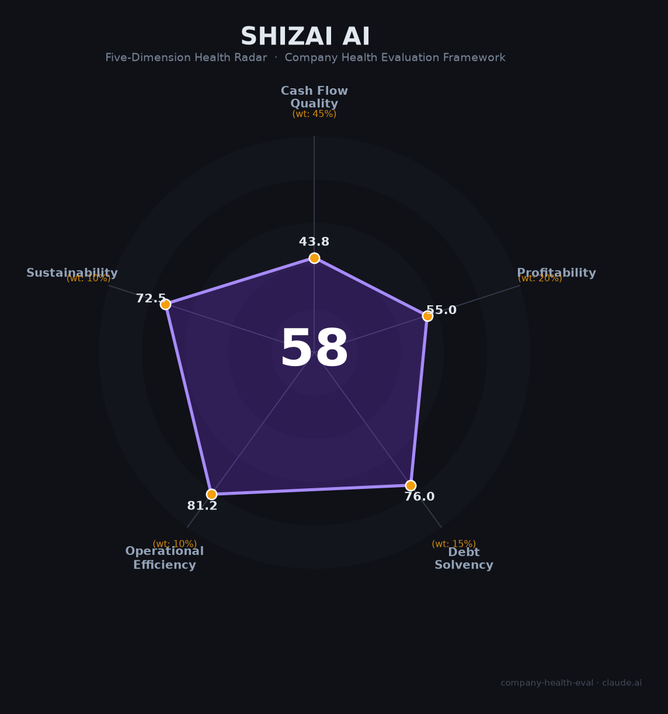

# 实在智能 财务健康评估（2026-06-12）

## 一句话结论

🟠 **中等（57.5/100）** | ISSUT屏幕语义+RPA+Agent技术独特（信创第一），5,000+客户增速+40%；唯持续亏损+现金储备有限+行业盈利模式未验证是核心风险

---

## 一、公司基本画像

| 项目 | 内容 |
|------|------|
| **全称** | 浙江实在智能科技有限公司（Shizai AI） |
| **成立** | 2018年3月，杭州人工智能小镇 |
| **创始人/CEO** | 孙林君（前阿里巴巴P9级资深算法专家，花名"阿宝"） |
| **员工** | 300余人，研发占比54% |
| **主营业务** | RPA+AI Agent（实在Agent+TARS大模型+ISSUT屏幕语义理解） |
| **2025年营收** | ~2.5亿元（📊 IDC推算，+40%） |
| **客户** | 5,000+家（央国企+500强占比超90%） |
| **融资** | 累计~3.5亿元（8轮，最新C轮近2亿2024年2月） |
| **估值** | 10-30亿元（📊 推测，未公开确认） |
| **资质** | 国家级专精特新"小巨人"+国家重点软件企业+TARS双备案 |

实在智能是中国RPA+AI Agent赛道第四名（IDC市占率5.7%），以独创的ISSUT屏幕语义理解技术（"像人一样看懂屏幕"）构建了信创环境下的核心壁垒。2025年营收增长超40%、客户数突破5000家，TARS大模型任务拆解准确率84.16%超越GPT-4（74.26%），在央企信创领域市占率第一。

---

## 二、五维财务健康评估

### 1. 现金流质量（43.8/100）

- **OCF持续为负（危险）**：成立7年尚未盈利，2020年净亏损率曾达-197%。2025年研发投入超1亿（占营收40-50%），OCF大概率仍为负
- **现金仅够1-2年（关注）**：C轮2亿+历史累计约3.5亿融资，估算当前现金5,000万-2亿。年烧钱率约0.8-1.5亿
- **零负债（健康）**：纯股权融资驱动，无有息负债

### 2. 盈利能力（55.0/100）

毛利率55-70%（SaaS订阅为主），但净利率深度为负（研发费用率40-50%）。营收增速+40%属行业上游，但人均产出仅83万（显著低于同行平均水平）。

### 3. 偿债能力（76.0/100）

零有息负债+纯股权融资，偿债风险极低。现金储备有限是流动性风险而非偿债风险。

### 4. 运营效率（81.2/100）

5,000+客户高度分散、创始人团队稳定在位7年、员工持续扩张。但央国企客户回款周期长（6-12个月）。

### 5. 可持续发展（72.5/100）

RPA+AI市场35% CAGR、信创国产替代2027年窗口期、ISSUT技术壁垒独特。但产品线单一（仅RPA+Agent）、2024年后无新融资、IPO路径不明。

---

## 三、综合评分

| 维度 | 得分 | 权重 | 加权得分 |
|------|:----:|:----:|:--------:|
| 现金流质量 | 43.8 | 45% | 19.7 |
| 盈利能力 | 55.0 | 20% | 11.0 |
| 偿债能力 | 76.0 | 15% | 11.4 |
| 运营效率 | 81.2 | 10% | 8.1 |
| 可持续发展 | 72.5 | 10% | 7.2 |
| **综合得分** | **57.5** | **100%** | **57.5/100** |

**健康等级：🟠 中等（Moderate）** · 行业第四 · 信创第一

---

## 四、核心风险

1. **持续亏损+现金紧张（高风险）**：研发费用率40-50%不可持续，2024年后无新融资
2. **RPA行业盈利困境（高风险）**：龙头金智维三年半亏8亿，全行业未验证盈利模式
3. **大厂挤压（中风险）**：阿里/腾讯/华为云RPA作为生态组件捆绑销售
4. **IPO退出不确定（中风险）**：金智维港股IPO是行业风向标

**适合**：看好信创国产替代+AI Agent赛道、愿赌RPA行业整合终局、能接受创业公司高风险的求职者。

---

*评估日期：2026年6月12日 | 数据截至：2026年1月公开信息 | 注意：非上市中小企业，财务数据基于IDC推算+CEO公开披露*
