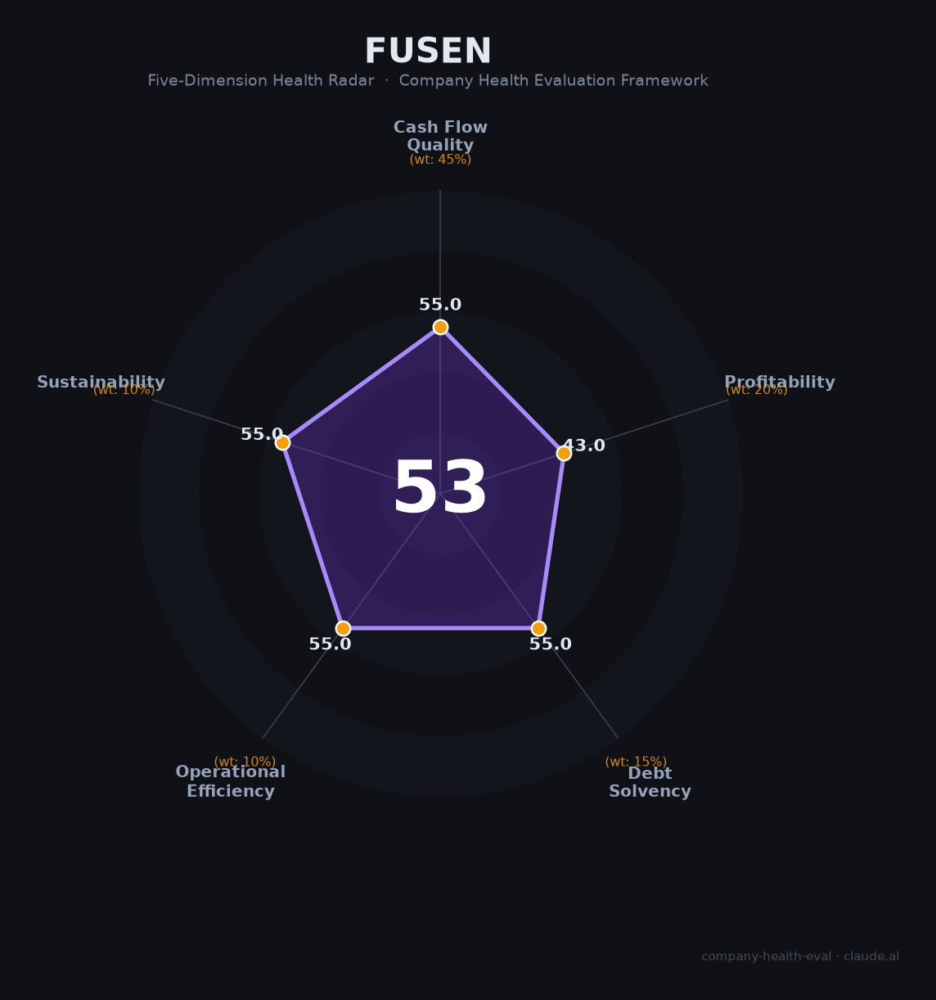

# 富森供应链（—（非上市））财务健康评估（2026-08-14）

## 一句话结论

🔴 **53/100，中等偏下** | 电子元器件供应链，规模中游但数据不透明

---

## 一、公司基本画像

| 项目 | 内容 |
|------|------|
| 主体 | 富森供应链，深圳电子元器件供应链 |
| 主营 | 电子元器件采购/分销/供应链管理 |
| 财务 | 非上市，注册1.12亿，财务数据有限 |

> 一句话定性：电子元器件供应链，非上市数据透明度低

---

## 二、五维财务健康评估

### 1. 现金流质量（55/100）| 权重45%

供应链企业现金流一般。

### 2. 盈利能力（43/100）| 权重20%

薄利多销、盈利承压。

### 3. 偿债能力（55/100）| 权重15%

负债偏高。

### 4. 运营效率（55/100）| 权重10%

运营风险一般。

### 5. 可持续发展（55/100）| 权重10%

电子元器件分销竞争激烈。

---

## 三、综合评分

| 维度 | 得分 | 权重 | 加权 |
|------|:----:|:----:|:----:|
| 现金流质量 | 55 | 45% | 24.8 |
| 盈利能力 | 43 | 20% | 8.6 |
| 偿债能力 | 55 | 15% | 8.2 |
| 运营效率 | 55 | 10% | 5.5 |
| 可持续发展 | 55 | 10% | 5.5 |
| **综合得分** | **53/100** | 100% | 52.6 |

**健康等级：中等偏下** — 存在较多风险点，需谨慎评估

---

## 四、核心风险清单

1. **非上市数据不透明**
2. **供应链薄利**
3. **行业竞争**

## 五、求职/择业视角

### 核心优势
- 电子供应链专业深耕
### 现有短板
- 数据不透明、盈利薄

**结论**：富森供应链电子元器件分销，规模中游但非上市数据不透明、盈利薄，需谨慎评估。

---

*评估方法：商泰汽车（iAUTO）五维框架 · 数据截至2026年8月 · 财务来源公开/行业资料*