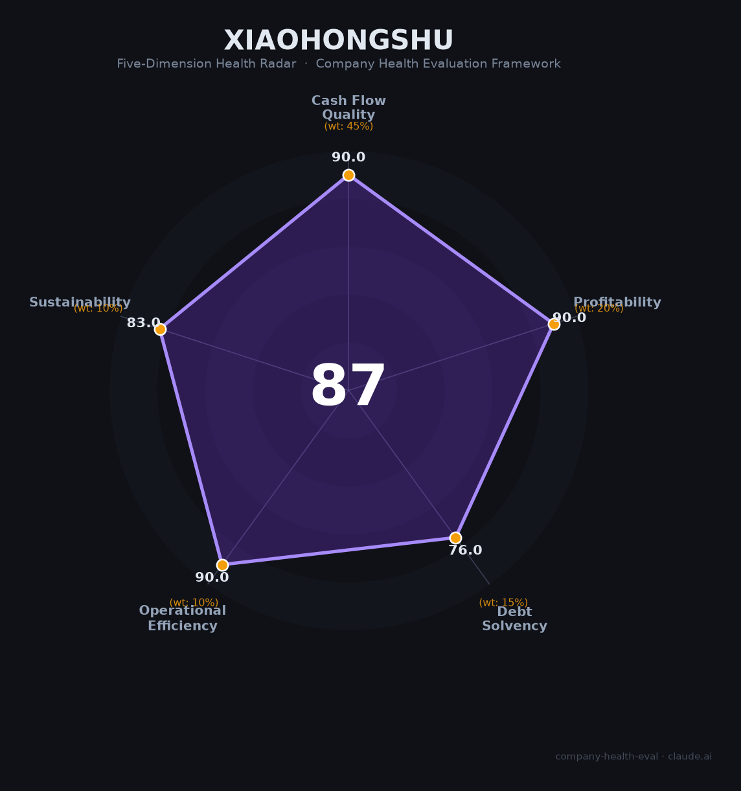

# 小红书 财务健康评估（2026-06-12）

## 一句话结论

🟢 **优秀（87.2/100）** | 人均产出行业第一，零负债高利润，商业化提速中；唯监管处罚频密（20+次）和用户信任流失（63%因虚假信息离开）是核心隐忧

---

## 一、公司基本画像

| 项目 | 内容 |
|------|------|
| **全称** | 行吟信息科技（上海）有限公司 / Red (Xiaohongshu) |
| **成立** | 2013年6月，上海 |
| **创始人** | 毛文超（CEO，斯坦福MBA）+ 瞿芳（产品/社区） |
| **估值** | 约500亿美元（2025年底老股交易，📊 估算） |
| **主要股东** | 腾讯（~13-15%，外部第一大）、阿里（~10-21%）、金沙江创投、GGV、DST、红杉、高瓴 |
| **员工** | ~4,000人（2026年） |
| **主营业务** | 广告（76%营收）+ 电商（24%） |
| **核心产品** | 小红书App（月活3.5亿+，日搜索6亿次） |
| **2025年营收** | ~420亿元（📊 估算，+40%） |
| **2025年净利润** | ~30亿美元（📊 估算，彭博社报道） |
| **IPO状态** | 未上市，赴港IPO准备中（2025年6月香港办公室开幕） |

小红书是中国最大的生活方式内容社区，从海外购物攻略起家，发展为集"种草-搜索-电商"三位一体的超级平台。2026年4月成立AI一级部门Dots，自研dots系列开源大模型，AI搜索"问一问"日活千万级。

---

## 二、五维财务健康评估

### 1. 现金流质量（90.0/100）

| 指标 | 状态 | 详情 |
|------|------|------|
| 经营现金流净额 | ✅ 健康 | 2023年首次盈利（5亿美元），2024年利润翻倍至10亿+美元，2025年预计30亿美元——连续3年盈利，现金流转正（📊 估算） |
| 现金及等价物 | ✅ 健康 | 公司"不缺钱"——2021年后未再进行一级市场融资，所有后续交易均为老股转让。2025年两轮回购期权，2026年第三次回购（25.5美元/股），现金充裕 |
| 有息负债 | ✅ 健康 | 无公开有息负债记录，零杠杆运营 |
| 净现比 | ✅ 健康 | 广告收入占比76%，回款周期极短（预充值/月结），经营现金流/净利润预计>1（📊 估算，依据广告平台行业惯例） |

小红书现金流质量评分90分，四大指标均为健康。作为非上市公司，现金流数据多为估算，但连续3年盈利、零债务、无需融资、自掏腰包回购期权——这些信号共同指向充裕的现金储备和健康的现金流。广告业务占比76%意味着收入高度可预测且回款快（广告主预充值），这是互联网平台中最优质的现金流模式之一。

### 2. 盈利能力（90.0/100）

| 指标 | 等级 | 详情 |
|------|------|------|
| 毛利率 | 🌟 卓越 | 估算65-75%（📊 基于广告业务毛利率>60%+UGC零内容成本），远超内容社区行业平均53% |
| 净利率 | 🌟 卓越 | 预计30-50%（📊 估算），彭博社报道2025年利润约30亿美元。即使保守按20%推算仍远超15%基准线 |
| 营收增速 | 🌟 卓越 | 近3年CAGR >50%（2023年+85% → 2024年+42% → 2025年+40%），增速在内容平台中仅次于字节 |
| 研发费用率 | 👍 良好 | 未公开具体数字。Dots AI部门2026年4月刚成立，AI投入尚在加速期，估算10-15%或更高 |
| 人均产出 | 🌟 卓越 | ~1,050万元/人（📊 营收420亿/4,000人），约为快手（578万）的1.8倍、B站（379万）的2.8倍，拼多多级别的人效 |

盈利能力评分90分，五项指标中四项卓越。2025年营收增速40%在内容平台中独树一帜（快手仅+12.5%，B站约+10%）。人均产出1,050万元超越快手和B站的总和级差距——小红书以4,000人团队支撑了3.5亿月活和420亿元营收，人效为行业顶尖。

### 3. 偿债能力（76.0/100）

| 指标 | 状态 | 详情 |
|------|------|------|
| 资产负债率 | ✅ 健康 | 预估<40%（📊 估算，零有息负债+高利润+未进行债权融资） |
| 有息负债率 | ✅ 健康 | 0%，无公开有息负债 |
| 流动比率 | ⚠️ 关注 | 无法验证（非上市公司不披露资产负债表） |
| 现金比率 | ⚠️ 关注 | 无法验证（同上） |
| 股权质押比例 | ✅ 健康 | VIE架构，创始团队通过协议控制，不存在传统股权质押风险 |

偿债能力评分76分。零有息负债是小红书的核心财务优势——成立12年来完全依靠股权融资和自身现金流发展，未进行债权融资。两个"关注"评级纯粹因非上市公司无法验证具体数字（流动比率/现金比率），而非已知风险。实际偿债风险极低。

### 4. 运营效率（90.0/100）

| 指标 | 状态 | 详情 |
|------|------|------|
| 应收周转 | ✅ 健康 | 广告收入占比76%，广告主预充值模式回款极快，远优于行业平均 |
| 客户集中度 | ✅ 健康 | 数百万广告主+KOL/KOC+3.5亿月活用户，零单一客户依赖 |
| 员工规模趋势 | ✅ 健康 | 近3年扩张（2,000→3,000→4,000人）。2026年初虽进行"去肥增瘦"（非核心岗裁15-30%），但AI和核心岗位同步扩招，净趋势为增长 |
| 高管稳定性 | ✅ 健康 | 毛文超+瞿芳创始组合稳定13年，2026年4月提拔柯南为总裁，核心团队超3年+ |

运营效率评分90分，四大指标全健康。小红书的"人效奇迹"——以4,000人运营3.5亿月活——是运营效率的最佳证明。2026年初的裁员（电商产品/商业化/社区技术非核心岗15-30%）虽引起关注，但本质是AI替代+聚焦核心的"去肥增瘦"，与Meta 2023年"效率之年"逻辑相似。

### 5. 可持续发展能力（83.0/100）

| 指标 | 状态 | 详情 |
|------|------|------|
| 行业赛道空间 | ✅ 健康 | 内容电商CAGR 37%，搜索广告市场持续扩张，小红书日搜索6亿次逼近百度一半 |
| 技术壁垒 | ✅ 健康 | 10亿+UGC笔记内容孤岛+消费决策搜索心智+高线城市女性用户粘性，3年+难以复制 |
| 业务多元化 | ✅ 健康 | 广告（76%）+电商（24%）双引擎，覆盖美妆/母婴/旅游/房产/留学等多行业 |
| 资本支持 | ✅ 健康 | 腾讯+阿里+DST+红杉+高瓴顶级VC矩阵，盈利能力强，赴港IPO倒计时 |
| 政策/监管风险 | ⚠️ 关注 | 10年被约谈处罚20+次（2025年9月热搜处罚最严厉），数据安全审查成IPO最大障碍 |

可持续发展能力评分83分。UGC内容孤岛（10亿+篇笔记）是小红书最深的核心壁垒——抖音投入两年"图文战"仍承认"图文UGC效果未达预期"。但政策监管风险突出：20+次处罚记录、数据安全审查障碍、内容虚假导致63%用户弃坑——这些问题直接影响IPO进程和长期信任。

---

## 三、综合评分与健康等级

| 维度 | 得分 | 权重 | 加权得分 |
|------|:----:|:----:|:--------:|
| 现金流质量 | 90.0 | 45% | 40.5 |
| 盈利能力 | 90.0 | 20% | 18.0 |
| 偿债能力 | 76.0 | 15% | 11.4 |
| 运营效率 | 90.0 | 10% | 9.0 |
| 可持续发展 | 83.0 | 10% | 8.3 |
| **综合得分** | **87.2** | **100%** | **87.2/100** |

**健康等级：🟢 优秀（Excellent）**

---

## 四、同业对标

| 对比项 | 小红书 | 快手 | B站 | 得物 |
|--------|:----:|:----:|:----:|:----:|
| 上市/融资 | 未上市（估值~$500亿） | 港股1024.HK | 港股9626.HK | 未上市（估值~¥710亿） |
| 2025年营收 | ~420亿（估） | 1,428亿 | 304亿 | ~80亿（估） |
| 营收增速 | +40% | +12.5% | +10% | ~+10% |
| 净利润 | ~$30亿（估） | 186亿 | 首次全年盈利 | 未披露 |
| 毛利率 | 65-75%（估） | 55% | 37% | — |
| 净利率 | 30-50%（估） | 13% | 4% | — |
| MAU | 3.5亿+ | 7.2亿 | 3.7亿 | 0.95亿 |
| 员工数 | ~4,000 | 24,718 | ~8,000 | ~3,500 |
| 人均营收 | **1,050万** | 578万 | 379万 | ~229万 |
| 电商GMV | ~8,500亿（估） | 1.6万亿 | — | ~1,000亿 |

**对标结论**：小红书在人均产出（1,050万/人）和营收增速（+40%）方面遥遥领先可比公司，是"中国内容社区中效率最高的平台"。但用户规模仅为快手的1/2、营收仅为快手的29%，体量差距显著。对比得物（同属垂直社区+电商），小红书在用户规模（3.7x）和GMV（8.5x）上均具压倒性优势。

---

## 五、核心风险清单

1. **监管处罚频密（高风险）**：10年被约谈/处罚20+次，2025年9月因"热搜不良信息"被国家网信办处罚最严厉。数据安全审查、CSRC备案、VIE合规三重关卡构成IPO最大障碍。若IPO推迟超过12个月，早期投资方退出压力将加剧。

2. **用户信任危机（高风险）**：艾媒咨询2025年调查显示63%用户因"虚假信息太多"离开小红书。社区真实分享根基被商业化侵蚀——"种草"变"拔草"，信任重建周期漫长。

3. **广告依赖度偏高（中风险）**：广告占营收76%，虽为高毛利模式但经济周期敏感度高。若广告市场下行（如2026年宏观经济走弱），收入将首当其冲。

4. **电商闭环薄弱（中风险）**：电商转化率0.7-1.2%（抖音3-5%），供应链/物流/售后基建严重落后。GMV虽达8,500亿但大部分为种草外溢至淘宝/京东，平台内闭环仅约800亿。

5. **美国监管蔓延风险（中低风险）**：PAFACA法案可能扩至小红书（月活超100万美国用户门槛已触及）。2025年2月爱荷华州已率先禁止州政府设备使用小红书——虽然当前影响极小，但TikTok先例表明风险不可忽视。

6. **AI搜索投入不足（低风险）**：独立AI搜索App"点点"下载仅20万，远逊于豆包（2.27亿MAU）和元宝（4,000万+）。DeepSeek等第三方正在训练能力绕过小红书内容孤岛。

---

## 六、求职/择业视角

### 核心优势
- **薪酬行业顶级**：本科应届生月均38.3K（全行业第2，仅次于大疆），技术岗校招45-70万/年，社招AI岗50K+/月，REDstar计划年薪200-500万不设上限
- **人效极高=个人成长快**：以4,000人支撑3.5亿月活，每个人负责的业务宽度远超B站（8,000人）和快手（2.5万人），个人成长曲线陡峭
- **AI方向爆发期**：2026年4月成立AI一级部门Dots，校招AI岗暴增12倍，AI产品经理月薪涨38.7%，正处在AI人才红利期
- **IPO红利预期**：赴港IPO倒计时，期权回购价已从11.5美元涨至25.5美元（一年翻倍），早期加入的AI方向员工有望获得较大财务回报

### 现存短板
- **工作强度极高**：脉脉2026届加班榜排名第2（仅次于拼多多），周均72.4小时，日均14.5小时。上海"四大卷"之一，平均司龄仅半年
- **裁员风险不低**：2026年初非核心岗裁15-30%，取消大小周实质降薪（月薪少约15%），"隐性卷+复盘文化"消耗大
- **品牌背书偏弱**：相比腾讯/阿里/字节，小红书经历对传统大厂跳槽的加分有限（尤其非AI方向）。但在内容社区/消费品牌/新消费赛道有独特价值
- **薪酬结构不确定**：期权估值在IPO前波动大（2024年估值170亿→2025年底500亿→老股定价不稳定），实际兑现存在不确定性

### 分场景建议

| 个人诉求 | 推荐 | 次选 | 规避 |
|----------|------|------|------|
| 稳定+深耕 | 腾讯（成熟业务线） | 小红书（电商/社区等已定型业务） | 字节（竞争更激烈） |
| 高薪+IPO红利 | 小红书（AI/Dots方向，REDstar） | 拼多多（18薪） | 百度（增长停滞） |
| 成长+技术积累 | 小红书Dots（AI Agent/Search方向） | 字节豆包 | 快手（增速放缓） |
| WLB+生活质量 | —（小红书非合适选择） | 腾讯非核心业务 | 小红书（高强度高内卷） |

---

## 七、总结

小红书是中国内容社区领域"人均效率最高、盈利能力最强"的平台——以4,000人创造420亿营收和约30亿美元利润，人均产出1,050万元达到拼多多级别的人效奇迹，零负债运营且现金流充裕，唯一短板是监管处罚频密（20+次）导致IPO不确定性较高，以及过度商业化引发的用户信任流失（63%因虚假信息离开）。在中国消费决策从"搜索引擎"向"内容社区"转移的大背景下，小红书属于优秀（87.2分），适合追求高薪+IPO红利+早期AI机遇、且能承受高强度工作节奏的求职者的选择。对于以AI Agent为职业方向的候选人，Dots部门2026年才成立一级部门，技术生态尚在建设早期，是少有的"大平台内创业"机会。

---

*评估日期：2026年6月12日 | 数据截至：2026年Q1/Q2公开报道 | 注意：小红书为非上市公司，财务数据多为第三方估算，标注「📊 估算」*
