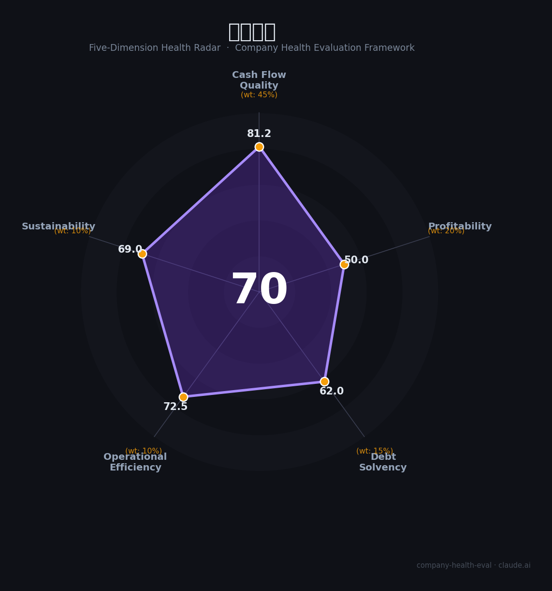

# 崇达技术（002815.SZ）财务健康评估（2026-08-14）

## 一句话结论

🟡 **70/100，中等偏上** | PCB龙头，营收稳、盈利中等、扩产

---

## 一、公司基本画像

| 项目 | 内容 |
|------|------|
| 主营 | PCB(高端印制电路板) |
| 财务 | 2025营收75.44亿(+0.9%)，归母净利3.24亿，ROE 4% |

> 一句话定性：积层PCB龙头，营收稳、盈利中等、扩产

---

## 二、五维财务健康评估

### 1. 现金流质量（81/100）| 权重45%

现金流良好。

### 2. 盈利能力（50/100）| 权重20%

盈利中等、ROE偏低。

### 3. 偿债能力（62/100）| 权重15%

负债适中。

### 4. 运营效率（72/100）| 权重10%

运营效率良好。

### 5. 可持续发展（69/100）| 权重10%

AI+汽车PCB，扩产带来增长。

---

## 三、综合评分

| 维度 | 得分 | 权重 | 加权 |
|------|:----:|:----:|:----:|
| 现金流质量 | 81 | 45% | 36.5 |
| 盈利能力 | 50 | 20% | 10.0 |
| 偿债能力 | 62 | 15% | 9.3 |
| 运营效率 | 72 | 10% | 7.2 |
| 可持续发展 | 69 | 10% | 6.9 |
| **综合得分** | **70/100** | 100% | 70.0 |

**健康等级：中等偏上** — 整体稳健，局部有待改善

---

## 四、核心风险清单

1. **ROE偏低**
2. **PCB竞争**
3. **扩产周期**

## 五、求职/择业视角

### 核心优势
- PCB龙头、产能、稳健
### 现有短板
- 盈利收益率、扩产压力

**结论**：崇达技术高端PCB龙头，营收稳、盈利中等，扩产与AI需求有望带来增长。

---

*评估方法：商泰汽车（iAUTO）五维框架 · 数据截至2026年8月 · 财务来源崇达技术2025年报*