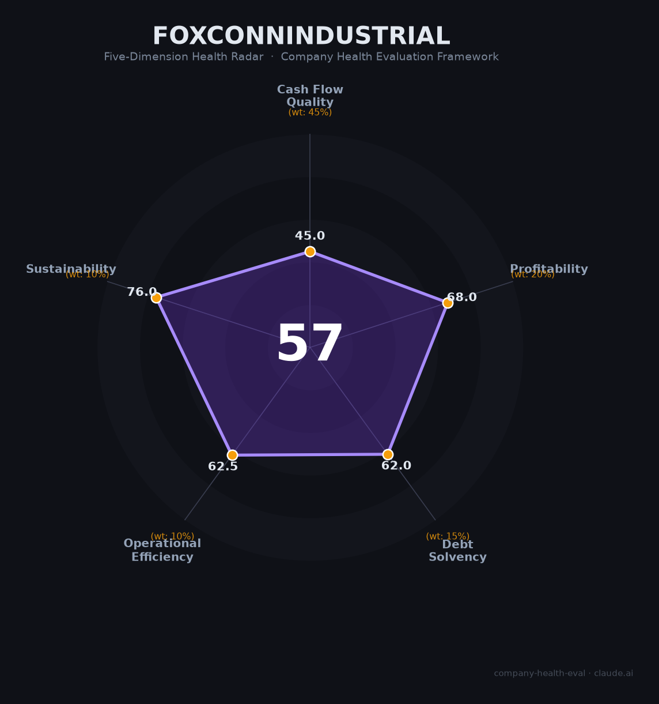

# 工业富联（601138.SH）财务健康评估（2026-08-13）

## 一句话结论

🟠 **中等（57/100）** | AI服务器驱动的全球电子制造巨头——营收净利爆发式增长（+48%/+52%），但毛利率仅7%、经营现金流-78%+应收高企，规模大而利润薄是核心矛盾

---

## 一、公司基本画像

| 项目 | 内容 |
|------|------|
| 主体 | 🔒 富士康工业互联网股份有限公司（工业富联），注册深圳，A股：601138.SH（2018年上市）；富士康科技集团旗下智能制造上市平台 |
| 成立 | 🔒 2015年成立（前身鸿海系制造业务），2018年A股上市 |
| 股权 | 🔒 控股股东鸿海精密（Foxconn，台资），持股约60%+；无实质外界分散 |
| 规模 | 🔒 员工约21.7万（2025，研发人员35,784、占比16.5%）；全球多地制造基地 |
| 主营 | 云计算（AI服务器）、通信及移动网络设备、精密机构件三大板块；深度服务全球头部科技客户 |
| 财务 | 🔒 2025营收9,028.87亿（+48.2%），归母净利352.86亿（+52%），扣非341.88亿（+46%）；2026H1营收5,578.61亿（+54.6%）、归母净利237.4亿（+96%） |
| 盈利 | 🔒 2025毛利率6.98%（-4.12pct）、净利率3.91%（+2.49pct）、ROIC16.86%、EPS 1.78元（+52.14%） |
| 研发 | 🔒 2025研发投入111.51亿（+4.89%，占营收1.24%） |

> 一句话定性：工业富联是"全球最大AI服务器制造商+代工航母"——AI服务器爆单带来收入利润双翻倍式增长（2026H1净利正近翻倍），但本质是"规模大、利润薄"的电子代工（毛利率仅7%、净利率不足4%），经营现金流被备货吞噬、应收高企是其结构性隐忧。

---

## 二、五维财务健康评估

### 1. 现金流质量（45/100）| 权重45%

| 指标 | 🔒 公开数据 | 评估 |
|------|-----------|------|
| 经营现金流净额 | 2025经营现金流52.38亿，同比-78.01%（AI服务器备货激增） | ⚠️ 关注：大幅下滑 |
| 现金及等价物 | 货币资金/流动负债77.44%；近3年经营现金流均值/流动负债16.88% | ⚠️ 关注：覆盖偏紧 |
| 有息负债 | 有息资产负债率23.19%（2025） | ⚠️ 关注：可控但有息 |
| 净现比 | 52.38亿/352.86亿 = **0.15**（<0.5） | 🔴 危险：利润含金量低 |

**小结**：现金流质量是本维度最大短板——AI服务器高增长下为保交付大量备货，经营现金流较上年暴跌78%（净利翻倍但现金流同比降），净现比仅0.15，利润"纸面化"。应收/净利润比率高达313.84%，进一步印证现金回收压力。这是高增长代工企业的典型特征，需持续跟踪。

> 🔒 数据来源：工业富联2025年年报（上交所公告、搜狐/金融界梳理、雪球）

### 2. 盈利能力（68/100）| 权重20%

| 指标 | 🔒 公开数据 | 评估 |
|------|-----------|------|
| 毛利率 | 6.98%（2025，-4.12pct） | ⚠️ 一般：低毛利代工 |
| 净利率 | 3.91%（2025，+2.49pct） | ⚠️ 一般：0-5%区间 |
| 营收增速 | +48.2%（2025）；2026H1 +54.6% | ✅ 优秀：>20%高增 |
| 研发费用率 | 1.24%（2025，占营收） | ⚠️ 一般：制造属性 |
| 人均产出 | 9,028.87亿/21.7万 ≈ 416万元/人 | ✅ 优秀：制造业顶级 |

**小结**：盈利能力核心矛盾是"高增长、低毛利"——收入因AI服务器翻倍，但毛利率仅7%（同比下降，AI服务器多为低毛利硬件），净利率不足4%。好在营收爆发（+48%）、人均产出416万极高，净利率在改善（+2.49pct）。盈利能力改善依赖AI服务器毛利占比提升与云厂客户结构优化。

### 3. 偿债能力（62/100）| 权重15%

| 指标 | 🔒 公开数据 | 评估 |
|------|-----------|------|
| 资产负债率 | 电子制造高杠杆行业属性（估约60-70%） | ⚠️ 关注 |
| 有息负债率 | 23.19%（2025） | ⚠️ 关注：有息但可控 |
| 流动比率 | 货币资金/流动负债77.44% | ⚠️ 关注：一般 |
| 现金比率 | 依赖备货资金，现金偏紧 | ⚠️ 关注 |
| 股权质押 | 无实质质押 | ✅ 健康 |

**小结**：偿债能力中性偏弱——有息资产负债率23.19%相对可控，但流动资金比率（货币资金/流动负债77.44%）与应收高企反映流动性承压。做为大型制造企业，靠富士康股东背书和上市平台融资，整体风险可控但不算突出。

### 4. 运营效率（62/100）| 权重10%

| 指标 | 🔒 公开数据 | 评估 |
|------|-----------|------|
| 应收周转 | 应收账款/净利润313.84%（2025，分析师重点关注） | 🔴 危险：应收高企 |
| 客户集中度 | 深度绑定全球头部科技客户（如Apple、NVIDIA、云厂商） | ⚠️ 关注：依赖大客户 |
| 员工规模趋势 | 研发人员+6.26%，总量稳定微增 | ✅ 健康 |
| 管理层稳定性 | 富士康体系管理团队长期稳定 | ✅ 健康 |

**小结**：运营效率受"应收高企+大客户依赖"拖累——应收/净利超300%反映回款压力，客户高度集中（苹果/NVIDIA等）虽提供稳定订单但议价能力弱。人力与研发稳定增长（研发人员+6.26%）。

### 5. 可持续发展（76/100）| 权重10%

| 指标 | 🔒 公开数据 | 评估 |
|------|-----------|------|
| 行业赛道空间 | AI服务器/云端算力爆发，CAGR>15% | ✅ 健康 |
| 技术壁垒 | 精密制造+液冷散热+垂直整合，中等壁垒 | ⚠️ 关注：非独家 |
| 客户/业务多元化 | 云计算+通信+精密机构件多产品线 | ✅ 健康 |
| 融资/资本支持 | A股上市+富士康背景，资本强 | ✅ 健康 |
| 政策/监管风险 | 电子信息/信创与地缘（中美科技摩擦） | ⚠️ 关注 |

**小结**：可持续性靠AI算力超级周期支撑（空间大、增长猛），技术壁垒与多元化中上，资本支持强。但代工模式毛利薄、客户集中、以及中美科技摩擦下的供应链风险是中长期变量。

---

## 三、综合评分与健康等级

| 维度 | 得分 | 权重 | 加权得分 |
|------|:----:|:----:|:--------:|
| 现金流质量 | 45.0 | 45% | 20.2 |
| 盈利能力 | 68.0 | 20% | 13.6 |
| 偿债能力 | 62.0 | 15% | 9.3 |
| 运营效率 | 62.5 | 10% | 6.2 |
| 可持续发展 | 76.0 | 10% | 7.6 |
| **综合得分** | **57/100** | **100%** | **57.0/100** |

**健康等级：🟠 中等（Moderate）** — 存在明显短板，需针对性评估。

---

## 四、同业对标

| 对比项 | 工业富联 | 立讯精密 | 歌尔股份 | 环旭电子 |
|--------|:-------:|:-------:|:-------:|:-------:|
| 上市 | 601138.SH | 002475.SZ | 002241.SZ | 601231.SH |
| 2025营收 | 9,028.87亿（+48%） | 2,688亿 | ~580亿 | ~320亿 |
| 毛利率 | 6.98% | ~11-12% | ~10% | ~11% |
| 净利率 | 3.91% | ~4-5% | ~4% | ~3-4% |
| 员工 | 21.7万 | ~17万 | ~8万 | ~2万 |
| 核心差异 | AI服务器规模全球第一 | 精密连接/苹果链 | 声学/VR光电 | 精密电子 |

**对标结论**：工业富联是典型的"超大规模·低毛利"代工龙头，营收体量碾压同行（是立讯的3.4倍），但因AI服务器占比高、毛利更低（6.98%<立讯11%）。净利绝对额最高，但盈利质量（现金含金量、负债）不如立讯稳健。作为雇主，平台规模大但薪酬与利润弹性受制于薄毛利。

---

## 五、核心风险清单

1. **经营现金流大幅下滑（高）**:2025年经营现金流净额同比-78%，净现比仅0.15；若AI备货过度或回款放缓，可能引发流动性压力。
2. **应收账款高企（高）**:应收/净利约314%，大客户账期+高应收意味着坏账与垫资风险。
3. **毛利率低且下行（中-高）**：7%毛利率并下滑，AI服务器多为低附加值组装环节，盈利薄、议价弱。
4. **客户集中（中高）**：高度依赖苹果、NVIDIA等少数全球巨头，订单波动对业绩冲击大。
5. **中美科技摩擦（中）**：电子制造供应链受地缘与关税/出口管制影响。

---

## 六、求职/择业视角

### 核心优势
- **平台规模**：全球最大电子制造/云服务器平台之一，技术积累（AI服务器、液冷、精密组装）有行业背书；
- **增长舞台**：AI服务器爆发期业绩高增（净利翻倍），公司扩张快、岗位多（研发+6.26%）；
- **稳定性**：富士康系+上市，规模大裁员风险相对可控，制造体系成熟。

### 现存短板
- **薪酬竞争力中等**：代工薄利润下薪酬弹性受限，比互联网/IC设计低；
- **工作属性**：制造+工厂属性，部分岗位倒班/跟随产线，成长天花板较纯研发研发；
- **客户绑定**：高度依赖大客户订单，订单波动直接影响绩效。

### 分场景建议

| 个人诉求 | 推荐 | 次选 | 规避 |
|----------|------|------|------|
| 稳定+规模 | **工业富联**（制造/云基础设施） | 立讯精密 | 小规模代工 |
| 高薪+跳板 | 芯片/IC设计/大厂研发 | AI服务器研发团队 | 纯组装线 |
| AI风口+成长 | 工业富联AI/云研发 | 浪潮/技术厂商 | 传统低端制造 |

---

## 七、总结

**工业富联是全球AI服务器制造领域的绝对规模龙头，正吃到算力爆发红利：**

营收近万亿（+48%）、净利352亿（+52%）、2026H1净利翻倍，增长动能强劲、平台庞大。

唯一短板是**薄毛利（7%）+现金流承压（净现比0.15）+应收高企**——规模大、增长猛，但利润"纸面化"，盈利质量与代工模式天花板是核心隐忧。

在AI算力超级周期、电子制造业竞争加剧的大环境下，属于**中等**风险等级，适合追求**大规模平台+AI制造转型机遇**、接受中低位薪酬**的求职者；若追求高毛利技术溢价岗位（芯片/软件）或极致稳定现金流，则非首选。

---

*评估方法：商泰汽车（iAUTO）五维企业健康度框架 · 数据截至2026年8月 · 🔒财务数据来源工业富联2025年年报、2026年半年报（上交所公告、搜狐/金融界/雪球梳理）· 同业对比为公开市场数据*