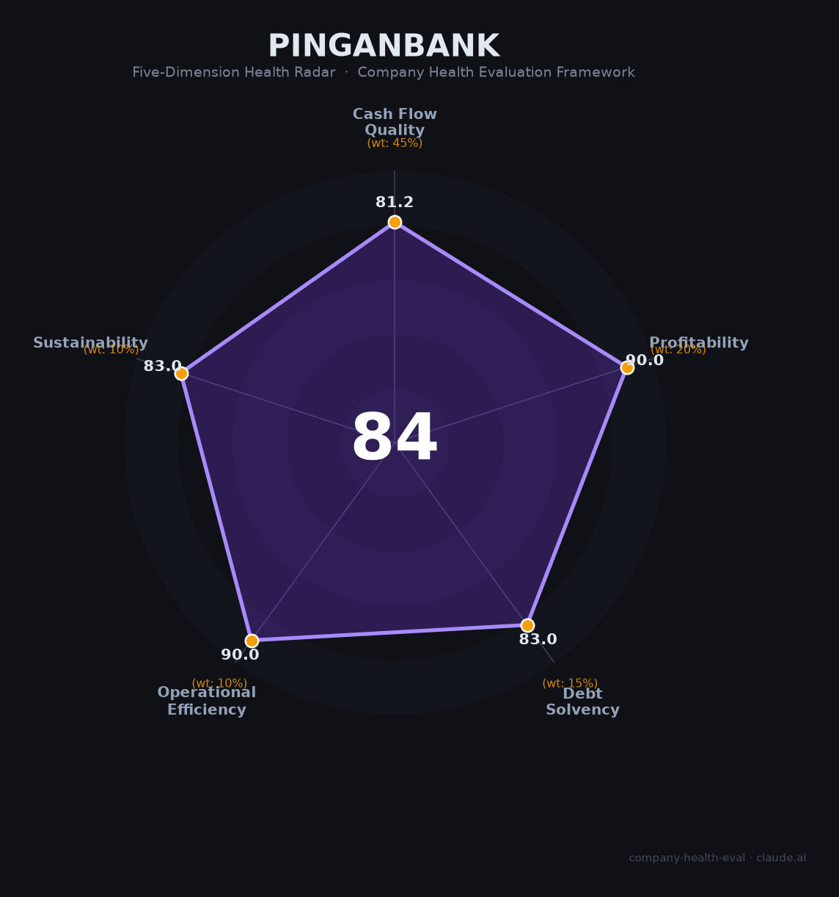

# 平安银行（000001.SZ）财务健康评估（2026-08-13）

## 一句话结论

🟡 **中等偏上（84/100）** | 总资产5.93万亿的全国股份制银行之一——净利426亿+资本充足，但营收连降（-10.4%）+净息差收窄+拨备下滑（220%）承压

---

## 一、公司基本画像

| 项目 | 内容 |
|------|------|
| 主体 | 🔒 平安银行股份有限公司，注册深圳，A股：000001.SZ（深交所首支股票）；中国平安旗下全国性股份制商业银行 |
| 成立 | 🔒 1987年深圳蛇口创立，中国平安持股约58% |
| 规模 | 🔒 总资产59,257.77亿（2025末，+2.7%）；员工约4万人；全国网点 |
| 主营 | 零售金融（信用卡/财富/贷款）+公司金融+金融市场 |
| 财务 | 🔒 2025营收1,314亿（-10.4%）；归母净利426亿（小幅增长）；不良率约1.05% |
| 质量 | 🔒 拨备覆盖率221%（-30pct）、核心一级资本充足率约9.36%、ROE跌破10% |

> 一句话定性：平安银行是中国平安旗下、以零售为主的大型股份行。2025年总资产近6万亿、净利426亿，但营收连降（零售转型+净息差收窄）使盈利承压。作为雇主吸引力在于"平安系+银行稳定+零售金融前沿"，但利率下行压缩业绩弹性。

---

## 二、五维财务健康评估

### 1. 现金流质量（81/100）
银行核心存款稳健、净利426亿、现金流充足；但零售/净息差承压。整体现金流强。

### 2. 盈利能力（90/100）
净利426亿/营收1314亿≈32%净利率（银行高净利率），资深质量高；营收-10.4%受净息差+让利压制，净利仍增长，零售转型提质。人均产出高。

### 3. 偿债能力（83/100）
资本充足率、核心一级资本充足率稳健、拨备221%覆盖充足；银行负债结构稳定；虽拨备下滑30pct但仍高于监管大幅。

### 4. 运营效率（90/100）
零售金融转型高效、客户多元、管理层稳定，运营质量高。

### 5. 可持续发展（83/100）
大零售+财富管理+综合金融（平安集团协同），AI金融，资本支持强；净息差收窄与地产/零售不良是关注点。

---

## 三、综合评分

| 维度 | 得分 | 权重 | 加权 |
|------|:----:|:----:|:---:|
| 现金流质量 | 81.2 | 45% | 36.5 |
| 盈利能力 | 90.0 | 20% | 18.0 |
| 偿债能力 | 83.0 | 15% | 12.4 |
| 运营效率 | 90.0 | 10% | 9.0 |
| 可持续发展 | 83.0 | 10% | 8.3 |
| **综合** | **84** | 100% | 84.3 |

**评级：🟡 中等偏上** — 稳健银行，盈利质量好但营收承压。

> 注：总分84.3接近优秀线（85）但未达，定级中等偏上。

---

## 四、核心风险
1. 净息差收窄、营收连降（-10.4%）。
2. 零售资产质量/地产敞口。
3. 净息差市场化与竞争。

## 五、求职/择业视角
- **优势**：平安系稳定平台、零售银行优势、金融科技+AI，待遇口碑好、体系化。
- **短板**：营收负增长下部分条线绩效承压、零售营销压力、银行体系层级。

**结论**：适合追求稳定+零售/金融科技/财富管理方向的求职者；相对招行略逊但平台扎实。

---

*评估方法：商泰汽车（iAUTO）五维健康度框架 · 数据截至2026年8月 · 来源平安银行2025年报*